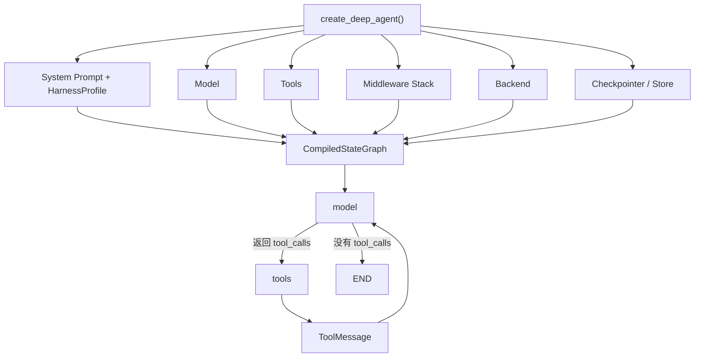
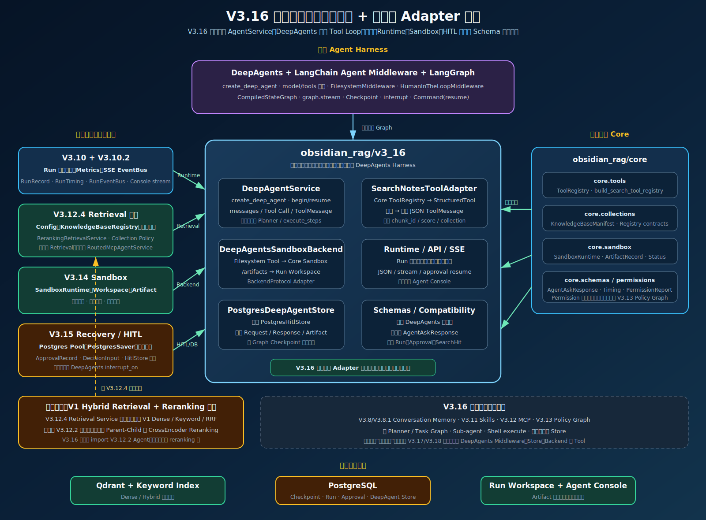
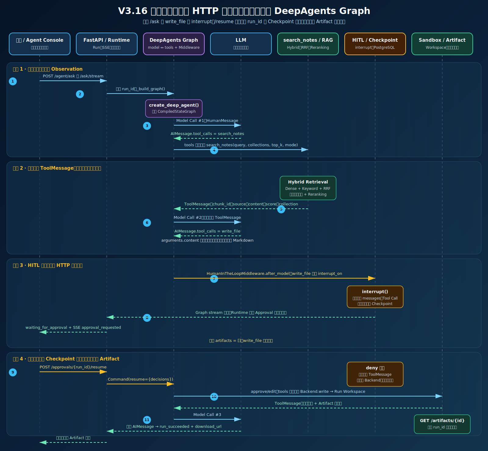

# DeepAgents 核心概念学习指南

日期：2026-07-24  
主题：DeepAgents、LangChain Agent Middleware、LangGraph、Tool Loop、Backend、Memory 与 HITL  
项目对照：[`obsidian_rag/v3_16/`](../obsidian_rag/v3_16/)

## 1. 一句话定位

DeepAgents 是构建在 LangChain Agent 和 LangGraph 之上的生产型 Agent Harness：

```text
DeepAgents
  提供默认 Harness、Filesystem、Todo、Skills、Sub-agent、Summarization 和 HITL 装配
      ↓
LangChain Agent / Middleware
  提供 Model、Tool、Message、Middleware hooks 和标准 Tool Calling
      ↓
LangGraph
  提供 Graph、State、Checkpoint、interrupt/resume、stream 和状态恢复
```

DeepAgents 不会替业务系统实现检索、权限、文件存储和审计。它主要负责把这些能力组装成标准的 Agent Tool Loop。

## 2. 整体心智模型



可以把 Harness 理解为模型外围的运行支架：

```text
Model
+ System Prompt
+ Tool Catalog
+ Middleware
+ Backend
+ AgentState
+ Checkpointer
+ Store
+ Permission / HITL
+ Sub-agent
```

LLM 负责提出下一步，Harness 负责验证、执行、记录、暂停和恢复。

## 3. `create_deep_agent()`

`create_deep_agent()` 是 DeepAgents 的总装配入口，最终返回 LangGraph `CompiledStateGraph`。

主要参数可以分为五组：

| 分类 | 参数 | 职责 |
| --- | --- | --- |
| 思考 | `model`、`system_prompt` | 决定使用哪个模型以及模型遵循什么业务规则 |
| 能力 | `tools`、`skills`、`subagents`、`memory` | 决定模型能调用什么以及能加载哪些任务知识 |
| 控制 | `middleware`、`permissions`、`interrupt_on` | 验证和限制模型提出的动作 |
| 状态 | `state_schema`、`context_schema`、`checkpointer`、`store` | 管理当前 Graph、当前 Run 和长期持久状态 |
| 输出 | `response_format`、`debug`、`cache`、`name` | 约束输出并配置调试、缓存和 Graph 名称 |

V3.16 的调用位置：[`DeepAgentService._build_graph()`](../obsidian_rag/v3_16/agent.py)。

当前传入：

```python
create_deep_agent(
    model=model,
    tools=[search_notes],
    system_prompt=system_prompt,
    backend=sandbox_backend,
    subagents=[],
    interrupt_on={"write_file": ..., "edit_file": ...},
    checkpointer=postgres_saver,
    name="v3_16_deepagents_tool_loop",
)
```

## 4. Harness 与 `HarnessProfile`

### 4.1 Harness

Harness 不是单个类，而是整套 Agent 运行环境。它回答的是：

```text
模型能看到什么？
模型能调用什么？
调用前后经过哪些检查？
状态保存在哪里？
中断后如何恢复？
文件最终写到哪里？
```

### 4.2 `HarnessProfile`

`HarnessProfile` 是针对特定模型的 Harness 配置覆盖层，常见配置包括：

```text
excluded_tools
tool_description_overrides
extra_middleware
excluded_middleware
general_purpose_subagent
模型适配 Prompt
```

V3.16 在 [`dependencies.py`](../obsidian_rag/v3_16/dependencies.py) 中配置：

```python
HarnessProfile(
    excluded_tools=frozenset({"execute", "write_todos"}),
    general_purpose_subagent=GeneralPurposeSubagentProfile(enabled=False),
)
```

因此 V3.16 关闭了 Shell、Todo Planner 和默认通用 Sub-agent，但保留 Filesystem Tools。

## 5. Middleware

Middleware 是 DeepAgents 最重要的扩展机制，用于在 Model 和 Tool 调用前后插入横切逻辑。

典型 hook：

```text
before_agent
before_model
wrap_model_call
after_model
wrap_tool_call
after_agent
```

DeepAgents 默认 Middleware 大致按以下顺序组装：

```text
TodoListMiddleware
SkillsMiddleware（配置 skills 时）
FilesystemMiddleware
SubAgentMiddleware（存在 Sub-agent 时）
SummarizationMiddleware
PatchToolCallsMiddleware
AsyncSubAgentMiddleware（存在异步 Sub-agent 时）
自定义 Middleware
HarnessProfile extra/exclusion Middleware
Prompt Cache Middleware
MemoryMiddleware（配置 memory 时）
HumanInTheLoopMiddleware（配置 interrupt_on 时）
```

生产规则适合放入 Middleware，例如：

```text
知识库任务没有成功的 search_notes ToolMessage 时禁止 write_file
按 Principal 动态过滤当前可见 Tools
校验 Tool arguments
记录 Model、Tool 和 Middleware 耗时
在高风险 Tool 前触发 interrupt
```

## 6. Tool 与自动规划

### 6.1 Tool 的组成

Tool 通常包含：

```text
name
description
JSON Schema / Pydantic 参数模型
handler
```

例如：

```text
search_notes(query, collections, top_k, mode)
write_file(file_path, content)
```

### 6.2 自动规划的本质

DeepAgents 没有额外隐藏一个固定的 `PlannerService`。所谓自动规划，是模型在每一轮根据当前 `messages` 和 Tool Catalog 生成下一步：

```text
Model Call
  ↓
AIMessage.tool_calls
  ↓
Tool 执行
  ↓
ToolMessage Observation
  ↓
下一次 Model Call
```

它接近 ReAct：

```text
Action → Observation → Action → Observation → Final Answer
```

确定性部分由 LangGraph 保证：

```text
有 tool_calls → tools
Tool 完成 → ToolMessage → model
没有 tool_calls → END
interrupt → Checkpoint
resume → 从暂停点继续
```

概率性部分由 LLM 决定：

```text
是否调用工具
调用哪个工具
参数是什么
是否继续调用
什么时候结束
```

因此 DeepAgents 提供的是可约束的 Tool Loop，不保证模型规划永远正确。

## 7. `AIMessage`、`ToolMessage` 与 AgentState

`AIMessage` 不是 `ContextBundle`，也不是 AgentState。它是 AgentState 中的一条消息。

```text
AgentState
  └─ messages
       ├─ HumanMessage
       ├─ AIMessage(tool_call=search_notes)
       ├─ ToolMessage(search results)
       ├─ AIMessage(tool_call=write_file)
       ├─ ToolMessage(write result)
       └─ AIMessage(final answer)
```

三者职责：

| 概念 | 含义 |
| --- | --- |
| `AgentState` | Graph 当前完整共享状态 |
| `HumanMessage` | 用户输入 |
| `AIMessage` | 某一次模型输出，可以包含文本或 Tool Calls |
| `ToolMessage` | 某一次 Tool 执行后的 Observation |
| `ContextBundle` | 旧版 ContextBuilder 为某次模型调用组装的 Prompt 材料包 |

旧版关系：

```text
AgentState → ContextBuilder → ContextBundle → LLM → AIMessage → AgentState
```

V3.16 主要通过 `AgentState.messages` 持续传递 Tool Observation，不再构建旧版一次性 `ContextBundle`。

## 8. `FilesystemMiddleware` 与 Backend

### 8.1 `FilesystemMiddleware`

`FilesystemMiddleware` 负责向模型注入文件工具：

```text
ls
read_file
write_file
edit_file
glob
grep
execute
```

`tools=[search_notes]` 表示额外添加 Tool，并不会移除这些内置文件工具。

### 8.2 Backend

Filesystem Tool 不决定文件存在哪里，Backend 才是真正的执行层：

```text
LLM 生成 write_file
  ↓
FilesystemMiddleware
  ↓
Backend.write()
  ↓
实际文件存储
```

常见 Backend：

| Backend | 适用场景 |
| --- | --- |
| `StateBackend` | 文件保存在当前 Graph State |
| `FilesystemBackend` | 文件保存在本机目录 |
| `StoreBackend` | 文件保存在 LangGraph Store，适合长期 Memory |
| `CompositeBackend` | 按路径前缀路由到多个 Backend |
| `SandboxBackendProtocol` | 支持受隔离的命令执行 |

V3.16 的 [`DeepAgentsSandboxBackend`](../obsidian_rag/v3_16/backends/sandbox.py) 把 Filesystem Tool 映射到 Core Sandbox 的 Run Workspace。

## 9. Checkpointer、Store 与 Runtime Context

这三个概念的生命周期不同：

| 概念 | 主要问题 | 典型内容 |
| --- | --- | --- |
| Checkpointer | 当前 Thread 执行到哪里 | Messages、Graph State、interrupt、下一节点 |
| Store | 当前用户长期记住了什么 | 用户偏好、长期事实、Memory 文件 |
| Runtime Context | 当前 Run 是谁发起的 | tenant、user、assistant、权限、环境配置 |

简单记忆：

```text
Checkpointer：线程执行现场
Store：跨线程长期记忆
Runtime Context：本次运行身份和环境
```

V3.16 已使用 PostgreSQL Checkpointer 支持 HITL 恢复，但没有把 LangGraph Store 传入 `create_deep_agent()`。V3.16 的 `self.store` 是项目自己的 Run/Approval Repository，不等于 LangGraph Store。

## 10. HITL 与 `interrupt_on`

配置示例：

```python
interrupt_on={
    "write_file": {
        "allowed_decisions": ["approve", "edit", "reject"]
    }
}
```

执行过程：

```text
AIMessage(tool_call=write_file)
  ↓
HumanInTheLoopMiddleware.after_model
  ↓
interrupt()
  ↓
Checkpointer 保存状态
  ↓
用户 approve / edit / reject
  ↓
Command(resume=...)
  ↓
tools
```

`interrupt_on` 控制的是“是否允许执行”，不负责判断“之前是否应该先检索”。

## 11. Skills、Memory、Todo 与 Sub-agent

| 能力 | 作用 |
| --- | --- |
| `skills` | 从 Backend 路径加载任务说明、脚本或资源描述 |
| `memory` | 加载类似 `AGENTS.md` 的长期指令到 System Prompt |
| `write_todos` | 让模型维护动态任务列表，但 Todo 不是强制工作流 |
| `subagents` | 主 Agent 通过 `task` 委派给专用 Agent |
| `SummarizationMiddleware` | Context 过长时压缩旧消息 |
| `PatchToolCallsMiddleware` | 修复不完整 Tool Call/ToolMessage 对，保持消息合法 |

需要区分：

```text
Todo 是模型的任务草稿，不是确定性 Executor
memory 参数是静态长期指令，不等于 LangGraph Store
Sub-agent 是独立 Agent，不是普通 Tool handler
```

## 12. 规划准确性如何保障

DeepAgents 无法保证 LLM Planner 百分之百正确。生产可靠性来自分层约束：

```text
Tool Description
  帮助模型理解能力

System Prompt
  引导业务执行顺序

Schema Validation
  限制参数结构

Middleware / Policy
  代码级验证前置条件和权限

HITL
  审批高风险副作用

Evaluation / Trace
  持续衡量 Tool 选择和参数准确率
```

例如“知识库文档必须先检索”不能只依赖 Prompt。生产版应加入硬规则：

```text
模型请求 write_file
  ↓
当前任务是否要求知识库依据？
  ├─ 否 → 正常进入审批
  └─ 是
       ↓
是否存在成功的 search_notes ToolMessage？
  ├─ 否 → 阻止写入，要求模型先检索
  └─ 是 → 进入 HITL 审批
```

还可以动态控制 Tool 可见性：检索成功前不向模型开放 `write_file`，检索成功后再开放。

注意：当前 V3.16 尚未实现动态 Tool 可见性。第一次 Model Call 已经能同时看到 `search_notes` 和 Filesystem Tools，主要依赖 System Prompt 引导顺序。

## 13. V3.16 当前使用范围

### 已使用

```text
create_deep_agent
标准 model ↔ tools Tool Loop
FilesystemMiddleware
SummarizationMiddleware
PatchToolCallsMiddleware
HumanInTheLoopMiddleware
HarnessProfile
Sandbox Backend Adapter
PostgreSQL Checkpointer
```

### 已关闭

```text
write_todos
execute
general-purpose Sub-agent
```

### 尚未接入

```text
Skills
MCP
跨线程长期 Store Memory
Runtime Context
自定义 State Schema
动态 Tool 可见性
生产级 Permissions Middleware
```

V3.16 的版本依赖关系见：



完整执行顺序见：



## 14. 推荐学习顺序

```text
1. create_deep_agent 与 CompiledStateGraph
2. AgentState.messages 与 Tool Loop
3. Middleware 装配和 hook
4. FilesystemMiddleware 与 Backend
5. interrupt_on、Checkpoint 和 resume
6. HarnessProfile 与 Tool 集合控制
7. Store、Runtime Context 和 Context Window
8. Skills、MCP 与 Sub-agent
9. 生产级 Policy、Evaluation 和 Observability
```

掌握前六项即可理解 V3.16。后续 V3.17 将重点进入 Checkpointer、Store、CompositeBackend、长期 Memory 和 Context Window 管理。

## 15. 项目代码入口

| 入口 | 作用 |
| --- | --- |
| [`v3_16/agent.py`](../obsidian_rag/v3_16/agent.py) | `create_deep_agent`、Tool Loop、begin/resume 和消息投影 |
| [`v3_16/dependencies.py`](../obsidian_rag/v3_16/dependencies.py) | HarnessProfile、Model、Retrieval、Sandbox、Checkpoint 依赖装配 |
| [`v3_16/tools/search_notes.py`](../obsidian_rag/v3_16/tools/search_notes.py) | 将 Core Tool Registry 适配成 LangChain StructuredTool |
| [`v3_16/backends/sandbox.py`](../obsidian_rag/v3_16/backends/sandbox.py) | 将 DeepAgents BackendProtocol 适配到 Core Sandbox |
| [`v3_16/runtime.py`](../obsidian_rag/v3_16/runtime.py) | Run 生命周期和 SSE 事件 |
| [`v3_16/store.py`](../obsidian_rag/v3_16/store.py) | Run、审批、响应与 Artifact 持久化 |
| [`V3.16 Guide`](v3-16-deepagents-tool-loop-guide.md) | 当前学习版本的完整实现和调试说明 |

## 16. 关键结论

```text
DeepAgents 不是替代 LangGraph，而是自动装配 LangGraph Agent Harness。

自动规划不是独立 Planner，而是 LLM 在 ToolMessage 驱动下逐轮决定下一步。

FilesystemMiddleware 提供文件 Tool，Backend 决定文件实际存储和执行方式。

Checkpointer 保存线程执行现场，Store 保存跨线程长期记忆。

Prompt 负责引导，Middleware 和 Policy 负责确保关键规则不能被绕过。
```
