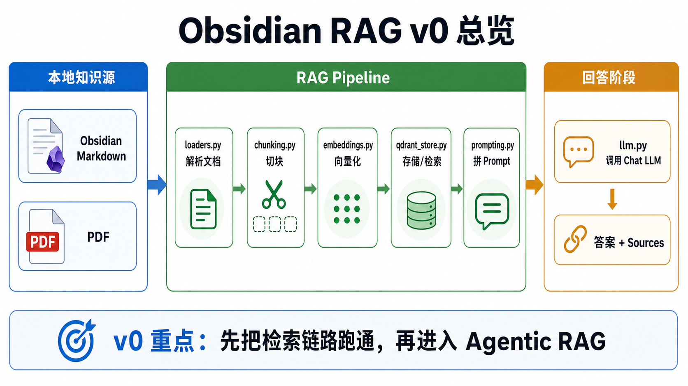
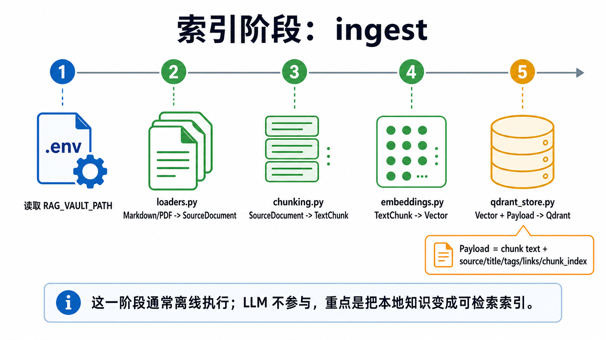
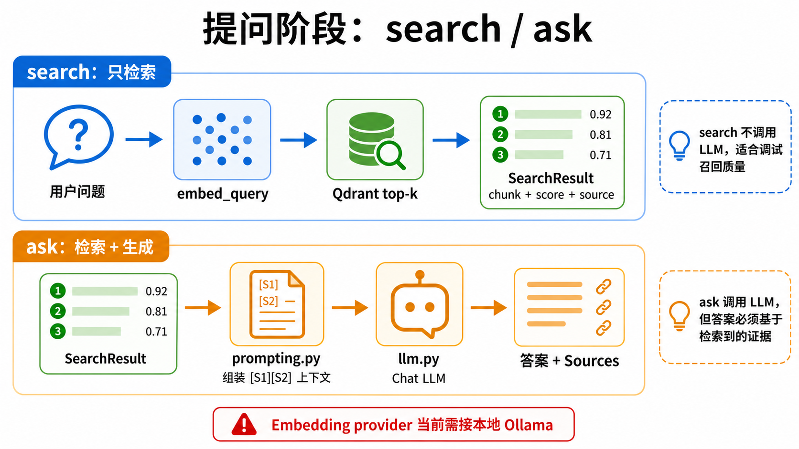
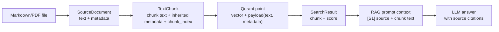
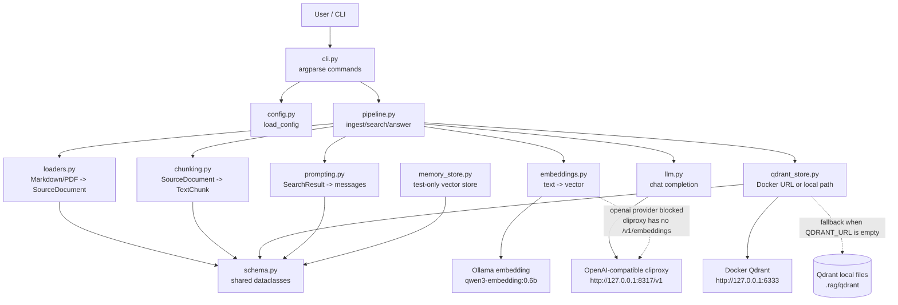
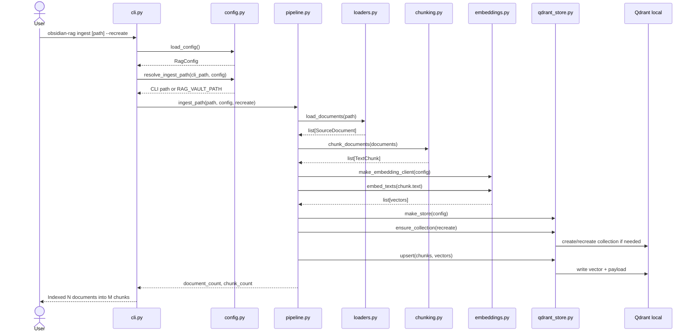
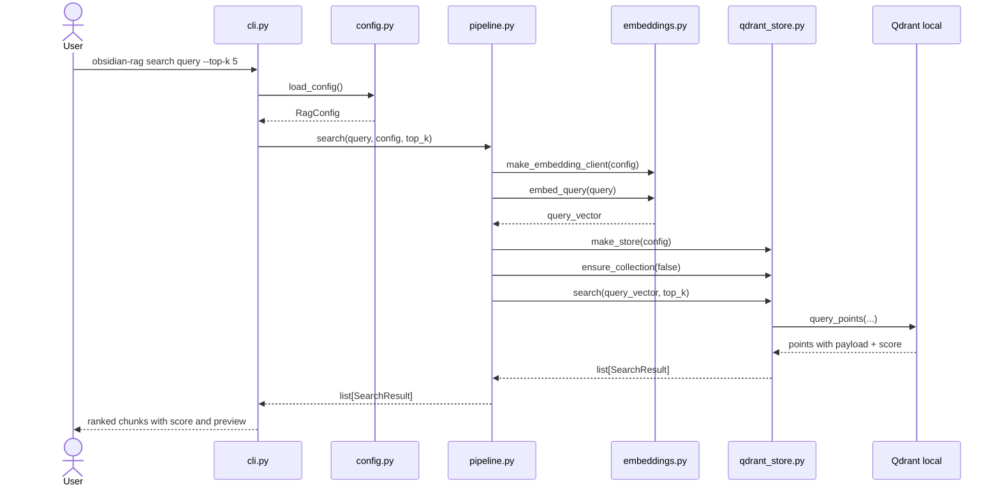
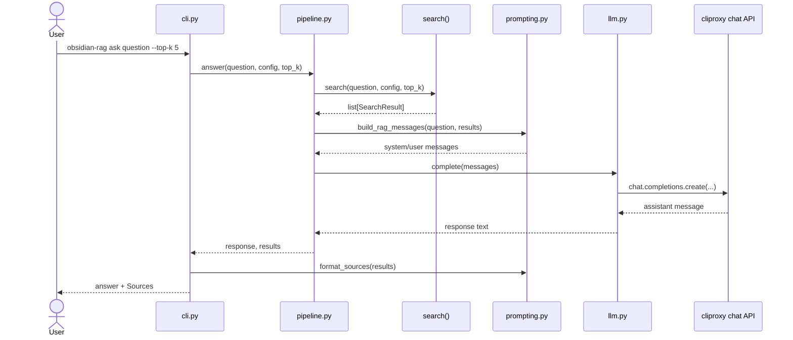
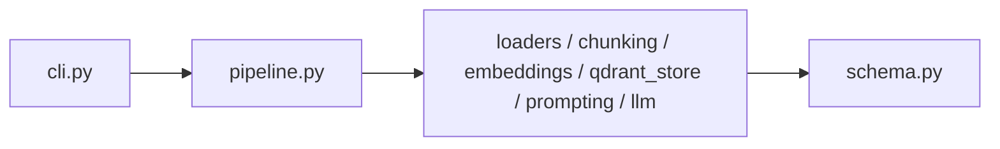

# Obsidian RAG Code Guide

这份文档解释 `obsidian_rag/` 目录下每个文件的作用，并用架构图、数据流图、时序图串起 v0 RAG 的运行流程。

## Mental Model

当前 v0 项目的核心不是 Agent，而是一个固定 RAG pipeline：

```text
本地文档 -> 加载解析 -> 切块 -> 向量化 -> 存入 Qdrant -> 检索 -> 拼 Prompt -> LLM 回答 -> 输出来源
```

把它拆成两条链路更容易理解：

- 索引链路：`ingest`
- 查询链路：`search` / `ask`

`search` 只做检索，不调用 LLM；`ask` 在检索后继续调用 LLM 生成答案。

## Visual Guide

下面三张图是用 ImageGen 生成的学习辅助图，帮助先建立整体直觉；精确的模块关系和时序以本文后面的 Mermaid 图为准。

### v0 总览



这张图适合先看：左边是本地知识源，中间是 RAG pipeline，右边是回答阶段。

### 索引阶段



索引阶段对应 `obsidian-rag ingest`。这一步把本地文档变成可检索的向量索引，通常离线执行，LLM 不参与。

### 提问阶段



提问阶段分两层：`search` 只检索，适合调试召回质量；`ask` 在检索结果基础上拼 prompt，再调用 LLM 生成带来源的答案。

## File Responsibilities

| 文件 | 主要职责 | 学习重点 |
| --- | --- | --- |
| `__init__.py` | Python package 标识，目前只放包说明。 | 包入口。 |
| `schema.py` | 定义 RAG 流程里的核心数据结构：`SourceDocument`、`TextChunk`、`SearchResult`。 | RAG 中数据如何从“文档”变成“检索结果”。 |
| `config.py` | 从 `.env` / 环境变量读取配置，生成 `RagConfig`。 | 模型、向量库、chunk 参数如何配置化。 |
| `loaders.py` | 加载 Markdown / PDF，解析 Obsidian metadata。 | 文档进入 RAG 系统的第一步。 |
| `chunking.py` | 将完整文档切成适合检索和塞进上下文的 chunk。 | chunk size、overlap 对召回质量的影响。 |
| `embeddings.py` | 定义 embedding client 协议，并实现 `HashEmbeddingClient`、`OpenAIEmbeddingClient` 和 `OllamaEmbeddingClient`。 | 文本如何变成向量。 |
| `qdrant_store.py` | 将 chunk + vector 写入 Qdrant，并执行相似度搜索；支持 Docker URL 和 embedded 本地 path。 | 向量库 collection、payload、top-k 检索。 |
| `memory_store.py` | 测试用的内存向量库，不依赖 Qdrant。 | 用最小实现理解 cosine similarity。 |
| `prompting.py` | 把检索结果组织成 LLM messages，并格式化 sources。 | grounding、source citation。 |
| `llm.py` | 调用 OpenAI-compatible chat completions。 | 生成阶段如何接入 LLM。 |
| `pipeline.py` | 编排 RAG 核心流程：`ingest_path`、`search`、`answer`。 | RAG 主链路。 |
| `cli.py` | 命令行入口，提供 `ingest`、`search`、`ask`。 | 用户如何触发 pipeline。 |

## Data Structures

`schema.py` 里的三个 dataclass 是整个项目的数据骨架。

```python
SourceDocument(text, metadata)
TextChunk(text, metadata)
SearchResult(chunk, score)
```

含义：

- `SourceDocument`：刚从文件系统加载出来的一篇文档。比如一篇 Markdown 或一个 PDF。
- `TextChunk`：文档被切分后的片段。每个 chunk 继承原文档 metadata，并增加 `chunk_index`。
- `SearchResult`：向量库检索返回的结果，包含 chunk 和相似度分数。

数据演化：



## Module Architecture



## Ingest Flow

命令：

```bash
.venv/bin/obsidian-rag ingest --recreate
```

不传路径时，`cli.py` 会从 `.env` 的 `RAG_VAULT_PATH` 读取知识库目录。命令行也可以传路径临时覆盖配置：

```bash
.venv/bin/obsidian-rag ingest "/path/to/other/vault" --recreate
```

作用：

1. 扫描 Markdown/PDF。
2. 提取文档文本和 metadata。
3. 切成 chunks。
4. 对每个 chunk 生成 embedding。
5. 把 vector、chunk text、metadata 写入 Qdrant。



## Search Flow

命令：

```bash
.venv/bin/obsidian-rag search "我关于 Agent memory 写过什么？" --top-k 5
```

作用：

1. 把用户 query 转成向量。
2. 用 query vector 去 Qdrant 做 top-k 相似度搜索。
3. 返回 chunk、来源、标题、分数、片段预览。
4. 不调用 LLM。



## Ask Flow

命令：

```bash
.venv/bin/obsidian-rag ask "我关于 Agent memory 写过什么？" --top-k 5
```

作用：

1. 先执行完整 search flow。
2. 把检索结果拼成带 `[S1]`、`[S2]` 来源编号的上下文。
3. 调用 LLM。
4. 输出答案和 sources。



## Important Files In Detail

### `config.py`

`RagConfig` 是所有运行参数的集中入口。它从 `.env` 读取：

- `OPENAI_API_KEY`
- `OPENAI_BASE_URL`
- `RAG_CHAT_MODEL`
- `RAG_EMBED_MODEL`
- `RAG_EMBED_DIMENSIONS`
- `RAG_EMBED_PROVIDER`
- `OLLAMA_BASE_URL`
- `QDRANT_URL`
- `RAG_DB_PATH`
- `RAG_COLLECTION`
- `RAG_CHUNK_SIZE`
- `RAG_CHUNK_OVERLAP`
- `RAG_MIN_SCORE`
- `RAG_VAULT_PATH`

学习点：RAG 实验会经常换模型、chunk 参数、collection 名称。把这些放在配置里，后面做 v1/v2 对比实验会轻松很多。

`QDRANT_URL` 是 Docker/远程 Qdrant 地址。当前推荐：

```text
QDRANT_URL=http://127.0.0.1:6333
```

如果不配置 `QDRANT_URL`，系统会使用 `RAG_DB_PATH=.rag/qdrant` 的 embedded 本地文件库。

`RAG_VAULT_PATH` 是默认 Obsidian 知识库目录。`ingest` 的优先级是：

```text
CLI path > RAG_VAULT_PATH > 报错提示
```

`RAG_MIN_SCORE` 是 `ask` 的最低相关度阈值。`search` 仍然会返回 top-k 结果用于调试；`ask` 会在 `pipeline.answer()` 中检查 `results[0].score`：

```text
最高分 >= RAG_MIN_SCORE -> 构建 prompt 并调用 LLM
最高分 < RAG_MIN_SCORE  -> 返回“本地知识库没有足够相关资料”
```

当前注意点：`RAG_EMBED_PROVIDER=ollama` 会调用本地 Ollama。当前配置使用 `qwen3-embedding:0.6b`，维度是 `1024`。`RAG_EMBED_PROVIDER=openai` 会调用 `/v1/embeddings`，但当前 cliproxy 没有这个 endpoint。

### `loaders.py`

负责把文件系统里的知识变成 `SourceDocument`。

Markdown 处理：

- 读取 UTF-8 文本。
- 解析 YAML frontmatter。
- 删除 frontmatter 后保留正文。
- 标题优先级：frontmatter `title` -> 第一个一级标题 -> 文件名。
- 提取 tags：
  - frontmatter `tags`
  - 正文里的 `#tag`
- 提取 Obsidian 双链：`[[Some Note]]`。
- 记录 `source`，也就是相对 vault root 的路径。

PDF 处理：

- 使用 `pypdf.PdfReader` 抽取每页文本。
- 合并成一个 `SourceDocument`。
- PDF 暂时没有复杂 metadata，只保留 `source`、`title`、空 tags、空 links。

### `chunking.py`

负责把 `SourceDocument` 切成 `TextChunk`。

当前策略：

- 按空行拆成 paragraphs。
- 尽量把多个 paragraph 合并到 `max_chars` 内。
- 如果 paragraph 太长，就按字符窗口硬切。
- 新 chunk 可以携带上一段末尾的 `overlap_chars`。
- 每个 chunk 复制原文档 metadata，并加入 `chunk_index`。

学习点：chunking 是 RAG 质量的核心之一。chunk 太大会带噪音，chunk 太小会丢上下文，overlap 可以缓解断裂。

### `embeddings.py`

定义了统一接口：

```python
embed_texts(texts) -> list[list[float]]
embed_query(text) -> list[float]
```

当前实现：

- `HashEmbeddingClient`：测试/烟测用，把 token hash 到固定维度向量。它不是语义 embedding，但能验证 pipeline。
- `OpenAIEmbeddingClient`：调用 OpenAI-compatible `/v1/embeddings`。当前 cliproxy 不支持，所以暂时不能用于真实 v0。
- `OllamaEmbeddingClient`：调用本地 Ollama `/api/embed`，失败时兼容旧的 `/api/embeddings`。

当前推荐：

- `RAG_EMBED_PROVIDER=ollama`
- `RAG_EMBED_MODEL=qwen3-embedding:0.6b`
- `RAG_EMBED_DIMENSIONS=1024`

### `qdrant_store.py`

负责持久化向量库。

当前推荐连接 Docker Qdrant：

```text
QDRANT_URL=http://127.0.0.1:6333
```

如果 `QDRANT_URL` 为空，则使用 embedded 本地 Qdrant 文件库：

```text
RAG_DB_PATH=.rag/qdrant
```

主要方法：

- `ensure_collection(recreate=False)`：创建或重建 collection。
- `upsert(chunks, vectors)`：把 chunk 和 vector 写入 Qdrant。
- `search(query_vector, top_k)`：查询最相似的 points，转回 `SearchResult`。

Qdrant payload 结构：

```python
{
    "text": chunk.text,
    "metadata": chunk.metadata,
}
```

point id 使用 `uuid5` 从 `source + chunk_index + text prefix` 生成，保证同一个 chunk 重复写入时 id 稳定。

### `prompting.py`

负责把检索结果变成 LLM 可用的上下文。

核心行为：

- system prompt 要求“只基于给定资料回答”。
- 每个 chunk 都带来源编号：

```text
[S1] path/to/note.md (Note Title)
chunk text...
```

- `format_sources` 会去重输出来源文件列表。

学习点：RAG 的 generation 阶段不是直接把 chunks 丢给模型，而是要有明确约束，让模型知道它应该基于证据回答。

### `llm.py`

负责调用 chat model：

```python
client.chat.completions.create(model=model, messages=messages)
```

它只处理 LLM 调用，不关心检索、chunk 或来源。这种边界比较干净。

### `pipeline.py`

这是核心编排层，连接其他模块。

三个入口：

- `ingest_path(path, config, recreate)`：索引文档。
- `search(query, config, top_k)`：检索 chunk。
- `answer(question, config, top_k)`：检索 + prompt + LLM。

如果想学习 RAG 主链路，优先读这个文件。它像目录一样串起所有步骤。

### `cli.py`

命令行入口。

暴露三个命令：

- `ingest`
- `search`
- `ask`

CLI 的职责很薄：

1. 解析命令行参数。
2. 加载配置。
3. 调 pipeline。
4. 打印结果。

这种写法方便未来加 Web UI，因为 RAG 能力都在 `pipeline.py`，不是绑死在 CLI 里。

### `memory_store.py`

这是测试辅助实现，不是生产路径。

它用 Python list 存 `(TextChunk, vector)`，搜索时手写 cosine similarity 排序。

学习价值很高：它让你能不用 Qdrant，也看懂向量检索本质就是：

```text
query vector 和每个 chunk vector 算相似度 -> 排序 -> 取 top_k
```

## Dependency Direction

依赖方向应该保持从外层到内层：



经验规则：

- `schema.py` 不应该依赖其他业务模块。
- `pipeline.py` 可以依赖各个能力模块。
- `cli.py` 只做输入输出，不塞业务逻辑。
- 新增 Web UI 时应该调用 `pipeline.py`，不要复制 CLI 逻辑。

## Where To Read First

推荐阅读顺序：

1. `schema.py`：先知道数据形状。
2. `pipeline.py`：看完整 RAG 主链路。
3. `loaders.py`：看本地知识如何进入系统。
4. `chunking.py`：看文档如何变成 chunks。
5. `embeddings.py` + `qdrant_store.py`：看检索基础设施。
6. `prompting.py` + `llm.py`：看 generation 阶段。
7. `cli.py`：看用户命令如何触发流程。

## Current Limitation

当前 v0 已支持本地 Ollama embedding。项目代码也保留 OpenAI-compatible embedding client，但本机 cliproxy 目前没有 `/v1/embeddings`，所以真实索引应使用：

```text
RAG_EMBED_PROVIDER=ollama
RAG_EMBED_MODEL=qwen3-embedding:0.6b
RAG_EMBED_DIMENSIONS=1024
```
