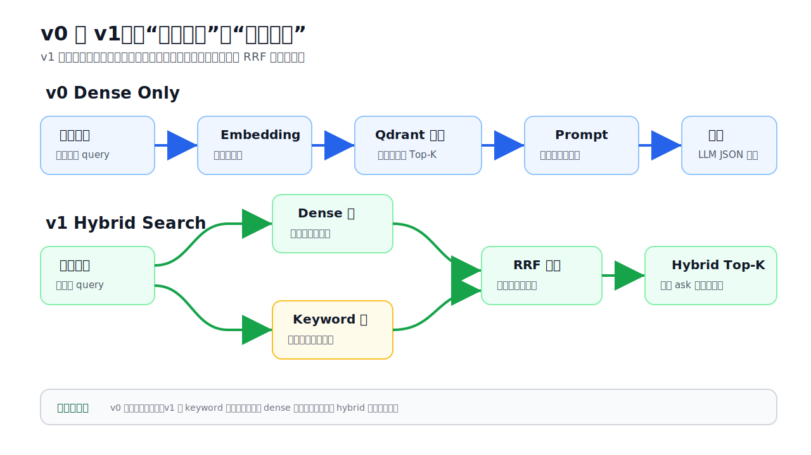
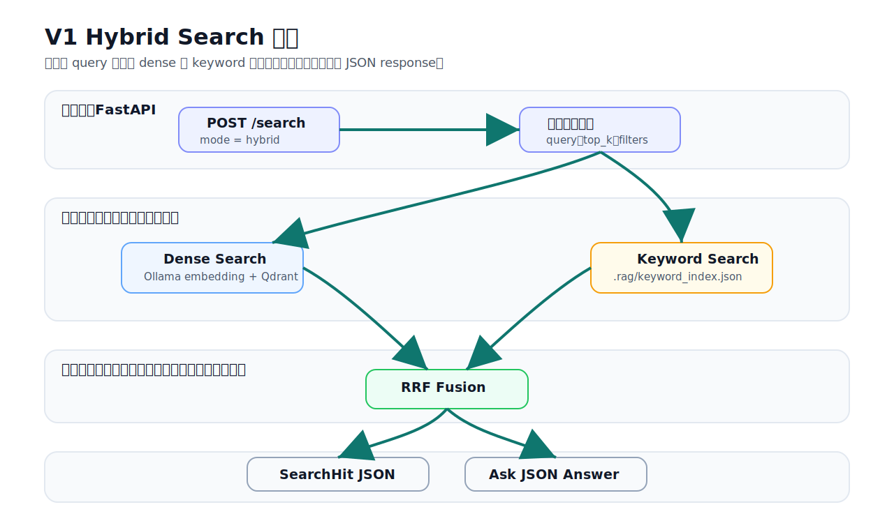
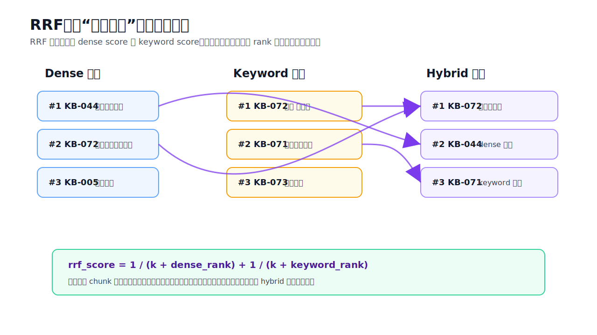

# V1 Hybrid Search Guide

V1 的目标是提升检索质量。V0 已经能完成一条最小 RAG 链路：加载文档、切块、向量化、写入 Qdrant、检索、拼 prompt、调用 LLM。V1 在这个基础上增加 FastAPI JSON 接口和混合检索，让你可以在 Swagger 里观察不同检索策略的差异。

## V1 比 V0 改进了什么



V0 的查询链路只有 dense vector search：

```text
用户问题 -> embedding -> Qdrant dense search -> top-k chunks -> LLM answer
```

V1 的查询链路变成 hybrid search：

```text
用户问题 -> dense search
        -> keyword search
        -> RRF hybrid fusion
        -> top-k chunks
        -> LLM answer / JSON response
```

核心变化：

- `dense`：保留 V0 的向量检索能力，擅长语义相近但字面不同的问题。
- `keyword`：新增关键词检索，擅长命中 `KB-072`、命令、日期、文件名、专有名词和罕见词。
- `hybrid`：新增融合层，用 RRF 把 dense 和 keyword 的排名合并，减少单一路径漏召回。
- FastAPI：新增 Swagger 调试入口，可以直接测试 `/search`、`/compare-search`、`/ask`。

## 三种搜索模式

### dense

`dense` 只使用向量检索。它会把 query 通过 Ollama embedding 转成向量，再去 Qdrant 找相似 chunk。

适合：

- 问法和原文不完全一样。
- 用户用自然语言描述问题。
- 需要语义理解，比如“鸡肉要不要洗”和“不建议清洗生鸡肉”。

局限：

- 对精确字符串不够敏感。
- 可能漏掉编号、命令、日期、罕见专有名词。

### keyword

`keyword` 使用与 Qdrant collection 同名的本地索引（默认 `RAG_DB_PATH=.rag/qdrant` 时为 `.rag/keyword_indexes/<collection>.json`）。这个索引由同一 collection 的 `ingest` 阶段同步写入，内容来自 chunk text 和 metadata；增量 ingest 会合并新 chunks，`recreate=true` 才会覆盖该 collection 的索引。

适合：

- `KB-072` 这类知识块编号。
- 文件名、命令、日期、配置项、API 名称。
- 用户问题里出现必须精确匹配的词。

局限：

- 不理解语义。
- 如果用户换一种说法，而关键词没有重合，召回会变差。

### hybrid

`hybrid` 是 V1 默认推荐模式。它会同时执行 dense 和 keyword，然后用 RRF 融合两边排名。

适合：

- 日常问答默认使用。
- 同时希望保留语义召回和精确命中。
- 想用 `/compare-search` 观察 dense、keyword、hybrid 哪个更稳。

## Hybrid Search 流程



`POST /search` 使用 `mode=hybrid` 时，内部流程是：

1. FastAPI 校验 JSON 请求。
2. `RetrievalService.search()` 收到 query、top_k、mode、filters、collection。
3. Dense 路径调用 V0 的 `pipeline.search()`，继续使用 Ollama embedding 和 Qdrant。
4. Keyword 路径读取当前 collection 对应的 keyword index，做关键词/BM25 风格检索。
5. `reciprocal_rank_fusion()` 把两组结果融合。
6. API 返回统一的 `SearchHit` JSON。

## RRF 是什么



RRF 全称是 Reciprocal Rank Fusion。它不直接比较 dense score 和 keyword score，因为这两种分数不是同一个体系。RRF 只看排名：

```text
rrf_score = 1 / (k + rank)
```

如果一个 chunk 同时出现在 dense 和 keyword 的靠前位置，它会拿到两份排名分数，所以 hybrid 排名会被提升。

示例：

| chunk | dense rank | keyword rank | hybrid 结果 |
| --- | ---: | ---: | --- |
| `KB-072` | 2 | 1 | 两路都命中，通常会排到前面 |
| `KB-044` | 1 | - | dense 很强，但缺少 keyword 加成 |
| `KB-071` | - | 2 | keyword 命中，可以补 dense 漏召回 |

## Swagger 怎么测试

启动 API：

```bash
.venv/bin/uvicorn obsidian_rag.v1.app:app --reload
```

打开 Swagger：

```text
http://127.0.0.1:8000/docs
```

推荐先测 `/compare-search`：

```json
{
  "query": "生鸡肉要不要洗",
  "top_k": 5,
  "mode": "hybrid",
  "collection": "food_safety"
}
```

它会同时返回：

- `dense`
- `keyword`
- `hybrid`

然后再测 `/ask`：

```json
{
  "question": "生鸡肉要清洗吗",
  "top_k": 5,
  "mode": "hybrid",
  "collection": "food_safety"
}
```

注意：如果没有过滤需求，不要保留 Swagger 自动生成的 filters 示例值：

```json
{
  "filters": {
    "path": "string",
    "tag": "string",
    "file_type": "string"
  }
}
```

这会启用过滤条件，要求 source 包含 `string`、文件类型以 `string` 结尾、tags 里包含 `string`，结果通常会被过滤为空。没有过滤需求时删除 `filters`，或设置为 `null`。

## V1 文件职责

### API 入口与依赖

| 文件 | 作用 |
| --- | --- |
| `obsidian_rag/v1/__init__.py` | 标识 V1 package。 |
| `obsidian_rag/v1/app.py` | FastAPI app 入口，设置标题、版本和说明，并挂载所有 route。 |
| `obsidian_rag/v1/dependencies.py` | FastAPI 依赖注入层，负责加载 `RagConfig`，创建 `RetrievalService` 和 `AnswerService`。 |
| `obsidian_rag/v1/schemas.py` | Pydantic 请求/响应模型，定义 `SearchRequest`、`AskRequest`、`SearchHit`、`SearchResponse` 等 JSON 结构。 |

### Routes

| 文件 | 作用 |
| --- | --- |
| `obsidian_rag/v1/routes/__init__.py` | 标识 routes package。 |
| `obsidian_rag/v1/routes/health.py` | `GET /health`，用于确认 API 服务是否正常。 |
| `obsidian_rag/v1/routes/search.py` | `POST /search` 和 `POST /compare-search`，用于测试 dense、keyword、hybrid 检索。 |
| `obsidian_rag/v1/routes/ask.py` | `POST /ask`，先检索再调用 LLM，返回 JSON answer、results、sources。 |
| `obsidian_rag/v1/routes/ingest.py` | `POST /ingest`，通过 HTTP 触发 V0 的 ingest 流程，并同步生成 keyword index。 |

### Services

| 文件 | 作用 |
| --- | --- |
| `obsidian_rag/v1/services/__init__.py` | 标识 services package。 |
| `obsidian_rag/v1/services/retrieval_service.py` | V1 检索服务入口。根据 `mode` 分发到 dense、keyword、hybrid，并处理 filters。 |
| `obsidian_rag/v1/services/answer_service.py` | V1 问答服务。调用 `RetrievalService` 获取证据，再复用 V0 的 prompt 和 LLM client 生成答案。 |

### Retrieval

| 文件 | 作用 |
| --- | --- |
| `obsidian_rag/v1/retrieval/__init__.py` | 标识 retrieval package。 |
| `obsidian_rag/v1/retrieval/models.py` | 定义 V1 内部排名结果 `RankedSearchResult`，用于携带 dense_rank、keyword_rank、hybrid_score。 |
| `obsidian_rag/v1/retrieval/keyword.py` | 本地关键词索引。负责 build/load/save/upsert/search collection-scoped index（默认路径 `.rag/keyword_indexes/<collection>.json`）。 |
| `obsidian_rag/v1/retrieval/hybrid.py` | RRF 融合逻辑。把 dense results 和 keyword results 合并成 hybrid 排名。 |

### Tests

| 文件 | 作用 |
| --- | --- |
| `tests/v1/test_api.py` | 测试 `/health`、`/search`、`/compare-search` 的 JSON 结构。 |
| `tests/v1/test_keyword_retrieval.py` | 测试 keyword index 能命中精确编号和中文词，并能处理索引文件缺失。 |
| `tests/v1/test_hybrid_rrf.py` | 测试 RRF 会提升同时被 dense 和 keyword 命中的结果。 |

## 常见排查顺序

1. `/health` 不通：先确认 `uvicorn obsidian_rag.v1.app:app --reload` 是否启动。
2. `/search` 的 `keyword` 为空：确认已对同一个 `collection` 运行 `obsidian-rag ingest --collection <collection> --recreate` 或 `POST /ingest`，并检查该 collection 的 keyword index（默认 `.rag/keyword_indexes/<collection>.json`）是否存在。
3. `/ask` 返回“资料不足”：先删掉 Swagger 自动生成的 `filters`，再用 `/compare-search` 看三组结果。
4. `chunk_id` 返回 `null`：说明当前 chunk metadata 里没有单独保存 `chunk_id`。如果 `KB-072` 只写在正文 YAML 块中，后续需要增加 chunk-level metadata 解析。
5. hybrid 排名不理想：先看 `/compare-search`，判断是 dense 漏召回、keyword 漏召回，还是 RRF 融合权重需要调整。
