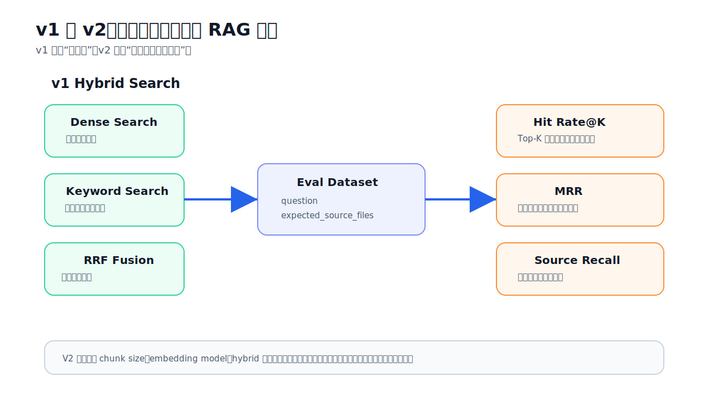
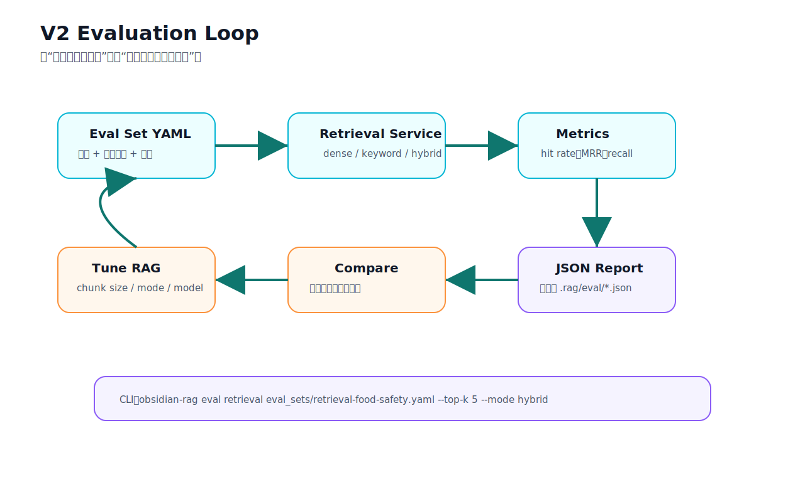
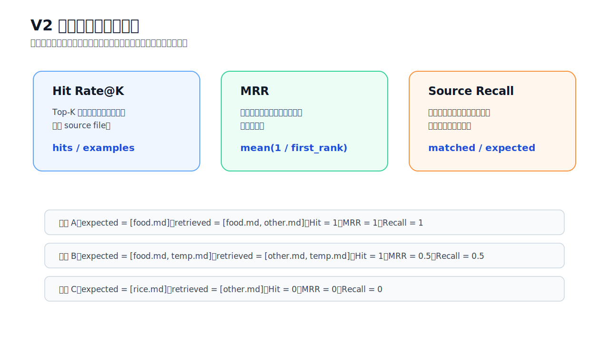

# V2 Evaluation Guide

V2 的目标是停止只靠感觉判断 RAG。V1 让系统能用 dense、keyword、hybrid 找到更多候选证据；V2 增加可重复评估，让你每次改 chunk size、embedding model、检索模式或融合策略后，都能用同一批问题对比效果。

## V2 比 V1 改进了什么



V1 主要回答：

```text
怎样更容易找到正确证据？
```

V2 主要回答：

```text
这次改动是否真的让检索更好？
```

新增能力：

- YAML 评估集：保存问题、预期来源文件、可选答案要点。
- 检索指标：`hit_rate_at_k`、`mean_reciprocal_rank`、`mean_source_recall`。
- 答案指标：轻量检查来源覆盖和预期答案要点覆盖。
- CLI：`obsidian-rag eval retrieval eval_set.yaml`。
- FastAPI：`POST /eval/retrieval` 和 `POST /eval/answer`。
- JSON report：默认保存到 `.rag/eval/retrieval-*.json`。

## Evaluation Loop



一个典型 V2 循环是：

1. 写一批真实问题到 eval set。
2. 每个问题写上 `expected_source_files`。
3. 跑 retrieval eval。
4. 看 hit rate、MRR、source recall。
5. 调整 RAG 参数或检索策略。
6. 用同一份 eval set 再跑一次，比较 JSON report。

这让你能区分两类问题：

- 检索失败：正确资料没有进 Top-K。
- 生成失败：资料已经找到了，但答案没用好。

## Eval Set 格式

示例文件：[retrieval-food-safety.yaml](../eval_sets/retrieval-food-safety.yaml)

```yaml
examples:
  - id: chicken-wash
    question: 生鸡肉要不要用水冲洗？
    expected_source_files:
      - rag_test_food_safety_kb_expanded.md
    expected_answer_points:
      - 不建议清洗生鸡肉
      - 交叉污染
```

字段说明：

- `id`：可选，方便定位某条评估结果；不写时自动生成 `example-1`。
- `question`：要测试的问题。
- `expected_source_files`：这道题应该命中的来源文件。
- `expected_answer_points`：可选，轻量答案评估会检查答案是否包含这些要点。

当前 V2 的检索指标以 source file 为粒度。后续如果把 `chunk_id` 正式解析进 metadata，可以进一步支持 expected chunk ids。

## Retrieval Metrics



### Hit Rate@K

Top-K 结果里只要命中任意一个预期来源，就算 hit。

```text
hit_rate_at_k = hit examples / all examples
```

它回答：

```text
这批问题里，有多少题至少找到了一个正确来源？
```

### MRR

MRR 看第一个正确来源排在第几名。

```text
reciprocal_rank = 1 / first_relevant_rank
mean_reciprocal_rank = average(reciprocal_rank)
```

如果正确来源排第 1，得分是 `1.0`。如果排第 2，得分是 `0.5`。如果没命中，得分是 `0`。

它回答：

```text
正确来源是不是排得足够靠前？
```

### Source Recall

如果一道题有多个预期来源，source recall 看实际覆盖了多少。

```text
source_recall = matched_expected_sources / expected_sources
```

它回答：

```text
多证据问题的来源覆盖够不够？
```

## CLI 使用

运行示例评估集：

```bash
.venv/bin/obsidian-rag eval retrieval eval_sets/retrieval-food-safety.yaml --top-k 5 --mode hybrid
```

常用参数：

```bash
--top-k 5
--mode dense
--mode keyword
--mode hybrid
--output .rag/eval/my-report.json
--no-save
```

输出示例：

```text
Examples: 10
Mode: hybrid
Top-K: 5
Hit rate@5: 1.0000
MRR: 0.8500
Source recall: 1.0000
Saved report: .rag/eval/retrieval-20260707-153000.json
```

## Swagger 使用

启动 V2 API：

```bash
.venv/bin/uvicorn obsidian_rag.v2.app:app --reload --port 8001
```

打开：

```text
http://127.0.0.1:8001/docs
```

检索评估：

```json
{
  "dataset_path": "eval_sets/retrieval-food-safety.yaml",
  "top_k": 5,
  "mode": "hybrid",
  "save": true
}
```

答案评估：

```json
{
  "answer": "不建议冲洗生鸡肉，因为水花可能造成交叉污染。",
  "expected_source_files": ["rag_test_food_safety_kb_expanded.md"],
  "cited_source_files": ["rag_test_food_safety_kb_expanded.md"],
  "expected_answer_points": ["不建议冲洗生鸡肉", "交叉污染"]
}
```

`/eval/answer` 不调用 LLM。它只评估你传入的 answer 文本，适合先做确定性检查。

## `/eval/answer` 是什么

`/eval/answer` 可以理解成一个答案批改器，或者答案质检器。它不是问答接口，也不会用答案反查知识库。

它做的事情是：

```text
已有答案 + 标准来源 + 实际引用来源 + 标准答案要点 -> 覆盖率报告
```

也就是说，它回答的问题不是“这道题该怎么答”，而是：

```text
这段已经生成好的答案，来源引用对不对？关键点漏没漏？
```

### 字段含义

示例请求：

```json
{
  "answer": "不建议冲洗生鸡肉，因为水花会造成交叉污染。",
  "expected_source_files": ["food.md"],
  "cited_source_files": ["food.md"],
  "expected_answer_points": ["不建议冲洗生鸡肉", "交叉污染", "充分加热"]
}
```

字段解释：

| 字段 | 含义 |
| --- | --- |
| `answer` | 要被批改的答案正文。V2 会在这段文本里检查是否包含预期要点。 |
| `expected_source_files` | 标准答案认为应该引用的来源文件。 |
| `cited_source_files` | 这段答案实际引用或声明使用的来源文件。 |
| `expected_answer_points` | 标准答案希望覆盖的关键要点列表。 |

### 计算方式

来源覆盖率：

```text
source_coverage = 命中的 expected_source_files 数量 / expected_source_files 总数
```

如果：

```json
"expected_source_files": ["food.md"],
"cited_source_files": ["food.md"]
```

那么：

```text
source_coverage = 1 / 1 = 1.0
```

答案要点覆盖率：

```text
answer_point_coverage = answer 中命中的 expected_answer_points 数量 / expected_answer_points 总数
```

如果：

```json
"answer": "不建议冲洗生鸡肉，因为水花会造成交叉污染。",
"expected_answer_points": ["不建议冲洗生鸡肉", "交叉污染", "充分加热"]
```

命中情况是：

```text
不建议冲洗生鸡肉：命中
交叉污染：命中
充分加热：未命中
```

那么：

```text
answer_point_coverage = 2 / 3 = 0.6667
```

返回中会看到：

```json
{
  "source_coverage": 1.0,
  "answer_point_coverage": 0.6666666666666666,
  "citation_present": true,
  "matched_source_files": ["food.md"],
  "missing_source_files": [],
  "matched_answer_points": ["不建议冲洗生鸡肉", "交叉污染"],
  "missing_answer_points": ["充分加热"]
}
```

### 为什么需要答案验证

RAG 的失败可以发生在两段：

```text
检索阶段：有没有找对资料？
生成阶段：找对资料后，答案有没有说对、说全、引用对？
```

所以 V2 把评估拆开：

| 接口 | 回答的问题 |
| --- | --- |
| `/eval/retrieval` | 有没有找对资料？ |
| `/eval/answer` | 已有答案有没有覆盖该说的点、引用该引用的来源？ |

如果 `/eval/retrieval` 分数低，问题通常在检索层，需要调 chunk size、embedding model、keyword search、hybrid fusion、top_k 或 filters。

如果 `/eval/retrieval` 分数高，但 `/eval/answer` 分数低，说明资料可能找到了，但生成阶段没有用好，需要调 prompt、答案结构、引用要求、上下文排序或 LLM 模型。

## V2 文件职责

### Evaluation

| 文件 | 作用 |
| --- | --- |
| `obsidian_rag/v2/__init__.py` | 标识 V2 package。 |
| `obsidian_rag/v2/evaluation/__init__.py` | 标识 evaluation package。 |
| `obsidian_rag/v2/evaluation/dataset.py` | 读取 YAML eval set，生成 `EvalDataset` 和 `EvalExample`。 |
| `obsidian_rag/v2/evaluation/metrics.py` | 计算 retrieval 指标：hit、first relevant rank、MRR、source recall。 |
| `obsidian_rag/v2/evaluation/retrieval.py` | 编排检索评估：逐题调用 retrieval service、汇总指标、保存 JSON report。 |
| `obsidian_rag/v2/evaluation/answer.py` | 轻量答案评估：检查来源覆盖和答案要点覆盖。 |

### API

| 文件 | 作用 |
| --- | --- |
| `obsidian_rag/v2/app.py` | FastAPI V2 app 入口。 |
| `obsidian_rag/v2/dependencies.py` | 依赖注入，加载配置并创建 V1 `RetrievalService`。 |
| `obsidian_rag/v2/schemas.py` | V2 Pydantic 请求/响应模型。 |
| `obsidian_rag/v2/routes/__init__.py` | 标识 routes package。 |
| `obsidian_rag/v2/routes/health.py` | `GET /health`。 |
| `obsidian_rag/v2/routes/eval.py` | `POST /eval/retrieval` 和 `POST /eval/answer`。 |

### Tests

| 文件 | 作用 |
| --- | --- |
| `tests/v2/test_dataset.py` | 测试 YAML eval set 读取和默认 id。 |
| `tests/v2/test_metrics.py` | 测试 retrieval 指标计算。 |
| `tests/v2/test_retrieval_evaluator.py` | 测试评估报告生成和 JSON 保存。 |
| `tests/v2/test_answer_metrics.py` | 测试轻量答案指标。 |
| `tests/v2/test_api.py` | 测试 V2 FastAPI JSON 接口。 |
| `tests/v2/test_cli_eval.py` | 测试 CLI retrieval eval 输出和报告保存。 |

## 常见排查

1. `hit_rate_at_k` 很低：先用 V1 `/compare-search` 看正确来源有没有进 dense、keyword、hybrid 任一路。
2. hit rate 高但 MRR 低：说明能找到正确来源，但排得靠后，可能需要调融合或 reranker。
3. source recall 低：多来源问题只命中了一部分资料，可能需要提高 `top_k` 或改善 query。
4. report 没保存：检查是否用了 `--no-save`，或 API 请求里 `save` 是否为 `false`。
5. answer point coverage 低：检索可能没问题，但 prompt 或生成阶段没覆盖预期要点。
