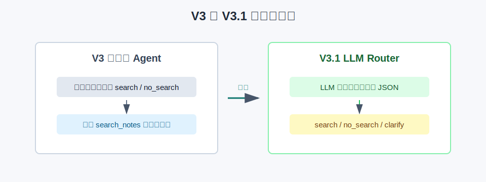
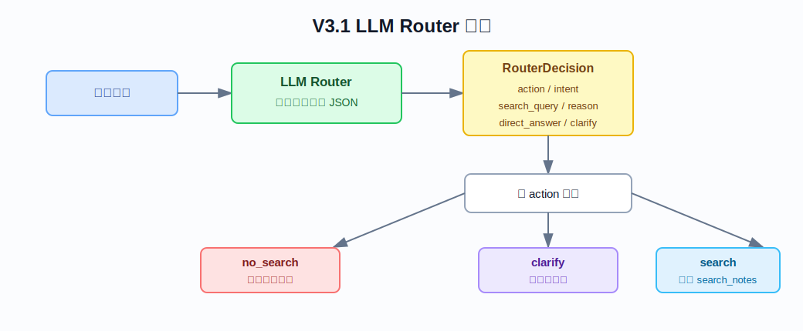
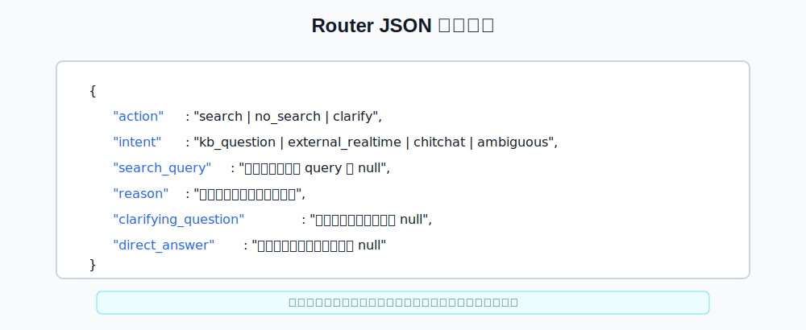

# V3.1 LLM Router Guide

V3.1 的目标是把 V3 的规则判断升级成 LLM Router。它仍然不是 Tool Calling，也不是 LangGraph；这一版只学习一件事：**先让模型输出结构化 JSON，再由代码按 JSON 决定是否检索知识库。**

## V3.1 比 V3 改进了什么



V3 的判断逻辑是规则版：

```text
问题很短或是寒暄 -> no_search
否则 -> search
```

所以类似下面的问题容易误判：

```text
今天深圳天气怎么样
```

它不是本地知识库问题，而是实时外部信息问题。V3.1 增加 LLM Router 后，流程变成：

```text
用户问题 -> LLM Router -> RouterDecision JSON -> search / no_search / clarify
```

V3.1 新增能力：

- 让 LLM 先分析用户意图。
- Router 必须返回结构化 JSON，而不是自然语言解释。
- 支持三种动作：`search`、`no_search`、`clarify`。
- 响应里新增 `router` 字段，方便在 Swagger 里直接看模型的路由结果。
- trace 第一步从 V3 的 `decision` 变成 V3.1 的 `router`。

## LLM Router 流程



V3.1 的主流程：

1. 接收用户问题。
2. `RouterService` 把问题交给 LLM Router。
3. LLM Router 只输出 JSON。
4. `parse_router_json()` 解析并校验 JSON。
5. 如果 `action=search`，使用 `search_query` 调用 V1 `RetrievalService`。
6. 如果 `action=no_search`，不检索，直接返回边界说明或直接回复。
7. 如果 `action=clarify`，不检索，向用户追问。
8. 返回 answer、sources、router、trace。

## Router JSON 字段



示例：

```json
{
  "action": "search",
  "intent": "kb_question",
  "search_query": "生鸡肉 清洗 交叉污染",
  "reason": "问题属于食品安全知识库范围。",
  "clarifying_question": null,
  "direct_answer": null
}
```

字段含义：

| 字段 | 含义 |
| --- | --- |
| `action` | 下一步动作：`search`、`no_search`、`clarify`。 |
| `intent` | 意图标签，例如 `kb_question`、`external_realtime`、`chitchat`、`ambiguous`。 |
| `search_query` | 当 `action=search` 时给检索器用的 query。 |
| `reason` | Router 为什么做出这个判断。 |
| `clarifying_question` | 当 `action=clarify` 时返回给用户的追问。 |
| `direct_answer` | 当 `action=no_search` 时可直接返回给用户的回答。 |

如果 LLM 没有返回合法 JSON，系统会降级成：

```json
{
  "action": "clarify",
  "intent": "invalid_router_output"
}
```

这比错误地检索更安全。

## Swagger 使用

启动 V3.1 API：

```bash
.venv/bin/uvicorn obsidian_rag.v3_1.app:app --reload --port 8003
```

打开：

```text
http://127.0.0.1:8003/docs
```

知识库问题：

```json
{
  "question": "生鸡肉还需要清洗下锅吗",
  "top_k": 5,
  "mode": "hybrid",
  "filters": null,
  "max_steps": 1
}
```

预期观察点：

- `router.action = "search"`
- `router.intent = "kb_question"`
- `router.search_query` 是 LLM 改写后的检索 query
- `used_retrieval = true`
- `trace[0].step_type = "router"`

实时外部信息问题：

```json
{
  "question": "今天深圳天气怎么样",
  "top_k": 5,
  "mode": "hybrid",
  "filters": null,
  "max_steps": 1
}
```

预期观察点：

- `router.action = "no_search"`
- `router.intent = "external_realtime"`
- `used_retrieval = false`
- 不会调用本地知识库检索。

模糊问题：

```json
{
  "question": "这个呢",
  "top_k": 5,
  "mode": "hybrid",
  "filters": null,
  "max_steps": 1
}
```

预期观察点：

- `router.action = "clarify"`
- `used_retrieval = false`
- `answer` 是一个追问。

## Trace 怎么读

V3.1 的 trace 示例：

```json
[
  {
    "step_type": "router",
    "decision": "search",
    "reason": "问题属于食品安全知识库范围。",
    "query": "生鸡肉 清洗 交叉污染",
    "metadata": {
      "intent": "kb_question"
    }
  },
  {
    "step_type": "search",
    "tool_name": "search_notes",
    "query": "生鸡肉 清洗 交叉污染",
    "result_count": 5
  },
  {
    "step_type": "evidence",
    "reason": "找到可用于回答的本地资料。",
    "result_count": 5
  },
  {
    "step_type": "answer",
    "reason": "基于检索证据生成最终答案。"
  }
]
```

重点看第一步：

```text
router.action 决定是否检索
router.intent 说明问题类型
router.search_query 说明检索器真正查了什么
```

## V3.1 文件职责

### Router

| 文件 | 作用 |
| --- | --- |
| `obsidian_rag/v3_1/router/service.py` | V3.1 的 Router 核心：提示词、调用 LLM、解析 JSON、非法输出降级。 |
| `obsidian_rag/v3_1/router/__init__.py` | 标识 router package。 |

### Agent

| 文件 | 作用 |
| --- | --- |
| `obsidian_rag/v3_1/agent/service.py` | 按 RouterDecision 执行 `search`、`no_search` 或 `clarify`，并返回 trace。 |
| `obsidian_rag/v3_1/agent/__init__.py` | 标识 agent package。 |
| `obsidian_rag/v3_1/schemas.py` | V3.1 请求/响应模型，包含 `router` 字段和 trace step。 |

### API

| 文件 | 作用 |
| --- | --- |
| `obsidian_rag/v3_1/app.py` | FastAPI V3.1 app 入口，提供 Swagger。 |
| `obsidian_rag/v3_1/dependencies.py` | 加载配置，创建 RouterService、V1 RetrievalService 和 LLM client。 |
| `obsidian_rag/v3_1/routes/agent.py` | `POST /agent/ask`。 |
| `obsidian_rag/v3_1/routes/health.py` | `GET /health`。 |

### Tests

| 文件 | 作用 |
| --- | --- |
| `tests/v3_1/test_router_service.py` | 测试 Router JSON 解析、fenced JSON、非法输出降级。 |
| `tests/v3_1/test_agent_service.py` | 测试 `search`、`no_search`、`clarify` 三条分支。 |
| `tests/v3_1/test_api.py` | 测试 V3.1 FastAPI JSON 接口。 |

## 当前限制

- V3.1 仍然是“Router JSON + 代码执行”，不是 Tool Calling。
- LLM 只负责路由判断，不直接调用工具。
- `max_steps` 当前主要保留为接口兼容字段，V3.1 默认只执行一次 Router 决定的检索 query。
- Router JSON 依赖模型遵守格式，所以代码保留了非法 JSON 降级逻辑。

## 和后续版本的关系

```text
V3.1：LLM Router 输出 JSON，代码按 JSON 执行
V3.2：Tool Calling，让模型直接选择 search_notes / no_search / clarify
V3.3：LangGraph，把 router、search、evidence_check、answer 拆成节点
```

所以 V3.1 要记住一句话：

```text
V3.1 的重点不是工具调用，而是把“是否检索”的判断交给 LLM Router，并强制它输出可被代码校验的 JSON。
```
