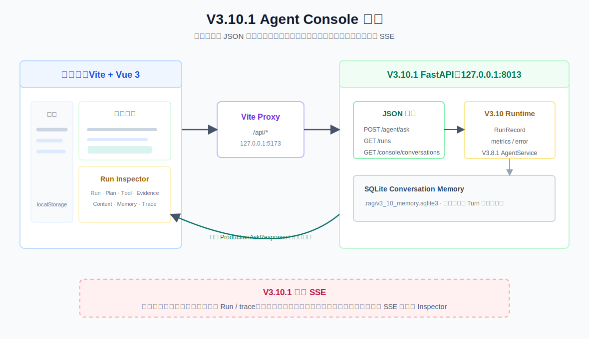

# V3.10.1 Agent Console 学习指南



## 这一版学习什么

V3.10 已经能返回 `ProductionAskResponse`，但它仍是一份适合 Swagger、CLI 和程序消费的 JSON。V3.10.1 用 Vite + Vue 3 把这些可观察数据变成工作台：用户可以对话，同时看见本次 Run 的 Plan、Tool、Evidence、Context、Memory 与 Trace。

```text
浏览器问题
  -> POST /api/agent/ask
  -> Vite proxy
  -> V3.10.1 FastAPI
  -> V3.10 Runtime + V3.8.1 Agent
  -> 完整 ProductionAskResponse
  -> Chat + Run Inspector
```

它是 Presentation / Agent Console 层，不是新的 RAG、Planner、Tool 或 Memory 策略。

## 与 V3.10 的区别

| 对比项 | V3.10 Production Core | V3.10.1 Agent Console |
| --- | --- | --- |
| 主要使用者 | API、CLI、日志、监控 | 正在提问和观察 Agent 的人 |
| 核心对象 | `RunRecord`、metrics、error | 会话 UI、Run Inspector、浏览器状态 |
| 主要输出 | `ProductionAskResponse` JSON | 对 JSON 的视觉化呈现 |
| 会话列表 | 无浏览器界面 | `localStorage` 保存近期会话 ID 与轻量消息 |
| 持久化 Memory | SQLite | UI 通过 Console API 读取 SQLite 快照 |
| 流式能力 | 无 | 无，仍等待完整 JSON |

## 目录和文件职责

```text
obsidian_rag/v3_10_1/
  app.py                    V3.10.1 FastAPI 装配，复用 V3.10 Agent/Run 路由
  schemas.py                Console 对外 JSON schema 与 Swagger 中文字段说明
  routes/console.py         会话快照与前端模式配置接口
  routes/health.py          V3.10.1 健康检查

frontend/v3_10_1_agent_console/
  vite.config.ts            Vite 开发服务器和 /api -> :8013 proxy
  src/api/production-client.ts  前端 API Client
  src/composables/use-agent-console.ts  浏览器会话、请求、Run 和错误状态
  src/types/production.ts   V3.10 JSON DTO TypeScript 类型
  src/components/           会话侧栏、消息区、输入器、Run Inspector
  src/styles/main.css       响应式工作台样式
```

## 页面数据边界

页面的三个状态层不能混淆：

| 数据 | 存放位置 | 作用 |
| --- | --- | --- |
| 浏览器近期会话与轻量消息 | `localStorage` | 让侧栏在刷新后保留当前会话入口和短历史。 |
| 原始 Turn / 滚动摘要 | `.rag/v3_10_memory.sqlite3` | V3.8.1 Planner/Answer 实际使用的会话记忆。 |
| 单次 Agent Run | `InMemoryRunStore` | 当前 FastAPI 进程中的 `prod_...` 状态、metrics、error；重启会丢失。 |

刷新页面时，UI 会调用：

```text
GET /console/conversations/{conversation_id}?window=3
```

读取 SQLite 最近 Turns；它不是把所有历史 Turn 都塞给前端，更不是浏览器的唯一消息真相。

## 页面布局

桌面端为三栏工作台：

```text
会话侧栏 | 对话主区 | Run Inspector
```

- 会话侧栏：浏览器保存的近期 `conversation_id`、近期 Production Runs、API 健康状态。
- 对话主区：问题、最终答案、来源和输入器；参数抽屉可调 `mode`、`top_k`、Memory、Context 等已有 API 字段。
- Run Inspector：`概览`、`计划与工具`、`证据`、`上下文` 四个 Tab。
- 移动端：主对话优先，Inspector 变为侧边抽屉。

界面只显示 `trace` 的节点、工具、结果数和原因说明；不会显示或声称显示 LLM chain-of-thought。

## JSON 请求与条件分支

### 正常检索

`POST /agent/ask` 成功后：

- Chat 显示 `agent_response.answer` 和 `sources`。
- Inspector 概览显示 `run.status=succeeded`、耗时和工具摘要。
- `计划与工具` 显示 Plan、每步 `status` 与搜索结果数。
- `证据` 显示 Evidence Checker 判断；`上下文` 显示 Memory 和选入 chunks。

### `no_search` / `clarify`

它们仍是成功 Run，不是错误：

- `run.status` 通常是 `succeeded`。
- `tool_summaries` 可为空，检索结果数为 0。
- 具体为何不检索或要求澄清，应从 Plan 和 Trace 中查看。

### Evidence 不足与补搜

Inspector 的 `证据` Tab 显示 `missing_step_ids`、`missing_points` 与 `suggested_queries`。若 V3.8.1 执行过 retry，`计划与工具` 会同时包含初始 `step_results` 和 `retry_step_results`。

### Agent 异常

当 V3.10 Runtime 捕获异常：

- `run.status=failed`。
- `agent_response=null`，因为没有完整 Agent 结果可渲染。
- Chat 显示结构化错误消息，Inspector 显示 `RunError`；不会暴露 Python traceback。

### 这版为何不是实时的

当前浏览器在 `fetch('/agent/ask')` 返回前，只能显示本地 `isRunning=true`。完整 `run.events` 与 V3.8.1 `trace` 都要在 Agent 执行结束后才抵达浏览器。

```text
V3.10.1：一次 JSON response -> 渲染完整时间线
V3.10.2：节点事件 -> EventSink -> SSE -> 增量追加时间线
```

因此本版不会假装在展示实时节点进度；SSE 会在下一版单独实现，而且 JSON 接口仍会保留给 Swagger、CLI 和测试。

## Swagger 与启动方式

V3.10.1 API 默认端口是 `8013`：`http://127.0.0.1:8013/docs`。

Vite 默认端口是 `5173`：`http://127.0.0.1:5173`。

Vite 的 `/api` proxy 默认目标为 `http://127.0.0.1:8013`。若要临时指向其他 API，可使用：

```bash
VITE_API_TARGET=http://127.0.0.1:8012 npm run dev
```

### `POST /agent/ask` Swagger payload

```json
{
  "question": "生鸡肉要不要洗？处理后厨房怎么清洁？",
  "conversation_id": "conv_v3101_demo",
  "memory_window": 3,
  "memory_compaction_enabled": true,
  "memory_compaction_trigger_turns": 4,
  "memory_compaction_trigger_tokens": 3000,
  "top_k": 5,
  "mode": "hybrid",
  "filters": null,
  "max_steps": 4,
  "max_retries": 1,
  "context_max_chunks": 4,
  "context_token_budget": 4000
}
```

### Console 专用接口

- `GET /console/config`：返回当前是 JSON 模式、尚未支持 SSE，以及 UI 默认值。
- `GET /console/conversations/{conversation_id}?window=3`：读取 V3.10 SQLite Memory 快照。
- `GET /runs`、`GET /runs/{run_id}`：复用 V3.10 进程内 Run Store。

## CLI

```bash
.venv/bin/obsidian-rag agent-v3-10-1 ask "生鸡肉要不要洗？" \
  --conversation-id conv_v3101_demo \
  --mode hybrid
```

CLI 输出仍来自 V3.10 Runtime，只是在开头标注 `Agent Console JSON flow`，用于和网页使用同一条 JSON Agent 链路做断点对照。

## 核心断点调试

下列行号基于当前代码；代码变动后优先按函数名定位。

| 顺序 | 断点位置 | 观察变量 |
| --- | --- | --- |
| 1 | `frontend/v3_10_1_agent_console/src/components/ChatComposer.vue:25`，`submit()` | `modelValue`、`isRunning`；确认 UI 只提交已有 JSON 参数。 |
| 2 | `frontend/v3_10_1_agent_console/src/composables/use-agent-console.ts:113`，`submit()` | `activeConversationId`、`options`、`isRunning`、`response`；观察浏览器本地状态如何变化。 |
| 3 | `frontend/v3_10_1_agent_console/src/api/production-client.ts:20`，`askAgent()` | `AgentAskPayload` 和 `/api/agent/ask`；Vite proxy 如何替换 `/api` 前缀。 |
| 4 | `obsidian_rag/v3_10/routes/agent.py:12`，`ask_agent()` | 从 V3.10.1 复用的 `/agent/ask` 路由，继续进入 Runtime。 |
| 5 | `obsidian_rag/v3_10/runtime/lifecycle.py:29`，`AgentRuntimeService.ask()` | `prod_...`、`run.status`、`agent_response`；观察 V3.10.1 没有复制 Agent 逻辑。 |
| 6 | `obsidian_rag/v3_10_1/routes/console.py:21`，`get_conversation()` | `conversation_id`、`window`、`memory_snapshot`；区分 SQLite Memory 与浏览器侧会话。 |
| 7 | `frontend/v3_10_1_agent_console/src/components/RunInspector.vue:35`，`timeline` | `run.events` 和 `agent.trace` 如何合成界面时间线；它发生在完整响应到达后。 |

`launch.json` 中的调试顺序：先启动 `V3.10.1 API server: Agent Console`，再启动 `V3.10.1 UI: Vite Agent Console`；`V3.10.1 Console: first turn` 和 `follow-up turn` 可用于同一 `conversation_id` 的 Memory 对照。

## 当前不做什么

- 不做 SSE、WebSocket、后台任务队列或实时 token 输出。
- 不在 UI 展示模型内部推理。
- 不给浏览器开放任意数据库、文件或 Shell 能力。
- 不取代 Swagger、CLI、V3.9 Evaluation 或 V3.10 Runtime。

下一版 `V3.10.2 Run Event Streaming` 会在已有界面上引入 `EventSink` 与 SSE，使 Inspector 在节点/工具实际结束时更新；之后才回到 V3.11 Skill System 主线。
