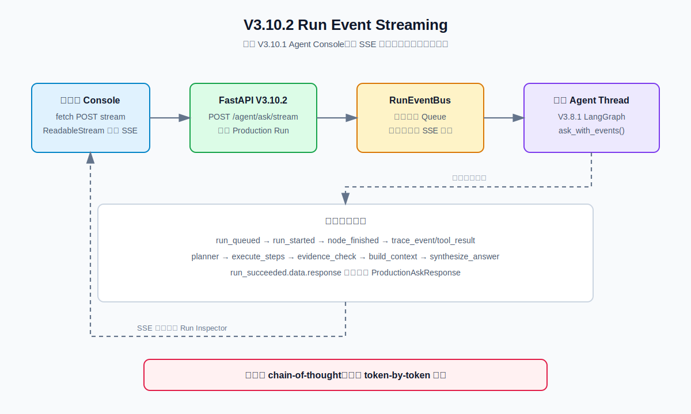

# V3.10.2 Run Event Streaming 学习指南

> 历史说明：本页记录 V3.10.2 当时对同一 Console 的 SSE 扩展，文中的 `frontend/v3_10_1_agent_console/` 是历史路径。当前维护中的 `frontend/agent_console/` 只支持 `console.v1 + V3.12.1/8020`；V3.10.2 里程碑代码可从提交 `9369a9c1f71d77a3a56167289f85cf1fb84accdb` 学习。



## 这一版学习什么

V3.10.1 的 Agent Console 只能在完整 JSON 返回后展示 Run 详情。V3.10.2 复用同一个 Vue 3 Console，把 Agent 执行过程中的可观察事实通过 SSE 增量发送给浏览器。

```text
POST /agent/ask/stream
  -> 创建 Production Run
  -> 后台线程执行 V3.8.1 Agent
  -> RunEventBus 保存并转发事件
  -> SSE 返回 node / trace / tool 事实
  -> run_succeeded 携带完整 ProductionAskResponse
```

SSE 只展示执行事实：节点名称、工具名称、结果数量、状态和耗时。它不展示模型内部推理，也不等于 token-by-token 输出。

## JSON 与 SSE

| 接口 | 用途 | 返回方式 |
| --- | --- | --- |
| `POST /agent/ask` | Swagger、CLI、非流式调用 | 完整 JSON |
| `POST /agent/ask/stream` | Agent Console、实时调试 | `text/event-stream` |

两条接口使用同一套 `ProductionAskRequest` 和 V3.8.1 Agent。SSE 只是增加传输层和运行时观测，不改变 Planner、RAG、Evidence、Context 或 Memory 策略。

## SSE 事件结构

每条事件包含：

```json
{
  "event_id": 4,
  "run_id": "prod_abc123",
  "name": "trace_event",
  "status": "running",
  "occurred_at": "2026-07-14T10:00:00+00:00",
  "detail": "LangGraph 节点 execute_steps 已完成，耗时 842 ms。",
  "data": {
    "run": {},
    "agent": {
      "node_name": "execute_steps",
      "graph_path": ["load_memory", "compact_memory", "planner", "execute_steps"],
      "duration_ms": 842
    }
  }
}
```

典型事件顺序：

```text
run_queued
run_started
node_finished(load_memory)
trace_event(memory_read)
node_finished(planner)
trace_event(planner)
node_finished(execute_steps)
trace_event(tool_result)
node_finished(evidence_check)
node_finished(build_context)
node_finished(synthesize_answer)
node_finished(save_memory)
run_succeeded
```

`run_succeeded.data.response` 才是完整的 `ProductionAskResponse`。响应中的 `node_timings` 和 `run.metrics.node_timings` 会记录每个 `graph_path` 节点的开始时间、结束时间和耗时。在最终事件到达之前，前端只能展示 Run 时间线，不能假设已经有最终答案、Plan 详情或完整 Context。

## Swagger 测试

启动：

```bash
.venv/bin/uvicorn obsidian_rag.v3_10_2.app:app --host 127.0.0.1 --port 8014
```

打开：`http://127.0.0.1:8014/docs`

非流式接口使用 `POST /agent/ask`。SSE 接口使用同一个 payload：

```json
{
  "question": "生鸡肉要不要洗？",
  "conversation_id": "conv_v3102_demo",
  "memory_window": 3,
  "memory_compaction_enabled": true,
  "memory_compaction_trigger_turns": 4,
  "memory_compaction_trigger_tokens": 3000,
  "top_k": 5,
  "mode": "hybrid",
  "filters": null,
  "max_steps": 4,
  "max_retries": 1,
  "context_max_chunks": 4,
  "context_token_budget": 4000
}
```

Swagger 对 `text/event-stream` 的展示不如浏览器直观；可以用 CLI 或前端查看事件：

```bash
.venv/bin/obsidian-rag agent-v3-10-2 ask "生鸡肉要不要洗？" \
  --conversation-id conv_v3102_demo \
  --api-base http://127.0.0.1:8014
```

前端启动：

```bash
cd frontend/v3_10_1_agent_console
VITE_API_TARGET=http://127.0.0.1:8014 npm run dev
```

地址：`http://127.0.0.1:5173`

## 文件职责

```text
obsidian_rag/v3_10_2/
  app.py                       FastAPI 装配，注册 JSON、SSE、Run 和 Console 路由
  schemas.py                   SSE 事件和 Console 配置 schema
  dependencies.py              构建 Agent、事件总线和 Streaming Runtime
  runtime/event_bus.py         线程安全的 Run 队列和 SSE 编码
  runtime/lifecycle.py         后台线程、Run 状态、事件发布和最终响应
  routes/agent.py              POST /agent/ask 与 POST /agent/ask/stream
  routes/console.py            Console 配置和 MySQL 会话快照
  routes/health.py             V3.10.2 健康检查

obsidian_rag/v3_8_1/agent/service.py
  ask_with_events()            使用 LangGraph values stream 发布节点和 trace 事实

frontend/v3_10_1_agent_console/
  src/api/production-client.ts SSE POST 和浏览器 ReadableStream 解析
  src/types/production.ts      AgentStreamEvent TypeScript DTO
  src/composables/use-agent-console.ts  实时更新 Run Inspector 和最终响应
  src/App.vue                  标注当前复用 Console 的 V3.10.2 SSE 模式
  vite.config.ts               默认代理到 127.0.0.1:8014
```

## 核心断点调试

| 顺序 | 断点位置 | 观察内容 |
| --- | --- | --- |
| 1 | `v3_10_2/routes/agent.py:25` `stream_agent()` | 收到 JSON 后创建 `run_id`，返回 StreamingResponse。 |
| 2 | `v3_10_2/runtime/lifecycle.py:45` `start_stream()` | Run Store、EventBus 和后台线程的关系。 |
| 3 | `v3_10_2/runtime/lifecycle.py:68` `_run()` | `queued -> running -> succeeded/failed` 生命周期。 |
| 4 | `v3_8_1/agent/service.py:112` `ask_with_events()` | LangGraph 每次产生完整 State 后如何识别当前节点。 |
| 5 | `v3_8_1/agent/service.py:570` `_emit_agent_event()` | 事件 sink 异常为何不能阻断 Agent。 |
| 6 | `v3_10_2/runtime/lifecycle.py:80` `publish_agent_event()` | Agent 节点事实如何写入 Run 和 EventBus。 |
| 7 | `v3_10_2/runtime/event_bus.py:31` `publish()` | 事件编号、线程安全 Queue 和事件 payload。 |
| 8 | `v3_10_2/runtime/event_bus.py:57` `iter_sse()` | Python 对象如何编码为 SSE `id/event/data`。 |
| 9 | `frontend/v3_10_1_agent_console/src/api/production-client.ts:31` `streamAgent()` | fetch POST、ReadableStream 和 SSE frame 解析。 |
| 10 | `frontend/v3_10_1_agent_console/src/composables/use-agent-console.ts:161` `applyStreamEvent()` | Run Inspector 如何先显示运行事件，再替换成完整响应。 |

节点耗时的关键断点：

```text
v3_8_1/agent/service.py:_timed_node()
  -> handler(state)
  -> AgentNodeTiming(duration_ms)
  -> ask_with_events() 的 node_finished
  -> v3_10_2/runtime/lifecycle.py::_agent_event_detail()
  -> RunMetrics.node_timings
```

## 设计边界

- EventBus 是进程内存结构，服务重启后事件消失，不适合多进程生产部署。
- 当前使用后台线程执行同步 Agent；后续可学习任务队列和分布式事件总线。
- JSON `/agent/ask` 保持不变，SSE 不会替代 Swagger 和 CLI 的稳定契约。
- Conversation Memory 已迁移到 MySQL；Run Store 仍然是进程内存结构。
- 不发送 chain-of-thought，不发送模型隐藏推理，不做 token-by-token LLM streaming。
- SSE 客户端断开不会让 Agent 失败；事件 sink 异常会被隔离。

## 下一步

V3.10.2 完成后进入 V3.11 Skill System，学习 Skill Registry、Skill Router 和按需加载 `SKILL.md`。SSE 作为运行观察层继续被后续 Skill、MCP 和 Permission 版本复用。
