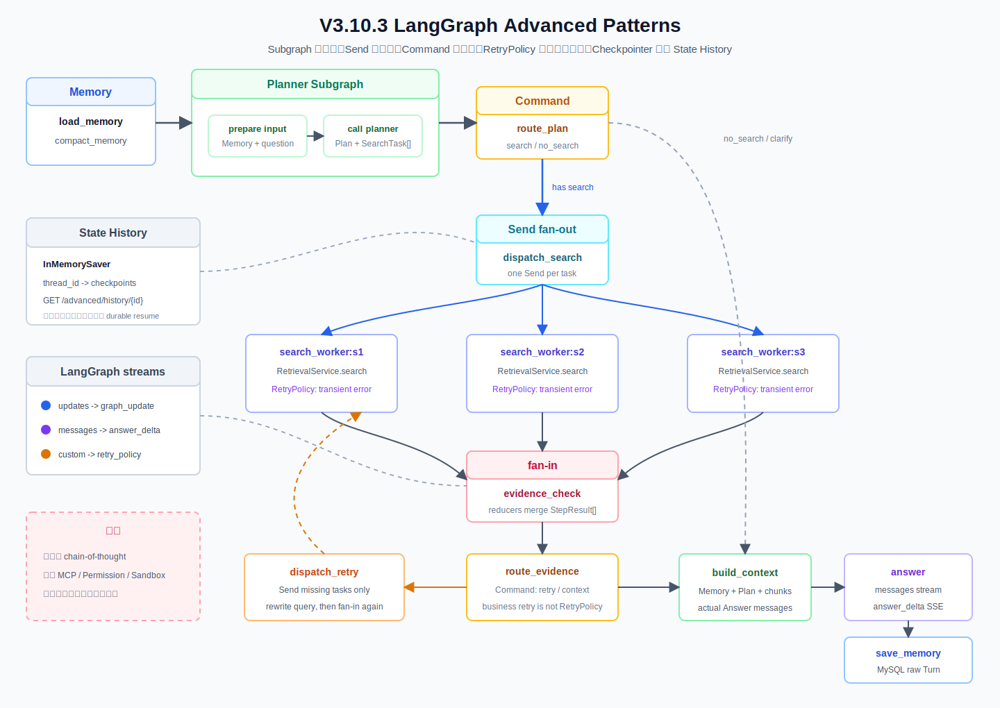

# V3.10.3 LangGraph Advanced Patterns 学习指南



## 这一版学习什么

V3.10.2 已经能把 V3.8.1 Agent 的节点事实放进 EventBus，再通过 SSE 发送给前端；但 Agent 图本身仍以串行节点为主。V3.10.3 把学习重点放回 LangGraph 执行模型：

```text
Subgraph       把 Planner 内部步骤封装成独立小图
Send           把多个 search task 并行分发并自动汇合
Command        节点更新 State 的同时决定下一跳
RetryPolicy    节点抛出临时异常后由 LangGraph 自动重试
State History  通过 Checkpointer 查看每个 superstep 的状态快照
messages       把 Answer ChatModel 的可见文本增量送入 SSE
```

这一版没有重新发明 Planner、RAG、Evidence、Context 或 Memory，而是复用现有能力，观察它们怎样被更高级的 LangGraph 模式组织起来。

## 相比 V3.10.2 的变化

| 能力 | V3.10.2 | V3.10.3 |
| --- | --- | --- |
| Graph 结构 | 复用 V3.8.1 串行主图 | 增加 Planner Subgraph、Send fan-out/fan-in、Command 路由 |
| 检索步骤 | Planner steps 依次执行 | 多个 search steps 最多按 `max_parallel_searches` 并行执行 |
| 异常重试 | 业务代码处理失败 | `RetryPolicy` 自动重跑抛出 `TransientSearchError` 的节点 |
| 状态观察 | 最终响应和节点事件 | `InMemorySaver` 保存 State History，可按 `thread_id` 查询 |
| 文本流 | 节点级 SSE，最终答案一次返回 | Answer ChatModel 通过 `messages` stream 产生 `answer_delta` |
| 事件来源 | 自定义节点事件 | LangGraph `updates`、`messages`、`custom` 三种 stream mode |

V3.10.3 的 `messages` 流是模型可见答案文本，不是 chain-of-thought，也不会发送模型隐藏推理。

## 主流程

```text
load_memory
  -> compact_memory
  -> planner_subgraph
       -> prepare_planner_input
       -> call_planner
  -> route_plan(Command)
       -> 无 search：build_context
       -> 有 search：dispatch_search
            -> Send(search_worker:s1)
            -> Send(search_worker:s2)
            -> Send(search_worker:s3)
            -> evidence_check（等待同一批 worker 汇合）
            -> route_evidence(Command)
                 -> 证据不足：dispatch_retry -> Send(retry_search_worker) -> evidence_check
                 -> 证据充分：build_context
  -> answer(messages stream)
  -> save_memory
  -> END
```

`graph.add_node()` 的书写顺序不是执行顺序。真正的执行关系由 `add_edge()`、`add_conditional_edges()`、`Command.goto` 和 `Send` 决定。

## 六个高级模式

### 1. Planner Subgraph

主图只关心“输入 Memory，输出 Plan 和 search tasks”。Planner 子图内部负责：

```text
prepare_planner_input
  -> 把当前问题、滚动摘要、最近原始 Turns 组装成 PlanRequest

call_planner
  -> 调用现有 PlannerService
  -> 把 Plan 中的 search steps 转成 SearchTask[]
```

子图使用 `PlannerSubgraphState`，主图使用 `AdvancedAgentState`。字段名相同的输出会回到主图，但子图不需要知道 Answer、Memory write 等后续字段。

### 2. Send 并行检索

`_send_initial_tasks()` 为每个 `SearchTask` 返回一个 `Send("search_worker", task_state)`。LangGraph 会在同一 superstep 中调度这些 worker；每个 worker 只拿到本任务所需的局部 State。

```text
SearchTask(s1) -> search_worker -> StepResult(s1) ┐
SearchTask(s2) -> search_worker -> StepResult(s2) ├-> reducer 合并 -> evidence_check
SearchTask(s3) -> search_worker -> StepResult(s3) ┘
```

`step_results` 使用 `Annotated[list[StepResult], operator.add]` reducer。没有 reducer 时，并行 worker 同时写同一个 State key 会产生并发更新冲突。

这里的“并行”是单个 LangGraph Run 内的节点并发，不等于 Kafka、NATS 或 Celery 的跨进程分布式任务。

### 3. Command 动态路由

`route_plan` 和 `route_evidence` 不只返回 State 更新，而是返回：

```python
Command(
    goto="dispatch_search",
    update={"graph_path": ["route_plan"]},
)
```

因此一个节点可以同时完成两件事：

1. 把路由事实写入 `route_decisions`、`trace` 和 `graph_path`。
2. 根据当前 State 选择下一节点。

本版本保留 `destinations=(...)`，让图可视化和静态分析知道 Command 可能前往哪些节点。

### 4. RetryPolicy 与 Evidence retry

这两种 retry 解决的问题不同：

| 类型 | 触发条件 | 是否重跑同一节点 | 是否改查询词 | 主要字段 |
| --- | --- | --- | --- | --- |
| LangGraph `RetryPolicy` | 节点抛出 `TransientSearchError` | 是 | 否 | `node_retry_counts` |
| Evidence 业务补搜 | 检索正常返回，但某个 task 的 `result_count=0` | 否，进入 retry worker | 是，追加“使用方法 注意事项” | `business_retry_count`、`retry_step_results` |

`simulate_transient_search_failure=true` 是教学开关：每个初始 `search_worker` 第一次执行主动抛出临时异常，第二次由 `RetryPolicy` 自动执行。尝试计数按 `run_id` 隔离，并在 Run 结束后清理。

Evidence retry 仍受请求中的 `max_retries` 控制。它不是节点故障，而是“工具工作正常，但证据覆盖不足”。

### 5. State History

主图编译时挂载 `InMemorySaver`：

```text
thread_id
  -> checkpoint 1: 下一节点 load_memory
  -> checkpoint 2: memory_snapshot 已写入
  -> checkpoint 3: planner_subgraph 已完成
  -> ...
  -> checkpoint N: answer / memory_write 已完成
```

查询接口只返回轻量摘要，不返回完整 Prompt 或所有 chunk：

```http
GET /advanced/history/{thread_id}?limit=20
```

需要区分两个 ID：

- `conversation_id`：MySQL Conversation Memory 的会话标识，跨服务重启保留原始 Turns 和摘要。
- `thread_id`：LangGraph Checkpointer 的状态线程标识，本版本使用 `InMemorySaver`，进程重启后清空。

State History 是后续恢复、time travel、HITL 的基础。本版本只实现状态保存与查询，没有实现持久 Checkpointer、`interrupt`、指定 checkpoint resume 或跨重启恢复；这些仍属于后续 Recovery & HITL 阶段。

### 6. updates / messages / custom stream

`graph.stream(..., stream_mode=["updates", "messages", "custom"], version="v2")` 同时输出三类数据：

| stream mode | 本版本映射 | 含义 |
| --- | --- | --- |
| `updates` | `graph_update` | 某个节点完成后更新了哪些 State keys |
| `messages` | `answer_delta` | Answer ChatModel 产生的可见文本 chunk |
| `custom` | `retry_policy` | 节点用 `get_stream_writer()` 主动发送的教学事件 |

Planner 仍复用 V3.4 的非流式 `PlannerService`，所以 `messages` 目前只来自 `answer` 节点。它不是所有节点的日志，也不会自动捕获普通 Python 字符串。

## 接口

V3.10.3 新增：

| 接口 | 作用 |
| --- | --- |
| `POST /advanced/ask` | 同步执行 Advanced Graph，返回完整 JSON |
| `POST /advanced/ask/stream` | 通过 SSE 返回三种 LangGraph stream mode 和最终响应 |
| `GET /advanced/history/{thread_id}` | 查询当前进程中的 State History 摘要 |
| `GET /advanced/config` | 查看 endpoint、stream modes 和 Checkpointer 边界 |

FastAPI app 同时保留 V3.10.2 的 `/agent/ask`、`/agent/ask/stream`、`/runs` 和 `/console` 路由，便于对照学习。Advanced Patterns 使用 `/advanced/*`，不会偷偷替换旧接口语义。

## Swagger 测试

启动服务：

```bash
.venv/bin/uvicorn obsidian_rag.v3_10_3.app:app --host 127.0.0.1 --port 8015
```

打开：`http://127.0.0.1:8015/docs`

### 并行 Send + RetryPolicy

调用 `POST /advanced/ask` 或 `POST /advanced/ask/stream`：

```json
{
  "question": "帮我总结生鸡肉处理、厨房清洁、剩菜保存三类食品安全建议",
  "conversation_id": "conv_v3103_learning",
  "thread_id": "thread_v3103_parallel_retry",
  "memory_window": 3,
  "memory_compaction_enabled": true,
  "memory_compaction_trigger_turns": 4,
  "memory_compaction_trigger_tokens": 3000,
  "top_k": 5,
  "mode": "hybrid",
  "filters": null,
  "max_steps": 6,
  "max_retries": 1,
  "context_max_chunks": 6,
  "context_token_budget": 4000,
  "max_parallel_searches": 4,
  "simulate_transient_search_failure": true
}
```

重点观察：

```text
parallel_task_count     Planner 实际产生并分发了多少个 search tasks
step_results            Send workers 汇合后的初始检索结果
node_retry_counts       每个 worker 因 RetryPolicy 实际执行了几次
route_decisions         Command 选择了哪些下一节点
planner_subgraph_path   子图内部路径
graph_path              主图路径及 search_worker:step_id
state_history_count     当前 thread_id 已保存的 checkpoint 数量
```

### no_search

```json
{
  "question": "帮我写一个 Python 两数之和函数",
  "conversation_id": "conv_v3103_no_search",
  "thread_id": "thread_v3103_no_search",
  "top_k": 5,
  "mode": "hybrid",
  "max_steps": 4,
  "max_retries": 1,
  "context_max_chunks": 4,
  "context_token_budget": 4000,
  "max_parallel_searches": 4,
  "simulate_transient_search_failure": false
}
```

预期 `route_plan.destination=build_context`，不出现 `dispatch_search`、`search_worker` 和 `evidence_check`。

### clarify

```json
{
  "question": "这个怎么处理？",
  "conversation_id": "conv_v3103_clarify",
  "thread_id": "thread_v3103_clarify",
  "top_k": 5,
  "mode": "hybrid",
  "max_steps": 4,
  "max_retries": 1,
  "context_max_chunks": 4,
  "context_token_budget": 4000,
  "max_parallel_searches": 4,
  "simulate_transient_search_failure": false
}
```

预期 Planner 生成 `clarify` step，Graph 同样跳过 Send，Answer 根据计划向用户追问。Planner 是 LLM，因此实际路由仍取决于当前模型输出。

### Evidence 业务补搜

可以用不存在的路径过滤，让检索正常完成但没有结果：

```json
{
  "question": "食品温度计应该怎样使用？",
  "conversation_id": "conv_v3103_evidence_retry",
  "thread_id": "thread_v3103_evidence_retry",
  "top_k": 5,
  "mode": "hybrid",
  "filters": {"path": "__missing__/no-file.md"},
  "max_steps": 4,
  "max_retries": 1,
  "context_max_chunks": 4,
  "context_token_budget": 4000,
  "max_parallel_searches": 4,
  "simulate_transient_search_failure": false
}
```

重点观察 `dispatch_retry`、`retry_search_worker:*`、第二次 `evidence_check` 和 `retry_step_results`。由于过滤条件仍然存在，补搜也可能为空，随后因 `max_retries=1` 进入 `build_context`。

## CLI

SSE 是 `ask` 的默认模式：

```bash
.venv/bin/obsidian-rag agent-v3-10-3 ask \
  "帮我总结生鸡肉处理、厨房清洁、剩菜保存三类食品安全建议" \
  --conversation-id conv_v3103_learning \
  --thread-id thread_v3103_parallel_retry \
  --max-steps 6 \
  --simulate-transient-search-failure \
  --api-base http://127.0.0.1:8015
```

改用同步 JSON：

```bash
.venv/bin/obsidian-rag agent-v3-10-3 ask "食品温度计怎么使用？" \
  --conversation-id conv_v3103_learning \
  --thread-id thread_v3103_json \
  --json \
  --api-base http://127.0.0.1:8015
```

读取 State History：

```bash
.venv/bin/obsidian-rag agent-v3-10-3 history thread_v3103_parallel_retry \
  --limit 20 \
  --api-base http://127.0.0.1:8015
```

State History 在 API 进程内存中，因此 history CLI 必须连接执行该 Run 的同一个服务进程。

## 文件职责

```text
obsidian_rag/v3_10_3/
  __init__.py                  V3.10.3 Python package 标识
  app.py                       FastAPI 装配；挂载 Advanced 和既有 Production 路由
  schemas.py                   Advanced 请求、响应、Trace、Route、History Pydantic 模型
  dependencies.py              构建 Retrieval、Planner、ChatModel、MySQL Memory、EventBus
  llm.py                       OpenAI-compatible endpoint -> LangChain BaseChatModel 适配器

  agent/
    service.py                 AdvancedAgentState、主图、Planner 子图和六种高级模式

  runtime/
    lifecycle.py               后台线程消费 graph stream，并转成现有 EventBus SSE

  routes/
    advanced.py                /advanced/ask、stream、history、config
    health.py                  V3.10.3 健康检查

tests/v3_10_3/
  test_advanced_service.py     Send、Command、RetryPolicy、Evidence retry、History 分支覆盖
  test_v3_10_3_api.py          JSON、SSE、History、Config、Health 接口覆盖
  test_v3_10_3_cli.py          JSON、SSE、History CLI 输出覆盖

docs/
  v3-10-3-langgraph-advanced-patterns-guide.md
  assets/rag-v3-10-3-langgraph-advanced-patterns-flow.svg
```

`obsidian_rag/v3_10_3/app.py` 仍挂载 V3.10.2 路由，所以 `/agent/*` 继续使用原 Production contract；只有 `/advanced/*` 返回 `AdvancedAskResponse`。

## 核心断点调试

以下行号按当前版本完成时的代码核对。代码变化后应优先按函数名重新定位。

| 顺序 | 断点位置 | 观察变量 |
| --- | --- | --- |
| 1 | `v3_10_3/routes/advanced.py:19` `ask_advanced()` 或 `:29` `stream_advanced()` | `request.thread_id`、`max_parallel_searches`、`simulate_transient_search_failure`。 |
| 2 | `v3_10_3/runtime/lifecycle.py:22` `start_stream()` | SSE 模式如何创建 `run_id`、EventBus queue 和后台线程。 |
| 3 | `v3_10_3/agent/service.py:184` `_build_graph()` | `planner_subgraph`、`RetryPolicy`、nodes、edges、checkpointer。该函数只在 Service 构建时执行。 |
| 4 | `v3_10_3/agent/service.py:224` `_build_planner_subgraph()` | 子图自己的 State、nodes 和 edges。 |
| 5 | `v3_10_3/agent/service.py:233` `_load_memory_node()` | `conversation_id`、`memory_window`、`memory_snapshot`。 |
| 6 | `v3_10_3/agent/service.py:283` `_prepare_planner_input_node()` | `question` 如何加入摘要和最近 Turns，观察 `planner_request`。 |
| 7 | `v3_10_3/agent/service.py:305` `_call_planner_node()` | `response.plan.steps`、`tasks`、`max_parallel_searches`。 |
| 8 | `v3_10_3/agent/service.py:327` `_route_plan_node()` | `has_search`、`destination`、返回的 `Command`。 |
| 9 | `v3_10_3/agent/service.py:354` `_send_initial_tasks()` | 返回的 `list[Send]`，每个 task 的局部 State。 |
| 10 | `v3_10_3/agent/service.py:368` `_search_worker_node()` | `task.step_id`、`attempt`；模拟失败时观察 RetryPolicy 再次进入同一函数。 |
| 11 | `v3_10_3/agent/service.py:418` `_evidence_check_node()` | fan-in 后的 `step_results`、`missing_tasks`。 |
| 12 | `v3_10_3/agent/service.py:444` `_route_evidence_node()` | `should_retry`、`business_retry_count`、Command 目标。 |
| 13 | `v3_10_3/agent/service.py:478` `_send_retry_tasks()` | 只为 `missing_step_ids` 创建的 retry Sends。 |
| 14 | `v3_10_3/agent/service.py:536` `_build_context_node()` | `included_chunks`、`messages`、`used_retrieval`。 |
| 15 | `v3_10_3/agent/service.py:569` `_answer_node()` | `chat_model.stream()` 产生的 chunk 和最终 `answer`。 |
| 16 | `v3_10_3/llm.py:57` `_stream()` | OpenAI-compatible chunk 如何变成 `AIMessageChunk`。 |
| 17 | `v3_10_3/agent/service.py:708` `_normalize_stream_item()` | `updates/messages/custom` 如何映射成 SSE 事件。 |
| 18 | `v3_10_3/runtime/lifecycle.py:38` `_run()` | `answer_delta`、`graph_update` 和 `run_succeeded` 如何进入 EventBus。 |
| 19 | `v3_10_3/agent/service.py:164` `get_history()` | `graph.get_state_history()` 返回的 snapshot、next nodes 和 state keys。 |

推荐先运行 `V3.10.3 API server: LangGraph Advanced Patterns`，再依次调试：

```text
V3.10.3 SSE: parallel Send + RetryPolicy
V3.10.3 JSON: memory first turn
V3.10.3 JSON: memory follow-up turn
V3.10.3 CLI: state history
```

首轮和追问使用相同 `conversation_id=conv_v3103_learning`，用于观察 MySQL Memory；它们故意使用不同 `thread_id`，避免把两个独立 Run 的 Checkpointer State 合并。State History 案例使用并行案例的固定 `thread_id`。

## 版本边界

V3.10.3 会：

- 在完整 RAG 主链路中演示 Subgraph、Send、Command、RetryPolicy 和 messages stream。
- 用 `InMemorySaver` 保存并查询 State History。
- 同时保留 JSON、SSE、CLI 和 Swagger。
- 继续使用 MySQL Conversation Memory。

V3.10.3 不会：

- 不接 MCP、Permission、Sandbox、Shell 或新的 Skill System。
- 不实现跨进程并行、分布式消息队列或持久 Run EventBus。
- 不实现 durable checkpoint、interrupt/resume、time travel 修改或 Human-in-the-loop。
- 不展示 chain-of-thought、模型隐藏推理或 reasoning tokens。
- 不改变现有混合检索、Evidence、Context Builder 和 Memory 策略。

按学习路线，下一阶段是 V3.11 Skill System：学习“采用什么工作方法”；V3.10.3 解决的仍是“怎样编排和观察执行流程”。
