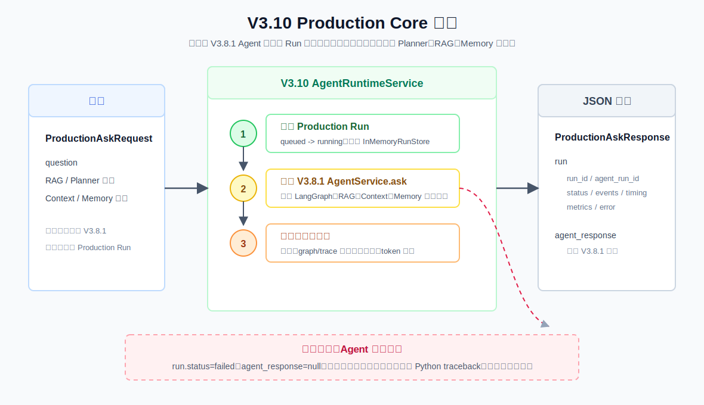

# V3.10 Production Core 学习指南



## 这一版学习什么

V3.8.1 已经能回答问题，也会返回 `trace`、`step_results` 和 `run_id`；但这些信息分散在 Agent 响应里，缺少一个统一的运行管理层。V3.10 在它外面包一层 `AgentRuntimeService`，学习真实 harness 常见的 **Run Lifecycle / Observation**：

```text
ProductionAskRequest
  -> 创建 Production Run（queued -> running）
  -> V3.8.1 AgentService.ask()
  -> succeeded: 聚合 timing / trace / tool / token estimate
  -> failed: 记录标准化 error
  -> ProductionAskResponse
```

这版是生产化基础设施练习，不是新的 RAG 策略版本。

## 与 V3.9 的区别

| 对比项 | V3.9 Agent Evaluation Lite | V3.10 Production Core |
| --- | --- | --- |
| 关注对象 | 多个 case 是否符合预期 | 单次真实运行发生了什么 |
| 主入口 | YAML / `/eval/agent` | `/agent/ask` |
| 核心产物 | `passed`、`score`、`checks` | `RunRecord`、`metrics`、`error` |
| 是否调用 Agent | 为评测 case 调用 | 为用户请求调用 |
| 典型用途 | 回归测试 | 在线调试、前端运行面板、故障定位 |

两者互补：V3.9 回答“行为是否符合预期”，V3.10 回答“这一趟运行状态、耗时和工具调用如何”。

## 两个 Run ID

```text
V3.10 run.run_id          prod_...  生命周期层的标识，进入 Agent 前就生成
V3.8.1 agent_response.run_id  run_...   Agent 图内部的标识，Agent 成功后才得到
```

这两个 ID 不合并。前者适合查询 `/runs/{run_id}`，后者继续对应原有 Agent 响应与调试语义。

## 正常和异常分支

正常请求依次写入三个 `events`：`run_queued`、`run_started`、`run_succeeded`。成功后：

- `run.status` 为 `succeeded`。
- `run.metrics` 有总耗时、节点数、trace 数、检索结果数与 `tool_summaries`。
- `agent_response` 保留完整的 V3.8.1 输出，包括 Plan、Evidence、Context、Memory 和 `trace`。

若 V3.8.1 Agent 调用过程抛出异常：

- `run.status` 为 `failed`，并追加 `run_failed`。
- `agent_response` 为 `null`，因为 Agent 没能构造完整响应。
- `run.error` 仅返回异常类型、最多 500 字符的消息和保守的 `retryable=false`；不返回 Python traceback。

`no_search`、`clarify` 不是失败。它们仍会正常完成，只是 `tool_summaries` 可能为空、`retrieval_result_count` 为 0；详细原因仍在 `agent_response.plan` 与 `agent_response.trace`。

## Token Summary 的边界

`run.metrics.token_estimate` 是便于观察上下文规模的**启发式估算**：中文约每 2 个字符算 1 token，其他字符约每 4 个字符算 1 token。

它只统计实际 `ContextBundle.messages` 中的 Answer prompt，以及最终 `answer`：

```text
answer_prompt_tokens + answer_output_tokens = observed_total_tokens
```

它不包含 Planner prompt、Memory Compaction prompt，也不是 OpenAI/Ollama 的真实 tokenizer 或账单用量。后续若要做精确成本观测，需要在 LLM Client 层读取供应商返回的 usage。

## Swagger 接口

启动方式由你自行选择；默认调试端口为 `8012`，Swagger 地址为 `http://127.0.0.1:8012/docs`。

### `POST /agent/ask`

```json
{
  "question": "生鸡肉要不要洗？处理后厨房怎么清洁？",
  "conversation_id": "conv_v310_demo",
  "memory_window": 3,
  "memory_compaction_enabled": true,
  "memory_compaction_trigger_turns": 4,
  "memory_compaction_trigger_tokens": 3000,
  "top_k": 5,
  "mode": "hybrid",
  "filters": null,
  "max_steps": 4,
  "max_retries": 1,
  "context_max_chunks": 4,
  "context_token_budget": 4000
}
```

响应最外层是：

```json
{
  "run": {
    "run_id": "prod_...",
    "status": "succeeded",
    "agent_run_id": "run_...",
    "timing": {"started_at": "...", "finished_at": "...", "duration_ms": 123},
    "events": [],
    "metrics": {"tool_summaries": [], "token_estimate": {}},
    "error": null
  },
  "agent_response": {}
}
```

### 其他接口

- `GET /runs?limit=20`：读取当前进程最近的运行记录，最新的排在前面。
- `GET /runs/{run_id}`：根据 V3.10 的 `prod_...` ID 读取单条记录；不存在返回 `404`。
- `GET /runtime/config`：查看 Run Store 上限和 token 估算边界，不会暴露 `.env` 的密钥。
- `GET /health`：健康检查。

`InMemoryRunStore` 不持久化：服务重启后 `/runs` 会清空。这和 V3.8.1 的 MySQL Conversation Memory 是两类数据，前者是运行观测，后者是对话内容。

## CLI

```bash
.venv/bin/obsidian-rag agent-v3-10 ask "生鸡肉要不要洗？" \
  --conversation-id conv_v310_demo \
  --mode hybrid
```

CLI 会打印 Production Run ID、状态、耗时、工具汇总、估算 token 和最终答案。Conversation Memory 使用 `.env` 中的 MySQL 配置；`.rag/v3_10_memory.sqlite3` 仅作为历史迁移源保留。

## 文件职责

| 文件 | 作用 |
| --- | --- |
| `obsidian_rag/v3_10/schemas.py` | Run、事件、耗时、工具摘要、错误和 API 响应的 Pydantic 契约。 |
| `obsidian_rag/v3_10/runtime/lifecycle.py` | 创建/更新 Run，调用 V3.8.1 Agent，聚合 metrics，处理异常。 |
| `obsidian_rag/v3_10/runtime/store.py` | 线程安全的近期进程内 Run Store。 |
| `obsidian_rag/v3_10/dependencies.py` | 组装 Retrieval、LLM、独立 Memory DB、Run Store 和运行时服务。 |
| `obsidian_rag/v3_10/routes/agent.py` | `POST /agent/ask`。 |
| `obsidian_rag/v3_10/routes/runs.py` | Run 查询和安全的运行时配置接口。 |
| `obsidian_rag/v3_10/app.py` | FastAPI 应用装配。 |
| `docs/assets/rag-v3-10-production-core-flow.svg` | 正常/异常 Run 生命周期图。 |
| `tests/v3_10/` | lifecycle、API 和 CLI 的无网络单元测试。 |

## 断点调试

下列行号基于当前代码；代码变化后优先按函数名定位。

| 顺序 | 断点位置 | 观察变量 |
| --- | --- | --- |
| 1 | `obsidian_rag/v3_10/runtime/lifecycle.py:29`，`AgentRuntimeService.ask()` | `run_id`、`record.status`、`record.events`；确认先创建 `queued` 再进入 `running`。 |
| 2 | `obsidian_rag/v3_10/runtime/lifecycle.py:50`，`self.agent_service.ask(request)` | `request` 如何原样进入 V3.8.1；可单步进入既有 `AgentService.ask()`。 |
| 3 | `obsidian_rag/v3_10/runtime/lifecycle.py:92`，`_build_metrics()` | `response.graph_path`、`response.trace`、`step_results` 和 `context_bundle.messages` 如何变成观察指标。 |
| 4 | `obsidian_rag/v3_10/runtime/lifecycle.py:112`，`_tool_summaries()` | `tool_name`、`status`、`result_count` 如何按工具聚合；`no_search` / `clarify` 通常不会进入。 |
| 5 | `obsidian_rag/v3_10/runtime/lifecycle.py:51`，`except Exception as exc` | 临时让 fake Agent 抛异常，观察 `RunError` 和 `agent_response=null`。 |
| 6 | `obsidian_rag/v3_10/runtime/store.py:21` / `:29`，`save()` / `get()` | `_records`、`limit`；理解 Run 查询只在当前进程有效。 |

VS Code 的 `V3.10 production: first turn` 和 `V3.10 production: follow-up turn` 都可直接启动。第二个使用同一个 `conversation_id`，方便同时看到 V3.8.1 的 Memory 与 V3.10 的新 Run 是两条不同数据链。

## 当前不做什么

- 不持久化 Run，不实现跨进程/跨机器查询。
- 不实现队列、并发 worker、超时取消、分布式 trace 或 dashboard。
- 不做自动重试和错误分类策略；只记录保守的 `retryable=false`。
- 不提供 LLM 真实 usage / 成本统计。
- 不改变 V3.8.1 的 Planner、Tool、Evidence、Context 或 Memory 逻辑。

下一版 `V3.11 Skill System` 会学习“面对不同任务应采用哪种方法”，即 Skill Registry、Skill Router 和按需加载 `SKILL.md`；它会复用 V3.10 的 Run 观察面来记录选择了什么 Skill。
