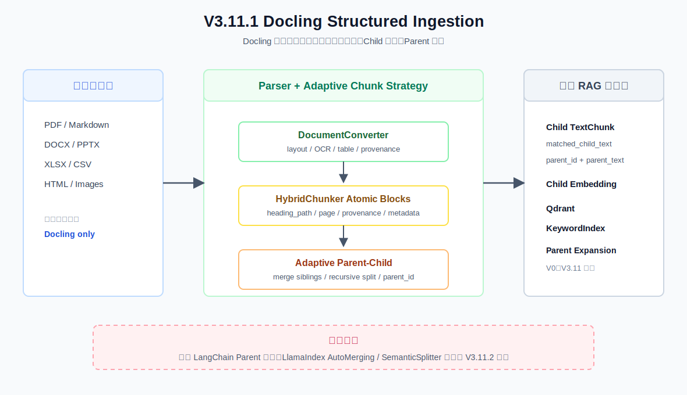

# V3.11.1 Docling Structured Ingestion 学习指南

V3.11.1 在 V3.11 Skill System 与 V3.12 MCP Integration 之间补充多格式文档数据基础。它不改写 Agent 的 Planner、Skill 或决策行为；本次新增的请求级 `collection` 会被 V3.8.1/V3.11 Agent 透传到检索层。Docling 部分则把共享 V0 ingest 从“Markdown/PDF 纯文本 loader + 字符切片”升级为固定的 Docling framework 链路。



## 当前版本做什么

```text
PDF / Markdown / DOCX / PPTX / XLSX / HTML / CSV / Image
                              │
                              ▼
                   Docling DocumentConverter
                              │
                              ▼
                       DoclingDocument
                              │
                              ▼
          HybridChunker + HuggingFaceTokenizer
                              │
                              ▼
                     TextChunk adapter
                              │
                              ▼
          Embedding -> Qdrant + KeywordIndex
```

- 使用 Docling `DocumentConverter` 处理框架支持的本地格式。
- 用 `DoclingDocument.export_to_markdown()` 展示统一文档结果。
- 使用官方 `HybridChunker`，不自研递归切片算法。
- 同时保留 `chunk.text` 与 `HybridChunker.contextualize()`。
- 将 headings、captions、origin、doc_items provenance 和页码映射到 metadata。
- 从标题块内的 fenced YAML 提取可选业务 metadata；`chunk_id` 不限制为 `KB-` 前缀，兼容 `KB-072`、`VU-001` 等引用 ID。
- 通过共享 V0 pipeline 写入现有 Qdrant 与 keyword index。
- 用请求级 `collection` 隔离 Qdrant 与 keyword index；同一 collection 的增量 ingest 会合并 keyword index。
- 提供 convert、chunks、ingest、search 四个 JSON 接口和对应 CLI。

## 当前版本不做什么

- 不实现 LangChain ParentDocumentRetriever。
- 不实现 LlamaIndex AutoMergingRetriever 或 SemanticSplitter。
- 不重新实现 PDF Layout、OCR、表格识别或 Markdown AST。
- 不改写 V3.11 Skill Registry、Router、Planner 或 Agent 的决策逻辑；Agent 仅复用请求级 collection 检索能力。
- 不提供 SSE、后台任务、转换缓存或旧索引迁移。

这些框架检索能力由 V3.11.2 继续学习；V3.12 仍回到 MCP Integration 主线。

## 相比旧 V0 改进了什么

| 维度 | 旧 V0 | V3.11.1 Docling |
| --- | --- | --- |
| 格式 | Markdown、PDF | Docling 当前支持的多格式 |
| 文档模型 | 扁平 `SourceDocument.text` | `DoclingDocument` |
| PDF | `pypdf.extract_text()` | Docling layout/OCR pipeline |
| Chunk | 自定义字符窗口 | Docling `HybridChunker` |
| 长度 | 字符数 | tokenizer token 上限 |
| 表格 | 普通文本 | Docling table item + provenance |
| Embedding 文本 | chunk 原文 | `contextualize(chunk)` |

## 配置

```dotenv
RAG_DOCLING_TOKENIZER_MODEL=sentence-transformers/all-MiniLM-L6-v2
RAG_CHUNK_TOKENS=512
# 默认知识库；单次 ingest/search 可用 collection 参数覆盖
RAG_COLLECTION=obsidian_notes
```

首次使用 Docling 可能下载布局、OCR 或 tokenizer 模型。共享 ingest 固定使用 Docling，不再提供旧 loader/chunker 回退开关。

## Swagger JSON 示例

API 入口：

```bash
.venv/bin/uvicorn obsidian_rag.v3_11_1.app:app --host 127.0.0.1 --port 8016
```

### 1. Convert 单文件

`POST /documents/convert`

```json
{
  "path": "/absolute/path/to/manual.pdf"
}
```

返回 `DoclingDocument` 的标题、状态、页数、结构项数量和 Markdown 预览，不执行 chunk 或入库。

### 2. Preview HybridChunker

`POST /documents/chunks`

```json
{
  "path": "/absolute/path/to/manual.pdf"
}
```

关键响应字段：

| 字段 | 含义 |
| --- | --- |
| `raw_text` | Docling `chunk.text` 原始内容 |
| `contextualized_text` | 实际用于 embedding 的 headings/captions + text |
| `metadata.docling` | Docling chunk meta 的 JSON 投影，仅用于调试和定位 |
| `heading_path` | 标题路径 |
| `page_numbers` | provenance 中提取的页码 |
| `node_id` | 映射到 Qdrant point 的稳定 ID |
| `chunk_id` | 文档 YAML 或编号标题提供的可选业务引用 ID，不限 `KB-` 前缀 |

### 3. 重建索引

`POST /documents/ingest`

```json
{
  "collection": "food_safety",
  "recreate": true
}
```

本版本 chunk schema 为 `docling-v1`，首次 ingest 应使用 `recreate=true`。它只会覆盖当前指定的 Qdrant collection 及其 keyword index；不会删除源文件或其他 collection。省略 `recreate` 时，新 chunks 会增量写入当前 collection，并合并到该 collection 的 keyword index。已有索引需要重新 ingest，才会获得新增的业务 metadata。

### 业务 metadata 约定

在 Markdown 二级标题块中放置 fenced YAML，即可让该标题下的所有 Docling chunks 继承 metadata：

````markdown
## VU-001：VueUse 定位

```
chunk_id: VU-001
title: VueUse 定位
category: 基础
tags: [vueuse, vue3]
source: https://vueuse.org/guide/
```
````

`node_id` 是系统生成的稳定向量 ID；`chunk_id` 是可选的业务引用 ID。前者始终存在，后者用于引用展示、Context Builder 优先级和评测。YAML 的 `source` 会保存为 `kb_source`，不会覆盖源文件路径 `source`。

### 4. 检索 Docling chunks

`POST /documents/search`

```json
{
  "query": "这个文档的核心结论是什么？",
  "top_k": 5,
  "mode": "hybrid",
  "collection": "food_safety"
}
```

## CLI

```bash
.venv/bin/obsidian-rag documents-v3-11-1 convert /absolute/path/to/manual.pdf
.venv/bin/obsidian-rag documents-v3-11-1 chunks /absolute/path/to/manual.pdf
.venv/bin/obsidian-rag documents-v3-11-1 ingest --collection food_safety --recreate
.venv/bin/obsidian-rag documents-v3-11-1 search "核心结论是什么？" --top-k 5 --mode hybrid --collection food_safety
```

省略 `chunks` / `ingest` 的路径时，CLI 使用 `.env` 中的 `RAG_VAULT_PATH`。

## `ingest` 正常主链路

`convert` 与 `chunks` 是无状态预览接口，不接受 collection；只有 `ingest` / `search` 会选择 collection。

```text
CLI / Swagger
  -> collection（未传时回退 RAG_COLLECTION）
  -> DoclingLearningService
  -> DoclingIngestion
  -> DocumentConverter.convert
  -> DoclingDocument
  -> HybridChunker.chunk
  -> HybridChunker.contextualize
  -> TextChunk(metadata.docling)
  -> embedding
  -> Qdrant + KeywordIndex
```

## 条件分支

| 分支 | 行为 |
| --- | --- |
| Docling 依赖缺失 | 返回明确的 `pip install -e .` 提示 |
| 单文件 convert 传入目录 | 返回参数错误，提示改用 chunks/ingest |
| 目录中个别文件转换失败 | chunks preview 返回 `errors`，成功文件继续展示 |
| 所有文件转换失败 | ingest 中止，不写入空索引 |
| 指定 `collection` | dense、keyword、hybrid 只访问该 collection；`recreate` 只重建该 collection，未传时增量合并该 collection 的 keyword index |
| 标题块含 `chunk_id` YAML | 将 `chunk_id`、title、tags、source 等 metadata 绑定到该标题路径的 chunks |
| 标题块不含业务 YAML | 仍正常切片；无编号标题时不伪造 `chunk_id` |
| tokenizer/model 首次使用 | 可能下载模型，耗时高于后续运行 |

## 文件职责

| 文件 | 作用 |
| --- | --- |
| `obsidian_rag/docling_ingestion.py` | Docling Converter/HybridChunker 薄适配和 TextChunk metadata 映射 |
| `obsidian_rag/structured_metadata.py` | Markdown 标题块 YAML metadata 的提取、规范化和 Docling heading path 匹配 |
| `obsidian_rag/pipeline.py` | 固定执行 Docling convert/chunk，然后按请求 collection 统一 embed/upsert、关闭 embedded Qdrant client 并维护 keyword index |
| `obsidian_rag/config.py` | tokenizer、token 上限和请求级 collection 配置 |
| `obsidian_rag/v3_11_1/schemas.py` | Swagger 输入输出职责与字段中文说明 |
| `obsidian_rag/v3_11_1/service.py` | convert/chunks/ingest/search 学习编排 |
| `obsidian_rag/v3_11_1/routes/` | FastAPI JSON 路由 |
| `obsidian_rag/v3_11_1/app.py` | V3.11.1 FastAPI app |
| `tests/v3_11_1/` | Docling adapter、service、API、CLI 测试 |

## 核心断点顺序

| 顺序 | 文件行号与函数 | 观察变量 |
| --- | --- | --- |
| 1 | `v3_11_1/service.py:66` `DoclingLearningService.ingest()` | `request.collection`、`request_config.collection_name`、`path`、`request.recreate` |
| 2 | `config.py:69` `with_collection()` | `selected`、返回副本的 `collection_name`，确认不修改共享 config |
| 3 | `pipeline.py:54` `ingest_path()` | `config.collection_name`、`document_count`、`chunks` |
| 4 | `docling_ingestion.py:129` `convert_and_chunk_path()` | `files`、`conversions`、`chunks`、`errors` |
| 5 | `docling_ingestion.py:77` `convert_file()` | `result.status`、`document`、`markdown` |
| 6 | `docling_ingestion.py:93` `chunk_conversion()` | `chunk.text`、`contextualized`、`docling_meta`、结构化业务 metadata |
| 7 | `pipeline.py:15` `make_embedding_client()` | embedding provider/model |
| 8 | `qdrant_store.py:41` `ensure_collection()` | `collection_name`、`recreate` |
| 9 | `qdrant_store.py:51` `upsert()` | point payload、`node_id`、vector dimensions |
| 10 | `pipeline.py:128` `_write_keyword_index()` | `config.collection_name`、collection 对应 keyword index 路径与增量合并行为 |

行号已经按版本完成时的代码核对。后续代码变化后，应优先按函数名重新定位。

## 测试与边界

- adapter 测试使用 Docling fake，验证 headings、任意业务 ID（如 KB / VU）、provenance page 和 schema 映射。
- service/API/CLI 测试不下载真实模型，也不连接 Qdrant。
- 共享 V0 pipeline smoke 使用临时 embedded Qdrant，验证 food_safety / recipes 的 dense、keyword、hybrid 隔离，以及 `recreate` 不影响另一 collection。
- 真正的布局/OCR 效果必须用本地代表性 PDF/图片执行 chunks preview 后再评估。
- 本版本不会自动启动 API；由用户自行运行 Swagger 和断点调试。

## 下一版本

V3.11.2 使用同一个 Docling Markdown 输入对比：

```text
LangChain RecursiveCharacterTextSplitter + ParentDocumentRetriever
LlamaIndex HierarchicalNodeParser + AutoMergingRetriever
LlamaIndex SemanticSplitterNodeParser
```
