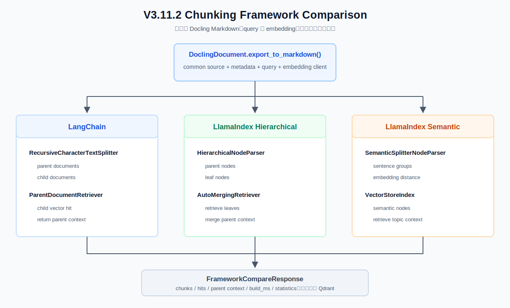

# V3.11.2 LangChain / LlamaIndex 切片检索对比指南

V3.11.2 不再讨论“如何手写切片算法”，而是直接运行主流框架组件，观察递归父子、层级自动合并和语义切片的实际差异。



## 当前版本做什么

```text
DoclingDocument.export_to_markdown()
                 │
     ┌───────────┼────────────────┐
     ▼           ▼                ▼
LangChain     LlamaIndex       LlamaIndex
Recursive     Hierarchical     SemanticSplitter
+ Parent      + AutoMerge      + VectorStoreIndex
     │           │                │
     └───────────┼────────────────┘
                 ▼
       unified comparison JSON
```

三条路线使用：

- 同一个 Docling Markdown。
- 同一个 query。
- 同一个仓库 embedding provider/model。
- 相同 `top_k`。
- request-scoped 内存索引。

## 三个组件方向

### LangChain：递归切片 + ParentDocumentRetriever

```text
source document
  -> parent RecursiveCharacterTextSplitter
  -> child RecursiveCharacterTextSplitter
  -> child embedding / similarity search
  -> doc_id lookup
  -> return parent Document
```

适合学习组件拼装和“小块召回、大块返回”。LangChain splitter 的 `chunk_size` 在本版本按字符理解。

### LlamaIndex：HierarchicalNodeParser + AutoMergingRetriever

```text
Document
  -> parent nodes (token size)
  -> leaf nodes (token size)
  -> VectorStoreIndex(leaf)
  -> retrieve leaves
  -> AutoMergingRetriever
  -> merge related parent context
```

适合学习 Node Relationship、StorageContext 和自动合并。LlamaIndex size 按 tokenizer token 理解。

### LlamaIndex：SemanticSplitterNodeParser

```text
sentences
  -> adjacent sentence-group embeddings
  -> cosine dissimilarity
  -> percentile breakpoint
  -> semantic nodes
  -> VectorStoreIndex
```

适合标题结构较差、主题自然转折的长正文。它会额外调用 embedding，结果依赖模型和阈值。

## 当前版本不做什么

- 不修改或重建共享 Qdrant。
- 不持久化 LangChain docstore、LlamaIndex StorageContext。
- 不调用 Answer LLM。
- 不比较不同框架的绝对 score；score 标度并不一致。
- 不把单次 compare 结果直接宣布为生产最优策略。

最终是否替换共享检索器，需要用 V2 真实问题集重复评估。

## Swagger JSON 示例

API 入口：

```bash
.venv/bin/uvicorn obsidian_rag.v3_11_2.app:app --host 127.0.0.1 --port 8000
```

`POST /frameworks/compare`

```json
{
  "path": "knowledge/manual.pdf",
  "query": "部署失败时应该如何回滚？",
  "top_k": 4,
  "langchain_parent_chars": 2000,
  "langchain_child_chars": 400,
  "langchain_overlap_chars": 50,
  "llama_parent_tokens": 1024,
  "llama_child_tokens": 256,
  "llama_overlap_tokens": 20,
  "semantic_breakpoint_percentile": 95,
  "max_preview_chunks": 20
}
```

关键响应：

```text
results[0] = langchain / recursive_parent
results[1] = llamaindex / hierarchical_auto_merge
results[2] = llamaindex / semantic_splitter
```

每条结果包含：

| 字段 | 含义 |
| --- | --- |
| `build_ms` | 本次内存切片、建索引和检索耗时 |
| `chunk_count` | child/leaf/semantic node 数量 |
| `average_chars` | 平均 chunk 字符数，仅用于统一展示 |
| `chunks` | 截断后的框架节点预览 |
| `hits` | matched child/leaf 与最终 parent/merged context |
| `hit_kind` | 说明当前文本属于召回证据还是最终上下文 |

## CLI

```bash
.venv/bin/obsidian-rag chunking-v3-11-2 compare \
  "部署失败时应该如何回滚？" \
  --path knowledge/manual.pdf \
  --top-k 4 \
  --langchain-parent-chars 2000 \
  --langchain-child-chars 400 \
  --llama-parent-tokens 1024 \
  --llama-child-tokens 256 \
  --semantic-breakpoint-percentile 95
```

## 正常主链路

```text
FrameworkComparisonService.compare
  -> DoclingIngestion.convert_file
  -> conversion.markdown
  -> make_embedding_client
  -> run_langchain_parent
  -> run_llamaindex_hierarchical
  -> run_llamaindex_semantic
  -> normalize FrameworkRun
  -> FrameworkCompareResponse
```

## 条件分支

| 分支 | 行为 |
| --- | --- |
| path 是目录 | 拒绝；本版本一次只比较单文件，控制重复 embedding 成本 |
| LangChain 缺失 | 返回安装提示，不产生伪结果 |
| LlamaIndex 缺失 | 返回安装提示，不产生伪结果 |
| parent size <= child size | Pydantic 校验拒绝 |
| embedding provider 不可用 | compare 失败并保留原始 provider 错误 |
| SemanticSplitter 阈值较低 | 通常产生更多 semantic nodes，需要结合真实 query 评估 |
| AutoMerging 未触发 | 返回 leaf context；这不是错误，说明命中比例未达到合并阈值 |

## 文件职责

| 文件 | 作用 |
| --- | --- |
| `obsidian_rag/v3_11_2/frameworks.py` | 三套官方框架组件及现有 embedding 适配 |
| `obsidian_rag/v3_11_2/schemas.py` | 统一比较请求、strategy、chunk、hit 和 trace schema |
| `obsidian_rag/v3_11_2/service.py` | Docling 共同输入、三策略执行和结果归一化 |
| `obsidian_rag/v3_11_2/routes/` | FastAPI compare/runtime/health 路由 |
| `obsidian_rag/v3_11_2/app.py` | V3.11.2 FastAPI app |
| `tests/v3_11_2/` | service/API/CLI 的确定性框架 fake 测试 |

## 核心断点顺序

| 顺序 | 文件行号与函数 | 观察变量 |
| --- | --- | --- |
| 1 | `v3_11_2/service.py:40` `FrameworkComparisonService.compare()` | `request`、`path` |
| 2 | `docling_ingestion.py:77` `convert_file()` | `conversion.markdown`、`source` |
| 3 | `v3_11_2/frameworks.py:40` `run_langchain_parent()` | `parent_documents`、`child_documents`、`child_hits`、`parent_hits` |
| 4 | `v3_11_2/frameworks.py:128` `run_llamaindex_hierarchical()` | `nodes`、`leaf_nodes`、`leaf_hits`、`merged_hits` |
| 5 | `v3_11_2/frameworks.py:177` `run_llamaindex_semantic()` | `documents`、`nodes`、`hits_raw`、threshold |
| 6 | `v3_11_2/frameworks.py:240` `_llama_embedding()` | 现有 embedding client 到 BaseEmbedding 的调用 |
| 7 | `v3_11_2/service.py:149` `_strategy_result()` | preview 截断与统一响应 |
| 8 | `cli.py:1477` `run_chunking3112_compare()` | CLI 参数与最终 JSON |

行号已经按版本完成时的代码核对。后续变化时，应以函数名重新定位。

## VueUse 实验结论：三张结果卡怎么读

使用同一个 VueUse 文档、query `有拖拽相关的 hook 吗？`、相同 embedding 和 `top_k=4` 时，本次实验得到：

```text
LangChain Parent               204 child chunks
LlamaIndex Hierarchical        112 leaf nodes
LlamaIndex SemanticSplitter     19 semantic nodes
```

这些数字表示每条路线建立的可检索节点数量，不是最终命中数量。`top_k=4` 才表示每条路线最多检索多少条结果。不要根据 `204 > 112 > 19` 判断质量。

### LangChain Parent 卡片

- `matched_child` 是实际完成向量匹配的小块，本次准确命中 `VU-039 useDraggable`。
- `returned_parent` 是根据 child 的 `doc_id` 返回的较大上下文。
- 优势是“小块精确召回、大块补全上下文”；风险是 parent 过大时会带入相邻 Hook。

当前 VueUse 实验中，这条路线的目标命中最直观，检索精度暂时最好。需要同时检查 `returned_parent`，不能只看 `matched_child`。

### LlamaIndex Hierarchical 卡片

- `matched_leaf` 是向量索引直接命中的叶子 Node。
- `auto_merged_context` 是 `AutoMergingRetriever` 根据父子关系向上合并后的上下文。
- 优势是答案跨多个相邻叶子时可以动态补全；风险是 `parent=1024 tokens` 时合并上下文偏大。

如果命中正确但上下文噪声较多，可尝试 `parent=512`、`child=128`，再观察合并后的完整性。

### LlamaIndex Semantic 卡片

- `semantic_node` 是根据相邻句组 embedding 差异形成并参与检索的语义节点。
- 当前实现先将 Markdown 限制为不超过 3000 字符的安全片段，避免超过本地 embedding context，再在片段内部寻找语义断点。
- `semantic_breakpoint_percentile=95` 较难触发切分，因此通常得到更少、更大的节点。

VueUse 各章节使用高度重复的模板，纯语义切分容易把多个 Hook 合并到同一节点。本次虽然命中 `useDraggable`，但同时混入多个无关 Hook，上下文噪声最高。降低阈值到 `80~85` 可以产生更多节点，但对于这种标题明确的技术文档，更合理的方向仍是先按标题切分，再在标题内部选择是否语义切分。

### 当前阶段判断

| 方案 | 本次命中表现 | 上下文表现 | 当前判断 |
| --- | --- | --- | --- |
| LangChain Parent | 精确命中 `useDraggable` child | parent 略大但可调 | 当前三种方案中最适合该文档 |
| LlamaIndex Hierarchical | leaf 能命中目标 | 自动合并上下文偏大 | 适合答案跨相邻段落，需调小层级参数 |
| LlamaIndex Semantic | semantic node 包含目标 | 混入多个无关 Hook | 不适合直接处理当前模板化技术文档 |

因此，本次实验只支持下面这个阶段性结论：

```text
标题清晰、章节独立的技术文档
  -> 优先 Docling HybridChunker 或 LangChain Parent

答案经常跨多个相邻段落
  -> 尝试 LlamaIndex Hierarchical + AutoMerge

缺少可靠标题、依靠自然主题转折的长正文
  -> 尝试 LlamaIndex SemanticSplitter
```

V3.11.1 Qdrant 中的 point 数和这里的 child/leaf/node 数采用不同切片单位，不能直接用数量比较优劣。当前 V3.11.2 也尚未把 Docling HybridChunker 作为第四条 baseline。

## 如何判断哪个更适合

不要只看 chunk 数。至少使用同一批 V2 问题对比：

- Hit Rate / MRR / Source Recall。
- 关键证据是否完整。
- parent/merged context 是否引入过多噪声。
- 平均 Prompt Context 长度。
- 索引耗时与 embedding 调用量。
- 技术文档、规章、会议纪要、OCR 文本分别测试。

一般预期：

- 标题清晰的技术文档：Docling + Parent/Hierarchical 更稳定。
- 细节问题多、回答需要上下文：ParentDocumentRetriever 或 AutoMergingRetriever。
- 缺少可靠标题的长自然语言：SemanticSplitter 值得实验。

## 下一版本

V3.12 回到既定主线：MCP Integration。本版本不会把任何框架检索器偷偷接入 Agent 主流程。
