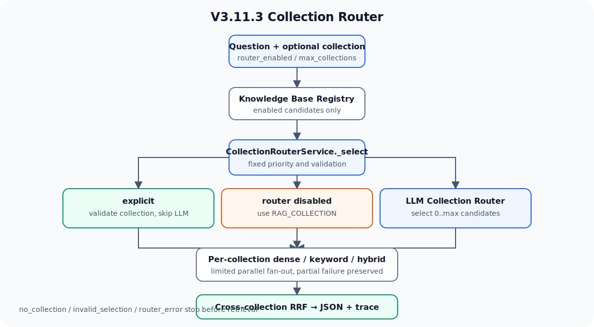

# V3.11.3 Collection Router 学习指南

V3.11.3 在已经拆分好的多个物理 collection 之上增加查询路由层：调用方可以显式指定知识库，也可以让 LLM 从受控 Registry 中选择最多两个知识库，再复用现有 Hybrid Retrieval 并通过第二层 RRF 合并结果。



## 相比 V3.11.2 新增什么

V3.11.2 关注“单份文档如何切片和召回”，V3.11.3 关注“一个问题应该查哪些知识库”。两者职责不同：

```text
V3.11.2: document -> chunk strategy -> retrieval experiment
V3.11.3: question -> collection scope -> existing retrieval -> cross-collection fusion
```

本版本新增：

- `knowledge_bases.yaml`：可审查的知识库 Registry。
- 显式 `collection` 优先，避免不必要的 LLM 调用。
- LLM 从启用 candidates 中选择零个、一个或有限多个知识库。
- 每个 collection 独立执行现有 dense、keyword 或 hybrid 检索。
- 第二层跨库 RRF；同名 `chunk_id` 在不同 collection 中保持独立。
- FastAPI JSON、CLI、trace、单元测试和 VS Code 调试案例。

## 当前版本边界

当前做：Registry、Collection Router、request-scoped 多库检索和跨库 RRF。

当前不做：

- 不接入 V3.11 完整 Agent、Memory 或 Skill Runtime。
- 不实现 SSE、Answer LLM、ACL、租户隔离或自动建库。
- 不把 keyword index 迁移到 Qdrant sparse vector。
- 不增加 reranker，也不直接比较不同 collection 的原始 dense/BM25 score。
- 不默认扫描全部 collection；LLM fan-out 默认最多 2 个、上限 3 个。

这是 V3.12 MCP Integration 前的专项插入版本，完成后回到 V3.12 主线。

## Registry

默认读取根目录 `knowledge_bases.yaml`，可通过 `RAG_KNOWLEDGE_BASE_REGISTRY` 或 CLI `--registry` 覆盖。

```yaml
knowledge_bases:
  - id: food_safety
    collection: food_safety
    description: 食品安全、食材处理和厨房卫生知识
    triggers: [生鸡肉, 食品安全, 厨房清洁]
    enabled: true
```

`id` 是 Router 使用的稳定标识，`collection` 是实际 Qdrant 和 keyword index 命名空间。重复 `id`、重复 `collection` 和非法名称会被跳过并记录在 `errors`。

## 主流程

```text
CollectionRouterService.search
  -> KnowledgeBaseRegistry.list_manifests(enabled_only=True)
  -> CollectionRouterService._select
       -> explicit: 校验并跳过 LLM
       -> disabled: 使用 RAG_COLLECTION
       -> auto: CollectionRouter.route
  -> MultiCollectionRetrievalService.search
       -> RetrievalService.search(collection=...)
  -> cross_collection_rrf
  -> CollectionSearchResponse + trace
```

路由优先级固定为：

1. 请求显式提供 `collection`。
2. Router 关闭时使用 `RAG_COLLECTION`。
3. 其余情况调用 LLM Collection Router。

## 条件分支

| 状态/分支 | 行为 |
| --- | --- |
| `explicit` | 显式 collection 已登记且启用；跳过 LLM，只检索该库 |
| `disabled` | Router 关闭；使用 `RAG_COLLECTION` 对应的已登记知识库 |
| `selected` | LLM 选择一个 Registry candidate |
| `multi_selected` | LLM 选择多个 candidates，按 collection 并行检索 |
| `no_collection` | Registry 无启用项或 LLM 返回空列表；不执行检索 |
| `invalid_selection` | 显式库未知、默认库未登记，或 LLM 返回未知/重复/过多 ID |
| `router_error` | LLM 调用失败或输出无法解析；不执行检索 |
| 单库失败 | 在 `collection_errors` 记录错误，保留其他库的成功结果 |

## Swagger

启动命令（本版本不会自动启动服务）：

```bash
.venv/bin/uvicorn obsidian_rag.v3_11_3.app:app --host 127.0.0.1 --port 8018
```

打开 `http://127.0.0.1:8018/docs`。

接口：

- `GET /health`
- `GET /collections`
- `POST /collections/route`
- `POST /collections/search`

显式单库检索：

```json
{
  "question": "番茄炒蛋怎么做？",
  "collection": "recipes",
  "top_k": 5,
  "mode": "hybrid"
}
```

自动多库路由与检索：

```json
{
  "question": "鸡肉怎么做更安全？",
  "router_enabled": true,
  "max_collections": 2,
  "top_k": 5,
  "mode": "hybrid"
}
```

只观察路由，不访问 Qdrant：

```json
{
  "question": "useMouse 怎么使用？",
  "router_enabled": true,
  "max_collections": 2
}
```

## CLI

```bash
.venv/bin/obsidian-rag collections-v3-11-3 list

.venv/bin/obsidian-rag collections-v3-11-3 route \
  "番茄炒蛋怎么做？" --collection recipes

.venv/bin/obsidian-rag collections-v3-11-3 route \
  "鸡肉怎么做更安全？" --max-collections 2

.venv/bin/obsidian-rag collections-v3-11-3 search \
  "鸡肉怎么做更安全？" --max-collections 2 --top-k 5 --mode hybrid
```

显式 `--collection` 最适合业务已知分类的生产调用；自动路由适合统一搜索入口。

## 文件职责

| 文件 | 作用 |
| --- | --- |
| `knowledge_bases.yaml` | 知识库 ID、物理 collection、描述、triggers 和启用状态 |
| `obsidian_rag/v3_11_3/schemas.py` | Registry、路由、检索结果与 trace 的 Pydantic contract |
| `obsidian_rag/v3_11_3/registry.py` | 加载和校验 YAML Registry |
| `obsidian_rag/v3_11_3/router.py` | 构造受限 candidates prompt、解析并校验 LLM JSON |
| `obsidian_rag/v3_11_3/retrieval.py` | 有限 collection 并行检索和第二层 RRF |
| `obsidian_rag/v3_11_3/service.py` | 显式优先规则和完整查询编排 |
| `obsidian_rag/v3_11_3/dependencies.py` | Registry、LLM client 和 RetrievalService 依赖组装 |
| `obsidian_rag/v3_11_3/routes/` | health、list、route、search JSON 路由 |
| `obsidian_rag/v3_11_3/app.py` | 独立 FastAPI app 和 Swagger 元数据 |
| `tests/v3_11_3/` | Registry、Router、RRF、Service、API 和 CLI 测试 |

## 核心断点顺序

| 顺序 | 文件行号与函数 | 观察变量 |
| --- | --- | --- |
| 1 | `cli.py:1535` `run_collections3113()` | `command`、`collection`、`router_enabled`、`max_collections` |
| 2 | `v3_11_3/registry.py:19` `KnowledgeBaseRegistry.load()` | `payload`、`entries`、`seen_ids`、`seen_collections`、`errors` |
| 3 | `v3_11_3/service.py:45` `CollectionRouterService.search()` | `request`、`selection`、`trace` |
| 4 | `v3_11_3/service.py:97` `CollectionRouterService._select()` | `candidates`、`request.collection`、`router_enabled` |
| 5 | `v3_11_3/router.py:34` `CollectionRouter.route()` | `candidate_ids`、`raw_output`、`decision`、`selected_ids` |
| 6 | `v3_11_3/retrieval.py:15` `MultiCollectionRetrievalService.search()` | `collections`、`recall_k`、`results_by_collection`、`errors` |
| 7 | `v3_11_3/retrieval.py:59` `cross_collection_rrf()` | `collection`、`rank`、`key`、`cross_collection_score` |
| 8 | `v3_11_3/service.py:87` `CollectionRouterService.search()` | `counts`、`errors`、`results`、最终响应 |

以上行号按 V3.11.3 完成时的代码核对；后续代码变化应以函数名重新定位。

调试变量 `RAG_DEBUG_BREAKPOINTS` 可使用：

```text
v3_11_3.registry.loaded,v3_11_3.router.selected,v3_11_3.search.completed
```

## 下一步

V3.12 回到 MCP Integration 主线。本版本未来若接入完整 Agent，应复用这里的 scoped retrieval contract，而不是把 Router 逻辑复制进 Agent。
