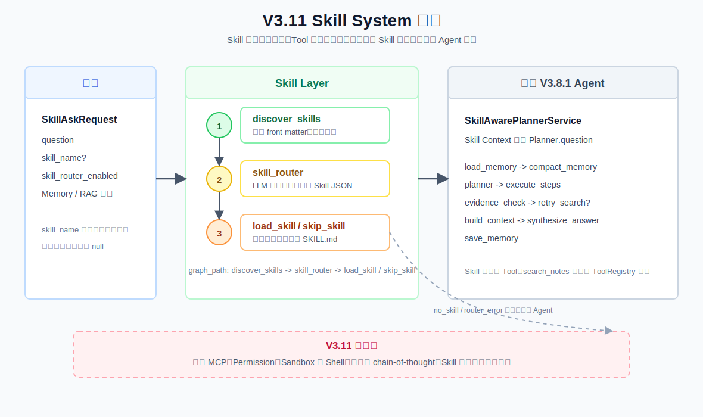

# V3.11 Skill System 学习指南

## 1. 这一版学习什么

V3.11 在已有 Agentic RAG 前增加一个 Skill System：系统先判断当前任务是否需要某种“工作方法”，命中后才加载对应的 SKILL.md，再把方法上下文交给 Planner。

```text
用户问题
  -> Skill Registry 发现候选元数据
  -> Skill Router 选择零个或一个 Skill
  -> 只加载选中的 SKILL.md
  -> Skill Context 注入 Planner
  -> 复用 V3.8.1 RAG Agent
  -> Production Run / JSON / SSE
```

。

V3.10.3 是 LangGraph 高级模式的补充版本，不改变 V3.11 的学习入口。V3.11 关注的是“采用什么方法”，而不是继续扩展 Graph 编排。

## 2. Skill 和 Tool 的区别

| 概念    | 负责什么                                                | 本项目例子                                   |
| ------- | ------------------------------------------------------- | -------------------------------------------- |
| Skill   | 告诉 Agent 应该采用什么方法、检查哪些风险、如何组织步骤 | food-safety 指导食品安全问题的拆解和回答顺序 |
| Tool    | 执行一个具体动作并返回结果                              | search_notes 调用混合检索                    |
| Planner | 根据问题和 Skill Context 生成执行计划                   | 生成 search、synthesize 或 clarify steps     |

Skill 不直接读取 Qdrant，不直接执行 Shell，也不能绕过 ToolRegistry。Skill 只是方法上下文；真正的检索仍由 V3.8.1 Agent 的 Planner、Tool Executor 和 Evidence Checker 完成。

## 3. 渐进式加载

Registry 第一次扫描每个 SKILL.md 的 YAML front matter，只得到名称、描述、触发词和路径：

```yaml
name: food-safety
description: 处理食品安全问题时组织污染控制和安全温度信息。
triggers:
  - 生鸡肉
  - 交叉污染
```

这些元数据会进入 Router prompt。只有 Router 选择 food-safety 后，SkillRegistry.load() 才读取完整 Markdown 正文。

因此：

- 没选中的 Skill 正文不会占用 Planner 上下文。
- GET /skills 只展示元数据。
- GET /skills/config 可查看当前 Skill 根目录和 Router 模式。
- GET /skills/food-safety?include_content=true 可查看完整正文。
- loaded_skill 是 API/调试响应字段；真正注入 Planner 的是 build_skill_context() 生成的文本。

## 4. Planner 如何拿到 Skill

V3.11 没有改写 V3.8.1 的 Planner。SkillAwarePlannerService 包装旧 PlannerService，在调用 plan() 前把方法正文和用户问题拼成：

```text
[Selected Skill Context]
name: food-safety
description: ...
method:
...

[User Question]
生鸡肉要不要洗？
```

之后旧 Planner 仍然按照原来的 Plan JSON 规则工作。Skill 影响的是计划生成方式，后续检索结果、Context、Answer 和 Memory 仍走 V3.8.1 主链路。

## 5. Swagger 测试

启动服务：

```bash
.venv/bin/uvicorn obsidian_rag.v3_11.app:app --host 127.0.0.1 --port 8016
```

打开 http://127.0.0.1:8016/docs，先调用 GET /skills，确认发现了 food-safety。

命中 Skill 的 JSON 请求：

```json
{
	"question": "生鸡肉要不要洗，处理完厨房怎么清洁？",
	"conversation_id": "conv_v311_food",
	"skill_router_enabled": true,
	"skill_name": null,
	"memory_window": 3,
	"memory_compaction_enabled": true,
	"memory_compaction_trigger_turns": 4,
	"memory_compaction_trigger_tokens": 3000,
	"top_k": 5,
	"mode": "hybrid",
	"filters": null,
	"max_steps": 4,
	"max_retries": 1,
	"context_max_chunks": 4,
	"context_token_budget": 4000
}
```

为了稳定观察“加载成功”分支，也可以填写：

```json
{
	"question": "生鸡肉要不要洗？",
	"conversation_id": "conv_v311_forced",
	"skill_router_enabled": true,
	"skill_name": "food-safety",
	"top_k": 5,
	"mode": "hybrid",
	"max_steps": 4,
	"max_retries": 1,
	"context_max_chunks": 4,
	"context_token_budget": 4000
}
```

skill_name 是调试用强制选择，会跳过 LLM Router；正常产品链路应保持 skill_name 为 null。

不命中 Skill 的案例：

```json
{
	"question": "帮我写一个两数之和函数",
	"conversation_id": "conv_v311_no_skill",
	"skill_router_enabled": true,
	"skill_name": null,
	"top_k": 5,
	"mode": "hybrid",
	"max_steps": 2,
	"max_retries": 1
}
```

预期 skill_selection.status 为 no_skill，然后仍然进入旧 Agent 流程。若关闭 skill_router_enabled，状态会是 disabled。

## 6. 正常链路和条件分支

正常链路：

```text
discover_skills
  -> skill_router(selected)
  -> load_skill
  -> load_memory -> compact_memory -> planner
  -> execute_steps -> evidence_check
  -> retry_search（必要时） -> build_context
  -> synthesize_answer -> save_memory
```

主要分支：

- no_skill：没有合适 Skill，进入 skip_skill，底层 Agent 不受影响。
- disabled：请求主动关闭 Router，直接跳过 Skill 层。
- forced：请求带 skill_name，跳过 LLM Router，用于确定性断点调试。
- invalid_selection：LLM 返回 Registry 不存在的名称，安全降级为不加载。
- router_error：LLM 不通或 JSON 无法解析，安全降级为不加载，并继续旧 Agent 流程。
- retry_search：这是旧 V3.8.1 Evidence 分支，不是 Skill Router 重试。

## 7. JSON 和 SSE

- POST /agent/ask：同步返回 SkillProductionAskResponse。
- POST /agent/ask/stream：复用 V3.10.2 RunEventBus，推送 skill_candidates、skill_selected、skill_loaded、skill_skipped、底层 node_finished、trace_event 和终态事件。
- GET /runs/{run_id}：查看 Run 生命周期和耗时摘要。

SSE 推送的是 Skill 选择和执行事实，不是模型隐藏推理或 chain-of-thought。

## 8. 文件职责

| 文件                                  | 作用                                                           |
| ------------------------------------- | -------------------------------------------------------------- |
| obsidian_rag/v3_11/schemas.py         | V3.11 请求、Skill 元数据、选择结果、调试轨迹和 JSON 响应契约   |
| obsidian_rag/v3_11/skills/registry.py | 扫描 SKILL.md front matter、建立 Registry、按名称懒加载正文    |
| obsidian_rag/v3_11/router/service.py  | 调用 LLM 选择零个或一个 Skill，并解析结构化 JSON               |
| obsidian_rag/v3_11/agent/service.py   | 组织 Skill 外层流程，包装旧 Planner 和 V3.8.1 Agent            |
| obsidian_rag/v3_11/runtime/service.py | 提供 V3.11 JSON Run、SSE Run 和终态响应                        |
| obsidian_rag/v3_11/dependencies.py    | 构造 Registry、Agent、Runtime 和共享 Run Store                 |
| obsidian_rag/v3_11/routes/skills.py   | 提供 Skill 列表和正文查看接口                                  |
| obsidian_rag/v3_11/routes/agent.py    | 提供 /agent/ask 和 /agent/ask/stream                           |
| obsidian_rag/v3_11/app.py             | 组装 V3.11 FastAPI 应用和 Swagger                              |
| obsidian_rag/v3_11/\*\*/**init**.py   | 标记 agent、router、routes、runtime 和 skills 为独立 Python 包 |
| skills/food-safety/SKILL.md           | 用于学习和调试的示例 Skill                                     |
| obsidian_rag/cli.py                   | agent-v3-11 ask 和 agent-v3-11 skills list CLI 入口            |
| .vscode/launch.json                   | V3.11 API、命中 Skill、跳过 Skill 和 Registry 调试配置         |

## 9. 核心断点调试

建议先使用 .vscode/launch.json 的 V3.11 CLI: selected Skill，这样不会因为 Router 的随机输出而错过加载分支。按以下顺序设置断点：

| 顺序 | 文件和函数                                                                | 重点观察                                                        |
| ---- | ------------------------------------------------------------------------- | --------------------------------------------------------------- |
| 1    | obsidian_rag/v3_11/skills/registry.py:23 SkillRegistry.discover           | root、\_manifests、errors，理解为什么这里只读元数据             |
| 2    | obsidian_rag/v3_11/router/service.py:34 SkillRouter.route                 | question、candidates、decision、未知 Skill 降级逻辑             |
| 3    | obsidian_rag/v3_11/agent/service.py:164 SkillAgentService.\_select_skill  | skill_name 强制分支、skill_router_enabled 分支和正常 LLM 路由   |
| 4    | obsidian_rag/v3_11/skills/registry.py:49 SkillRegistry.load               | 选中名称如何定位 SKILL.md，content 和 estimated_tokens          |
| 5    | obsidian_rag/v3_11/agent/service.py:29 SkillAwarePlannerService.plan      | enriched_request.question，确认 Skill 正文确实进入 Planner 输入 |
| 6    | obsidian_rag/v3_8_1/agent/service.py:301 AgentService.\_planner_node      | 旧 Agent 如何继续执行 Planner、Plan、检索和 Evidence 链路       |
| 7    | obsidian_rag/v3_11/runtime/service.py:32 SkillRuntimeService.ask          | Run 外壳如何包住 Skill Agent，并生成 RunRecord                  |
| 8    | obsidian_rag/v3_11/runtime/service.py:75 SkillRuntimeService.\_run_stream | SSE 后台线程如何把 Skill 事件和 Agent 事件送入 EventBus         |

代码变化后，文档中的行号可能移动，应优先用函数名重新定位；实现完成后可用 nl -ba 核对当前行号。

## 10. 版本边界

V3.11 做：Skill Registry、LLM Skill Router、渐进式加载、Planner Context 注入、Skill trace 和 Swagger/SSE 观察。

V3.11 不做：MCP、Permission、Sandbox、Shell、文件写入、Skill 自己执行 Tool，也不重写 V3.8.1 的 RAG Agent。

下一版本 V3.12 进入 MCP Integration：学习如何通过标准协议发现和调用外部工具，再把本地 search_notes 暴露为 MCP Server。
