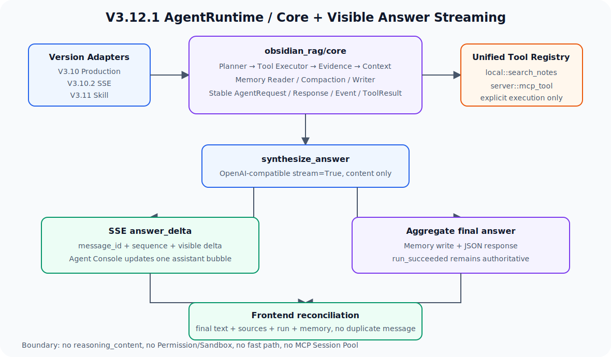

# V3.12.1 AgentRuntime/Core Extraction 与答案流指南

V3.12.1 把长期由 V3.8.1 学习目录承担的稳定 Agent 内核提升到无版本号 `obsidian_rag/core/`，并将 V3.10.3 已验证的最终可见答案流收敛到 V3.10.2/V3.11 主线和 Agent Console。



## 相比 V3.12 新增什么

V3.12 学习 MCP 协议，V3.12.1 解决公共运行时的依赖方向和用户等待体验：

```text
V3.12   : MCP initialize -> tools/list -> tools/call
V3.12.1 : Version Adapters -> Agent Core -> Tool Registry -> JSON / reasoning_delta / answer_delta SSE
```

本版本新增：

- `obsidian_rag/core/`：公共 schemas、Planner、Context、Memory、Compaction、Agent 和 Tool Registry。
- V3.10、V3.10.2、V3.11 不再直接依赖 V3.8.1 AgentService/schemas。
- 本地 `search_notes` 与 MCP `server::tool` 进入统一 Registry，并保持显式执行。
- OpenAI-compatible `stream=True` 只读取最终可见 `delta.content`。
- `answer_delta` 使用稳定 `message_id + sequence`，终态仍返回完整 response。
- 可通过环境开关适配 CPA `reasoning_content` 并发布独立 `reasoning_delta`。
- Core 额外发布稳定 `progress(phase, status)`，前端不依赖 LangGraph 节点名。
- Agent Console 在同一个 assistant 气泡中增量追加，终态补齐 sources、Run 和 Memory。
- `answer_stream` 返回 `mode`、`llm_ttft_ms`、`llm_generation_ms` 和可见字符数。

## 当前版本边界

当前做：公共 Core 提升、兼容 Adapter、统一 Tool Registry、最终答案 token streaming 和前端增量渲染。

当前不做：

- 不改变 Prompt、Planner、检索、Evidence 或 Memory 语义。
- 不把 `reasoning_content` 当作最终答案、事实依据或生产稳定契约；它仅在显式开关开启时用于学习调试。
- 不实现 Permission、Sandbox、任意 Shell、fast path 或 MCP Session Pool。
- 不删除 V3.8.1、V3.10.3、V3.12 教学代码。
- 不让 LLM 自动选择高风险 MCP Tool。

下一版本回到主线：V3.13 Permission Policy。

## 依赖方向

迁移前：

```text
V3.10 / V3.10.2 / V3.11 -> V3.8.1 AgentService
V3.12 MCP Adapter           独立显式调用
```

迁移后：

```text
obsidian_rag/core
  <- V3.10 Production Runtime
  <- V3.10.2 SSE Runtime
  <- V3.11 Skill Runtime
  <- V3.12.1 Learning Adapter

V3.12 MCP Adapter -> V3.12.1 Tool Adapter -> core ToolRegistry
```

公共 Core 不 import 任意 `obsidian_rag.v3_x`；学习版本可以依赖 Core。

## 正常主链路

```text
POST /agent/ask/stream
  -> StreamingAgentRuntimeService.start_stream
  -> core.AgentService.ask_with_events
  -> load_memory / compact_memory     -> progress(memory)
  -> planner                          -> progress(planning)
  -> execute_steps / retry_search     -> progress(retrieval, collection, result_count)
  -> evidence_check / build_context   -> progress(evidence/context)
  -> synthesize_answer
       -> progress(answer)
       -> OpenAIChatClient.stream
       -> reasoning_delta(message_id, reasoning sequence, delta) [可选]
       -> answer_delta(message_id, sequence, delta)
       -> aggregate complete answer
  -> save_memory
  -> run_succeeded(full response)
```

`reasoning_delta` 与 `answer_delta` 使用独立 sequence。完整 answer 只拼接 content，仍用于 Memory、JSON 和最终对账；reasoning 不写入 Memory、sources 或最终答案。

## Reasoning 学习开关

本地 `.env`：

```env
RAG_REASONING_STREAM_ENABLED=true
RAG_REASONING_EFFORT=medium
```

- `false`：不传 `reasoning_effort`，行为与旧版本一致。
- `true`：向 CPA Chat Completions 传 reasoning effort；若 provider 返回 `reasoning_content`，发布 reasoning_delta。
- provider 不支持该字段时静默退化为 answer-only stream。

`gpt-5.4-mini` 是当前 CPA 路由名。官方 OpenAI reasoning tokens 默认不可见，因此这里的 `reasoning_content` 属于 OpenAI-compatible/CPA 学习扩展。参考 [Reasoning models](https://developers.openai.com/api/docs/guides/reasoning) 和 [Streaming API responses](https://developers.openai.com/api/docs/guides/streaming-responses)。

## 条件分支

| 分支 | 行为 |
| --- | --- |
| JSON `/agent/ask` | 使用完整响应，不要求客户端消费 delta |
| Provider 支持 stream | 多个 `answer_delta`，最终拼接成完整 answer |
| stream 在首个 chunk 前失败 | 回退 `complete()`，`answer_stream.mode=fallback` |
| reasoning 开启且 provider 支持 | reasoning_delta 独立增长，answer 仍只包含 content |
| reasoning 开启但 provider 不支持 | 没有 reasoning_delta，answer stream 正常执行 |
| stream 已产生部分文本后失败 | Run 失败，避免再调用一次 LLM 造成答案重复或语义漂移 |
| stream 返回空内容 | 回退 `complete()` |
| EventSink/客户端断开 | 观测事件异常不改变 Agent 节点；前端保留已收到文本并显示错误 |
| 重复 sequence | 前端忽略，不重复追加文本 |
| 不同 message_id | 前端拒绝写入当前 assistant 草稿 |
| MCP Server 发现失败 | 保留本地 Tool 和其他成功 Server，错误放入 `errors` |
| 未知 Tool | 返回结构化 failed，不执行外部调用 |

## Swagger

启动命令（不会自动启动）：

```bash
.venv/bin/uvicorn obsidian_rag.v3_12_1.app:app --host 127.0.0.1 --port 8020
```

打开 `http://127.0.0.1:8020/docs`。

主要接口：

- `GET /health`
- `GET /agent/stream/config`
- `POST /agent/ask`
- `POST /agent/ask/stream`
- `GET /tools`
- `POST /tools/call`
- `GET /runs`

同步 JSON payload：

```json
{
  "question": "剩菜可以保存多久？",
  "conversation_id": "conv_core_stream_demo",
  "collection": "food_safety",
  "memory_window": 3,
  "top_k": 5,
  "mode": "hybrid",
  "max_steps": 4,
  "max_retries": 1,
  "context_max_chunks": 4,
  "context_token_budget": 4000
}
```

显式执行统一 Registry Tool：

```json
{
  "name": "demo::lookup_food_temperature",
  "arguments": {
    "food": "chicken"
  }
}
```

## SSE 事件职责

三类 Agent 事件各自承担不同职责：

| 事件 | 面向对象 | 稳定性与内容 |
| --- | --- | --- |
| `progress` | 最终用户体验 | 稳定 `phase/status` 和 collection、结果数等事实，不包含中文 UI 文案 |
| `reasoning_delta` | 学习调试 | CPA reasoning_content 增量；不进入最终答案和后端 Memory |
| `answer_delta` | 最终用户可见答案 | 只传最终可见文本增量，使用 `message_id + sequence` 去重 |
| `trace_event` | 开发调试 | 节点、工具、query、reason 等内部可观察事实，可随实现演进 |

```text
run_queued
run_started
progress(memory/planning/retrieval/evidence/context/answer)
node_finished / trace_event
reasoning_delta × N（开关开启且 provider 支持）
answer_delta × N
node_finished(synthesize_answer)
progress(memory_write)
node_finished(save_memory)
run_succeeded + full response
```

检索阶段示例：

```json
{
  "name": "progress",
  "status": "running",
  "data": {
    "agent": {
      "phase": "retrieval",
      "status": "running",
      "collection": "food_safety",
      "result_count": null,
      "metadata": {}
    }
  }
}
```

示例 delta：

```json
{
  "name": "answer_delta",
  "status": "running",
  "data": {
    "message_id": "msg_run_ab12cd34",
    "sequence": 3,
    "delta": "通常建议在三至四天内食用",
    "node_name": "synthesize_answer"
  }
}
```

示例 reasoning delta：

```json
{
  "name": "reasoning_delta",
  "status": "running",
  "data": {
    "message_id": "msg_run_ab12cd34",
    "sequence": 2,
    "delta": "正在比较检索证据……",
    "node_name": "synthesize_answer"
  }
}
```

## CLI

先启动 V3.12.1 API，然后执行：

```bash
.venv/bin/obsidian-rag agent-v3-12-1 ask \
  "剩菜可以保存多久？" \
  --conversation-id conv_core_stream_demo \
  --collection food_safety
```

同一会话追问：

```bash
.venv/bin/obsidian-rag agent-v3-12-1 ask \
  "那冷冻的话呢？" \
  --conversation-id conv_core_stream_demo \
  --collection food_safety
```

同步 JSON 对照：

```bash
.venv/bin/obsidian-rag agent-v3-12-1 ask "剩菜可以保存多久？" --json
```

## 前端表现

```text
提交问题
  -> 立即创建一个空 assistant 气泡
  -> progress(memory) 显示“正在读取会话记忆…”
  -> progress(planning) 显示“正在生成执行计划…”
  -> progress(retrieval) 显示“正在检索 food_safety…”
  -> retrieval completed 显示“已找到 4 条资料，正在检查证据…”
  -> reasoning_delta 在“思考过程（学习调试）”折叠区独立增长
  -> answer_delta 到达后同一气泡持续增长
  -> run_succeeded 后用完整 answer 对账并补 sources
  -> 显示 food_safety / 4 条结果 / 总耗时 / 首字 TTFT / Memory 状态
```

页面只保留单行最新状态，不构建复杂时间线。reasoning 仅在开关开启并收到事件时显示为纯文本学习调试区；旧后端没有 reasoning_delta 时不渲染空区域。V3.12.1 不经过 Skill Runtime，因此不会显示“正在选择 Skill”。

VS Code/Cursor 可分别运行：

- `V3.12.1 API server: Agent Core Streaming`
- `V3.12.1 UI server: Agent Console`

后者通过 `VITE_API_TARGET=http://127.0.0.1:8020` 将 `/api` 代理到 V3.12.1。

## 文件职责

| 文件 | 作用 |
| --- | --- |
| `obsidian_rag/core/schemas.py` | 公共 Agent、Plan、Context、Memory、Event 和 streaming metrics contract |
| `obsidian_rag/core/agent/service.py` | 稳定 Agent Graph、答案流聚合和兼容模型归一化 |
| `obsidian_rag/core/planner.py` | 不依赖学习版本的公共 Planner |
| `obsidian_rag/core/context.py` | Answer Prompt Context 构建 |
| `obsidian_rag/core/memory.py` | SQLite Memory compatibility store |
| `obsidian_rag/core/mysql_memory.py` | 当前主线 MySQL Conversation Memory |
| `obsidian_rag/core/compaction.py` | 滚动摘要压缩 |
| `obsidian_rag/core/tools.py` | 本地/MCP 共用 Tool Definition、Result 和 Registry |
| `obsidian_rag/core/llm.py` | complete/stream Protocol |
| `obsidian_rag/llm.py` | OpenAI-compatible complete、content stream 和 CPA reasoning_content 适配 |
| `obsidian_rag/v3_12_1/tool_adapter.py` | V3.12 MCP Tool 到公共 Registry 的 Adapter |
| `obsidian_rag/v3_12_1/service.py` | V3.12.1 教学门面 |
| `obsidian_rag/v3_12_1/routes/` | JSON、SSE、Tool 和 health 路由 |
| `frontend/.../use-agent-console.ts` | progress/reasoning reducer、assistant 草稿、独立 sequence 去重和终态对账 |
| `tests/v3_12_1/` | Core streaming、依赖方向、API、Tool 和 CLI 测试 |

## 核心断点顺序

| 顺序 | 文件行号与函数 | 观察变量 |
| --- | --- | --- |
| 1 | `cli.py:799` `run_agent3121_ask()` | `payload`、`stream`、`current_event`、`final_response` |
| 2 | `v3_10_2/runtime/lifecycle.py:86` `_run()` | `run_id`、`record`、`request` |
| 3 | `core/agent/service.py:109` `AgentService.ask_with_events()` | `request`、`event_sink`、ContextVar token |
| 4 | `core/agent/service.py:277` `_timed_node()` | `node_name`、稳定 `phase`、running/failed progress payload |
| 5 | `core/agent/service.py:570` `_synthesize_answer_node()` | `context_bundle.messages`、`answer`、`stream_metrics` |
| 6 | `core/agent/service.py:756` `_generate_answer()` | `message_id`、answer/reasoning sequence、first content/reasoning time |
| 7 | `core/agent/service.py:858` `_stream_chunk_parts()` | `ChatStreamDelta.kind`、reasoning/content 隔离 |
| 8 | `v3_10_2/runtime/lifecycle.py:97` `publish_agent_event()` | `name=progress/reasoning_delta/answer_delta`、EventBus data |
| 9 | `use-agent-console.ts:122` `submit()` | `assistantDraft`、SSE callback、终态 result |
| 10 | `use-agent-console.ts:168` `applyStreamEvent()` | progress、reasoning、answer 与终态 response 分流 |
| 11 | `use-agent-console.ts:209` `applyAnswerDelta()` | `messageId`、`streamSequence`、`message.text` |
| 12 | `use-agent-console.ts:237` `applyReasoningDelta()` | `reasoningMessageId`、独立 sequence、`reasoningText` |
| 13 | `use-agent-console.ts:254` `applyProgressEvent()` | `phase`、`status`、`collection`、`result_count`、`currentProgress` |
| 14 | `use-agent-console.ts:292` `reconcileAssistantMessage()` | 最终 answer、sources、summary、reasoning 保留 |
| 15 | `v3_12_1/tool_adapter.py:43` `_registry()` | 本地 definitions、MCP discovery、errors |

以上行号按 V3.12.1 完成时的代码核对；后续代码变化应以函数名重新定位。

## 下一版本

V3.13 Permission Policy 将在公共 Tool Registry 前增加 `allow / confirm / deny`，让本地 Tool 和 MCP Tool 经过同一策略入口。本版本不会提前开放 Shell 或文件写入。
