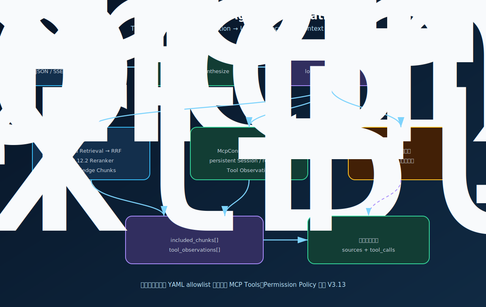
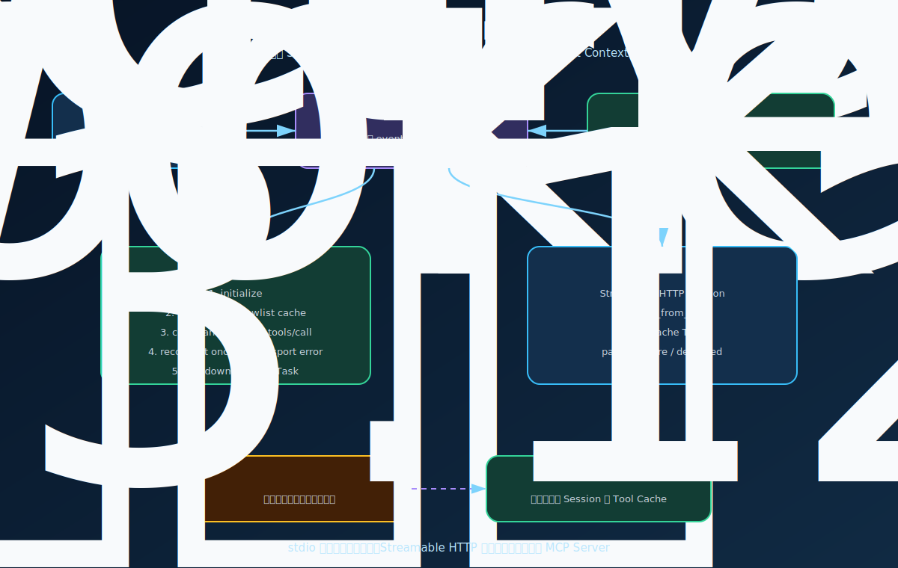
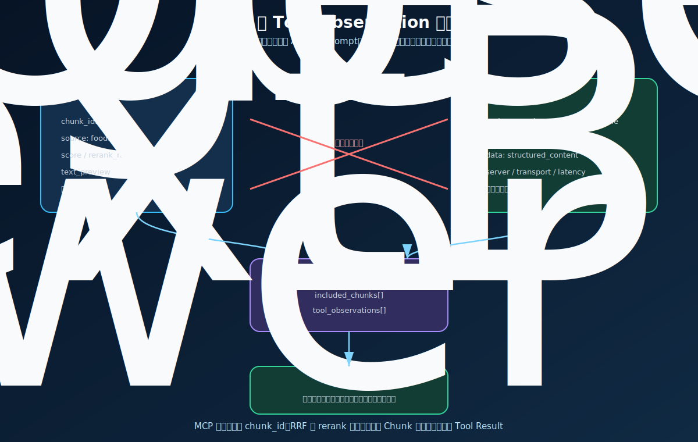

# V3.12.3 MCP Agent Integration 学习指南

V3.12.3 把前三个版本组合成一条完整主链路：

```text
V3.12   MCP Client / Server 协议实验
V3.12.1 公共 Agent Core + Unified ToolRegistry
V3.12.2 Hybrid Retrieval + CrossEncoder Reranking
    ↓
V3.12.3 Planner 自动选择并执行 MCP Tool
```

本版本的核心学习目标不是再写一个 MCP Server，而是理解生产形态 Harness 如何管理外部工具连接，并把外部 Tool Result 安全地送入 Planner、Executor、Context、Answer、Trace、Memory 和前端观察面板。

## 版本边界

当前版本做什么：

- 从 `mcp_servers.yaml` 加载预配置 MCP Servers。
- 支持 `stdio` 与 `streamable_http` Transport。
- FastAPI lifespan 启动和关闭 `McpConnectionManager`。
- 每个 Server 使用一个长期 Worker Task 持有 MCP Session，跨请求复用连接。
- 通过 allowlist、Tool Catalog 数量和 Schema 字符预算限制暴露给 Planner 的工具。
- Planner 可以生成通用 `tool` step，Executor 通过统一 `ToolRegistry` 调用。
- MCP Result 转为独立 `ToolObservation`，与知识库 Chunk 一起进入 Answer Context。
- 复用 V3.12.2 Reranking、V3.10.2 SSE 和共享 Agent Console。

当前版本不做什么：

- 不允许请求动态传入任意 MCP Server URL 或启动命令。
- 不开放写入 Tool、宿主机 Shell、Skill `scripts/` 或任意文件写入。
- `read_only` 只是 Server 声明和当前 allowlist 约束，还不是完整 Permission Policy。
- 不实现人工审批、Sandbox、分布式 Session Pool 或跨进程连接共享。
- 不把本项目自己的 `search_notes` 通过 MCP 绕回自身；本地检索仍是进程内工具。

下一版本 V3.13 会在所有 Local/MCP Tool Call 前增加 Permission Policy。

## 主流程



一次自动 MCP 调用经历：

1. FastAPI lifespan 启动 `McpConnectionManager`，预连接配置为 `connect_on_startup` 的 Server。
2. `build_agent()` 读取已发现的 MCP Tools，注册到统一 `ToolRegistry`，同时构造精简 Planner Catalog。
3. Planner 同时看到用户问题、本地检索能力和本轮允许的 MCP Tool Schema。
4. LLM 可以生成 `search`、`tool`、`synthesize` 的组合计划。
5. `search` step 继续走本地 Hybrid Retrieval + Reranking；`tool` step 进入统一 Executor。
6. Executor 将 `server::tool` 调用投递给对应 Server Worker。
7. Worker 复用 MCP Session 执行 `tools/call`，必要时断开后自动重试一次。
8. MCP Result 被适配为 `ToolObservation`，ContextBuilder 与 Knowledge Chunks 分栏组装 Prompt。
9. Answer 节点综合两类事实，SSE 同步发送 `tool_started`、`tool_finished` 和最终答案。

## Session 生命周期



为什么不在每次 `/agent/ask` 内直接写 `async with ClientSession(...)`：

- `stdio` 每次新建 Session 通常意味着重复启动子进程。
- `initialize` 和 `tools/list` 会重复产生延迟。
- MCP SDK 底层 AnyIO context 必须由创建它的 Task 负责关闭，跨 Task 持有 context 容易产生 cancel scope 错误。

当前实现给每个 Server 建立一个专用 Worker Task。其他线程或请求只提交 `refresh/reconnect/call/stop` 命令，不直接触碰 Session。Worker 自己完成打开、调用、重连和关闭，因此 Session 的创建与释放始终处于同一个 Task。

```text
FastAPI Request Thread
        │ call_tool(server::tool)
        ▼
Connection Manager Event Loop Thread
        │ queue.put(command)
        ▼
Per-Server Worker Task
        │ owns context
        ▼
Transport → ClientSession → MCP Server
```

`stdio` 适合本地开发工具和单机 sidecar；`streamable_http` 更适合独立部署、跨服务调用、认证和水平扩容。两者在 Agent 上层都被适配为相同的 Tool Definition 与 Tool Result。

## Tool Catalog 到 Executor

Tool Catalog 经过三次收窄：

1. `mcp_servers.yaml` 只加载 `enabled: true` 的 Server。
2. `tools/list` 结果只保留 `tool_allowlist` 中的工具。
3. 请求可用 `mcp_enabled` 或 `mcp_tool_names` 进一步收窄本轮 Planner Catalog。

Planner 只看到：

```json
{
  "name": "demo::get_server_time",
  "description": "返回指定时区当前时间",
  "input_schema": {"type": "object"},
  "source": "mcp",
  "read_only": true
}
```

Planner 看不到连接对象、URL Secret、环境变量值或 Python handler。LLM 只负责输出工具名称和结构化参数；Harness 仍负责查表、执行、捕获错误和记录审计信息。

## Chunk 与 Observation



两类数据不能混在一起：

| 数据 | 来源 | 典型字段 | 回答中的身份 |
| --- | --- | --- | --- |
| Knowledge Chunk | Qdrant/Keyword/Hybrid/Reranker | `chunk_id`、`source`、`score`、`text_preview` | 本地知识库证据，可形成 KB 来源引用 |
| Tool Observation | MCP/Local Tool | `tool_name`、`source`、`data`、`status`、`metadata` | 外部工具观察结果，不能伪装成 KB Chunk |

`used_retrieval` 仍只表示是否使用知识库检索。只调用 MCP Tool 时，`used_retrieval=false` 是正确结果；是否调用外部工具应查看 `step_results[].observation`、`context_bundle.tool_observations` 和 trace。

## Swagger 测试

使用 `V3.12.3 API server: MCP Agent Integration` 调试配置后，Swagger 地址为 `http://127.0.0.1:8020/docs`。服务由你手动启动，本实现不会自动启动。

### 自动选择时间工具

`POST /agent/ask`

```json
{
  "question": "现在上海时间是多少？",
  "conversation_id": "conv_v3123_time",
  "collection": "food_safety",
  "memory_window": 3,
  "memory_compaction_enabled": true,
  "memory_compaction_trigger_turns": 4,
  "memory_compaction_trigger_tokens": 3000,
  "top_k": 5,
  "mode": "hybrid",
  "filters": null,
  "max_steps": 3,
  "max_retries": 1,
  "context_max_chunks": 4,
  "context_token_budget": 4000,
  "mcp_enabled": true,
  "mcp_tool_names": ["demo::get_server_time"]
}
```

重点观察：

- `plan.steps[].kind` 是否出现 `tool`。
- `step_results[].arguments` 是否包含 `timezone`。
- `step_results[].observation.data` 是否包含时间结果。
- `context_bundle.tool_observations` 是否进入 Answer Context。
- `used_retrieval` 应为 `false`。

### 本地 RAG 与 MCP 组合

```json
{
  "question": "结合知识库说明生鸡肉是否要洗，并查询 chicken 的安全中心温度。",
  "conversation_id": "conv_v3123_mixed",
  "collection": "food_safety",
  "memory_window": 3,
  "memory_compaction_enabled": true,
  "memory_compaction_trigger_turns": 4,
  "memory_compaction_trigger_tokens": 3000,
  "top_k": 5,
  "mode": "hybrid",
  "filters": null,
  "max_steps": 4,
  "max_retries": 1,
  "context_max_chunks": 4,
  "context_token_budget": 4000,
  "mcp_enabled": true,
  "mcp_tool_names": ["demo::lookup_food_temperature"]
}
```

理想 Plan 是 `search + tool + synthesize`。最终 Context 同时包含 `included_chunks` 和 `tool_observations`，此时 `used_retrieval=true`。

### 禁用 MCP 对照

把 `mcp_enabled` 改为 `false`。Planner 收到空 Tool Catalog，不得生成有效 MCP tool step。对于必须依赖实时外部事实的问题，通常会走 `no_search`。

### 显式验证 Session

`POST /mcp/call`

```json
{
  "name": "demo::lookup_food_temperature",
  "arguments": {"food": "chicken"}
}
```

连续调用后查看 `GET /mcp/runtime`：`call_count` 应增加，Tool trace 中会出现 `session_reused`。`POST /mcp/refresh?server_name=demo&reconnect=true` 可主动重建 Session。

## 条件分支

| 场景 | 行为 |
| --- | --- |
| Planner 不需要外部工具 | 只执行 `search/no_search/clarify/synthesize`，MCP Session 保持空闲 |
| `mcp_enabled=false` | 本轮 Tool Catalog 为空，不影响本地 RAG |
| Server 启动失败 | Server 状态为 `failed/degraded`，其他 Server 和本地检索仍可用 |
| Tool 不在 allowlist | 不进入 Catalog；显式调用返回失败 |
| Tool 调用 Transport 异常 | Worker 关闭当前 Session，重连后自动重试一次 |
| MCP Tool 返回 `isError=true` | 生成失败 Observation，Evidence 标记不足，Answer 不应伪造工具结果 |
| Tool Result 超过上限 | 调用失败，防止超大结果直接进入 Context |
| Planner 输出未知工具名 | `ToolRegistry` 返回 failed，记录错误 Observation，不执行任意动态工具 |
| `clarify` | 不调用 Tool，直接请求用户补充信息 |
| `no_search` | 不检索知识库；没有适用外部工具时按通用回答边界处理 |

## 前端观察

前端继续复用 `frontend/agent_console` 和 `console.v1`，没有复制一套 V3.12.3 UI。后端通过 `/console/config` 声明 `features.mcp_tools=true` 和 `/mcp/runtime` endpoint，旧版本后端仍返回 `false`，因此共享前端保持兼容。

运行参数抽屉中的 `MCP Tools` toggle 用于对照启用和禁用 MCP。右侧 MCP Tab 展示：

- Connection Manager 是否运行。
- 每个 Server 的 Transport、protocol version、Tool 数、调用数和失败数。
- Planner Tool Catalog 与 input schema。
- SSE 实时 `tool_started/tool_finished`。
- 最终 Tool Observation 和结构化 data。

前端展示的是可观察执行事实，不展示模型隐藏 chain-of-thought，也不显示认证 Secret。

## 文件职责

### 后端

| 文件 | 作用 |
| --- | --- |
| `mcp_servers.yaml` | MCP Server、Transport、allowlist、TTL 和结果限制配置 |
| `obsidian_rag/v3_12_3/config.py` | 加载 YAML、展开环境变量、解析 Server cwd |
| `obsidian_rag/v3_12_3/schemas.py` | Swagger 请求、响应、Server Runtime 和 Agent MCP 控制模型 |
| `obsidian_rag/v3_12_3/connection.py` | 后台事件循环、Per-Server Worker、Session 复用、重连和调用 |
| `obsidian_rag/v3_12_3/registry.py` | 将 MCP Tool 注册到公共 `ToolRegistry`，构造精简 Planner Catalog |
| `obsidian_rag/v3_12_3/agent.py` | 扩展公共 Agent 节点，执行通用 tool step 并产生 Observation |
| `obsidian_rag/v3_12_3/dependencies.py` | 组装 Reranking Retrieval、MCP Manager、Agent、Runtime 和 Memory |
| `obsidian_rag/v3_12_3/service.py` | JSON/SSE Agent 与 MCP Runtime 的应用服务边界 |
| `obsidian_rag/v3_12_3/app.py` | FastAPI lifespan 和 Router 组合 |
| `obsidian_rag/v3_12_3/routes/agent.py` | `/agent/ask`、`/agent/ask/stream`、Runtime Config |
| `obsidian_rag/v3_12_3/routes/mcp.py` | MCP 状态、刷新和显式调用接口 |
| `obsidian_rag/v3_12_3/routes/health.py` | API 与 MCP 连接健康摘要 |
| `obsidian_rag/core/schemas.py` | 公共 `tool` step、Tool Catalog、Observation 和响应字段 |
| `obsidian_rag/core/planner.py` | Tool-aware Planner Prompt 和结构化 Plan 解析 |
| `obsidian_rag/core/context.py` | 分离并组装 Memory、Knowledge Chunks、Tool Observations |

V3.12.3 的 `McpAgentService` 暂时复用公共 Core 的少量私有 helper，以保持学习版改动集中。后续若多个生产版本都需要扩展，应将它们提升为正式 protected/public extension points。

### 前端

| 文件 | 作用 |
| --- | --- |
| `frontend/agent_console/src/components/McpRuntimePanel.vue` | MCP Sessions、Catalog、Live Calls 和 Observations 展示 |
| `frontend/agent_console/src/components/RunInspector.vue` | 组合 MCP Tab 与原有 Plan/Evidence/Context Tabs |
| `frontend/agent_console/src/components/ChatComposer.vue` | 提供请求级 `MCP Tools` 开关 |
| `frontend/agent_console/src/composables/use-agent-console.ts` | 拉取 MCP Runtime、发送 `mcp_enabled`、消费 Tool SSE 事件 |
| `frontend/agent_console/src/api/production-client.ts` | 调用 Console Config 和 MCP Runtime API |
| `frontend/agent_console/src/types/production.ts` | MCP Runtime、Tool Catalog、Observation 和事件 TypeScript 契约 |

## 核心断点调试

行号按当前版本核对。代码变化后优先按函数名重新定位。

### 启动与发现

| 顺序 | 文件:行 | 函数 | 重点变量 |
| --- | --- | --- | --- |
| 1 | `obsidian_rag/v3_12_3/app.py:13` | `lifespan()` | `manager`、启动和关闭时机 |
| 2 | `obsidian_rag/v3_12_3/connection.py:78` | `start()` | `_thread`、`startup_names` |
| 3 | `obsidian_rag/v3_12_3/connection.py:227` | `_server_worker()` | `command.kind`、`pending`、`server.status` |
| 4 | `obsidian_rag/v3_12_3/connection.py:276` | `_open_session()` | `transport`、`parameters/url`，不要展开 Secret |
| 5 | `obsidian_rag/v3_12_3/connection.py:302` | `_client_session()` | `initialized.protocolVersion`、`connected_at` |
| 6 | `obsidian_rag/v3_12_3/connection.py:316` | `_discover()` | `listed.tools`、`allowlist`、`server.tools` |

### Agent 自动选择与调用

| 顺序 | 文件:行 | 函数 | 重点变量 |
| --- | --- | --- | --- |
| 1 | `obsidian_rag/v3_12_3/dependencies.py:39` | `build_agent()` | `registry`、`planner_tools`、Reranking Retrieval |
| 2 | `obsidian_rag/v3_12_3/registry.py:10` | `build_agent_tool_registry()` | `remote_tools`、`schema_chars`、namespaced name |
| 3 | `obsidian_rag/v3_12_3/agent.py:41` | `_planner_node()` | `catalog`、`PlanRequest.tools`、`plan.steps` |
| 4 | `obsidian_rag/core/planner.py:212` | `_build_planner_messages()` | `user_payload["tools"]` |
| 5 | `obsidian_rag/v3_12_3/agent.py:77` | `_execute_steps_node()` | `step.kind`、`step.tool_name` |
| 6 | `obsidian_rag/v3_12_3/agent.py:119` | `_execute_tool_step()` | `step.arguments`、`ToolResult`、`ToolObservation` |
| 7 | `obsidian_rag/v3_12_3/connection.py:324` | `_call_in_session()` | `server.tools`、`result.isError`、`result_size` |
| 8 | `obsidian_rag/v3_12_3/agent.py:171` | `_evidence_check_node()` | `failed_tools`、`evidence_check.is_sufficient` |
| 9 | `obsidian_rag/core/context.py:22` | `ContextBuilder.build()` | `included`、`tool_observations`、`messages` |
| 10 | `obsidian_rag/core/context.py:99` | `_build_messages()` | `context_payload` 中四类 Context |
| 11 | `obsidian_rag/v3_12_3/agent.py:206` | `_synthesize_answer_node()` | `observations`、最终 Answer trace |

### 前端 SSE 与面板

| 顺序 | 文件:行 | 函数 | 重点变量 |
| --- | --- | --- | --- |
| 1 | `frontend/agent_console/src/composables/use-agent-console.ts:127` | `refreshMcpRuntime()` | Console capability 与 endpoint |
| 2 | `frontend/agent_console/src/composables/use-agent-console.ts:331` | `applyMcpToolEvent()` | `event.name`、`payload.tool_name`、`liveToolEvents` |
| 3 | `frontend/agent_console/src/components/McpRuntimePanel.vue:26` | Template | `runtime.servers`、`observations` |

推荐先调试 `V3.12.3 CLI: automatic MCP tool`，再调试 `local RAG + MCP tool`，最后打开 Agent Console 观察 SSE 和最终响应如何汇合。

## CLI

服务由你手动启动后可使用：

```bash
.venv/bin/obsidian-rag agent-v3-12-3 mcp-status
.venv/bin/obsidian-rag agent-v3-12-3 mcp-call demo::get_server_time --arguments '{"timezone":"Asia/Shanghai"}'
.venv/bin/obsidian-rag agent-v3-12-3 ask "现在上海时间是多少？" --mcp-tool-name demo::get_server_time
.venv/bin/obsidian-rag agent-v3-12-3 ask "现在上海时间是多少？" --disable-mcp
```

CLI 和 Swagger 调用的是同一个 FastAPI 服务。CLI 更适合断点和脚本化重复调用，Swagger 更适合观察 schema、字段描述和手工修改 payload。

## 本版本应掌握

完成 V3.12.3 后，应能解释：

1. MCP 解决 Tool 协议与发现，Planner/Tool Calling 解决模型如何选择，两者不是同一层。
2. 为什么 Session 的 context 必须由同一个 Worker Task 创建和关闭。
3. 为什么 Tool Catalog 需要 namespace、allowlist 和 schema budget。
4. 为什么 Tool Observation 不能伪装成 Knowledge Chunk。
5. 为什么 `read_only=true` 仍不能替代下一版本的 Permission Policy。

