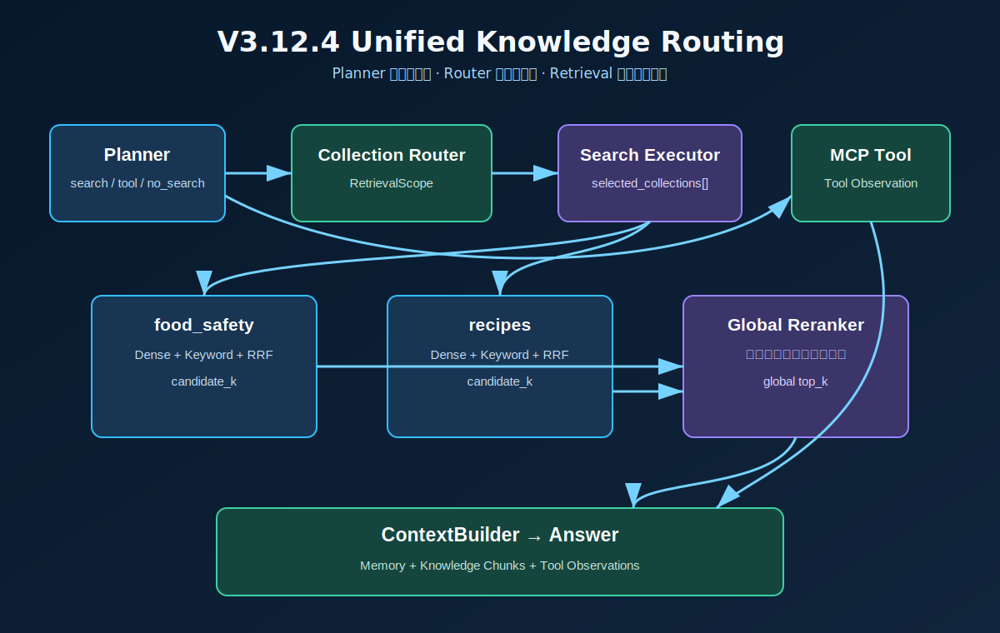
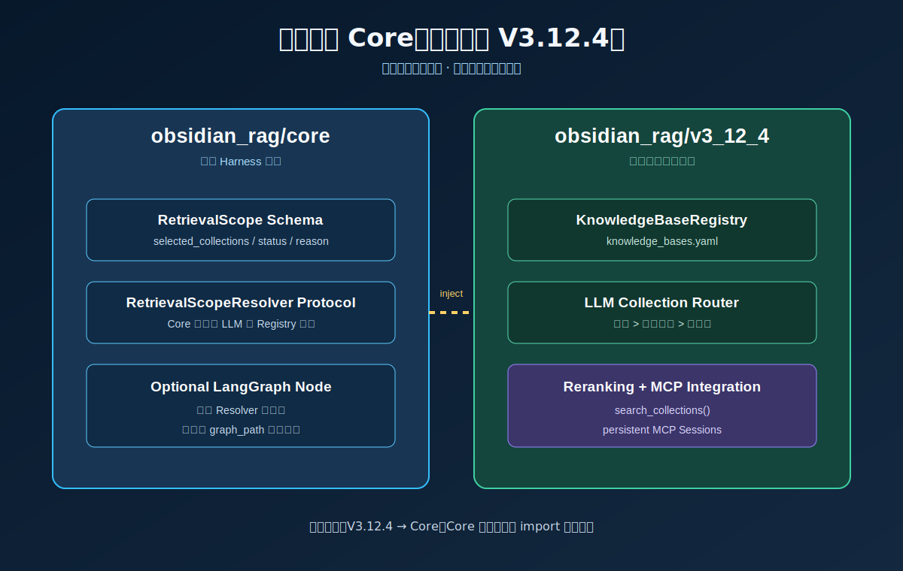
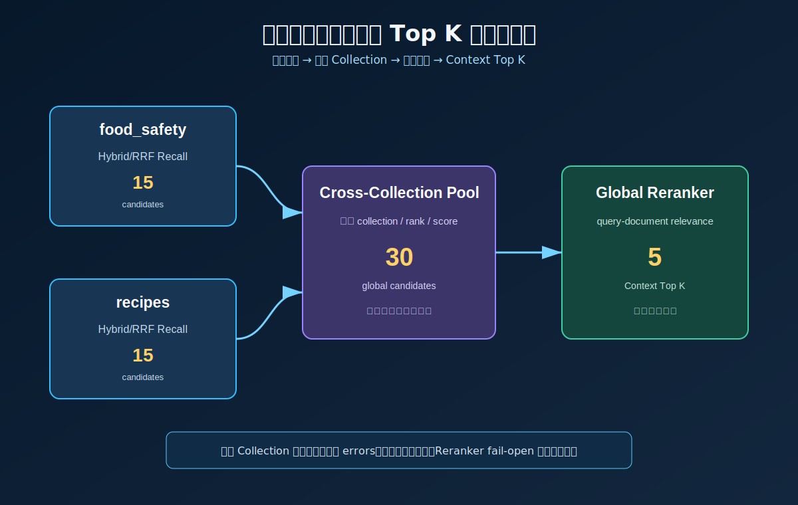

# V3.12.4 Unified Knowledge Routing 学习指南

> 当前代码说明：继承关系仍保留版本语义，但 V3.12.3 的通用 Tool Agent
> 节点已在 V3.14 阶段合并到 Core。下文提到的重写节点，应以
> `obsidian_rag/core/agent/service.py` 中同名函数为当前实现位置。

V3.12.4 把之前相互独立的能力组合成一条完整 Agent 主链路：

```text
V3.11.3 Collection Router
V3.12.2 Multi-Collection Reranking
V3.12.3 MCP Agent Integration
              ↓
V3.12.4 Unified Knowledge Routing
```

本版本最重要的学习目标是分清三个问题：

```text
Planner：当前任务是否需要检索或工具？
Collection Router：如果需要本地检索，允许访问哪些知识库？
Retrieval/Reranker：在这些知识库里，哪些证据最相关？
```

## 相比 V3.12.3 新增什么

V3.12.3 已经能让 Planner 自动选择 MCP Tool，但本地 `search_notes` 仍依赖单个显式或默认 Collection。V3.12.4 新增：

- Core `RetrievalScope` 稳定契约。
- `RetrievalScopeResolver` 注入接口。
- 可选 LangGraph 节点 `resolve_retrieval_scope`。
- YAML Knowledge Base Registry 与 LLM Collection Router。
- 显式 Collection、自动路由、Router disabled、no-search 等明确分支。
- 多 Collection 候选融合后统一 CrossEncoder Reranking。
- Agent Console 的 Auto Collection、Router 参数和知识库观察 Tab。

V3.12.3 的 MCP Session、Tool Catalog、Tool Observation、SSE、Memory 和 Context 语义保持不变。

## 版本边界

当前版本做：

- 每个 Agent Run 最多调用一次 Collection Router。
- Router 从 `knowledge_bases.yaml` 中选择 1 到 `max_collections` 个知识库。
- 显式 `collection` 始终优先，并跳过 LLM Router。
- Planner 没有生成 search step 时，不调用 Collection Router。
- 多库结果通过 V3.12.2 `search_collections()` 融合并统一 Rerank。
- MCP Tool 和本地知识库检索可以出现在同一个 Plan 中。

当前版本不做：

- 不为每个 search subquery 单独调用 Collection Router。
- 不把 Collection Router 注册成 MCP Tool。
- 不实现 Collection ACL、租户授权或用户级知识库权限。
- 不实现写入 Tool、Permission Policy、人工审批或 Sandbox。

下一版本 V3.13 会让本地检索和 MCP Tool 统一经过 Permission Policy。

## 端到端主流程



正常自动路由链路：

1. Memory 节点读取最近 Turns 和滚动摘要。
2. Planner 判断问题需要 `search`、MCP `tool`，还是两者组合。
3. 只有 Plan 包含 search step 时，才进入 `resolve_retrieval_scope`。
4. Resolver 从 Registry 加载候选知识库，并由 LLM Router 输出结构化选择。
5. 所有 search steps 共用本轮 `RetrievalScope.selected_collections`。
6. 每个 Collection 内执行 Dense/Keyword/Hybrid/RRF 召回。
7. 跨 Collection 候选统一进入 CrossEncoder Reranker。
8. Knowledge Chunks 与 MCP Tool Observations 一起进入 ContextBuilder。
9. Answer 节点综合 Memory、Chunks 和 Observations。

## Core 与版本边界



Core 只保存可复用的稳定能力：

```text
RetrievalScope
RetrievalScopeRequest
RetrievalScopeResolver Protocol
KnowledgeBaseRegistry
LlmCollectionRouter
Optional resolve_retrieval_scope Graph Node
```

V3.12.4 负责具体组合：

```text
Core Resolver
  + V3.12.2 RerankingRetrievalService
  + V3.12.3 McpConnectionManager / McpAgentService
  + FastAPI / CLI / Agent Console
```

依赖方向必须保持：

```text
v3_12_4 → core
core      不 import v3_12_4 或其他学习版本
```

Core Agent 只有在构造时传入 `retrieval_scope_resolver`，才增加路由节点。因此 V3.12.3 和更早版本的 graph path 不会平白多一个节点。

### RoutedMcpAgentService 组合了哪些版本

`RoutedMcpAgentService` 的直接继承链只有三层：

```text
V3.12.4 RoutedMcpAgentService
        ↓ 继承
V3.12.3 McpAgentService
        ↓ 继承
V3.12.1 CoreAgentService
```

三层职责分别是：

| 层级 | 类 | 主要职责 |
| --- | --- | --- |
| V3.12.4 | `RoutedMcpAgentService` | 作为完整组合入口，通过构造参数注入 `RetrievalScopeResolver`，让公共 Graph 增加 `resolve_retrieval_scope` 节点。 |
| V3.12.3 | `McpAgentService` | 在公共 Agent 上增加 MCP Tool Catalog、Planner `tool` step、Tool 执行和 `ToolObservation`。 |
| V3.12.1 | `CoreAgentService` | 提供 LangGraph、Memory、Planner、RAG、Evidence、Retry、Context、Answer、Memory Write、Trace 和节点耗时。 |

V3.12.3 的 `McpAgentService` 主要重写以下 Core 节点：

| 方法 | 扩展内容 |
| --- | --- |
| `_initial_state()` | 将本轮可用的 MCP `tool_catalog` 放入 `AgentState`。 |
| `_planner_node()` | 把 MCP Tool Catalog 交给 Planner，使 Plan 可以生成通用 `tool` step。 |
| `_execute_steps_node()` | 在 `search`、`synthesize` 等步骤之外，增加 MCP `tool` step 分发。 |
| `_evidence_check_node()` | 先调用 Core Evidence Checker，再把 MCP Tool 执行失败纳入证据不足判断。 |
| `_synthesize_answer_node()` | 先调用 Core Answer 节点，再补充 Tool Observation 相关 Trace。 |

其中 `_planner_node()` 和 `_execute_steps_node()` 会改变输入或步骤分发，因此完整替换父类节点实现；`_evidence_check_node()` 和 `_synthesize_answer_node()` 使用 `super()` 保留 Core 行为后再追加 MCP 语义。

`RoutedMcpAgentService` 当前看起来是空类，这是有意设计。Core 在构建 LangGraph 时注册的是 `self._planner_node`、`self._execute_steps_node` 等绑定方法；运行时 `self` 实际是 `RoutedMcpAgentService`，Python 动态分派会调用 V3.12.3 `McpAgentService` 重写后的节点。

下面这些版本能力也参与 V3.12.4，但不属于 `AgentService` 继承链：

```text
V3.12.2 RerankingRetrievalService
    → Hybrid/RRF 后执行 CrossEncoder Reranking

V3.11.3 Collection Router 思路
    → 已提升为 core/collections 下的 Registry、Resolver 和 Router

V3.10.2 StreamingAgentRuntimeService
    → 在 Agent 外层管理 Production Run 和 SSE

V3.12.3 McpConnectionManager
    → 管理持久 MCP Session 和远程 Tool Catalog
```

因此从能力组合角度，可以记为：

```text
V3.12.4 Agent
= V3.12.1 公共 Agent Core
+ V3.12.3 MCP Agent 能力
+ V3.12.4 Collection Routing
+ V3.12.2 Reranking Retrieval
```

实际依赖组装位于 `obsidian_rag/v3_12_4/dependencies.py` 的 `build_agent()`：它同时传入 Retrieval、Resolver、统一 Tool Registry、Planner Tool Catalog、LLM Client 和 Memory Store。

## 多库候选漏斗



V3.12.4 没有直接复用 V3.11.3 的完整 `MultiCollectionRetrievalService`，因为 V3.12.2 已经提供更成熟的：

```python
RerankingRetrievalService.search_collections(...)
```

链路是：

```text
food_safety candidate_k
recipes     candidate_k
       ↓
cross-collection candidate pool
       ↓
CrossEncoder global rerank
       ↓
Context top_k
```

这避免了先执行 V3.11.3 第二层 RRF、再重复融合和 Rerank。每个结果仍在 metadata 中保留：

- `collection`
- `collection_rank`
- `collection_score`
- `cross_collection_score`
- `rerank_run`

## RetrievalScope 字段

```json
{
  "status": "multi_selected",
  "selected_ids": ["food_safety", "recipes"],
  "selected_collections": ["food_safety", "recipes"],
  "candidate_ids": ["food_safety", "recipes", "vueuse_core"],
  "reason": "问题同时涉及食品安全和烹饪做法。",
  "confidence": 0.92,
  "registry_path": "/workspace/knowledge_bases.yaml",
  "errors": {}
}
```

字段含义：

| 字段 | 含义 |
| --- | --- |
| `status` | `explicit/selected/multi_selected/no_collection/router_error` 等分支 |
| `selected_ids` | Router 选择的业务知识库 ID |
| `selected_collections` | 真正传给 Retrieval 的物理 Collection 名称 |
| `candidate_ids` | 本轮 Router 实际看到的候选范围 |
| `reason` | 可观察的简短原因，不是隐藏推理 |
| `confidence` | LLM Router 置信度，非 LLM 分支为空 |
| `registry_path` | 实际加载的 Registry 文件 |
| `errors` | Registry、Router 或局部检索失败摘要 |

## Swagger 测试

手动启动 `V3.12.4 API server: Unified Knowledge Routing` 后，Swagger 地址是 `http://127.0.0.1:8020/docs`。

### 自动选择多个知识库

`POST /agent/ask`

```json
{
  "question": "做鸡肉时怎样保证安全，同时给我一个简单做法？",
  "conversation_id": "conv_v3124_auto",
  "collection": null,
  "collection_router_enabled": true,
  "max_collections": 2,
  "mcp_enabled": true,
  "mcp_tool_names": null,
  "memory_window": 3,
  "memory_compaction_enabled": true,
  "memory_compaction_trigger_turns": 4,
  "memory_compaction_trigger_tokens": 3000,
  "top_k": 5,
  "mode": "hybrid",
  "filters": null,
  "max_steps": 4,
  "max_retries": 1,
  "context_max_chunks": 4,
  "context_token_budget": 4000
}
```

重点观察：

- `graph_path` 是否包含 `resolve_retrieval_scope`。
- `retrieval_scope.selected_collections` 是否包含安全库和菜谱库。
- `step_results[].metadata.collections` 是否与 Scope 一致。
- `context_bundle.included_chunks[].metadata.collection` 是否保留真实来源库。

### 显式 Collection 旁路 Router

```json
{
  "question": "useMouse 怎么使用？",
  "conversation_id": "conv_v3124_explicit",
  "collection": "vueuse_core_kb",
  "collection_router_enabled": true,
  "max_collections": 2,
  "mcp_enabled": true,
  "memory_window": 3,
  "memory_compaction_enabled": false,
  "memory_compaction_trigger_turns": 4,
  "memory_compaction_trigger_tokens": 3000,
  "top_k": 5,
  "mode": "hybrid",
  "filters": null,
  "max_steps": 3,
  "max_retries": 1,
  "context_max_chunks": 4,
  "context_token_budget": 4000
}
```

预期 `retrieval_scope.status=explicit`，不调用 Collection Router LLM。

### 只调试 Router

`POST /collections/route`

```json
{
  "question": "做鸡肉时怎样保证安全，同时给我一个简单做法？",
  "collection": null,
  "collection_router_enabled": true,
  "max_collections": 2
}
```

该接口只返回 Scope，不访问 Qdrant、不调用 Reranker，也不生成最终答案。

### Planner 不需要检索

问题：

```text
帮我写一个两数之和函数
```

如果 Planner 生成 `no_search`，Scope 应为：

```json
{
  "status": "not_required",
  "selected_collections": []
}
```

这说明 Router 放在 Planner 后面避免了一次无意义 LLM 调用。

## 条件分支

| 条件 | 结果 |
| --- | --- |
| Plan 没有 search | `not_required`，不调用 Collection Router |
| 请求提供 `collection` | `explicit`，验证 Registry 后单库检索 |
| Router disabled | `disabled`，使用 `RAG_COLLECTION` 默认库 |
| Router 选择一个库 | `selected`，单库 Reranking Retrieval |
| Router 选择多个库 | `multi_selected`，多库候选融合后统一 Rerank |
| Router 返回空列表 | `no_collection`，search 返回空结果，Evidence 可触发补搜但不会越过 Scope |
| Router JSON 无效 | `router_error`，不偷偷退回不受限默认检索 |
| 某个 Collection 失败 | 记录 `collection_errors`，其他库继续执行 |
| Reranker 失败 | 沿用 V3.12.2 fail-open，保留融合候选顺序 |
| Plan 同时有 search 和 MCP tool | Knowledge Chunks 与 Tool Observations 一起进入 Context |

## 前端学习点

共享 Agent Console 没有复制 V3.12.4 专属项目。后端通过 `console.v1` 声明：

```json
{
  "features": {"collection_routing": true},
  "endpoints": {"collection_runtime": "/collections/runtime"}
}
```

前端运行参数：

- Collection 留空表示 Auto。
- 填写 Collection 后自动旁路 Router。
- `Collection Router` 控制自动路由是否启用。
- `最大知识库数` 限制 LLM Router 可选择范围。

右侧“知识库”Tab 展示：

- Registry candidates。
- 最终 selected collections。
- `status/reason/confidence`。
- Registry 和 Router errors。

## 文件职责

### Core

| 文件 | 作用 |
| --- | --- |
| `core/collections/schemas.py` | KnowledgeBaseManifest、RetrievalScopeRequest、RetrievalScope |
| `core/collections/protocol.py` | Agent Core 依赖的 Resolver Protocol |
| `core/collections/registry.py` | 加载并校验 Knowledge Base Registry YAML |
| `core/collections/router.py` | LLM Router Prompt、JSON 解析和选择校验 |
| `core/collections/resolver.py` | 显式、disabled、自动路由的优先级编排 |
| `core/agent/service.py` | 可选 Graph Node、Scope State、search/retry 传递 |
| `core/tools.py` | `search_notes` 单库/多库调用适配 |

### V3.12.4 后端

| 文件 | 作用 |
| --- | --- |
| `v3_12_4/schemas.py` | Swagger 请求、Scope Runtime、健康和配置模型 |
| `v3_12_4/agent.py` | 组合 MCP Agent 与 RetrievalScopeResolver 的版本入口 |
| `v3_12_4/dependencies.py` | 组装 Registry、Router、Reranker、MCP、Memory 和 Runtime |
| `v3_12_4/service.py` | Agent、Collection Debug 和 MCP Runtime 应用服务 |
| `v3_12_4/app.py` | FastAPI lifespan 与 Router 组合 |
| `v3_12_4/routes/agent.py` | JSON/SSE Agent API |
| `v3_12_4/routes/collections.py` | Registry Runtime 与 Router Debug API |
| `v3_12_4/routes/mcp.py` | 持久 MCP Runtime API |
| `v3_12_4/routes/health.py` | MCP 与 Knowledge Base 健康摘要 |

### 前端

| 文件 | 作用 |
| --- | --- |
| `CollectionRoutingPanel.vue` | Scope、Candidates 和 Errors 展示 |
| `ChatComposer.vue` | Auto Collection、Router 和 max collections 参数 |
| `RunInspector.vue` | 组合“知识库”Tab |
| `use-agent-console.ts` | 拉取 Registry、发送路由参数、处理 routing progress |
| `production-client.ts` | Collection Runtime API Client |
| `types/production.ts` | RetrievalScope 和 Registry TypeScript 契约 |

## 核心断点调试

行号按版本完成时的代码核对；后续修改请优先按函数名重新定位。

| 顺序 | 文件:行 | 函数 | 观察变量 |
| --- | --- | --- | --- |
| 1 | `obsidian_rag/v3_12_4/dependencies.py:67` | `build_agent()` | `retrieval`、`resolver`、`planner_tools` |
| 2 | `obsidian_rag/core/agent/service.py:412` | `_planner_node()` | `plan.steps` 是否包含 search |
| 3 | `obsidian_rag/core/agent/service.py:486` | `_resolve_retrieval_scope_node()` | `search_required`、`scope.status`、`selected_collections` |
| 4 | `obsidian_rag/core/collections/resolver.py:21` | `resolve()` | 显式、disabled、Router 分支 |
| 5 | `obsidian_rag/core/collections/router.py:31` | `route()` | `candidates`、`raw`、`decision` |
| 6 | `obsidian_rag/core/agent/service.py:693` | `_execute_steps_node()` | `retrieval_scope`、search/tool steps |
| 7 | `obsidian_rag/core/agent/service.py:724` | `_execute_search_step()` | `_retrieval_scope_kwargs()` |
| 8 | `obsidian_rag/core/tools.py:87` | `search_notes()` | `collection`、`collections`、`outcome` |
| 9 | `obsidian_rag/reranking/retrieval.py:53` | `search_collections()` | `results_by_collection`、`fused`、`errors` |
| 10 | `obsidian_rag/core/context.py:22` | `ContextBuilder.build()` | Chunks 与 Tool Observations |
| 11 | `frontend/agent_console/src/components/CollectionRoutingPanel.vue:21` | Template | `runtime`、`scope`、`selected` |

## CLI

服务由你手动启动后：

```bash
.venv/bin/obsidian-rag agent-v3-12-4 collections
.venv/bin/obsidian-rag agent-v3-12-4 route "鸡肉安全和做法"
.venv/bin/obsidian-rag agent-v3-12-4 ask "做鸡肉时怎样保证安全，同时给我一个简单做法？"
.venv/bin/obsidian-rag agent-v3-12-4 ask "useMouse 怎么使用？" --collection vueuse_core_kb
```

## 本版本应掌握

完成学习后，应能解释：

1. Planner、Collection Router 和 Reranker 分别解决什么问题。
2. 为什么 Collection Router 放在 Planner 后、Search Executor 前。
3. 为什么稳定契约进入 Core，而 V3.12.4 负责具体组合。
4. 为什么多库检索不能简单拼接每个库的最终 Top K。
5. 为什么 `no_collection/router_error` 不能偷偷退回不受限默认库。
6. 为什么 Collection Scope 下一步必须进入 Permission Policy。
