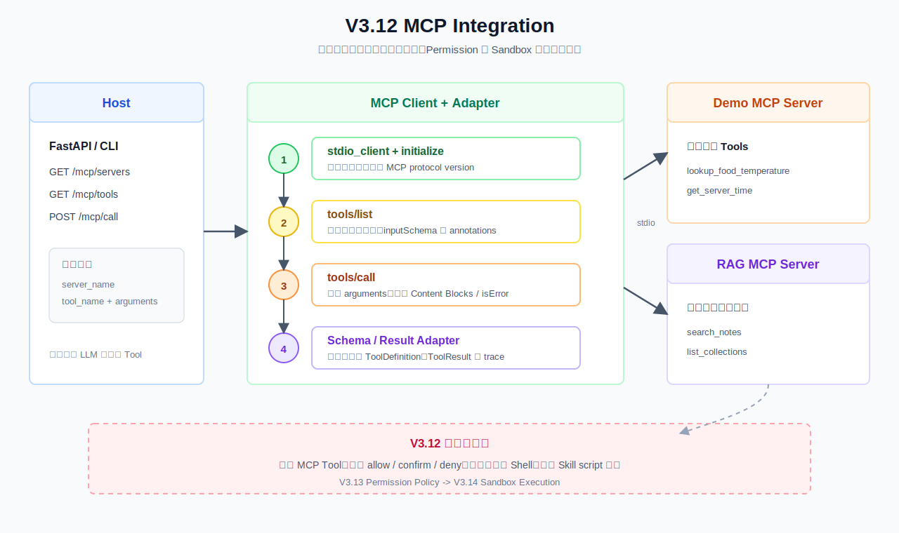
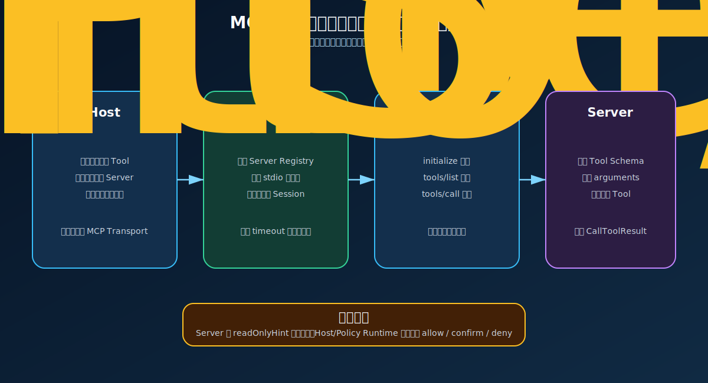
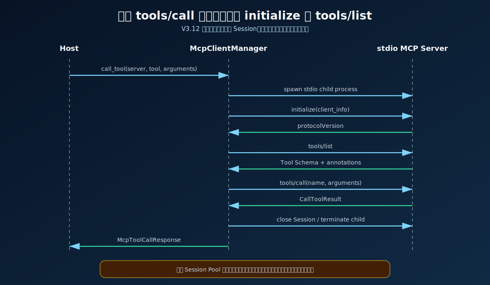

# V3.12 MCP Integration 学习指南

V3.12 学习 Harness 如何通过 MCP 标准协议发现和调用外部工具，以及如何把已有 RAG 检索能力暴露给其他 MCP Client。



## 一句话理解 MCP

MCP 不负责决定“应该完成什么任务”，也不负责实现具体业务逻辑。它规定的是：

> 一个 Host 如何用统一协议发现 Tool、读取参数 Schema、发起调用并接收结构化结果。

三个概念的边界：

| 概念 | 回答的问题 | 本项目示例 |
| --- | --- | --- |
| Skill | 这类任务应该采用什么方法？ | V3.11 `SKILL.md`、Skill Router |
| Tool | 具体执行什么动作？ | `search_notes`、`get_server_time` |
| MCP | Tool 如何被发现、描述和调用？ | `initialize`、`tools/list`、`tools/call` |

## 相比 V3.11 新增了什么

```text
V3.11：Skill Registry -> Skill Router -> load SKILL.md -> Planner
V3.12：MCP Client -> initialize -> tools/list -> tools/call -> MCP Server
```

V3.11 解决方法选择；V3.12 解决标准工具协议。V3.12 本身不让 LLM 自动选择 MCP Tool，而是先通过 Swagger 和 CLI 显式调用，便于观察协议边界。

## Host、Client、Session、Server



| 角色 | 本项目对应物 | 职责 |
| --- | --- | --- |
| Host | FastAPI、CLI、未来 Agent Runtime | 决定何时发现或调用 MCP Tool |
| Client | `McpClientManager` | 启动 Server、创建 Session、发送协议请求 |
| Session | 官方 `ClientSession` | 在一条连接中完成初始化、发现和调用 |
| Server | Demo Server、RAG Server | 声明 Tool Schema 并执行 Tool |

当前 Transport 是 `stdio`：Client 启动 Server 子进程，通过标准输入输出传输 MCP 消息。它不是浏览器直接访问的 HTTP Server。

## 当前版本边界

### V3.12 做什么

- 使用官方 Python `mcp` SDK 和 `stdio` Transport。
- 支持 `initialize`、`tools/list`、`tools/call`。
- 将远端 Tool Schema 适配为稳定的 `McpToolDefinition`。
- 将 `CallToolResult` 适配为稳定的 `McpToolCallResponse`。
- 提供低风险 Demo MCP Server。
- 将 `search_notes`、`list_collections` 暴露为 RAG MCP Server。
- 记录协议阶段、状态和耗时，不记录 Secret。

### V3.12 不做什么

- 不让 LLM 自动选择 MCP Tool。
- 不执行 Skill 目录中的 `scripts/`。
- 不开放宿主机 Shell、任意文件写入或网络代理。
- 不实现 `allow / confirm / deny`，留给 V3.13 Permission Policy。
- 不实现隔离执行，留给 V3.14 Sandbox Execution。
- 不实现 MCP `resources`、`prompts`、Sampling 或生产级 Session Pool。
- 不修改 V3.11 Agent 主链路，也不新增 SSE。

V3.12.1 后续才把 V3.12 MCP Adapter 接入公共 Tool Registry；V3.12 本身仍是独立协议学习版本。

## 一次 Session 的生命周期



当前每次发现或调用都会创建短生命周期 Session：

```text
启动子进程
-> 创建 ClientSession
-> initialize
-> tools/list
-> 可选 tools/call
-> 关闭 Session
-> 结束子进程
```

优点是生命周期清晰、故障互相隔离；代价是每次调用都有进程启动和 initialize 开销。生产系统通常会复用 Session，但需要额外处理并发、断线、重连、健康检查和资源回收。

## 为什么调用前必须 tools/list

MCP Client 不应该在代码里硬编码远端 Tool 参数。`tools/list` 返回：

- Tool 名称、标题和描述。
- `inputSchema` 参数 JSON Schema。
- 可选 `outputSchema`。
- `readOnlyHint` 等 annotations。

本地 Adapter 会增加 Server 命名空间：

```text
demo::lookup_food_temperature
rag::search_notes
```

这样可以避免不同 Server 出现同名 Tool。`readOnlyHint` 只是 Server 声明的提示，不等于安全授权；真正的执行许可仍应由 V3.13 Policy Engine 判断。

## tools/list 主链路

```text
GET /mcp/tools
  -> McpIntegrationService.list_tools()
  -> McpClientManager.discover_tools()
  -> stdio_client()
  -> ClientSession.initialize()
  -> ClientSession.list_tools()
  -> adapt_tool()
  -> McpToolListResponse
```

遍历多个 Server 时，一个 Server 失败不会丢弃其他 Server 已成功发现的 Tools，失败摘要记录在 `errors`。

## tools/call 主链路

```text
POST /mcp/call
  -> McpIntegrationService.call_tool()
  -> McpClientManager.call_tool()
  -> stdio_client()
  -> ClientSession.initialize()
  -> ClientSession.list_tools()
  -> 确认 Tool 仍存在
  -> ClientSession.call_tool()
  -> adapt_content() / structured_content()
  -> McpToolCallResponse
```

学习版在调用前再次执行 `tools/list`，用于确认 Tool 存在并读取当前 Schema；本版没有实现 Tool Schema Cache。

## 两个 MCP Server

### Demo Server

| Tool | 用途 | 风险 |
| --- | --- | --- |
| `lookup_food_temperature` | 查询常见食物安全中心温度 | 只读、确定性 |
| `get_server_time` | 返回指定时区时间 | 只读、低风险 |

Demo Server 不依赖 Qdrant 或 LLM，最适合第一次打断点。

### RAG Server

| Tool | 用途 |
| --- | --- |
| `search_notes` | 复用 `RetrievalService`，支持 dense、keyword、hybrid、collection |
| `list_collections` | 读取 `knowledge_bases.yaml` 中启用的 Collection |

RAG Server 不提供 `ask_notes`，避免 MCP 协议学习混入 Answer LLM 延迟。

## Swagger 调试

启动：

```bash
.venv/bin/uvicorn obsidian_rag.v3_12.app:app --host 127.0.0.1 --port 8019
```

Swagger：`http://127.0.0.1:8019/docs`

### 查看 Server 配置

```text
GET /mcp/servers
```

该接口只读取 Registry，不启动子进程。

### 发现 Demo Tools

```text
GET /mcp/tools?server_name=demo
```

### 调用食品温度 Tool

```json
{
  "server_name": "demo",
  "tool_name": "lookup_food_temperature",
  "arguments": {
    "food": "chicken"
  }
}
```

### 调用 RAG 检索 Tool

```json
{
  "server_name": "rag",
  "tool_name": "search_notes",
  "arguments": {
    "query": "生鸡肉要不要清洗？",
    "top_k": 5,
    "mode": "hybrid",
    "collection": "food_safety"
  }
}
```

### 参数错误案例

```json
{
  "server_name": "demo",
  "tool_name": "lookup_food_temperature",
  "arguments": {}
}
```

Server 返回 Tool Error，FastAPI 仍返回结构化 `McpToolCallResponse`：`status=failed`、`is_error=true`，不会让整个 API 变成未处理的 500。

## CLI 调试

```bash
.venv/bin/obsidian-rag mcp-v3-12 servers
.venv/bin/obsidian-rag mcp-v3-12 tools --server demo
.venv/bin/obsidian-rag mcp-v3-12 call demo lookup_food_temperature --arguments '{"food":"chicken"}'
.venv/bin/obsidian-rag mcp-v3-12 call rag list_collections --arguments '{}'
```

让其他 MCP Client 启动本项目 RAG Server：

```bash
.venv/bin/obsidian-rag mcp-v3-12 serve-rag
```

该命令运行 stdio Server，应由 MCP Client 作为子进程启动。

## 正常路径与条件分支

| 分支 | 流程 | 结果 |
| --- | --- | --- |
| 正常发现 | known server → initialize → tools/list | 返回适配后的 Tools |
| 未知 Server | Registry 查找失败 | `/mcp/tools` 返回 404 |
| Server 启动失败 | spawn/connect/initialize 异常 | 记录 failed trace；多 Server 时保留其他结果 |
| 未知 Tool | initialize → tools/list → tool missing | 返回 failed `McpToolCallResponse` |
| 参数错误 | tools/call → `CallToolResult.isError=true` | `status=failed` |
| 结果过大 | 超过 `RAG_MCP_MAX_RESULT_BYTES` | 返回结构化失败，不把巨大内容送入 Context |
| timeout | 超过 Server `timeout_seconds` | 关闭 Session 并返回安全错误摘要 |

默认结果上限：

```text
RAG_MCP_MAX_RESULT_BYTES=262144
```

## 文件职责

| 文件 | 作用 |
| --- | --- |
| `obsidian_rag/v3_12/app.py` | 组装 V3.12 FastAPI app |
| `obsidian_rag/v3_12/dependencies.py` | 注册 Demo/RAG Server 并创建 Manager/Service |
| `obsidian_rag/v3_12/schemas.py` | Server、Tool、Call Result、Content Block、Trace 契约 |
| `obsidian_rag/v3_12/client/manager.py` | stdio 子进程、ClientSession 和协议生命周期 |
| `obsidian_rag/v3_12/client/adapter.py` | SDK Tool/Content 到稳定本地 Schema 的转换 |
| `obsidian_rag/v3_12/service.py` | 多 Server 发现、显式调用、错误与大小边界 |
| `obsidian_rag/v3_12/routes/mcp.py` | `/mcp/servers`、`/mcp/tools`、`/mcp/call` |
| `obsidian_rag/v3_12/servers/demo_server.py` | 低风险测试 Server |
| `obsidian_rag/v3_12/servers/rag_server.py` | 暴露本地 RAG 只读工具 |
| `tests/v3_12/` | Service、API、CLI 契约测试 |

## 核心断点调试

以下行号按当前代码核对；代码变化后应优先按函数名重新定位。

### tools/list

| 顺序 | 断点 | 观察变量 |
| --- | --- | --- |
| 1 | `routes/mcp.py:24 list_tools` | `server_name`、`service` |
| 2 | `service.py:39 McpIntegrationService.list_tools` | `servers`、`tools`、`errors`、`trace` |
| 3 | `client/manager.py:62 discover_tools` | `server`、`timeout_seconds` |
| 4 | `client/manager.py:102 _session` | `command`、`args`、`cwd`、`env` |
| 5 | `client/manager.py:120 ClientSession.initialize` | `protocolVersion` |
| 6 | `client/manager.py:67 ClientSession.list_tools` | `result.tools` |
| 7 | `client/adapter.py:10 adapt_tool` | `inputSchema`、`annotations`、`namespaced_name` |

### tools/call

| 顺序 | 断点 | 观察变量 |
| --- | --- | --- |
| 1 | `routes/mcp.py:35 call_tool` | `request.server_name`、`tool_name`、`arguments` |
| 2 | `service.py:91 McpIntegrationService.call_tool` | `trace`、`started`、`protocol_call` |
| 3 | `client/manager.py:75 call_tool` | `listed.tools`、`tool` |
| 4 | `client/manager.py:91 ClientSession.call_tool` | `arguments`、`result.isError` |
| 5 | `servers/demo_server.py:19 lookup_food_temperature` | `food`、`normalized`、匹配结果 |
| 6 | `client/adapter.py:26 adapt_content` | `result.content`、Content Block 类型 |
| 7 | `service.py:91` 返回前 | `status`、`structured_content`、`duration_ms`、`trace` |

`launch.json` 的 V3.12 配置开启 `subProcess=true`，便于进入由 FastAPI/CLI 启动的 stdio Server 子进程断点。

## 学习检查清单

- 能解释 Skill、Tool、MCP 的区别。
- 能画出 Host、Client、Session、Server 的关系。
- 能说明 `tools/list` 如何提供 Tool JSON Schema。
- 能调试一次 `initialize → tools/list → tools/call`。
- 能区分 Content Blocks 与 `structured_content`。
- 能说明 `readOnlyHint` 为什么不能替代 Permission Policy。
- 能使用外部 MCP Client 启动 `rag_server` 并调用 `search_notes`。

## 下一版本

V3.12.1 将 MCP Adapter 接入公共 Tool Registry；V3.13 再统一判断执行权限：

```text
Tool Call
  -> schema validation
  -> Policy Engine
  -> allow / confirm / deny
  -> Tool Executor
```

V3.13 仍不直接开放任意 Shell；隔离执行属于 V3.14 Sandbox Execution。

## SVG 图解索引

- [MCP Integration 主流程](assets/rag-v3-12-mcp-integration-flow.svg)
- [Host、Client、Session、Server 四角色关系](assets/rag-v3-12-mcp-roles.svg)
- [短生命周期 Session 时序](assets/rag-v3-12-mcp-session-lifecycle.svg)
