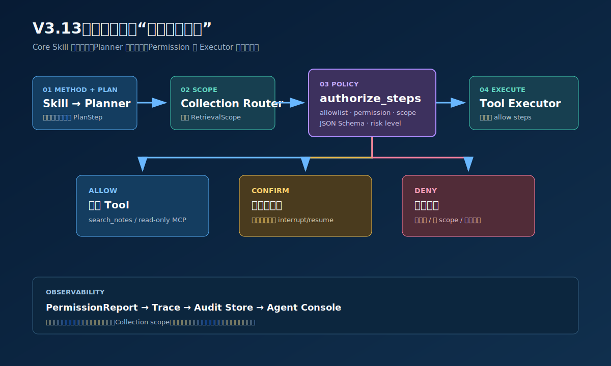
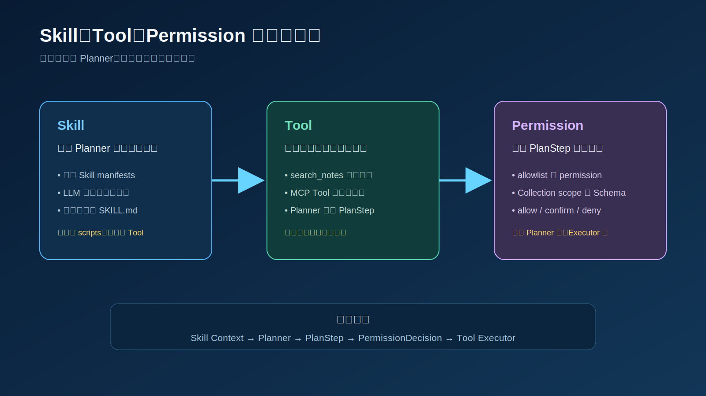
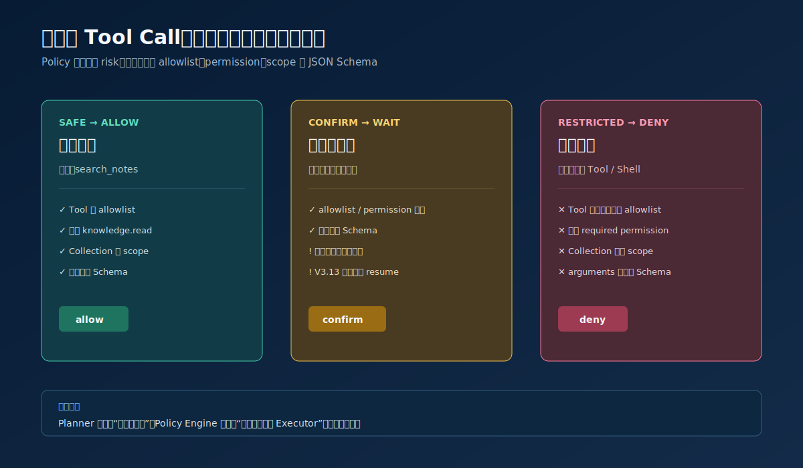
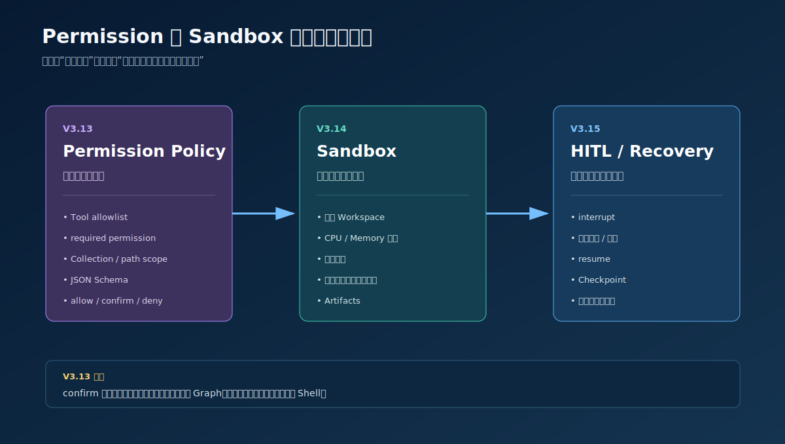

# V3.13 Permission Policy 学习指南

V3.13 在 V3.12.4 完整 Agent 上增加统一执行策略，并把 V3.11 已学习的 Skill Registry、LLM Skill Router 和按需加载能力提升到 Core。Skill 负责为 Planner 提供“采用什么方法”，Planner 和 Collection Router 负责“想做什么、去哪里检索”，Permission Policy 负责“系统是否允许真正执行”。

## 相比 V3.12.4 新增什么

V3.12.4 的核心链路是：

```text
Planner
→ resolve_retrieval_scope
→ execute_steps
```

V3.13 增加执行前权限节点：

```text
Planner
→ resolve_retrieval_scope
→ authorize_steps
→ execute_steps
```

同时把 Skill 流程并入同一个 Core AgentState：

```text
load_memory
→ compact_memory
→ discover_skills
→ skill_router
→ load_skill
→ planner
```

新增能力：

- `PermissionPrincipal`：描述主体、角色、权限、Tool allowlist 和 Collection scope。
- `ToolDefinition` 增加风险等级、required permission 和 scope 元数据。
- `StaticPermissionPolicy`：统一检查本地 Tool 与 MCP Tool。
- JSON Schema 参数校验。
- `allow`、`confirm`、`deny` 三类结构化决定。
- `PermissionReport` 进入 response、Context、Trace、SSE 和 Agent Console。
- 进程内 Permission Audit Store。
- 显式 `/mcp/call` 同样经过 Policy，不允许绕过。
- Core `SkillResolver`：支持显式多 Skill、Trigger/BM25 候选匹配和条件 LLM Router。
- `skill_selection`、`loaded_skill` 兼容摘要和完整 `loaded_skills` 列表进入 JSON/SSE 与 Agent Console。

## 版本边界

V3.13 完整保留：

- V3.12.4 Collection Router 和 `RetrievalScope`。
- 单库与多库 Hybrid Retrieval。
- V3.12.2 Reranker/fail-open 接口；本地可继续关闭真实 Reranker。
- V3.12.3 MCP Tool Catalog、持久 Session 和 Tool Observation。
- Memory、Context、Evidence、Retry、JSON/SSE 和共享 Agent Console。
- V3.11 Skill 方法选择；当前已提升到 `obsidian_rag/core/skills/`，不再使用外层 Agent 包装。

V3.13 暂时不做：

- 不执行真实文件写入或 Shell。
- 不提供 Sandbox。
- `confirm` 不会暂停并恢复 LangGraph，而是结构化阻止当前步骤。
- Audit Store 当前只保存在 API 进程内，重启后清空。
- 不实现多租户身份认证、OAuth 或生产数据库审计。
- 不执行 Skill `scripts/`，也不把 Skill 当成绕过 Tool Registry 的执行入口。

Roadmap 原始 Phase 10 包含人工审批暂停/恢复。为了保持渐进学习，本版本先完成 Policy Decision 和阻止语义；真正的 `interrupt/resume` 放到 V3.13.1 或 V3.15 Recovery & HITL。

## 端到端主流程



正常只读检索链路：

1. Memory 节点读取最近 Turns 和滚动摘要。
2. Skill Registry 只读取 manifests；显式 Skills 先确定并去重。
3. Matcher 使用 Trigger、内存 BM25 和词项覆盖率生成候选分数；高置信度直接选择，只有灰区或竞争候选才调用 LLM Router。
4. 按顺序加载全部已选 `SKILL.md`，显式 Skill 优先于隐式 Skill，并把方法正文注入 Planner Context。
5. Planner 生成 `search`、`tool`、`synthesize` 等步骤；此时 Permission 尚未介入。
6. Collection Router 在存在 search step 时生成全局 `RetrievalScope`。
7. `authorize_steps` 对每个 PlanStep 生成 `PermissionDecision`。
8. `execute_steps` 只执行 `allow` 步骤。
9. `confirm` 步骤标记为 `skipped`，`deny` 步骤标记为 `failed`。
10. Evidence、Context 和 Answer 可以观察权限结果，但不能绕过权限重新执行 Tool。

## Skill、Tool 与 Permission



```text
Skill：向 Planner 提供完成任务的方法说明
Tool：提供可以执行的具体动作
Permission：决定 Plan 中的动作是否允许执行
```

Skill Router 在 Planner 前运行，但不会提前过滤当前 Principal 无权使用的 Tool。这样系统可以明确区分“Planner 没有计划该动作”和“Planner 计划了动作，但 Policy 拒绝执行”。

Skill Router 采用级联策略，避免每个请求固定增加一次 LLM 延迟：

```text
explicit skill_names
→ stable dedupe
→ Trigger / BM25 / overlap Matcher
→ need_llm_skill_router
   ├─ no_skill：只保留显式 Skills
   ├─ direct：直接补充高置信度隐式 Skill
   └─ llm_router：只把 Top 候选交给 LLM 判断单选或组合
→ merge explicit + implicit
→ load SKILL.md
→ Planner
```

`augment` 是默认模式：保留显式 Skills，同时允许补充隐式 Skills。`exclusive` 用于严格调试，只加载显式 Skills。

## 三种 Policy Decision



### allow

以下条件全部满足时，`safe` Tool 可以自动执行：

```text
Tool 存在于 Registry
Tool 匹配 Principal.tool_allowlist
Principal 拥有 required_permission
Collection 没有越过 allowed_collections
arguments 通过 JSON Schema
risk_level = safe
```

默认允许的典型工具：

```text
search_notes       → knowledge.read
只读 MCP Tool      → tool.read
```

### confirm

`risk_level=confirm` 表示工具可能产生副作用。即使 allowlist、permission 和 Schema 全部通过，V3.13 也不会自动执行：

```text
decision = confirm
StepResult.status = skipped
executed = false
```

`local::simulate_workspace_write` 是无副作用教学 Tool，用来观察 confirm；它本身不会写磁盘。

### deny

以下任意情况会拒绝：

- 未知 Tool。
- Tool 不在 allowlist。
- 缺少 required permission。
- Collection 越过 Principal scope。
- arguments 不符合 JSON Schema。
- Tool 风险等级为 `restricted`。

## Permission 与 Sandbox



```text
Permission Policy：能不能执行
Sandbox：在哪里执行、能使用多少资源
HITL / Recovery：确认后如何继续执行
```

所以 V3.13 即使返回 `confirm`，也不会直接获得宿主机文件或 Shell 权限。

## 核心数据结构

### PermissionPrincipal

```json
{
  "subject_id": "learner",
  "roles": ["user"],
  "permissions": ["knowledge.read", "tool.read"],
  "tool_allowlist": ["search_notes", "demo::*"],
  "allowed_collections": ["*"]
}
```

- `subject_id`：可观察主体 ID，不是认证 Token。
- `roles`：静态角色；`admin` 在学习实现中可以跳过普通 allowlist/permission/scope 检查。
- `permissions`：精确权限或 `*`。
- `tool_allowlist`：支持 fnmatch，例如 `demo::*`。
- `allowed_collections`：知识库 scope；在 Router 选择完成后检查。

### PermissionDecision

每个 PlanStep 都产生一条决定：

```json
{
  "step_id": "s1",
  "kind": "search",
  "tool_name": "search_notes",
  "source": "local",
  "risk_level": "safe",
  "decision": "allow",
  "reason": "只读低风险工具满足 allowlist、permission、scope 和参数约束。",
  "required_permissions": ["knowledge.read"],
  "missing_permissions": [],
  "collections": ["recipes"],
  "denied_collections": [],
  "argument_names": [],
  "validation_errors": []
}
```

### PermissionReport

```text
principal
decisions[]
allow_count
confirm_count
deny_count
all_allowed
summary
```

它是 Policy 的最终事实快照，不是模型隐藏推理。

## 为什么需要前置节点和执行器兜底

只增加 `authorize_steps` 还不够。真正安全的 Harness 不能假设图永远按预期调用，因此执行器仍会读取对应 `PermissionDecision`：

```text
authorize_steps
→ 产生 PermissionReport

execute_steps / retry_search
→ 再检查当前 step 是否 allow
→ 非 allow 时不调用 ToolRegistry.run()
```

这样可以避免：

- `retry_search` 绕过权限重新检索。
- MCP Tool 直接进入 Executor。
- Planner 生成未知 Tool 后触发调用。

V3.13 的显式 `/mcp/call` 也先构造一个 Tool PlanStep，再交给同一个 Policy Engine。

## Swagger 测试

Swagger 地址：

```text
http://127.0.0.1:8022/docs
```

### allow：标准只读检索

`POST /agent/ask`

```json
{
  "question": "我想做香煎鸡胸肉，请给出做法并说明食品安全要求。",
  "conversation_id": "conv_v313_allow",
  "principal": {
    "subject_id": "swagger_standard",
    "roles": ["user"],
    "permissions": ["knowledge.read", "tool.read"],
    "tool_allowlist": ["search_notes", "demo::*"],
    "allowed_collections": ["*"]
  },
  "collection_router_enabled": true,
  "max_collections": 2,
  "skill_router_enabled": true,
  "skill_name": null,
  "skill_names": ["food-safety"],
  "skill_selection_mode": "augment",
  "mcp_enabled": true,
  "top_k": 5,
  "mode": "hybrid",
  "max_steps": 4,
  "max_retries": 1
}
```

预期：

```text
graph_path 包含 discover_skills、skill_router、load_skill、authorize_steps
食品安全问题通常会选择 food-safety Skill
search_notes decision = allow
selected_collections 可能是 recipes + food_safety
```

### 独立观察 Skill Router

`POST /skills/route`

```json
{
  "question": "生鸡肉要不要清洗？",
  "skill_router_enabled": true,
  "skill_name": null,
  "skill_names": ["food-safety"],
  "skill_selection_mode": "augment"
}
```

该接口只返回 `SkillSelection`，不会进入 Planner、Permission 或 Tool Executor。`GET /skills/runtime` 可以查看当前发现的 Skill manifests 和 Registry errors。

### deny：受限主体不能检索

`POST /agent/ask`

```json
{
  "question": "番茄炒鸡蛋怎么做？",
  "conversation_id": "conv_v313_deny",
  "principal": {
    "subject_id": "swagger_restricted",
    "roles": ["restricted"],
    "permissions": [],
    "tool_allowlist": [],
    "allowed_collections": []
  },
  "collection_router_enabled": true,
  "max_collections": 2,
  "top_k": 5,
  "mode": "hybrid",
  "max_retries": 0
}
```

预期：

```text
search_notes decision = deny
StepResult.status = failed
used_retrieval = false
不会调用 Qdrant 或 Keyword Index
```

### confirm：模拟写入请求

`POST /permissions/evaluate`

```json
{
  "principal": {
    "subject_id": "swagger_writer",
    "roles": ["user"],
    "permissions": ["tool.write"],
    "tool_allowlist": ["local::*"],
    "allowed_collections": ["*"]
  },
  "action": {
    "step_id": "write_demo",
    "kind": "tool",
    "tool_name": "local::simulate_workspace_write",
    "arguments": {
      "path": "notes/demo.md",
      "content": "hello"
    },
    "collections": []
  }
}
```

预期：

```text
decision = confirm
不会执行教学 Tool
```

### deny：Schema 校验失败

删除必填的 `content`：

```json
{
  "principal": {
    "subject_id": "swagger_writer",
    "roles": ["user"],
    "permissions": ["tool.write"],
    "tool_allowlist": ["local::*"],
    "allowed_collections": ["*"]
  },
  "action": {
    "kind": "tool",
    "tool_name": "local::simulate_workspace_write",
    "arguments": {"path": "notes/demo.md"},
    "collections": []
  }
}
```

预期 `validation_errors` 包含：

```text
'content' is a required property
```

### Audit

```text
GET /permissions/audit?limit=20
```

它返回 Agent Run、独立 Policy 调试和显式 MCP 调用产生的最近审计记录。

## 前端学习点

共享 Agent Console 根据：

```json
{
  "features": {
    "permission_policy": true
  }
}
```

显示：

- 权限预设：标准只读、仅知识库、受限主体。
- 独立“权限”页签。
- Principal、allow/confirm/deny 数量。
- 每个步骤的 risk、required permission、Collections 和校验错误。

旧后端没有该 feature 时不会显示权限控件，保持 `console.v1` 兼容。

## 文件职责

### Core Permission

| 文件 | 作用 |
| --- | --- |
| `obsidian_rag/core/permissions/schemas.py` | Principal、Decision、Report 和 Audit Pydantic 契约。 |
| `obsidian_rag/core/permissions/policy.py` | allowlist、permission、scope、Schema 和 risk 决策。 |
| `obsidian_rag/core/permissions/audit.py` | 线程安全的进程内审计 Store。 |
| `obsidian_rag/core/tools.py` | 公共 ToolDefinition 风险和权限元数据。 |
| `obsidian_rag/core/agent/service.py` | 可选 `authorize_steps` 节点和执行器兜底。 |
| `obsidian_rag/core/context.py` | 把 PermissionReport 送入 Answer Context。 |
| `obsidian_rag/core/skills/schemas.py` | Core Skill manifest、选择结果、内部文档和安全摘要。 |
| `obsidian_rag/core/skills/registry.py` | 发现 manifests，选中后懒加载 `SKILL.md`。 |
| `obsidian_rag/core/skills/matcher.py` | 使用内存 BM25、词项覆盖率和 Trigger 计算候选分数。 |
| `obsidian_rag/core/skills/policy.py` | `need_llm_skill_router()` 判断直接选择、不选或升级 LLM。 |
| `obsidian_rag/core/skills/router.py` | 仅在歧义分支调用 LLM，并允许返回多个隐式 Skills。 |
| `obsidian_rag/core/skills/resolver.py` | 显式选择、Matcher、Policy、LLM Router、合并去重的统一入口。 |

### V3.13 后端

| 文件 | 作用 |
| --- | --- |
| `obsidian_rag/v3_13/agent.py` | 继承 V3.12.4 的 Permission-aware Agent 入口。 |
| `obsidian_rag/v3_13/registry.py` | 复用 Local/MCP Registry，并注册 confirm 教学 Tool。 |
| `obsidian_rag/v3_13/dependencies.py` | 注入 Policy、Audit Store、Resolver、Registry、Runtime 和 Memory。 |
| `obsidian_rag/v3_13/schemas.py` | Swagger 输入输出、Runtime、Health、Audit 和显式 MCP 权限契约。 |
| `obsidian_rag/v3_13/service.py` | Agent、独立 Policy、Audit 和显式 MCP 调用编排。 |
| `obsidian_rag/v3_13/routes/agent.py` | JSON/SSE Agent 路由。 |
| `obsidian_rag/v3_13/routes/permissions.py` | Policy evaluate 和 audit 路由。 |
| `obsidian_rag/v3_13/routes/mcp.py` | 经过 Policy 的显式 MCP 路由。 |
| `obsidian_rag/v3_13/routes/health.py` | 健康摘要。 |
| `obsidian_rag/v3_13/routes/skills.py` | Skill Registry runtime 和独立 route 调试接口。 |
| `obsidian_rag/v3_13/app.py` | FastAPI app、lifespan 和共享 Console。 |

### 前端

| 文件 | 作用 |
| --- | --- |
| `frontend/agent_console/src/components/PermissionPanel.vue` | 展示权限报告和逐步骤决定。 |
| `frontend/agent_console/src/components/SkillPanel.vue` | 展示候选 Skill、Router 结果和加载摘要。 |
| `frontend/agent_console/src/components/SkillPicker.vue` | 输入 `/` 时筛选 Skill，并展示显式多选 chips。 |
| `frontend/agent_console/src/components/RunInspector.vue` | 组合权限页签。 |
| `frontend/agent_console/src/components/ChatComposer.vue` | 提供 Principal 权限预设。 |
| `frontend/agent_console/src/composables/use-agent-console.ts` | 把预设映射成请求 Principal。 |
| `frontend/agent_console/src/types/production.ts` | Permission 和 authorization 事件类型。 |

## 核心断点调试

正常 allow 主链路：

在原 Permission 主链前增加三个 Core Skill 断点：

| 顺序 | 文件与函数 | 观察变量 |
| --- | --- | --- |
| S1 | `obsidian_rag/core/agent/service.py:429` `_discover_skills_node()` | `skill_candidates`、Registry errors。 |
| S2 | `obsidian_rag/core/agent/service.py:448` `_skill_router_node()` | 请求中的 `skill_names`、`skill_selection_mode` 和最终 `selection`。 |
| S3 | `obsidian_rag/core/skills/resolver.py:36` `CoreSkillResolver.select()` | `explicit`、`remaining`、`matched`、`routing_decision`。 |
| S4 | `obsidian_rag/core/skills/matcher.py:13` `SkillMatcher.match()` | `bm25_score`、`overlap_score`、`matched_triggers`、融合 `score`。 |
| S5 | `obsidian_rag/core/skills/policy.py:17` `need_llm_skill_router()` | `top_score`、`score_margin`、`path`；只有 `llm_router` 才继续下一步。 |
| S6 | `obsidian_rag/core/skills/router.py:33` `LlmSkillRouter.route()` | `explicit_skill_names`、LLM 返回的 `skill_names`、`router_called`。 |
| S7 | `obsidian_rag/core/agent/service.py:487` `_load_skill_node()` | `loaded_skills`、`skill_context`、总 estimated tokens。 |
| S8 | `obsidian_rag/core/skills/registry.py:81` `build_skills_context()` | 显式 Skill 是否排在隐式 Skill 前，正文是否按序注入。 |

随后进入 `obsidian_rag/core/agent/service.py:593` `_planner_node()`，观察 Planner question 是否包含 `[Selected Skill 1]`、`[Selected Skill 2]`。代码变化后应优先按函数名重新定位断点。

| 顺序 | 文件与函数 | 观察变量 |
| --- | --- | --- |
| 1 | `obsidian_rag/v3_13/routes/agent.py:14` `ask()` | `request.principal`、Collection Router 参数。 |
| 2 | `obsidian_rag/v3_13/dependencies.py:32` `build_agent()` | `registry`、`planner_tools`、`permission_policy`。 |
| 3 | `obsidian_rag/v3_12_3/agent.py:42` `_planner_node()` | `state["plan"]` 和 MCP Tool Catalog。 |
| 4 | `obsidian_rag/core/agent/service.py:531` `_resolve_retrieval_scope_node()` | `selected_collections`。 |
| 5 | `obsidian_rag/core/agent/service.py:499` `_authorize_steps_node()` | `principal`、`report.decisions`。 |
| 6 | `obsidian_rag/core/permissions/policy.py:38` `authorize()` | `definitions`、逐步骤决定和计数。 |
| 7 | `obsidian_rag/core/permissions/policy.py:116` `_decide()` | allowlist、缺失权限、scope、Schema、risk。 |
| 8 | `obsidian_rag/v3_12_3/agent.py:78` `_execute_steps_node()` | `blocked`；非 allow 时不得进入工具调用。 |
| 9 | `obsidian_rag/v3_12_3/agent.py:124` `_execute_tool_step()` | 只有 allow Tool 才能到达。 |
| 10 | `obsidian_rag/core/agent/service.py:575` `_evidence_check_node()` | 权限阻止后证据状态。 |
| 11 | `obsidian_rag/core/agent/service.py:677` `_build_context_node()` | `permission_report` 是否进入 messages。 |
| 12 | `obsidian_rag/core/agent/service.py:711` `_synthesize_answer_node()` | Answer 是否正确解释未执行动作。 |
| 13 | `obsidian_rag/core/agent/service.py:747` `_save_memory_node()` | 最终 Turn 与 Tool 摘要写入。 |

confirm/deny 分支重点：

- `obsidian_rag/core/agent/service.py:1085` `_permission_blocked_step_result()`：观察 `status` 如何映射为 skipped/failed。
- `obsidian_rag/core/agent/service.py:601` `_retry_search_node()`：确认 denied search 不会通过 retry 绕过。
- `obsidian_rag/v3_13/service.py:55` `evaluate()`：不执行 Tool 的独立 Policy 调试。

代码变化后行号可能移动，应优先按函数名重新定位。

## CLI

allow Agent：

```bash
rtk .venv/bin/obsidian-rag agent-v3-13 ask "番茄炒鸡蛋怎么做？" --principal-profile standard
```

restricted deny：

```bash
rtk .venv/bin/obsidian-rag agent-v3-13 ask "番茄炒鸡蛋怎么做？" --principal-profile restricted
```

confirm 调试：

```bash
rtk .venv/bin/obsidian-rag agent-v3-13 policy local::simulate_workspace_write \
  --arguments '{"path":"notes/demo.md","content":"hello"}' \
  --principal-profile writer
```

Audit：

```bash
rtk .venv/bin/obsidian-rag agent-v3-13 audit --limit 20
```

## 本版本应掌握

1. Planner 的 Tool Selection 为什么不等于执行授权。
2. `allowlist`、permission、scope、Schema 和 risk 分别解决什么问题。
3. 为什么 Policy 应位于 Executor 前，同时 Executor 仍需要兜底。
4. `confirm` 与真正 Human Approval/Resume 的区别。
5. Permission Policy 与 Sandbox 的职责边界。
6. 为什么本地 Tool、MCP Tool 和显式 MCP 调用必须使用同一 Policy Engine。
