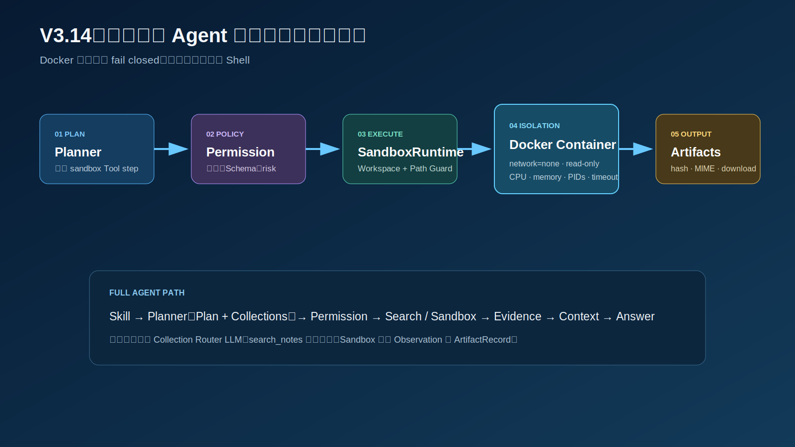
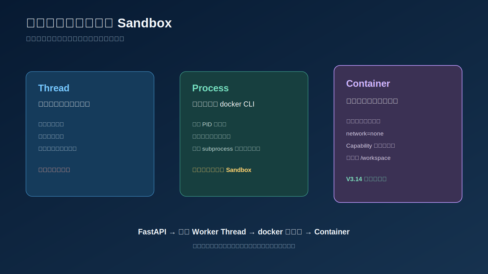
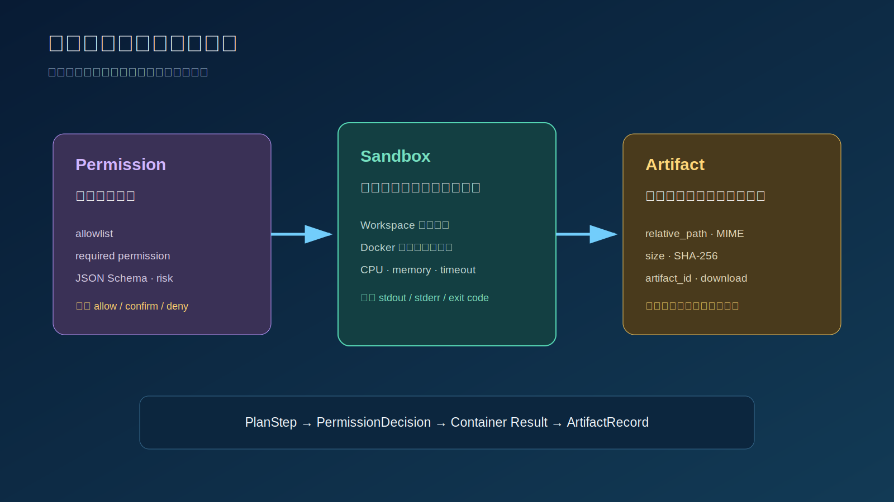

# V3.14 Sandbox Execution 学习指南

V3.14 在 V3.13 Permission Policy 后增加真实 Docker Sandbox。Agent 可以规划受控文件和命令工具，但不会直接获得宿主机 Shell、用户目录或环境变量。

## 相比 V3.13 新增什么

```text
V3.13：PlanStep → PermissionDecision → Tool Executor
V3.14：PlanStep → PermissionDecision → Sandbox Tool Executor → Docker → Artifact
```

新增能力：

- 每个 Agent Run 一个独立 Workspace。
- Docker 短生命周期 Container。
- `network=none`、只读根文件系统、`cap-drop=ALL` 和 `no-new-privileges`。
- CPU、内存、PID、超时和输出大小限制。
- 路径逃逸与 Symlink 防护。
- 受控 `read_file`、`write_file`、`list_files`、`run_command`。
- Artifact 的 MIME、size、SHA-256、列表和下载接口。
- Agent Console 的 Sandbox Profile、Tool Result 和 Artifact 页签。

### Core Tool Agent 收敛

V3.14 同步把 V3.12.3 已稳定复用的 Tool Catalog、`kind="tool"` 执行、
`ToolObservation`、Tool Evidence 和 Answer 汇总提升到
`obsidian_rag/core/agent/service.py`。`McpAgentService` 只保留兼容类名，
后续版本不再依赖它复制公共 Graph Node。

Sandbox 版本层只保留 Tool 可见性、`run_id` 执行上下文和 Artifact 回传。
`run_id` 由当前 `AgentState` 显式传给 Tool Executor，不保存在共享 Service
成员变量中，避免并发 Run 相互覆盖 Workspace。

## 版本边界

本版本做：

- 只在 Docker Container 中执行白名单命令。
- `run_command` 使用 `command + args[]`，不使用 `shell=True`。
- Docker 不可用时返回 `unavailable`，不降级成宿主机命令。
- 所有 Sandbox Tool 继续经过 V3.13 Policy。

本版本不做：

- 不开放 `bash -c`、`sh -c`、`sudo`、`ssh` 或任意宿主机命令。
- 不挂载项目目录、Home、`.env` 或 SSH 凭据。
- 不执行 Skill `scripts/`。
- 不实现长期 Container Pool。
- 不实现 `confirm → interrupt → resume`，该能力进入 V3.15。

## 端到端流程



```text
Skill Router
→ Planner
→ Planner 选择 search.arguments.collections
→ Permission Policy
→ search_notes / SandboxAgentService
→ ToolRegistry
→ SandboxRuntime
→ DockerSandboxBackend
→ ArtifactRegistry
→ Context / Answer / Memory
```

Planner 只能看到 Tool Definition，不能直接得到 Docker Client。Permission 先检查 `sandbox.read/write/execute` 和 `sandbox::*` allowlist；只有 `allow` 才会进入 Runtime。

V3.14 当前生产主线不再固定调用独立的 LLM Collection Router。Planner 在同一次规划调用中读取 Knowledge Base Catalog，并为每个 search step 输出 `arguments.collections`；`search_notes` 再确定性校验 Registry、数量上限和实际物理 Collection。V3.11.3、V3.12.4 仍保留旧 Router 作为教学对照。

共享 Agent Console 不再提供显式 Collection、Collection Router 开关或最大知识库数参数。右侧 Collection 面板只负责观察 Planner 为各 search step 请求了哪些知识库、Tool 实际执行了哪些物理 Collections，以及 Registry 校验错误。

## Thread、Process 与 Container



```text
Thread：避免阻塞或进行调度，不提供隔离
Process：启动 docker CLI，不自动构成安全边界
Container：限制文件系统、网络、Capability 和资源
```

V3.14 当前同步调用 Docker CLI。即使未来使用 `asyncio.to_thread()`，线程也只负责调度，Container 才是隔离边界。

## Sandbox Profile

默认 Profile：

```json
{
  "name": "locked-python",
  "image": "python:3.12-slim",
  "network_disabled": true,
  "read_only_root": true,
  "timeout_seconds": 15,
  "max_output_bytes": 131072,
  "max_file_bytes": 1048576,
  "memory_mb": 256,
  "cpus": 1.0,
  "pids_limit": 32,
  "allowed_commands": ["python", "python3"]
}
```

容器启动参数包括：

```text
--network none
--read-only
--tmpfs /tmp
--memory 256m
--cpus 1
--pids-limit 32
--security-opt no-new-privileges
--cap-drop ALL
```

## Path Guard

允许：

```text
hello.py
output/report.md
data/input.json
```

拒绝：

```text
/etc/passwd
../../.env
output/../secret
经过 Symlink 的路径
```

`resolve_workspace_path()` 会把目标解析到 Workspace 根目录，并验证目标仍位于根目录内。

## Sandbox Tools

| Tool | Permission | 用途 |
| --- | --- | --- |
| `sandbox::read_file` | `sandbox.read` | 读取 Workspace UTF-8 文本文件 |
| `sandbox::write_file` | `sandbox.write` | 写入文本并登记 Artifact |
| `sandbox::list_files` | `sandbox.read` | 列出当前 Artifacts |
| `sandbox::run_command` | `sandbox.execute` | 在 Docker 中执行白名单程序 |

Sandbox 工具在固定隔离 Profile 下显式声明为 `risk_level=safe`。这是“隔离后的有效风险”，不代表宿主机写入或任意 Shell 也安全。



## Swagger 测试

Swagger：

```text
http://127.0.0.1:8023/docs
```

### 1. 写入 Python 文件

`POST /sandbox/call`

```json
{
  "run_id": "sandbox_swagger_demo",
  "name": "sandbox::write_file",
  "arguments": {
    "path": "hello.py",
    "content": "from pathlib import Path\nPath('result.txt').write_text('sandbox ok', encoding='utf-8')\nprint('done')"
  },
  "principal": {
    "subject_id": "swagger_sandbox",
    "roles": ["user"],
    "permissions": ["sandbox.read", "sandbox.write", "sandbox.execute"],
    "tool_allowlist": ["sandbox::*"],
    "allowed_collections": []
  }
}
```

### 2. 在 Docker 中执行

```json
{
  "run_id": "sandbox_swagger_demo",
  "name": "sandbox::run_command",
  "arguments": {
    "command": "python",
    "args": ["hello.py"]
  },
  "principal": {
    "subject_id": "swagger_sandbox",
    "roles": ["user"],
    "permissions": ["sandbox.read", "sandbox.write", "sandbox.execute"],
    "tool_allowlist": ["sandbox::*"],
    "allowed_collections": []
  }
}
```

预期：

```text
executed = true
status = success
stdout = done
artifacts 包含 hello.py 和 result.txt
```

### 3. Agent 自动选择 Sandbox Tool

`POST /agent/ask`

```json
{
  "question": "请在隔离工作区创建 result.txt，内容为 Sandbox 学习完成。",
  "conversation_id": "conv_v314_artifact",
  "sandbox_enabled": true,
  "mcp_enabled": true,
  "skill_router_enabled": true,
  "principal": {
    "subject_id": "swagger_sandbox",
    "roles": ["user"],
    "permissions": ["knowledge.read", "tool.read", "sandbox.read", "sandbox.write", "sandbox.execute"],
    "tool_allowlist": ["search_notes", "demo::*", "sandbox::*"],
    "allowed_collections": ["*"]
  },
  "top_k": 5,
  "mode": "hybrid",
  "max_steps": 4,
  "max_retries": 0
}
```

## API

```text
POST /agent/ask
POST /agent/ask/stream
GET  /agent/runtime/config
GET  /sandbox/runtime
POST /sandbox/call
GET  /sandbox/artifacts/{run_id}
GET  /sandbox/artifacts/{run_id}/{artifact_id}
```

## 文件职责

### Core Sandbox

| 文件 | 作用 |
| --- | --- |
| `core/sandbox/schemas.py` | Profile、Workspace、ExecutionResult 和 Artifact 契约 |
| `core/sandbox/path_guard.py` | 拒绝绝对路径、目录逃逸和 Symlink |
| `core/sandbox/workspace.py` | 按 run_id 创建独立 Workspace |
| `core/sandbox/docker.py` | Docker 隔离、资源限制、超时和输出截断 |
| `core/sandbox/artifacts.py` | Artifact 扫描、SHA-256 和安全路径解析 |
| `core/sandbox/runtime.py` | 文件、命令和 Artifact 的统一编排 |

### Core Collection Selection

| 文件 | 作用 |
| --- | --- |
| `core/collections/policy.py` | 将 Planner 选择确定性规范为 Registry 中的物理 Collections |
| `core/planner.py` | 把 Knowledge Base Catalog 提供给 Planner，并要求 search step 输出 `arguments.collections` |
| `core/tools.py` | `search_notes` 二次校验 Collection 并执行单库或多库检索 |
| `core/permissions/policy.py` | 按每个 search step 的 Collections 执行 ACL 校验 |

### V3.14

| 文件 | 作用 |
| --- | --- |
| `v3_14/registry.py` | 注册四个 Sandbox Tool 及权限元数据 |
| `v3_14/agent.py` | 注入 run_id、过滤 Catalog、回传 Artifacts |
| `v3_14/dependencies.py` | 组装 Docker Backend、Runtime、Policy 和 Agent |
| `v3_14/service.py` | Agent 与显式 Sandbox 调试服务 |
| `v3_14/routes/sandbox.py` | Runtime、call、Artifact 列表和下载 |
| `v3_14/app.py` | FastAPI app 和共享 Console |

## 核心断点

代码变化后优先按函数名重新定位。

| 顺序 | 文件与位置 | 函数 | 观察变量 |
| --- | --- | --- | --- |
| 1 | `v3_14/dependencies.py:32` | `get_sandbox_runtime()` | `profile`、Workspace root、Backend |
| 2 | `v3_14/dependencies.py:53` | `build_agent()` | Collection Policy、Registry、Planner Catalog、Sandbox Runtime |
| 3 | `core/agent/service.py:693` | `_execute_steps_node()` | search/tool 分支、当前 `run_id` |
| 4 | `core/agent/service.py:737` | `_execute_tool_step()` | Registry、ToolResult、ToolObservation |
| 5 | `v3_14/agent.py:29` | `_execute_tool_step()` | Sandbox Tool 判断、内部 `_run_id` 注入 |
| 6 | `core/permissions/policy.py:119` | `_decide()` | sandbox permission、allowlist、Schema、risk |
| 7 | `v3_14/registry.py:28` | `write_file()` | `path`、`content`、`_run_id` |
| 8 | `core/sandbox/runtime.py:27` | `write_file()` | Path Guard、文件大小、Artifacts |
| 9 | `v3_14/registry.py:34` | `run_command()` | `command`、`args`、ToolResult |
| 10 | `core/sandbox/runtime.py:62` | `run_command()` | Workspace、ExecutionRequest |
| 11 | `core/sandbox/docker.py:49` | `execute()` | Docker argv、limits、exit code、timeout |
| 12 | `v3_14/service.py:54` | `sandbox_call()` | PermissionReport、executed、ToolResult |
| 13 | `v3_14/routes/sandbox.py:23` | `artifacts()` | run_id、Artifact 列表 |
| 14 | `v3_14/routes/sandbox.py:28` | `download()` | artifact_id、安全下载路径 |

Collection 选择主链建议增加这些断点：

| 顺序 | 文件与函数 | 观察变量 |
| --- | --- | --- |
| C1 | `core/planner.py:218` `_build_planner_messages()` | `knowledge_bases`、`explicit_collection`、`max_collections` |
| C2 | `core/agent/service.py:661` `_prepare_search_collections()` | `step.arguments`、`planned_collections`、`scope` |
| C3 | `core/collections/policy.py:25` `SearchCollectionPolicy.resolve()` | `requested`、`unknown`、`selected_collections` |
| C4 | `core/permissions/policy.py:79` `_authorize_step()` | 当前 search step 的 `collections`、`denied_collections` |
| C5 | `core/tools.py:94` `search_notes()` | `requested_collections`、`retrieval_scope`、`collection_errors` |

## CLI

```bash
rtk .venv/bin/obsidian-rag agent-v3-14 sandbox write_file \
  --run-id sandbox_cli_demo \
  --arguments '{"path":"hello.py","content":"print(123)"}'

rtk .venv/bin/obsidian-rag agent-v3-14 sandbox run_command \
  --run-id sandbox_cli_demo \
  --arguments '{"command":"python","args":["hello.py"]}'
```

## 本版本应掌握

1. Thread、Process 和 Container 为什么不是同一层隔离。
2. 为什么 `subprocess` 运行在宿主机上不等于 Sandbox。
3. Path Guard、资源限制和网络关闭分别防什么风险。
4. 为什么 Planner、Permission、Sandbox Executor 必须分层。
5. Artifact 为什么需要 ID、hash、size 和安全下载，而不能只返回宿主机路径。
6. 为什么 Docker 不可用时必须 fail closed，而不是退化到宿主机 Shell。
