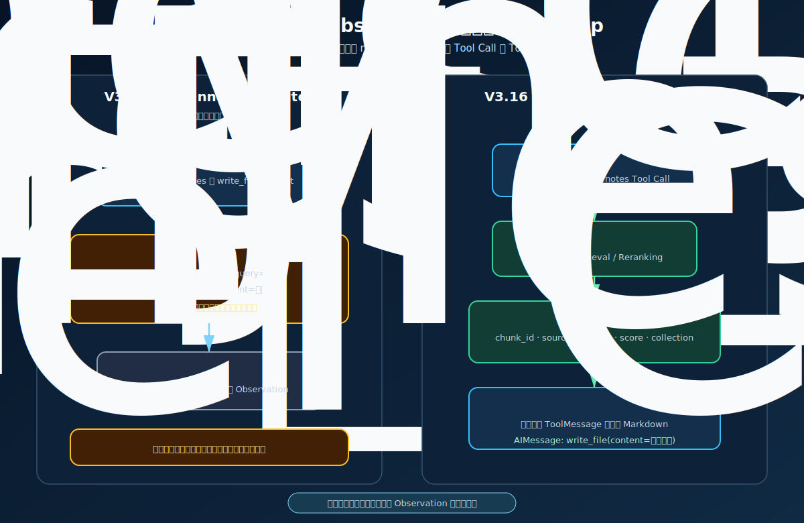
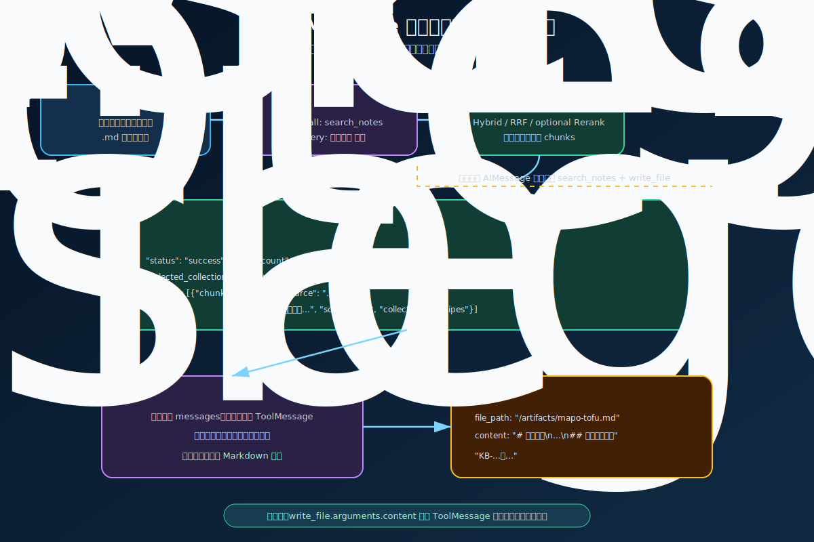
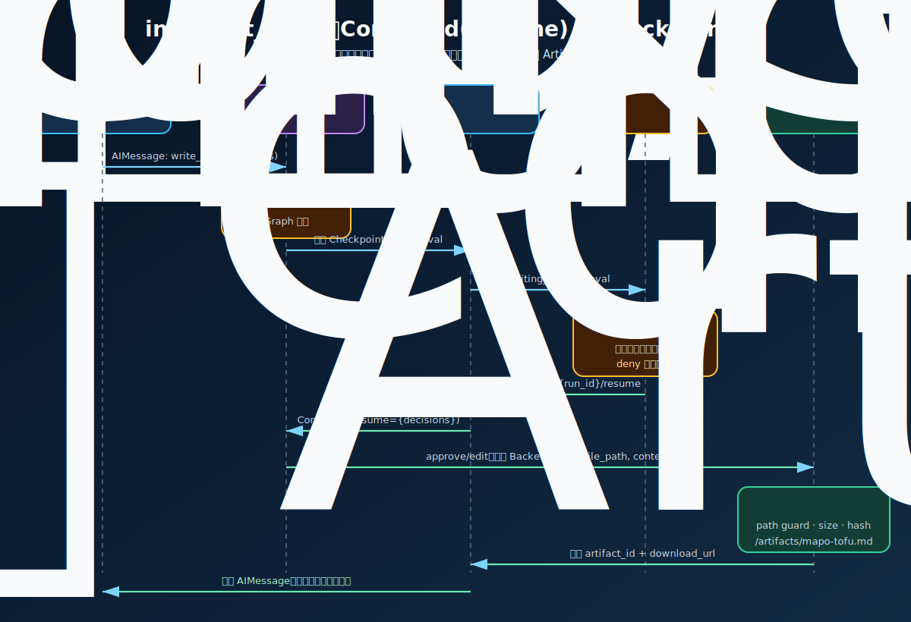

# V3.16 DeepAgents Tool Loop & Artifact 学习指南

状态：已完成  
后端目录：[`obsidian_rag/v3_16/`](../obsidian_rag/v3_16/)  
共享前端：[`frontend/agent_console/`](../frontend/agent_console/)  
默认 API：`http://127.0.0.1:8025`  
Swagger：`http://127.0.0.1:8025/docs`

> 按项目约定，代码完成后不自动启动服务，也不默认执行 `pytest`。请使用 `launch.json` 中的 V3.16 配置自行启动和断点调试。

## 1. 这一版主要学习什么

V3.16 是从自研 Agent Core 迁移到官方 DeepAgents 的桥接版本。它只聚焦一个关键能力：

DeepAgents 框架本身的 `HarnessProfile`、Middleware、Backend、State、Checkpointer、Store 和 Sub-agent 等基础概念，统一整理在 [DeepAgents 核心概念学习指南](deepagents-core-concepts-guide.md)。本文重点解释 V3.16 如何落地这些概念。

```text
后一个 Tool Call 的 arguments
必须在前一个 Tool 的真实 Observation 到达后再生成
```

核心验收问题：

```text
麻婆豆腐的做法总结成 .md 文档发给我
```

期望链路：

```text
HumanMessage
  -> Model Call #1
  -> search_notes Tool Call
  -> Hybrid Retrieval / Reranking
  -> ToolMessage（chunk_id、source、content、score、collection）
  -> Model Call #2（读取真实 ToolMessage）
  -> write_file Tool Call（此时才生成 Markdown content）
  -> interrupt_on / waiting_for_approval
  -> allow、edit 或 deny
  -> Command(resume=...)
  -> Backend.write
  -> Artifact 登记与下载
  -> Model Call #3 最终回复
```

V3.16 不再把一次性 `Plan` 当作执行真相。真正的执行顺序由 `messages` 中已经发生的 `AIMessage.tool_calls` 和 `ToolMessage` 决定。

### 1.1 完整执行时序


这条链路实际上由两段 HTTP 请求组成，但使用同一个 `run_id/thread_id` 和同一份 LangGraph Checkpoint：

1. 首次 `/agent/ask` 或 `/agent/ask/stream` 将 `HumanMessage` 交给 DeepAgents Graph，模型依次生成 `search_notes` 和 `write_file` Tool Call。
2. `search_notes` 的真实结果先作为 `ToolMessage` 写回 `messages`，第二次 Model Call 才据此生成 Markdown 正文。
3. `write_file` 命中 `interrupt_on` 后，Graph 在工具执行前暂停；首次请求以 `waiting_for_approval` 结束，此时还没有 Artifact。
4. 前端调用 `/approvals/{run_id}/resume`，服务使用 `Command(resume=...)` 从 Checkpoint 的暂停位置继续，而不是重新检索或重新执行整条链路。
5. `allow/edit` 执行 Backend 写入并登记 Artifact；`deny` 只生成拒绝 `ToolMessage`，不会进入 Sandbox。
6. 写入结果回到 `messages` 后触发最后一次 Model Call，Runtime 再返回最终答案、Artifact 元数据和下载地址。

因此，`create_deep_agent()` 自动编排的是通用的 `model -> tools -> model` 循环；本项目仍负责检索 Tool、审批配置、Checkpoint、Sandbox Backend、Artifact Registry、API/SSE 和响应投影。



## 2. V3.15 与 V3.16 的核心差异

| 对比项 | V3.15 自研链路 | V3.16 DeepAgents |
| --- | --- | --- |
| 主要抽象 | `PlanStep -> execute_steps` | `AIMessage -> ToolMessage -> next AIMessage` |
| 后续参数生成 | Planner 一次性预制 | 每轮模型依据当前 messages 动态生成 |
| Observation 传递 | 自研 `StepResult` / `ContextBundle` | 标准 LangChain `ToolMessage` |
| Graph 建造 | 手工 `add_node/add_edge` | `create_deep_agent` 组装 Middleware Harness |
| HITL | 自研 `approval_gate` 节点 | 官方 `HumanInTheLoopMiddleware` 和 `interrupt_on` |
| 文件能力 | Core Tool Registry 调 Sandbox | DeepAgents Filesystem Tool 调 Backend Adapter |
| 计划展示 | Planner JSON 是执行输入 | Console 中的 `plan` 只是 Tool Calls 兼容投影 |

V3.15 的问题不是不能按顺序执行，而是 `write_file.arguments.content` 在检索前就可能已经生成。`depends_on` 只描述顺序，没有表达“等 Observation 到达后重新生成参数”。

V3.16 的关键不是固定四个 `PlanStep`，而是下面的因果关系必须成立：

```text
search_notes ToolMessage 出现
  早于
包含 Markdown 正文的 write_file Tool Call
```

## 3. DeepAgents 和 LangGraph 是否共存

是。DeepAgents 没有替代 LangGraph，而是构建在 LangGraph 和 LangChain Agent Middleware 之上。

```text
DeepAgents
  提供：默认 Harness、Filesystem Middleware、Summarization、Sub-agent、HITL 装配
      ↓
LangChain create_agent / Middleware
  提供：Model Node、Tool Node、Middleware hooks、标准 messages
      ↓
LangGraph CompiledStateGraph
  提供：Graph 执行、Checkpoint、interrupt/resume、stream、状态恢复
```

本版调用 `create_deep_agent(...)` 后拿到的仍然是 `CompiledStateGraph`。因此：

- `graph.stream(...)` 仍由 LangGraph 驱动。
- `PostgresSaver` 仍保存 Checkpoint。
- `interrupt()` 与 `Command(resume=...)` 仍是 LangGraph 控制流。
- DeepAgents 主要减少 Harness 组装代码，不会消除业务 Tool、Backend、权限、存储和 API Adapter。

### 3.1 V3.16 与旧版本、Core 的依赖关系


V3.16 不是把前面所有版本复制一遍，也不是继承 V3.15 的 AgentService。它重新建立了 `DeepAgentService`，然后通过依赖注入和 Adapter 复用已经稳定的底层能力：

| 来源 | V3.16 实际复用内容 | 没有复用的部分 |
| --- | --- | --- |
| `V1` | Dense、Keyword、RRF Hybrid Retrieval；由 V3.12.4 Retrieval 间接装配 | V1 FastAPI 路由和 Answer 流程 |
| `V3.10/V3.10.2` | Run 数据结构、生命周期辅助函数、Metrics、SSE `RunEventBus` | V3.10 原 AgentService |
| `V3.12.4` | `RagConfig`、Knowledge Base Registry、多 Collection Retrieval、Reranking Service | `RoutedMcpAgentService`、MCP Tool Loop、独立 Collection Router Graph |
| `V3.14` | `SandboxRuntime`、Run Workspace、Artifact 和路径保护 | `run_command`、旧 Sandbox Planner/Executor 链路 |
| `V3.15` | PostgreSQL Pool、`PostgresSaver`、Approval Schema、HITL Store 基类 | 自研 `approval_gate` 节点和旧 Graph 编排 |
| `core` | Tool Registry、Collection 契约、Sandbox、公共 Response/Timing/Permission 投影 Schema | 整套自研 Core Agent Graph |

关键边界是：

```text
DeepAgents / LangGraph
  负责新的 model <-> tools 编排

V3.16 Adapter
  负责把 search_notes、Sandbox、Checkpoint、Run 和 Console 接入新编排

旧版本与 core
  继续提供已经验证过的业务基础设施
```

当前没有自动继承 V3.8 Memory、V3.11 Skills、V3.12 MCP、V3.13 Policy Graph、旧 Planner 或 Sub-agent。`PermissionReport` 等类型目前主要用于共享 Console 的兼容投影，不代表 V3.13 Policy 节点仍在 V3.16 Graph 中执行。

## 4. V3.16 如何限制 DeepAgents 默认能力

官方 `create_deep_agent` 默认可能提供 `write_todos`、Filesystem、`execute` 和 `task` 等能力。V3.16 暂不学习 Shell、Todo 和 Sub-agent，因此在 [`dependencies.py`](../obsidian_rag/v3_16/dependencies.py) 中使用官方 `HarnessProfile`：

```text
excluded_tools = execute、write_todos
general_purpose_subagent.enabled = false
subagents = []
```

当前模型可见的重点工具为：

```text
search_notes
ls / read_file / write_file / edit_file / glob / grep
```

其中 `write_file`、`edit_file` 配置 `interrupt_on`；`search_notes` 为只读 Tool。

## 5. ToolMessage 如何驱动文件正文



### 5.1 第一次模型调用

模型先产生标准 Tool Call：

```json
{
  "name": "search_notes",
  "args": {
    "query": "麻婆豆腐 做法",
    "collection": "recipes",
    "top_k": 5,
    "mode": "hybrid"
  },
  "id": "call_search_1"
}
```

### 5.2 Search Tool Adapter

[`SearchNotesToolAdapter`](../obsidian_rag/v3_16/tools/search_notes.py) 只向模型暴露业务参数，不暴露 Retrieval Service、Qdrant 连接或 Registry 对象。

Tool 内部仍复用已有能力：

```text
ToolRegistry.search_notes
  -> RetrievalService / RerankingRetrievalService
  -> Dense + Keyword + RRF
  -> 可选跨 Collection 融合和 Reranking
```

`filters` 保持为 `SearchFilters` Pydantic 模型传入底层，避免底层按 `filters.path` 访问时收到普通 `dict`。

### 5.3 ToolMessage 数据

`search_notes` 返回 JSON 字符串，LangChain 将其包装为标准 `ToolMessage`。每个结果显式保留：

```json
{
  "chunk_id": "KB-001",
  "source": "recipes/mapo-tofu.md",
  "content": "麻婆豆腐的原料和步骤……",
  "text": "麻婆豆腐的原料和步骤……",
  "score": 0.03278688524590164,
  "collection": "recipes",
  "metadata": {}
}
```

`content` 是 V3.16 原生 ToolMessage 的明确字段；`text` 保留是为了兼容已有 `SearchHit` 和 Console。

### 5.4 第二次模型调用

第二次模型调用的 messages 大致为：

```text
SystemMessage
HumanMessage(原始问题)
AIMessage(tool_call=search_notes)
ToolMessage(name=search_notes, tool_call_id=call_search_1, content=检索 JSON)
```

模型此时才能根据真实 chunks 生成：

```json
{
  "name": "write_file",
  "args": {
    "file_path": "/artifacts/mapo-tofu.md",
    "content": "# 麻婆豆腐\n...\n## 使用到的来源\nKB-001：..."
  }
}
```

这就是 Observation-driven write。不是用最终答案反推来源，也不是把第一轮 Planner 的预制正文传给 Executor。

## 6. HITL、Checkpoint、Workspace 与 Artifact



### 6.1 为什么审批前没有文件

`write_file` 和 `edit_file` 被配置到 `interrupt_on`。模型产生 Tool Call 后，`HumanInTheLoopMiddleware.after_model()` 先调用 `interrupt()`，Graph 保存 Checkpoint 并停止在 Tool 真正执行之前。

首次 `/agent/ask` 或 `/agent/ask/stream` 的终态是：

```text
run.status = waiting_for_approval
deep_agent_response.status = waiting_for_approval
approval.status = pending
write_file.status = waiting_for_approval
artifacts = []
```

### 6.2 三种审批决定

| 决定 | DeepAgents 决定类型 | 行为 |
| --- | --- | --- |
| `allow` | `approve` | 原参数执行写入 |
| `edit` | `edit` | 用审批人替换后的 `file_path/content` 执行 |
| `deny` | `reject` | 产生拒绝 ToolMessage，不写文件，模型说明未生成 |

恢复不是重新发送原问题，而是：

```python
Command(resume={"decisions": [...]})
```

LangGraph 使用相同 `thread_id=run_id` 从 Checkpoint 继续。

### 6.3 Sandbox 的准确边界

V3.16 的文件 Backend 复用 Core Sandbox 的：

- 每 Run 独立 Workspace。
- 路径防逃逸和 Symlink 防护。
- 单文件大小限制。
- Artifact 扫描、MIME、SHA-256 和下载登记。
- 只允许写入 `/artifacts/` 虚拟目录。

本版没有开放 `execute`，也不会为 `write_file` 启动 Shell 或 Docker 命令。文件写入直接进入受控 Workspace；Docker Runtime 状态只是复用 Sandbox 配置的一部分。

### 6.4 持久状态分层

| 数据 | 存储位置 | 用途 |
| --- | --- | --- |
| LangGraph Checkpoint | `PostgresSaver` 自有表 | interrupt/resume 的 Graph 状态 |
| Run / Approval | 继承 V3.15 的 `hitl_runs`、`hitl_approvals` | API 生命周期和审批审计 |
| V3.16 Request / Response | `deep_agent_runs` | 恢复请求参数和完整响应快照 |
| Artifact 索引 | `deep_agent_artifacts` | `artifact_id -> run_id -> record` |
| 实际文件 | Core Sandbox Workspace | Markdown 文件字节内容 |

Checkpoint 不是 Conversation Memory。本版即使传入相同 `conversation_id`，下一次 `/agent/ask` 仍会创建新的 `run_id/thread_id`，不会自动带入前一轮 messages。持久多轮会话进入 V3.17。

## 7. JSON 响应中的两个观察面

`DeepAgentAskResponse` 同时返回：

### `deep_agent_response`

这是 V3.16 原生观察面，重点看：

- `messages`：Checkpoint 中的安全消息投影。
- `tool_calls`：模型每轮请求的 Tool Call。
- `tool_messages`：工具 Observation。
- `execution_events`：公开节点、模型、工具和审批事实。
- `model_call_count`：完整 AIMessage 数量。
- `selected_collections` / `search_results`。
- `artifacts` 和 `download_url`。

### `agent_response`

这是共享 Console 的兼容投影：

- 将 Tool Calls 映射为 `plan.steps` 和 `step_results`。
- 将 search chunks 映射为 `context_bundle.included_chunks`。
- 将文件工具结果映射为 `tool_observations`。
- Memory 字段明确返回 `saved=false`，避免误以为 V3.16 已接入多轮记忆。

注意：这里的 `plan` 是事后投影，不是 DeepAgents 执行输入。

## 8. Swagger 调试

### 8.1 核心链路：菜谱生成 Markdown

`POST /agent/ask`

```json
{
  "question": "麻婆豆腐的做法总结成 .md 文档发给我",
  "conversation_id": "conv_v316_mapo",
  "collection": "recipes",
  "top_k": 5,
  "mode": "hybrid",
  "filters": null,
  "max_iterations": 12
}
```

首次响应应为 `waiting_for_approval`。记录：

```text
run.run_id
approval.request.steps[0].step_id
approval.request.steps[0].arguments.content
```

重点验证 `content` 是否包含 `deep_agent_response.tool_messages` 中的知识库事实和来源。

### 8.2 允许写入

`POST /approvals/{run_id}/resume`

```json
{
  "action": "allow",
  "comment": "允许生成 Markdown 文件",
  "step_arguments": {}
}
```

预期：

```text
run.status = succeeded
deep_agent_response.artifacts.length = 1
agent_response.sandbox_artifacts.length = 1
```

### 8.3 编辑后写入

先从审批响应读取真实 `step_id`，再提交：

```json
{
  "action": "edit",
  "comment": "修改文件名和正文后执行",
  "step_arguments": {
    "替换成真实_step_id": {
      "file_path": "/artifacts/mapo-tofu-reviewed.md",
      "content": "# 审核后的麻婆豆腐做法\n..."
    }
  }
}
```

### 8.4 拒绝写入

```json
{
  "action": "deny",
  "comment": "本次不生成文件",
  "step_arguments": {}
}
```

预期：Graph 恢复并产生拒绝 ToolMessage，Artifact 仍为空，最终回答明确文件未生成。

### 8.5 只检索，不生成文件

```json
{
  "question": "生鸡肉需要清洗吗？",
  "conversation_id": "conv_v316_food",
  "collection": "food_safety",
  "top_k": 5,
  "mode": "hybrid",
  "filters": null,
  "max_iterations": 8
}
```

预期链路：`Model #1 -> search_notes -> ToolMessage -> Model #2 answer`，不触发审批。

### 8.6 Direct answer

```json
{
  "question": "用一句话说明你能做什么",
  "conversation_id": "conv_v316_direct",
  "collection": null,
  "top_k": 5,
  "mode": "hybrid",
  "filters": null,
  "max_iterations": 6
}
```

模型可以不调用 Tool，直接返回答案。此时兼容投影会产生一个 `direct_answer` synthesize step。

## 9. SSE 事件

接口：

```text
POST /agent/ask/stream
POST /approvals/{run_id}/resume/stream
```

Runtime 后台线程执行 `graph.stream(...)`，`_ExecutionCollector` 将 DeepAgents/LangGraph 事件映射为现有 `console.v1` 事件：

| 事件 | 含义 |
| --- | --- |
| `run_queued` / `run_started` | Run 生命周期开始 |
| `progress` | planning、retrieval、answer、approval 阶段状态 |
| `tool_started` / `tool_finished` | Tool 执行状态和结果数量 |
| `node_finished` | DeepAgents Graph 节点耗时 |
| `answer_delta` | 当前实现按可见完整 AIMessage 发出安全答案增量 |
| `run_waiting_for_approval` | Graph 已暂停，前端弹出审批面板 |
| `run_succeeded` / `run_failed` | SSE 生成器终止条件 |

前端不会展示模型隐藏 chain-of-thought。`execution_events` 只记录公开执行事实。

## 10. CLI 与 launch.json

CLI：

```bash
.venv/bin/obsidian-rag agent-v3-16 ask "麻婆豆腐的做法总结成 .md 文档发给我" --collection recipes
.venv/bin/obsidian-rag agent-v3-16 resume <run_id> --action allow
.venv/bin/obsidian-rag agent-v3-16 inspect <run_id>
```

VS Code/Cursor 已提供：

```text
V3.16 API server: DeepAgents Tool Loop
V3.16 CLI: minimal Deep Agent
V3.16 CLI: search_notes Tool Loop
V3.16 CLI: recipe Markdown + approval
V3.16 CLI: resume approved artifact
Agent Console UI: console.v1 (V3.16 DeepAgents)
```

## 11. 核心断点调试

以下行号按当前 V3.16 代码和已安装依赖核对。代码变化或依赖升级后，优先按函数名重新定位。

### Stage 1：DeepAgents Anatomy

| 顺序 | 断点 | 当前行 | 观察变量 |
| --- | --- | ---: | --- |
| 1 | `configure_harness_profile()` | `obsidian_rag/v3_16/dependencies.py:30` | `excluded_tools`、`general_purpose_subagent` |
| 2 | `build_model()` | `obsidian_rag/v3_16/dependencies.py:53` | `config.chat_model`、`config.base_url`、`parallel_tool_calls` |
| 3 | `build_agent()` | `obsidian_rag/v3_16/dependencies.py:67` | `registry`、`knowledge_bases`、`checkpointer` |
| 4 | `DeepAgentService._build_graph()` | `obsidian_rag/v3_16/agent.py:153` | `search_tool`、`backend`、`interrupt_on`、返回类型 |
| 5 | 官方 `create_deep_agent()` | `.venv/lib/python3.14/site-packages/deepagents/graph.py:260` | `_profile`、Middleware stack、`tools` |
| 6 | 官方 `create_agent()` | `.venv/lib/python3.14/site-packages/langchain/agents/factory.py:808` | model node、tools node、conditional routing |

### Stage 2：Read-only Search Tool Loop

| 顺序 | 断点 | 当前行 | 观察变量 |
| --- | --- | ---: | --- |
| 1 | `DeepAgentService.begin()` | `obsidian_rag/v3_16/agent.py:90` | 初始 `messages`、`run_id` |
| 2 | `DeepAgentService._stream_graph()` | `obsidian_rag/v3_16/agent.py:188` | `stream_mode`、每个 `event.type/data` |
| 3 | `SearchNotesToolAdapter._invoke()` | `obsidian_rag/v3_16/tools/search_notes.py:66` | `query`、`collection(s)`、`filters` |
| 4 | `ToolRegistry.run("search_notes")` | `obsidian_rag/v3_16/tools/search_notes.py:77` | `ToolResult.status/results/metadata` |
| 5 | 官方 `ToolNode._run_one()` | `.venv/lib/python3.14/site-packages/langgraph/prebuilt/tool_node.py:1014` | `call`、返回的 `ToolMessage` |
| 6 | `_native_response()` | `obsidian_rag/v3_16/agent.py:534` | `messages`、`tool_message_by_call`、`search_results` |

### Stage 3：Observation-driven Write

| 顺序 | 断点 | 当前行 | 观察变量 |
| --- | --- | ---: | --- |
| 1 | `_ExecutionCollector._consume_update()` | `obsidian_rag/v3_16/agent.py:410` | 第一次 `AIMessage.tool_calls` |
| 2 | 同一函数 ToolMessage 分支 | `obsidian_rag/v3_16/agent.py:453` | `message.name/content/tool_call_id` |
| 3 | 第二次 model update | `obsidian_rag/v3_16/agent.py:410` | `write_file.args.content` 是否引用检索事实 |
| 4 | DeepAgents 创建 `write_file` Tool | `.venv/lib/python3.14/site-packages/deepagents/middleware/filesystem.py:1214` | Backend 绑定、Tool schema |
| 5 | `_compatibility_response()` | `obsidian_rag/v3_16/agent.py:638` | 事后 `plan_steps`、`step_results`、`observations` |

### Stage 4：HITL、Resume 与 Artifact

| 顺序 | 断点 | 当前行 | 观察变量 |
| --- | --- | ---: | --- |
| 1 | `HumanInTheLoopMiddleware.after_model()` | `.venv/lib/python3.14/site-packages/langchain/agents/middleware/human_in_the_loop.py:384` | `last_ai_msg.tool_calls`、`action_requests` |
| 2 | LangGraph `interrupt()` | `.venv/lib/python3.14/site-packages/langgraph/types.py:811` | 首次调用抛出可恢复控制流，恢复后返回 decisions |
| 3 | `DeepAgentService._approval_from_snapshot()` | `obsidian_rag/v3_16/agent.py:225` | `snapshot.interrupts`、`ApprovalStep.arguments` |
| 4 | `DeepAgentService.resume()` | `obsidian_rag/v3_16/agent.py:102` | `snapshot.interrupts`、旧 `deep_agent_response` |
| 5 | `_resume_decisions()` | `obsidian_rag/v3_16/agent.py:296` | `approve/edit/reject` 映射 |
| 6 | `Command(resume=...)` | `obsidian_rag/v3_16/agent.py:138` | 恢复 payload 和相同 `thread_id` |
| 7 | `DeepAgentsSandboxBackend.write()` | `obsidian_rag/v3_16/backends/sandbox.py:74` | `file_path`、`relative`、`target`、大小限制 |
| 8 | `project_artifacts()` | `obsidian_rag/v3_16/artifacts.py:9` | `artifact_id`、`sha256`、`download_url` |
| 9 | `PostgresDeepAgentStore.save_artifacts()` | `obsidian_rag/v3_16/store.py:86` | `deep_agent_artifacts` 持久索引 |

### Stage 5：FastAPI、SSE 与 Console

| 顺序 | 断点 | 当前行 | 观察变量 |
| --- | --- | ---: | --- |
| 1 | `routes.agent.ask_stream()` | `obsidian_rag/v3_16/routes/agent.py:23` | `run_id`、`StreamingResponse` generator |
| 2 | `DeepAgentRuntimeService.start_stream()` | `obsidian_rag/v3_16/runtime.py:51` | EventBus queue、后台 Thread |
| 3 | `DeepAgentRuntimeService._run_stream()` | `obsidian_rag/v3_16/runtime.py:83` | `event_sink`、首次执行与 resume 分支 |
| 4 | `_ExecutionCollector.consume()` | `obsidian_rag/v3_16/agent.py:332` | `tasks`、`updates`、节点耗时 |
| 5 | `RunEventBus.publish()` | `obsidian_rag/v3_10_2/runtime/event_bus.py:40` | SSE event name 和 payload |
| 6 | `RunEventBus.iter_sse()` | `obsidian_rag/v3_10_2/runtime/event_bus.py:77` | 终态事件后退出循环 |
| 7 | `streamApprovalResume()` | `frontend/agent_console/src/api/production-client.ts:96` | `/resume/stream` 请求和事件回调 |
| 8 | `DeepAgentPanel.vue` | `frontend/agent_console/src/components/DeepAgentPanel.vue:27` | messages、Tool Calls、events、Artifact URL |

## 12. 文件职责

| 文件 | 作用 |
| --- | --- |
| `obsidian_rag/v3_16/app.py` | FastAPI app、lifespan、Router 和 Console 契约装配 |
| `obsidian_rag/v3_16/dependencies.py` | Model、HarnessProfile、Retrieval Tool、Backend、PostgresSaver、Store 和 Runtime 依赖注入 |
| `obsidian_rag/v3_16/agent.py` | `create_deep_agent`、begin/resume、事件收集、原生响应与兼容投影 |
| `obsidian_rag/v3_16/runtime.py` | Run 生命周期、后台 SSE Thread、终态持久化和错误包装 |
| `obsidian_rag/v3_16/service.py` | FastAPI/CLI 使用的应用服务门面 |
| `obsidian_rag/v3_16/store.py` | PostgreSQL 请求、响应和 Artifact 索引；继承 V3.15 Run/Approval Store |
| `obsidian_rag/v3_16/schemas.py` | Swagger 可见的输入、messages、Tool Call、ToolMessage、事件、Artifact 和终态模型 |
| `obsidian_rag/v3_16/artifacts.py` | Workspace Artifact 投影、稳定下载 URL 和安全解析 |
| `obsidian_rag/v3_16/tools/search_notes.py` | 公共 Retrieval ToolRegistry 到 LangChain `StructuredTool` 的 Adapter |
| `obsidian_rag/v3_16/backends/sandbox.py` | DeepAgents Filesystem Backend 到 Core Sandbox Workspace 的 Adapter |
| `obsidian_rag/v3_16/routes/agent.py` | ask、ask/stream、Run 快照和审批查询 |
| `obsidian_rag/v3_16/routes/approvals.py` | 审批列表、详情、JSON resume 和 SSE resume |
| `obsidian_rag/v3_16/routes/artifacts.py` | Artifact 列表和按 `artifact_id` 下载 |
| `obsidian_rag/v3_16/routes/sandbox.py` | 兼容旧 Console 的 Sandbox Runtime 与 Artifact 路径 |
| `obsidian_rag/v3_16/routes/runtime.py` | DeepAgents Runtime 配置查询 |
| `obsidian_rag/v3_16/routes/health.py` | Checkpoint、Store 和 Sandbox 健康摘要 |
| `frontend/agent_console/src/components/DeepAgentPanel.vue` | 原生 messages、Tool Calls、ToolMessages、events 和 Artifact 展示 |
| `tests/v3_16/test_tool_loop.py` | Fake Model 下验证 search、write、interrupt 和 resume 的 Tool 因果顺序 |
| `tests/v3_16/test_api_cli.py` | API、OpenAPI 和 CLI 契约测试代码；默认不自动执行 |

`__init__.py` 文件仅用于包导出或包边界标记。

## 13. 正常链路与条件分支

| 场景 | 行为 |
| --- | --- |
| 一般问题 | Model 直接回答，不调用 Tool |
| 知识库问题 | `search_notes -> ToolMessage -> answer` |
| 知识库文件任务 | `search_notes -> ToolMessage -> write_file -> approval -> Artifact` |
| Search 无结果 | 明确证据不足，不生成声称来自知识库的文件 |
| `allow` | 原参数写入 |
| `edit` | 审批后的替换参数写入 |
| `deny` | 不写入，返回拒绝 ToolMessage 和最终说明 |
| Tool 异常 | ToolMessage 标记失败，Run 根据 Graph 后续行为结束或失败 |
| 超过 `max_iterations` | LangGraph recursion limit 终止，Runtime 返回结构化失败 |

V3.16 每个 Run 只支持一个写入审批轮次。系统 Prompt 要求审批拒绝或成功后不要再次请求第二轮写入。多审批工作流属于后续生产定制范围。

## 14. 当前版本不做什么

- 不使用相同 `conversation_id` 自动恢复历史 messages。
- 不接入长期 Memory、`StoreBackend` 或 Conversation Repository。
- 不接入 Skills、MCP Tool、Sub-agent 或 Shell。
- 不实现多轮审批、多人会签、审批超时和分布式队列。
- 不把隐藏 reasoning 或 chain-of-thought 暴露给 API。
- 不删除 V3.15 以前的自研 Core；它们继续作为原理对照和 Adapter 来源。

## 15. 下一版本

V3.17 进入 `DeepAgents Durable Memory & Context`：

```text
相同 thread_id 的持久多轮 messages
  + Conversation Repository
  + LangGraph Store / StoreBackend 长期 Memory
  + CompositeBackend
  + tenant/user/assistant namespace
  + Offloading / Summarization Context 管理
```

V3.17 会明确区分 Checkpoint、Conversation、长期 Memory、Summary 和当前 Prompt Context，不复刻 V3.8.1 固定 `memory_window=3`、每四轮压缩的规则。

## 16. SVG 图解索引

- [DeepAgents 完整执行时序](assets/rag-v3-16-complete-execution-sequence.svg)
- [版本依赖与 Core 复用关系](assets/rag-v3-16-dependency-map.svg)
- [Planner / Executor 与 Tool Loop 对比](assets/rag-v3-16-planner-vs-tool-loop.svg)
- [ToolMessage 驱动 write_file](assets/rag-v3-16-observation-driven-write.svg)
- [interrupt_on 到 Artifact](assets/rag-v3-16-hitl-artifact-flow.svg)
