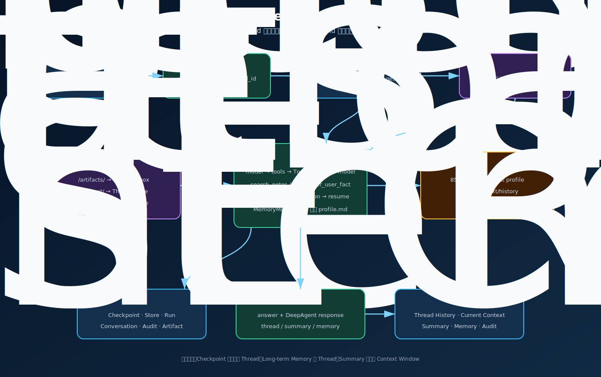
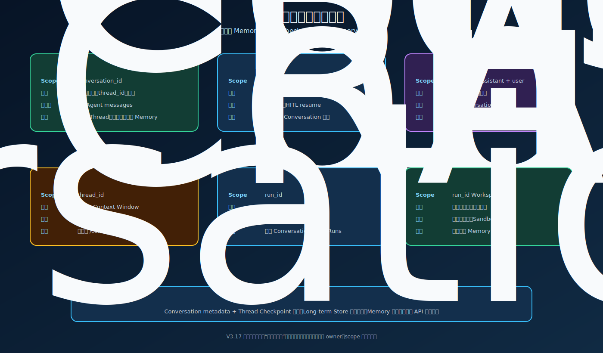
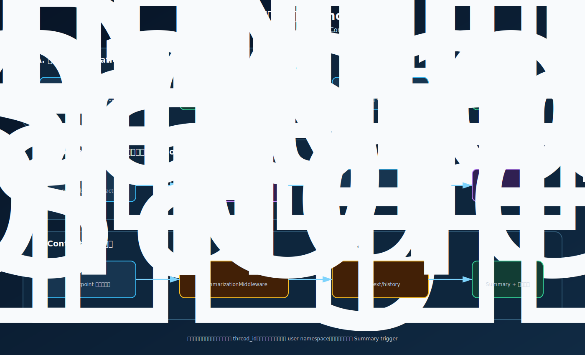

# V3.17 DeepAgents Durable Memory & Context

V3.16 解决一次 Run 内的 `model -> tools -> ToolMessage -> model`、HITL 和 Artifact。V3.17 继续使用同一 DeepAgents Tool Loop，但把一次性 `thread_id=run_id` 改成稳定 Conversation Thread，并增加跨 Conversation 长期 Memory 与 Context Window 管理。

## 本版学习目标

完成 V3.17 后，应能解释：

1. 为什么 `conversation_id`、`thread_id` 和 `run_id` 必须是三个不同概念。
2. PostgreSQL Checkpointer、Conversation Repository、LangGraph Store、Summary、Run 和 Artifact 分别保存什么。
3. 为什么同 Thread messages 不等于跨 Thread 长期 Memory。
4. `CompositeBackend` 如何把 `/artifacts/`、`/context/` 和 `/memories/` 分到不同生命周期。
5. DeepAgents `SummarizationMiddleware` 为什么按模型 Context Profile 触发，而不是固定每四轮压缩。
6. Runtime Context 如何阻止模型自行切换 tenant/user namespace。



## 相比 V3.16 改进了什么

| 能力 | V3.16 | V3.17 |
| --- | --- | --- |
| `thread_id` | 每次等于新的 `run_id` | 一个 Conversation 使用稳定 `thread_id` |
| 同会话追问 | 不恢复历史 messages | PostgreSQL Checkpointer 自动恢复 |
| 跨会话 Memory | 未启用 | LangGraph PostgresStore + StoreBackend |
| Context 压缩 | 框架存在，但一次 Run 很难触发 | 长 Thread 使用模型 Profile 自动 Summary |
| Backend | 每 Run Sandbox Backend | CompositeBackend 按路径分流 |
| Memory 治理 | 无 | 类型白名单、Secret 拦截、CRUD、Audit |
| Console | Tool Loop、HITL、Artifact | 增加 Thread、Summary、Memory 和 Audit |

## 三个 ID

```text
conversation_id
  业务会话 ID，供 API、数据库和前端使用
        ↓ 1:1 持久映射
thread_id
  LangGraph Checkpointer 的状态恢复 ID
        ↓ 1:N
run_id
  每次 /ask 或恢复执行的观测、耗时和响应 ID
```

同一个 `conversation_id` 连续请求：`thread_id` 不变，`run_id` 每次变化。

新 `conversation_id`：创建新 `thread_id`，不会继承旧 Thread messages；如果 tenant、assistant、user 相同，仍能读取该用户的长期 Memory。

## 状态分层



| 状态 | Owner | Scope | 保存内容 |
| --- | --- | --- | --- |
| Conversation metadata | `PostgresDurableAgentStore` | `conversation_id` | 标题、状态、稳定 `thread_id`、时间 |
| Agent State | `PostgresSaver` | `thread_id` | 原始 messages、Tool Calls、interrupt、middleware state |
| Long-term Memory | `PostgresStore` | tenant + assistant + user | 稳定偏好、长期事实、确认后的决策 |
| Summary | DeepAgents Middleware | `thread_id` | `_summarization_event`、summary message、历史文件路径 |
| Run | Production Run Store | `run_id` | 状态、耗时、错误、终态响应 |
| Artifact | Core Sandbox | `run_id` Workspace | 用户要求生成的可下载文件 |

删除 Conversation 时，V3.17 清理 Conversation metadata 和 Thread Checkpoint，但默认保留用户长期 Memory。长期 Memory 必须通过 `/memories/{memory_id}` 显式删除。

## CompositeBackend

V3.17 的 Backend 路由：

```text
/artifacts/**
  → DeepAgentsSandboxBackend
  → 当前 run_id Workspace

/context/**
  → StoreBackend
  → tenant / assistant / user / thread namespace

/memories/**
  → StoreBackend
  → tenant / assistant / user namespace
```

`SummarizationMiddleware` 会把淘汰的旧历史写入：

```text
/context/conversation_history/{thread_id}.md
```

因此 Summary 历史不会因为下一轮使用新的 Run Workspace 而丢失。

## Long-term Memory 写入

Agent 可使用三个受控工具：

```text
remember_user_fact
list_user_memories
forget_user_memory
```

允许保存：

- `preference`：稳定输出偏好，例如“回答控制在 100 字以内”。
- `fact`：未来任务仍有价值的长期事实。
- `decision`：用户已经确认的长期项目决策。

默认禁止保存：

- 普通寒暄和临时问题。
- 完整模型回答。
- RAG chunks 和冗长 Tool Result。
- API Key、Token、密码和 Secret。

Memory Service 同时维护两种 Store 数据：

```text
memory:{memory_id}
  → 用于 CRUD、类型和 Audit 的结构化记录

/profile.md
  → 物化后的 Markdown
  → 通过外部虚拟路径 /memories/profile.md 被 MemoryMiddleware 注入模型 Context
```

稳定 Thread 会持久化 middleware state，因此 V3.17 使用 `_ReloadingMemoryMiddleware` 在每个新 Run 开始时重新读取 profile，避免用户修改 Memory 后仍使用旧 `memory_contents`。

## Context Summary



当前安装的 `deepagents 0.6.12` 已自动安装 Summarization Middleware。V3.17 不再手工增加第二个摘要节点。

默认逻辑：

```text
模型 max_input_tokens
        × 85%
达到触发阈值
        ↓
旧消息写入 /context/
        ↓
LLM 生成 SummaryMessage
        ↓
Summary + 近期原始 messages 进入下一次模型调用
```

Checkpoint 中的原始 messages 不会因为 Summary 被物理删除。响应中的 `durable_context` 是可验证的调试投影，不是供应商收到的精确 Wire Prompt，也不包含隐藏 chain-of-thought。

调试环境可以使用 `.vscode/launch.json` 中的 `V3.17 API server: low Context threshold`，它设置：

```text
RAG_V317_MODEL_CONTEXT_TOKENS=4000
```

这会让 85% 阈值更容易触发。正式环境应按真实模型 Context Window 配置。

## Swagger Payload

服务入口由用户手动启动，默认调试端口为 `8026`：

```text
http://127.0.0.1:8026/docs
```

### 1. 首轮并要求保存偏好

`POST /agent/ask`

```json
{
  "question": "请记住：以后回答尽量控制在100字以内。",
  "tenant_id": "tenant_demo",
  "user_id": "user_demo",
  "assistant_id": "obsidian_rag",
  "conversation_id": "conv_v317_memory",
  "collection": null,
  "top_k": 5,
  "mode": "hybrid",
  "filters": null,
  "max_iterations": 12
}
```

观察：

- `run.run_id`
- `deep_agent_response.thread_id`
- `remember_user_fact` Tool Call / ToolMessage
- `deep_agent_response.durable_context.long_term_memories`

### 2. 相同 Conversation 追问

```json
{
  "question": "我刚才要求你以后怎么回答？",
  "tenant_id": "tenant_demo",
  "user_id": "user_demo",
  "assistant_id": "obsidian_rag",
  "conversation_id": "conv_v317_memory",
  "top_k": 5,
  "mode": "hybrid",
  "max_iterations": 12
}
```

期望：`thread_id` 与首轮相同，`run_id` 不同，Checkpoint messages 包含两轮历史。

### 3. 新 Conversation 读取长期 Memory

```json
{
  "question": "用我的默认偏好介绍一下食品温度计。",
  "tenant_id": "tenant_demo",
  "user_id": "user_demo",
  "assistant_id": "obsidian_rag",
  "conversation_id": "conv_v317_new_thread",
  "collection": "food_safety",
  "top_k": 5,
  "mode": "hybrid",
  "max_iterations": 12
}
```

期望：创建新的 `thread_id`，不加载旧 Thread messages，但 `/memories/profile.md` 中的回答长度偏好仍进入模型 Context。

### 4. Artifact + HITL

```json
{
  "question": "麻婆豆腐的做法总结成 .md 文档发给我",
  "tenant_id": "tenant_demo",
  "user_id": "user_demo",
  "assistant_id": "obsidian_rag",
  "conversation_id": "conv_v317_artifact",
  "collection": "recipes",
  "top_k": 5,
  "mode": "hybrid",
  "max_iterations": 12
}
```

链路仍为：

```text
search_notes → ToolMessage → write_file → interrupt
→ POST /approvals/{run_id}/resume → Sandbox → Artifact
```

### 5. 手动创建长期 Memory

`PUT /memories`

```json
{
  "memory_id": null,
  "kind": "fact",
  "content": "用户对花生过敏",
  "reason": "用户明确要求长期记住",
  "tenant_id": "tenant_demo",
  "user_id": "user_demo",
  "assistant_id": "obsidian_rag"
}
```

查询与删除：

```text
GET    /memories
DELETE /memories/{memory_id}
GET    /memory-audits
```

### 6. failed Run 从 Checkpoint 恢复

同步接口：

```text
POST /recoveries/{run_id}/retry
```

SSE 接口：

```text
POST /recoveries/{run_id}/retry/stream
```

`recover` 只接受 `status=failed` 且 Checkpoint 仍有 `snapshot.next` 的 Run。它沿用原 `run_id`、Conversation 和稳定 `thread_id`，以 `graph.stream(None, ...)` 从失败节点前的最近 Checkpoint 继续，不追加新的 HumanMessage。

若 Checkpoint 正在等待审批，必须调用 `/approvals/{run_id}/resume`；`recover` 会明确拒绝，避免绕过人工决定。

## 正常与条件分支

| 分支 | 行为 |
| --- | --- |
| 首次 Conversation | Repository 创建 `conversation_id -> thread_id` |
| 同 Conversation | Checkpointer 恢复 messages，并追加本轮 HumanMessage |
| 相同用户的新 Conversation | 新 Thread，不加载旧 messages；仍加载长期 Memory |
| scope 不匹配 | 返回 403，不读取 Checkpoint、Store 或 Run |
| Memory 内容含 Secret | Memory Policy 返回 422 或 Tool error |
| Context 未达到阈值 | 不生成新的 Summary event |
| Context 达到阈值 | 旧历史卸载到 `/context/`，Summary 进入模型调用 |
| `write_file` | 保持 V3.16 HITL，等待 resume |
| failed 且有待执行节点 | `recover` 使用原稳定 Thread 从 Checkpoint 继续 |
| waiting for approval | 禁止 `recover`，必须携审批决定调用 `resume` |
| failed 但无 `snapshot.next` | 返回 409，不能伪造可恢复状态 |
| 删除 Conversation | 清理 Thread Checkpoint，长期 Memory 保留 |

## 文件职责

| 文件 | 作用 |
| --- | --- |
| `obsidian_rag/v3_17/app.py` | FastAPI app 与全部 Router 装配 |
| `obsidian_rag/v3_17/dependencies.py` | PostgreSQL Store、Checkpointer、LLM Profile 和服务依赖生命周期 |
| `obsidian_rag/v3_17/schemas.py` | Ask、Conversation、Memory、Summary、Context、Audit 和 Runtime 契约 |
| `obsidian_rag/v3_17/context.py` | Runtime namespace 与 Backend 路径常量 |
| `obsidian_rag/v3_17/store.py` | Conversation Repository、V3.17 Run 快照和 Memory Audit PostgreSQL 表 |
| `obsidian_rag/v3_17/memory.py` | Memory Policy、LangGraph Store CRUD 和 profile.md 物化 |
| `obsidian_rag/v3_17/agent.py` | CompositeBackend、Memory tools、稳定 Thread config、Summary 投影 |
| `obsidian_rag/v3_17/runtime.py` | 每次 Run、SSE、终态、失败边界、resume 和 recover 生命周期 |
| `obsidian_rag/v3_17/service.py` | FastAPI/CLI 门面、Console Conversation 投影和 Runtime health |
| `obsidian_rag/v3_17/routes/agent.py` | JSON/SSE Ask 与 Run 查询 |
| `obsidian_rag/v3_17/routes/approvals.py` | HITL 查询和同步/SSE resume |
| `obsidian_rag/v3_17/routes/recoveries.py` | failed Run 的同步/SSE Checkpoint recover |
| `obsidian_rag/v3_17/routes/conversations.py` | Durable Conversation 列表与删除 |
| `obsidian_rag/v3_17/routes/memories.py` | 长期 Memory CRUD 与 Audit |
| `obsidian_rag/v3_17/routes/console.py` | 共享 Agent Console 的 V3.17 capability contract |
| `frontend/agent_console/src/components/DeepAgentPanel.vue` | Thread、Summary、长期 Memory、Audit 和 Artifact 观察面 |

## 核心断点调试

行号基于 V3.17 完成时的代码；后续代码变化时优先按函数名重新定位。

| 顺序 | 文件与行号 | 函数 | 观察变量 |
| --- | --- | --- | --- |
| 1 | `routes/agent.py:13` | `ask()` | 请求中的四个 identity/conversation 字段 |
| 2 | `runtime.py:94` | `_prepare_run()` | `run_id`、`conversation.thread_id`、normalized request |
| 3 | `store.py:75` | `get_or_create_conversation()` | 新建或命中的 Conversation、scope 校验 |
| 4 | `agent.py:95` | `begin()` | Runtime Context、Summary 前状态 |
| 5 | `agent.py:446` | `_runtime_context()` | tenant/user/assistant/thread/run 的映射 |
| 6 | `agent.py:223` | `_build_graph()` | `CompositeBackend.routes`、Memory tools、Store、middleware |
| 7 | `memory.py:51` | `ensure_profile()` | Store namespace、`/profile.md` 是否存在 |
| 8 | `agent.py:314` | `_stream_graph()` | `context=`、stable thread config、stream event |
| 9 | `memory.py:71` | `put()` | Policy 结果、Memory item、profile 物化和 Audit |
| 10 | `agent.py:325` | `_execution_result()` | Checkpoint snapshot、approval、Summary 是否变化 |
| 11 | `agent.py:420` | `_context_snapshot()` | `_summarization_event`、token 估算、长期 Memory |
| 12 | `runtime.py:228` | `_complete()` | Run status、thread_id、JSON/SSE 终态一致性 |

HITL 恢复额外断点：

| 顺序 | 文件与行号 | 函数 | 观察变量 |
| --- | --- | --- | --- |
| 1 | `agent.py:118` | `resume()` | 原 Run request、稳定 Thread、Checkpoint interrupts |
| 2 | `agent.py:464` | `_config()` | resume 仍使用原 `thread_id` |
| 3 | `agent.py:314` | `_stream_graph()` | `Command(resume=...)` |

失败 Run 恢复额外断点：

| 顺序 | 文件与行号 | 函数 | 观察变量 |
| --- | --- | --- | --- |
| 1 | `routes/recoveries.py:13` | `retry_failed_run()` | `run_id`、HTTP 404/409 分支 |
| 2 | `runtime.py:51` | `recover()` | Run 必须为 `failed`、累计耗时 |
| 3 | `agent.py:171` | `recover()` | `snapshot.interrupts`、`snapshot.next`、原 request |
| 4 | `agent.py:314` | `_stream_graph()` | `input_value=None`、稳定 `thread_id`、Runtime Context |
| 5 | `runtime.py:228` | `_complete()` | 恢复后的 succeeded 或 waiting_for_approval 终态 |

Conversation 删除额外断点：

| 文件与行号 | 函数 | 观察变量 |
| --- | --- | --- |
| `store.py:152` | `delete_conversation()` | `checkpoint_writes`、`checkpoint_blobs`、`checkpoints` 删除数；长期 Memory namespace 未删除 |

## 数据库查看

V3.17 新增：

```text
durable_conversations
durable_agent_runs
durable_memory_audits
```

LangGraph Store 使用官方 PostgresStore 表；Checkpoint 继续使用：

```text
checkpoints
checkpoint_blobs
checkpoint_writes
```

这些表属于不同 Repository，不应通过复制 JSON 相互充当事实来源。

## 本版不做什么

- 不做跨全部历史 Conversation 的向量语义搜索。
- 不把所有 Turn 自动变成长记忆。
- 不做后台 Memory consolidation、冲突合并或遗忘算法。
- 不接入复杂 Sub-agent、Skills、MCP 或 Shell。
- 不声称调试 Context 就是供应商收到的精确 Prompt。

V3.18 将继续学习 Middleware、Runtime Context、动态 Tool/Memory scope、Sub-agent 和后台 Memory consolidation。

## SVG 图解索引

- [Durable Memory 主流程](assets/rag-v3-17-durable-memory-flow.svg)
- [六类状态生命周期](assets/rag-v3-17-state-lifecycles.svg)
- [三条 Memory 路径](assets/rag-v3-17-three-memory-paths.svg)
