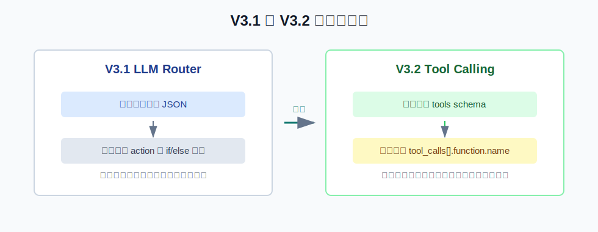
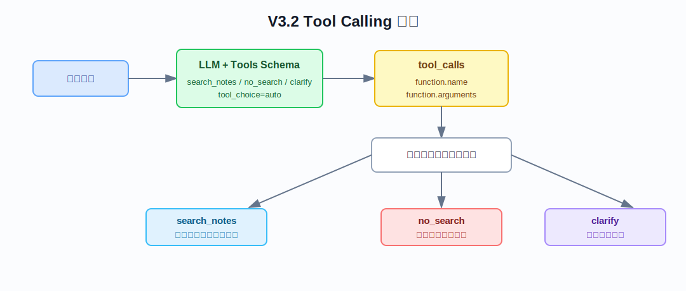
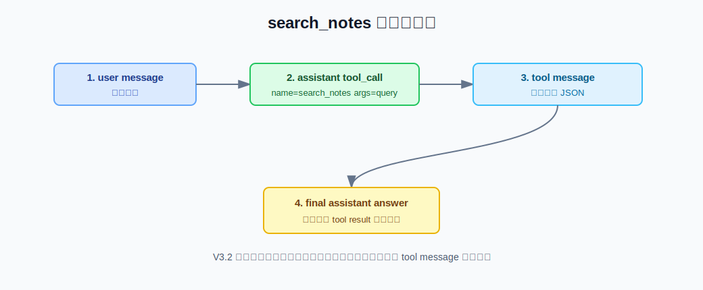

# V3.2 Tool Calling Guide

V3.2 的目标是把 V3.1 的“模型输出 JSON，代码 if/else 路由”升级成真正的 Tool Calling。模型会看到 `search_notes`、`no_search`、`clarify` 三个工具定义，并通过 `tool_calls` 协议选择下一步。

## V3.2 比 V3.1 改进了什么



V3.1：

```text
LLM 输出 RouterDecision JSON -> 代码读取 action -> 代码决定调用哪个函数
```

V3.2：

```text
LLM 收到 tools schema -> LLM 返回 tool_calls -> 代码执行 tool_call -> tool result 回传 LLM
```

这就是为什么 V3.2 才叫 Tool Calling：工具选择不再是我们自定义的 `router.action` 字段，而是模型 API 返回的标准结构：

```json
{
  "tool_calls": [
    {
      "function": {
        "name": "search_notes",
        "arguments": "{\"query\":\"生鸡肉 清洗 交叉污染\",\"top_k\":5}"
      }
    }
  ]
}
```

## Tool Calling 流程



V3.2 主流程：

1. 接收用户问题。
2. 把用户问题和 tools schema 一起发给 LLM。
3. LLM 选择工具：`search_notes`、`no_search` 或 `clarify`。
4. 代码执行模型选择的工具。
5. 如果工具是 `search_notes`，代码检索知识库并生成 tool result。
6. 把 tool result 作为 `role=tool` 消息交回 LLM。
7. LLM 基于 tool result 生成最终答案。
8. 返回 answer、sources、tool_calls、trace。

## 三个工具的含义

| 工具 | 什么时候用 | 结果 |
| --- | --- | --- |
| `search_notes` | 问题需要查询本地知识库，例如食品安全、笔记、项目文档。 | 执行 V1 `RetrievalService.search()`，再让 LLM 基于证据回答。 |
| `no_search` | 问题依赖实时外部信息、闲聊，或本地知识库无法可靠回答。 | 不检索，直接说明边界或给出简短回复。 |
| `clarify` | 问题模糊、指代不明、缺少范围。 | 不检索，先向用户追问。 |

## search_notes 消息闭环



V3.2 最值得理解的是这个闭环：

```text
user question
  -> assistant tool_call: search_notes
  -> tool message: 检索结果 JSON
  -> assistant final answer
```

也就是说，代码不是直接把检索结果拼成最终答案，而是把检索结果作为工具消息交回模型，让模型完成最后回答。

## Swagger 使用

启动 V3.2 API：

```bash
.venv/bin/uvicorn obsidian_rag.v3_2.app:app --reload --port 8004
```

打开：

```text
http://127.0.0.1:8004/docs
```

知识库问题：

```json
{
  "question": "生鸡肉还需要清洗下锅吗",
  "top_k": 5,
  "mode": "hybrid",
  "filters": null,
  "max_steps": 1
}
```

预期观察点：

- `tool_calls[0].name = "search_notes"`
- `tool_calls[0].arguments.query` 是模型生成的检索 query
- `used_retrieval = true`
- trace 包含 `tool_selection`、`tool_result`、`answer`

实时外部信息问题：

```json
{
  "question": "今天深圳天气怎么样",
  "top_k": 5,
  "mode": "hybrid",
  "filters": null,
  "max_steps": 1
}
```

预期观察点：

- `tool_calls[0].name = "no_search"`
- `used_retrieval = false`
- trace 不会出现 `tool_result`

模糊问题：

```json
{
  "question": "这个呢",
  "top_k": 5,
  "mode": "hybrid",
  "filters": null,
  "max_steps": 1
}
```

预期观察点：

- `tool_calls[0].name = "clarify"`
- `used_retrieval = false`
- `answer` 是一个追问。

## CLI 和调试

CLI：

```bash
.venv/bin/obsidian-rag agent-v3-2 ask "生鸡肉还需要清洗下锅吗？" --top-k 5 --mode hybrid --max-steps 1
```

VSCode/Cursor 调试配置：

```text
V3.2 agent ask: tool calling loop
```

建议断点：

| 文件 | 位置 | 看什么 |
| --- | --- | --- |
| `obsidian_rag/cli.py` | `run_agent32_ask()` | CLI 如何组装 V3.2 agent。 |
| `obsidian_rag/v3_2/agent/service.py` | `complete_with_tools(...)` 前后 | 模型如何收到 tools 并返回 tool_calls。 |
| `obsidian_rag/v3_2/agent/service.py` | `tool_call.name == "search_notes"` | 只有模型选择 search_notes 时才检索。 |
| `obsidian_rag/v3_2/agent/service.py` | `final_messages` | tool result 如何回传模型。 |
| `obsidian_rag/llm.py` | `complete_with_tools()` | OpenAI/Ollama tool calling 响应如何解析。 |

## V3.2 文件职责

### Tool Calling

| 文件 | 作用 |
| --- | --- |
| `obsidian_rag/v3_2/tools.py` | 定义 system prompt 和 `search_notes`、`no_search`、`clarify` 三个 tools schema。 |
| `obsidian_rag/llm.py` | 新增 `ToolCall`、`ToolCallingResponse` 和 `complete_with_tools()`，解析模型返回的 tool calls。 |

### Agent

| 文件 | 作用 |
| --- | --- |
| `obsidian_rag/v3_2/agent/service.py` | V3.2 核心：让模型选择工具、执行工具、把 tool result 交回模型、生成最终答案。 |
| `obsidian_rag/v3_2/schemas.py` | V3.2 请求/响应模型，响应包含 `tool_calls` 和 trace。 |

### API

| 文件 | 作用 |
| --- | --- |
| `obsidian_rag/v3_2/app.py` | FastAPI V3.2 app 入口。 |
| `obsidian_rag/v3_2/dependencies.py` | 加载配置，创建 V1 `RetrievalService` 和支持 tools 的 LLM client。 |
| `obsidian_rag/v3_2/routes/agent.py` | `POST /agent/ask`。 |
| `obsidian_rag/v3_2/routes/health.py` | `GET /health`。 |

### Tests

| 文件 | 作用 |
| --- | --- |
| `tests/v3_2/test_tool_calling_agent.py` | 测试 `search_notes`、`no_search`、`clarify` 三种 tool call。 |
| `tests/v3_2/test_api.py` | 测试 V3.2 FastAPI JSON 接口。 |
| `tests/v3_2/test_cli_agent.py` | 测试 CLI 输出 tool calls 和 trace。 |

## 当前限制

- 这版只执行第一个 tool call，保持教学流程简单。
- `max_steps` 仍保留在接口里，后续 V3.3/LangGraph 再用于多节点循环。
- Tool Calling 是否稳定取决于当前模型和 Ollama/OpenAI-compatible 服务对 tools 的支持。
- V3.2 还不是 LangGraph，流程仍写在一个 service 里。

## 和后续版本的关系

```text
V3.1：LLM Router 输出 JSON，代码按 action 路由
V3.2：LLM 返回 tool_calls，代码执行模型选择的工具
V3.3：LangGraph 把 router/search/evidence/answer 拆成节点图
```

一句话记忆：

```text
V3.2 的重点是：模型通过 tool_calls 协议选择工具，代码执行工具并把结果作为 tool message 交回模型。
```
