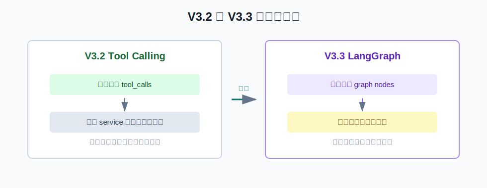
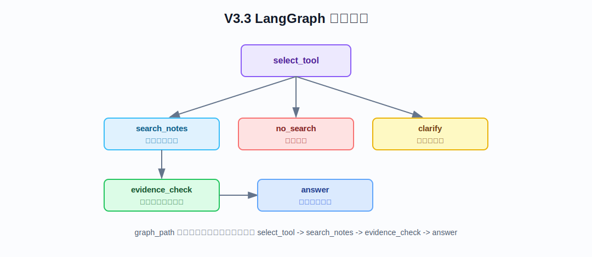
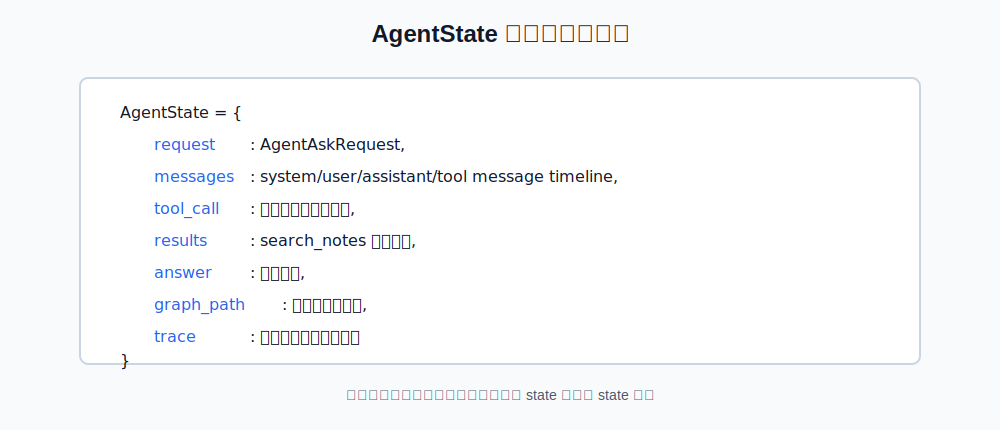

# V3.3 LangGraph Guide

V3.3 的目标是把 V3.2 的 Tool Calling loop 拆成 LangGraph 节点。它不是新增一种检索算法，而是学习真实 agent 工程里更常见的编排方式：**用 state、node、edge 表达流程。**

## V3.3 比 V3.2 改进了什么



V3.2：

```text
一个 AgentService.ask() 里完成工具选择、工具执行、证据判断和回答
```

V3.3：

```text
select_tool -> search_notes -> evidence_check -> answer
           -> no_search
           -> clarify
```

这让流程更容易调试、测试和扩展。比如以后要增加 rerank、multi-hop、human approval，都可以插入新节点，而不是继续拉长一个函数。

## LangGraph 节点流程



V3.3 使用 `StateGraph`：

```text
START -> select_tool
select_tool -- search_notes --> search_notes -> evidence_check -> answer -> END
select_tool -- no_search -----> no_search -> END
select_tool -- clarify -------> clarify -> END
```

节点职责：

| 节点 | 作用 |
| --- | --- |
| `select_tool` | 把 tools schema 交给 LLM，让模型返回 `tool_calls`。 |
| `search_notes` | 执行 V1 `RetrievalService.search()`，并把检索结果写成 tool message。 |
| `evidence_check` | 判断是否拿到了本地证据。 |
| `answer` | 让 LLM 基于 tool result 生成最终回答。 |
| `no_search` | 不检索，直接返回能力边界或模型给出的简短回复。 |
| `clarify` | 不检索，向用户追问。 |

## AgentState



LangGraph 的关键是 state。每个节点接收 `AgentState`，返回更新后的 `AgentState`。

当前 `AgentState` 里最重要的字段：

| 字段 | 含义 |
| --- | --- |
| `request` | 原始 `AgentAskRequest`。 |
| `messages` | OpenAI/Ollama chat message 时间线。 |
| `tool_call` | 模型选择的第一个工具调用。 |
| `tool_calls` | 响应里要展示的工具调用列表。 |
| `results` | `search_notes` 检索到的本地证据。 |
| `answer` | 最终答案。 |
| `used_retrieval` | 是否真的调用了检索。 |
| `sources` | 最终使用到的来源。 |
| `graph_path` | 实际经过的节点路径。 |
| `trace` | 给调试和前端展示用的结构化执行记录。 |

## Swagger 使用

启动 V3.3 API：

```bash
.venv/bin/uvicorn obsidian_rag.v3_3.app:app --reload --port 8005
```

打开：

```text
http://127.0.0.1:8005/docs
```

知识库问题：

```json
{
  "question": "生鸡肉还需要清洗下锅吗",
  "top_k": 5,
  "mode": "hybrid",
  "filters": null,
  "max_steps": 1
}
```

预期观察点：

- `tool_calls[0].name = "search_notes"`
- `graph_path = ["select_tool", "search_notes", "evidence_check", "answer"]`
- `trace[].node_name` 能看到每个节点的执行记录
- `used_retrieval = true`

实时外部信息问题：

```json
{
  "question": "今天深圳天气怎么样",
  "top_k": 5,
  "mode": "hybrid",
  "filters": null,
  "max_steps": 1
}
```

预期观察点：

- `tool_calls[0].name = "no_search"`
- `graph_path = ["select_tool", "no_search"]`
- `used_retrieval = false`

模糊问题：

```json
{
  "question": "这个呢",
  "top_k": 5,
  "mode": "hybrid",
  "filters": null,
  "max_steps": 1
}
```

预期观察点：

- `tool_calls[0].name = "clarify"`
- `graph_path = ["select_tool", "clarify"]`
- `answer` 是一个追问。

## CLI 和调试

CLI：

```bash
.venv/bin/obsidian-rag agent-v3-3 ask "生鸡肉还需要清洗下锅吗？" --top-k 5 --mode hybrid --max-steps 1
```

VSCode/Cursor 调试配置：

```text
V3.3 agent ask: LangGraph loop
```

建议断点：

| 文件 | 位置 | 看什么 |
| --- | --- | --- |
| `obsidian_rag/cli.py` | `run_agent33_ask()` | CLI 如何组装 V3.3 agent。 |
| `obsidian_rag/v3_3/agent/service.py` | `_build_graph()` | `StateGraph` 如何注册节点和条件边。 |
| `obsidian_rag/v3_3/agent/service.py` | `_select_tool_node()` | 模型如何返回 tool call。 |
| `obsidian_rag/v3_3/agent/service.py` | `_route_after_tool_selection()` | 条件边如何选择下一节点。 |
| `obsidian_rag/v3_3/agent/service.py` | `_search_notes_node()` | search_notes 如何执行检索。 |
| `obsidian_rag/v3_3/agent/service.py` | `_evidence_check_node()` | 如何判断证据是否存在。 |
| `obsidian_rag/v3_3/agent/service.py` | `_answer_node()` | tool result 如何回传模型并生成答案。 |

## V3.3 文件职责

### Agent

| 文件 | 作用 |
| --- | --- |
| `obsidian_rag/v3_3/agent/service.py` | V3.3 核心：构建 `StateGraph`，定义节点、条件边和 state 更新。 |
| `obsidian_rag/v3_3/schemas.py` | V3.3 请求/响应模型，响应包含 `graph_path` 和带 `node_name` 的 trace。 |

### API

| 文件 | 作用 |
| --- | --- |
| `obsidian_rag/v3_3/app.py` | FastAPI V3.3 app 入口。 |
| `obsidian_rag/v3_3/dependencies.py` | 加载配置，创建 V1 `RetrievalService` 和 LLM client。 |
| `obsidian_rag/v3_3/routes/agent.py` | `POST /agent/ask`。 |
| `obsidian_rag/v3_3/routes/health.py` | `GET /health`。 |

### Tests

| 文件 | 作用 |
| --- | --- |
| `tests/v3_3/test_langgraph_agent.py` | 测试 search/no_search/clarify 三条 graph path。 |
| `tests/v3_3/test_api.py` | 测试 V3.3 FastAPI JSON 接口。 |
| `tests/v3_3/test_cli_agent.py` | 测试 CLI 输出 graph path 和 trace。 |

## 当前限制

- 这版只执行第一个 tool call，保持学习路径清晰。
- `max_steps` 仍保留为接口字段，后续可用于循环图或多轮检索。
- 还没有加入独立 rerank 节点、human approval 节点或持久 checkpoint。
- LangGraph 已接入，但当前没有使用持久化 checkpoint；先聚焦节点编排。

## 一句话记忆

```text
V3.3 的重点不是让模型更聪明，而是把 agent 流程工程化：每一步变成可测试、可观察、可扩展的 graph node。
```
