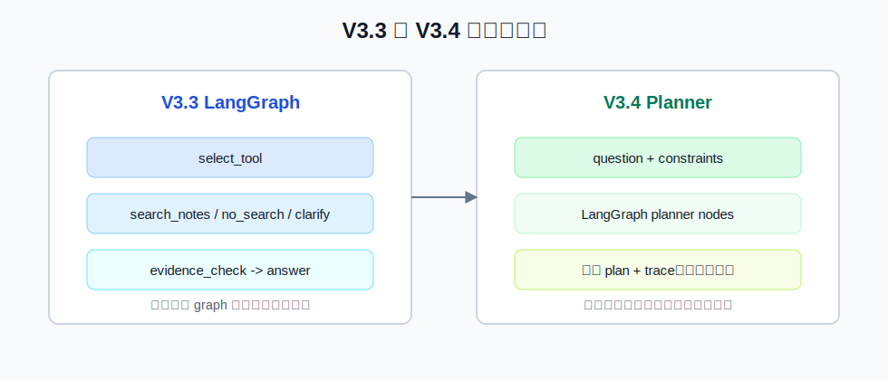
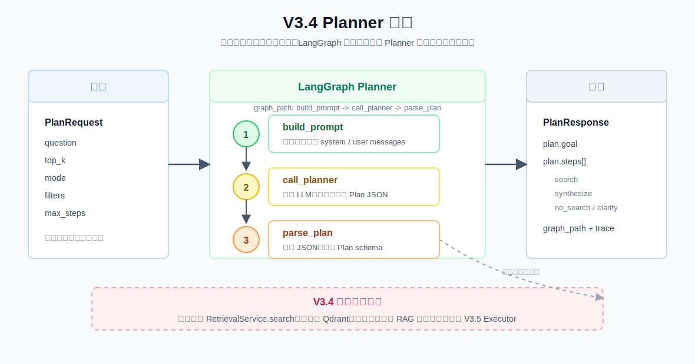

# V3.4 Planner Guide

V3.4 的目标是学习 harness 工程里的 **Planner**：先把复杂问题拆成结构化计划，再交给后续 Executor 执行。这个版本刻意只做 planner，不做检索执行，但内部已经使用 LangGraph，把 planner 拆成可观察的节点。

## V3.4 比 V3.3 改进了什么



V3.3 重点是 LangGraph 编排：模型选择工具，graph 决定走 `search_notes`、`no_search` 还是 `clarify`。

V3.4 重点是 Planner：模型不直接选一个工具立即执行，而是先输出一个 `Plan JSON`。这个 plan 可以包含多个 `search` step，最后用 `synthesize` step 表示后续需要综合。实现上，V3.4 用 LangGraph 表达 planner 流程。

## Planner 解决什么问题

Router 解决的是：

```text
这个问题要不要查知识库？
```

Tool Calling 解决的是：

```text
下一步调用哪个工具？
```

Planner 解决的是：

```text
这个任务应该拆成哪些步骤？
```

例如：

```text
帮我总结生鸡肉处理、厨房清洁、剩菜保存三类食品安全建议
```

V3.3 可能只调用一次 `search_notes`。V3.4 会更适合拆成：

```json
{
  "goal": "整理三类食品安全建议",
  "steps": [
    {"id": "s1", "kind": "search", "query": "生鸡肉 清洗 交叉污染"},
    {"id": "s2", "kind": "search", "query": "厨房 清洁 洗手 抹布"},
    {"id": "s3", "kind": "search", "query": "剩菜 保存 冷藏 复热"},
    {"id": "s4", "kind": "synthesize", "instruction": "综合前三步形成分主题回答", "depends_on": ["s1", "s2", "s3"]}
  ]
}
```

注意：V3.4 只返回计划，不执行这些步骤。真正执行 `s1/s2/s3` 会放到 V3.5 Planner Executor。

## 流程图



V3.4 的链路：

```text
PlanRequest
-> build_prompt node
-> call_planner node
-> parse_plan node
-> PlanResponse(plan + trace)
```

对应 `graph_path`：

```text
build_prompt -> call_planner -> parse_plan
```

## Swagger 用法

启动 V3.4 API：

```bash
.venv/bin/uvicorn obsidian_rag.v3_4.app:app --reload --port 8006
```

打开：

```text
http://127.0.0.1:8006/docs
```

接口：

```text
POST /planner/plan
```

示例 payload：

```json
{
  "question": "帮我总结生鸡肉处理、厨房清洁、剩菜保存三类食品安全建议",
  "top_k": 5,
  "mode": "hybrid",
  "filters": null,
  "max_steps": 4
}
```

你应该重点看响应里的：

```text
plan.goal
plan.steps[]
graph_path[]
trace[]
```

`plan.steps[].kind` 目前有四种：

| kind | 含义 |
| --- | --- |
| `search` | 后续应该查询本地知识库，必须有 `query`。 |
| `synthesize` | 后续应该综合前面步骤结果，通常依赖多个 search step。 |
| `no_search` | 问题不适合本地知识库，例如实时天气、股价、新闻。 |
| `clarify` | 问题太模糊，需要先追问用户。 |

## CLI 用法

```bash
.venv/bin/obsidian-rag agent-v3-4 plan "帮我总结生鸡肉处理、厨房清洁、剩菜保存三类食品安全建议" --top-k 5 --mode hybrid --max-steps 4
```

CLI 会打印：

```text
Goal: ...

Plan:
s1 | search | query=...
s2 | search | query=...
s3 | search | query=...
s4 | synthesize | instruction=...

Trace:
1. build_prompt:planner_prompt | ...
2. call_planner:planner_output | ...
3. parse_plan:planner_output | ...
```

## 调试断点

VS Code/Cursor 里选择：

```text
V3.4 planner: structured plan
```

推荐断点：

| 文件 | 位置 | 看什么 |
| --- | --- | --- |
| `obsidian_rag/cli.py` | `run_agent34_plan()` | CLI 如何组装 `PlanRequest`。 |
| `obsidian_rag/v3_4/planner/service.py` | `PlannerService.plan()` | planner 主入口，如何调用 LangGraph。 |
| `obsidian_rag/v3_4/planner/service.py` | `_build_graph()` | 如何注册 `build_prompt`、`call_planner`、`parse_plan` 节点和边。 |
| `obsidian_rag/v3_4/planner/service.py` | `_build_prompt_node()` | 如何构造 planner messages。 |
| `obsidian_rag/v3_4/planner/service.py` | `_call_planner_node()` | 如何调用 LLM Planner，失败时如何写入 `planner_error`。 |
| `obsidian_rag/v3_4/planner/service.py` | `_parse_plan_node()` | 如何把 LLM 输出解析成 `Plan`。 |
| `obsidian_rag/v3_4/planner/service.py` | `_build_planner_messages()` | 发给 LLM 的 system/user messages 长什么样。 |
| `obsidian_rag/v3_4/planner/service.py` | `parse_plan_json()` | LLM 输出如何变成 Pydantic `Plan`。 |
| `obsidian_rag/v3_4/routes/planner.py` | `planner_plan()` | Swagger 请求如何进入 service。 |

## V3.4 文件职责

| 文件 | 作用 |
| --- | --- |
| `obsidian_rag/v3_4/__init__.py` | V3.4 package 标识。 |
| `obsidian_rag/v3_4/schemas.py` | 定义 `PlanRequest`、`PlanStep`、`Plan`、`PlannerTraceStep`、`PlanResponse`，响应包含 `graph_path`。 |
| `obsidian_rag/v3_4/planner/service.py` | V3.4 核心：构建 LangGraph，定义 planner 节点、LLM 调用、JSON 解析、fallback plan。 |
| `obsidian_rag/v3_4/dependencies.py` | FastAPI dependency，加载配置并创建 `PlannerService`。 |
| `obsidian_rag/v3_4/app.py` | FastAPI V3.4 app 入口。 |
| `obsidian_rag/v3_4/routes/health.py` | `GET /health`。 |
| `obsidian_rag/v3_4/routes/planner.py` | `POST /planner/plan`。 |
| `tests/v3_4/test_planner_service.py` | 测试 planner JSON 解析、fallback 和 trace。 |
| `tests/v3_4/test_api.py` | 测试 V3.4 Swagger JSON 接口。 |
| `tests/v3_4/test_cli_planner.py` | 测试 CLI 输出 plan 和 trace。 |

## 你需要记住的重点

V3.4 的 planner 不回答问题，也不查知识库。它只做一件事：

```text
把用户任务变成机器可执行的步骤列表。
```

这就是它和 V3.3 最大的区别。V3.3 是“决定下一步并执行”，V3.4 是“先规划全局步骤”。现在 V3.4 也使用 LangGraph，但 graph 里只有 planner 相关节点；后面 V3.5 才会把这个 plan 交给 executor 执行。
