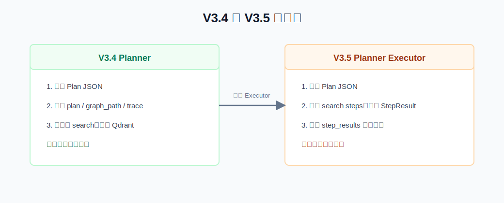
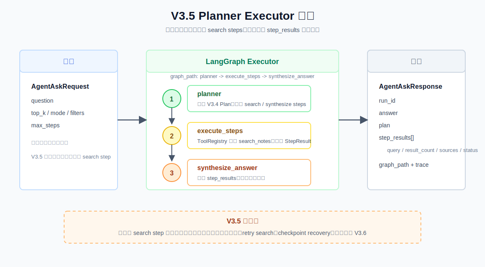

# V3.5 Planner Executor Guide

V3.5 的目标是把 V3.4 生成的 `Plan JSON` 真正执行起来。它仍然保持学习版边界，但已经从“只规划”进入“规划 + 执行 + 综合答案”。

## V3.5 比 V3.4 改进了什么



V3.4：

```text
question -> planner -> plan JSON -> 返回 plan
```

V3.5：

```text
question -> planner -> execute search steps -> synthesize answer
```

关键变化：

- 增加 `run_id`，每次 agent run 可追踪。
- 增加 `ToolRegistry`，先注册 `search_notes`。
- 增加 `StepResult`，记录每个 plan step 的执行结果。
- `search` step 会真实调用 `RetrievalService.search()`。
- `synthesize` step 会读取所有 `step_results` 生成最终答案。

## 流程图



当前 graph path：

```text
planner -> execute_steps -> synthesize_answer
```

V3.5 的边界：

- 会执行 `search` step。
- 会查本地知识库。
- 会生成最终答案。
- 暂时不做 evidence sufficiency check。
- 暂时不做 retry search。
- 暂时不做 checkpoint recovery。

这些留给 V3.6 Evidence Checker。

## Swagger 用法

启动 V3.5 API：

```bash
.venv/bin/uvicorn obsidian_rag.v3_5.app:app --reload --port 8007
```

打开：

```text
http://127.0.0.1:8007/docs
```

接口：

```text
POST /agent/ask
```

示例 payload：

```json
{
  "question": "帮我总结生鸡肉处理、厨房清洁、剩菜保存三类食品安全建议",
  "top_k": 5,
  "mode": "hybrid",
  "filters": null,
  "max_steps": 4
}
```

重点看响应里的：

```text
run_id
answer
plan
step_results[]
graph_path
trace[]
```

`step_results[]` 是 V3.5 的核心新增字段。它告诉你每个 plan step 是否执行、调用了哪个工具、检索到多少结果、用了哪些 sources。

## CLI 用法

```bash
.venv/bin/obsidian-rag agent-v3-5 ask "帮我总结生鸡肉处理、厨房清洁、剩菜保存三类食品安全建议" --top-k 5 --mode hybrid --max-steps 4
```

CLI 会打印：

```text
Run: run_xxx
最终答案...

Step results:
s1 | search | tool=search_notes | status=success | query=... | results=5

Graph path:
planner -> execute_steps -> synthesize_answer
```

## 调试断点

VS Code/Cursor 里选择：

```text
V3.5 agent ask: planner executor
```

推荐断点：

| 文件 | 位置 | 看什么 |
| --- | --- | --- |
| `obsidian_rag/cli.py` | `run_agent35_ask()` | CLI 如何组装 `AgentAskRequest`。 |
| `obsidian_rag/v3_5/agent/service.py` | `AgentService.ask()` | run 初始化和 graph 执行入口。 |
| `obsidian_rag/v3_5/agent/service.py` | `_build_graph()` | V3.5 三个节点如何串起来。 |
| `obsidian_rag/v3_5/agent/service.py` | `_planner_node()` | 如何复用 V3.4 Planner 生成 plan。 |
| `obsidian_rag/v3_5/agent/service.py` | `_execute_steps_node()` | 如何逐个执行 plan step。 |
| `obsidian_rag/v3_5/agent/service.py` | `_execute_search_step()` | search step 如何通过 `ToolRegistry` 调用 `search_notes`。 |
| `obsidian_rag/v3_5/tools.py` | `ToolRegistry.run()` | 工具分发和失败包装。 |
| `obsidian_rag/v3_5/agent/service.py` | `_synthesize_answer_node()` | 如何把 `step_results` 交给 LLM 生成答案。 |

## V3.5 文件职责

| 文件 | 作用 |
| --- | --- |
| `obsidian_rag/v3_5/__init__.py` | V3.5 package 标识。 |
| `obsidian_rag/v3_5/schemas.py` | 定义 `AgentAskRequest`、`StepResult`、`AgentTraceStep`、`AgentAskResponse`。 |
| `obsidian_rag/v3_5/tools.py` | 定义轻量 `ToolRegistry` 和 `ToolResult`，当前注册 `search_notes`。 |
| `obsidian_rag/v3_5/agent/service.py` | V3.5 核心：LangGraph planner/executor/synthesizer。 |
| `obsidian_rag/v3_5/dependencies.py` | FastAPI dependency，创建 `RetrievalService` 和 `AgentService`。 |
| `obsidian_rag/v3_5/app.py` | FastAPI V3.5 app 入口。 |
| `obsidian_rag/v3_5/routes/health.py` | `GET /health`。 |
| `obsidian_rag/v3_5/routes/agent.py` | `POST /agent/ask`。 |
| `tests/v3_5/test_executor_agent.py` | 测试多 step 执行和 no_search 不检索。 |
| `tests/v3_5/test_api.py` | 测试 V3.5 Swagger JSON 接口。 |
| `tests/v3_5/test_cli_agent.py` | 测试 CLI 输出 `step_results` 和 `graph_path`。 |

## 你需要记住的重点

V3.4 的核心问题是：

```text
应该做什么？
```

V3.5 的核心问题是：

```text
如何按计划执行，并把每一步结果带入最终答案？
```

`ToolRegistry` 是这版的关键工程概念。它把“计划里的工具名”和“代码里的执行函数”隔开，后续工具变多时，不需要把工具分发逻辑散落在 agent 主流程里。
