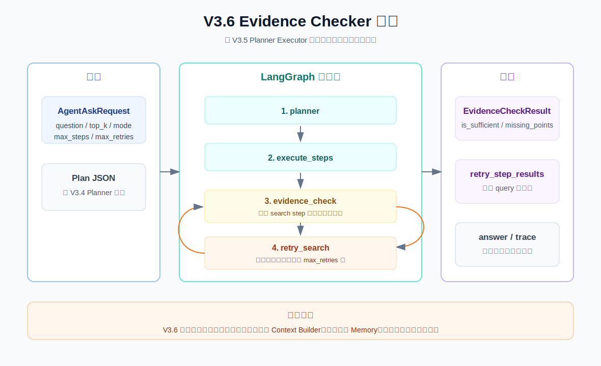

# V3.6 Evidence Checker Guide

V3.6 的目标是在 V3.5 Planner Executor 后面加一个运行时质量闸门：系统不只是执行 search steps，还要判断每个 search step 是否真的拿到了证据。

## V3.6 比 V3.5 改进了什么

V3.5：

```text
question -> planner -> execute search steps -> synthesize answer
```

V3.6：

```text
question -> planner -> execute search steps -> evidence_check -> retry_search -> evidence_check -> synthesize answer
```

关键变化：

- 新增 `EvidenceCheckResult`，记录证据是否足够。
- 新增 `evidence_check` graph node，逐个检查 `search` step。
- 新增 `retry_search` graph node，证据不足时最多补搜 `max_retries` 次。
- Response 新增 `retry_step_results`，展示补搜 query 和补搜结果。
- `trace` 会展示 evidence check 的判断原因。

## 流程图



当前 graph path 常见有两种。

证据足够：

```text
planner -> execute_steps -> evidence_check -> synthesize_answer
```

证据不足并触发补搜：

```text
planner -> execute_steps -> evidence_check -> retry_search -> evidence_check -> synthesize_answer
```

## 当前版本边界

V3.6 做：

- 检查每个 `search` step 是否有结果。
- 对没有结果的 step 生成补搜 query。
- 最多补搜 `max_retries` 次，默认 1 次。
- 把 evidence check 和 retry 结果返回给 Swagger/CLI。

V3.6 不做：

- 不做正式 `Context Builder`。
- 不做多轮 conversation memory。
- 不做 LLM judge 版 groundedness 检查。
- 不做生产级 checkpoint recovery。
- 不做 shell execution 或权限审批。

这些留给后续版本，尤其是 V3.7 Context Builder 和 V3.10 Production Harness。

## EvidenceCheckResult

Swagger response 里会多出：

```json
{
  "is_sufficient": false,
  "missing_points": ["s1 没有检索到证据：厨房 清洁"],
  "suggested_queries": ["厨房 清洁 食品安全"],
  "checked_step_ids": ["s1"],
  "missing_step_ids": ["s1"],
  "retry_count": 0,
  "reason": "部分 search step 没有证据，需要补搜。"
}
```

字段含义：

| 字段 | 含义 |
| --- | --- |
| `is_sufficient` | 当前证据是否足够进入最终回答。 |
| `missing_points` | 哪些 plan step 没有证据。 |
| `suggested_queries` | evidence checker 给 retry_search 的补搜 query。 |
| `checked_step_ids` | 本次检查覆盖了哪些原始 search step。 |
| `missing_step_ids` | 仍然缺证据的原始 search step id。 |
| `retry_count` | 已执行补搜次数。 |
| `reason` | 一句话说明判断依据。 |

## Swagger 用法

启动 V3.6 API：

```bash
.venv/bin/uvicorn obsidian_rag.v3_6.app:app --reload --port 8008
```

打开：

```text
http://127.0.0.1:8008/docs
```

接口：

```text
POST /agent/ask
```

示例 payload：

```json
{
  "question": "帮我总结生鸡肉处理、厨房清洁、剩菜保存三类食品安全建议",
  "top_k": 5,
  "mode": "hybrid",
  "filters": null,
  "max_steps": 4,
  "max_retries": 1
}
```

重点看响应里的：

```text
evidence_check
retry_step_results[]
graph_path
trace[]
```

## CLI 用法

```bash
.venv/bin/obsidian-rag agent-v3-6 ask "帮我总结生鸡肉处理、厨房清洁、剩菜保存三类食品安全建议" --top-k 5 --mode hybrid --max-steps 4 --max-retries 1
```

CLI 会打印：

```text
Evidence check:
sufficient=True | retry_count=1 | reason=...

Retry step results:
retry_s1_1 | search | tool=search_notes | status=success | query=... | results=1
```

## 调试断点

VS Code/Cursor 里选择：

```text
V3.6 agent ask: evidence checker
```

推荐断点：

| 文件 | 位置 | 看什么 |
| --- | --- | --- |
| `obsidian_rag/cli.py` | `run_agent36_ask()` | CLI 如何组装 `AgentAskRequest`，以及如何打印 evidence/retry。 |
| `obsidian_rag/v3_6/agent/service.py` | `AgentService.ask()` | run 初始化和 graph 执行入口。 |
| `obsidian_rag/v3_6/agent/service.py` | `_build_graph()` | `evidence_check` 和 `retry_search` 如何接入 LangGraph。 |
| `obsidian_rag/v3_6/agent/service.py` | `_execute_steps_node()` | 原始 plan steps 如何执行。 |
| `obsidian_rag/v3_6/agent/service.py` | `_evidence_check_node()` | 如何生成 `EvidenceCheckResult`。 |
| `obsidian_rag/v3_6/agent/service.py` | `_route_after_evidence_check()` | 如何决定进入 retry 还是 answer。 |
| `obsidian_rag/v3_6/agent/service.py` | `_retry_search_node()` | 如何执行补搜并写入 `retry_step_results`。 |
| `obsidian_rag/v3_6/agent/service.py` | `_synthesize_answer_node()` | 补搜后的证据如何进入最终回答。 |

## V3.6 文件职责

| 文件 | 作用 |
| --- | --- |
| `obsidian_rag/v3_6/__init__.py` | V3.6 package 标识。 |
| `obsidian_rag/v3_6/schemas.py` | 定义 `AgentAskRequest`、`EvidenceCheckResult`、`StepResult`、`AgentAskResponse`。 |
| `obsidian_rag/v3_6/tools.py` | 复用轻量 `ToolRegistry` 和 `ToolResult`，当前注册 `search_notes`。 |
| `obsidian_rag/v3_6/agent/service.py` | V3.6 核心：planner、executor、evidence checker、retry、synthesizer。 |
| `obsidian_rag/v3_6/dependencies.py` | FastAPI dependency，创建 `RetrievalService` 和 `AgentService`。 |
| `obsidian_rag/v3_6/app.py` | FastAPI V3.6 app 入口。 |
| `obsidian_rag/v3_6/routes/health.py` | `GET /health`。 |
| `obsidian_rag/v3_6/routes/agent.py` | `POST /agent/ask`。 |
| `tests/v3_6/test_evidence_agent.py` | 测试证据足够和证据不足触发 retry。 |
| `tests/v3_6/test_api.py` | 测试 V3.6 Swagger JSON 接口。 |
| `tests/v3_6/test_cli_agent.py` | 测试 CLI 输出 evidence check 和 retry 结果。 |

## 你需要记住的重点

V3.5 的核心问题是：

```text
如何按计划执行，并把每一步结果带入最终答案？
```

V3.6 的核心问题是：

```text
执行完之后，证据够不够？
```

这就是 harness 里的 Observer / Verification 雏形。它不让 agent 只“做完动作”，还要对动作结果做一次结构化检查。
