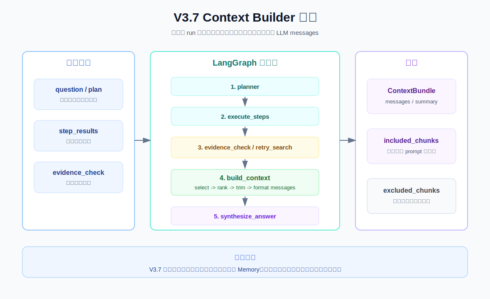

# V3.7 Context Builder Guide

V3.7 的目标是把“最终回答前怎么组装上下文”单独拆出来。它不引入持久 Memory，只处理本轮 run 内已经拿到的材料。

## V3.7 比 V3.6 改进了什么

V3.6：

```text
question -> planner -> execute_steps -> evidence_check -> synthesize_answer
```

V3.7：

```text
question -> planner -> execute_steps -> evidence_check -> build_context -> synthesize_answer
```

关键变化：

- 新增 `ContextBuilder`。
- 新增 `ContextBundle`。
- `synthesize_answer` 不再自己拼 prompt，而是使用 `context_bundle.messages`。
- Response 展示 `included_chunks` 和 `excluded_chunks`。
- trace 增加 `build_context` 节点。

## 流程图



当前 graph path：

```text
planner -> execute_steps -> evidence_check -> build_context -> synthesize_answer
```

如果 evidence 不足且触发补搜：

```text
planner -> execute_steps -> evidence_check -> retry_search -> evidence_check -> build_context -> synthesize_answer
```

## 当前版本边界

V3.7 做：

- 从本轮 `step_results` 和 `retry_step_results` 收集候选 chunks。
- 优先选择带 `chunk_id` 的 chunk。
- 按 score 排序。
- 按 `context_max_chunks` 裁剪。
- 生成 `ContextBundle.messages` 给 LLM。
- 返回 included/excluded chunks，方便理解 prompt 里到底放了什么。

V3.7 不做：

- 不做持久 Memory。
- 不读历史对话。
- 不写 conversation state。
- 不做长期用户偏好。
- 不做复杂 token 估算，只保留 `context_token_budget` 作为学习字段。

## Context Builder 和 Memory 的区别

`Memory` 负责：

```text
存什么、取什么、跨轮怎么找回
```

`Context Builder` 负责：

```text
把本轮可用材料怎么选择、排序、裁剪、格式化进 prompt
```

所以 V3.7 可以单独学习。V3.8 再把 Memory Reader 读出来的历史摘要交给 Context Builder。

未来 V3.8 的形态会更像：

```text
MemoryReader -> memory snippets
Retriever -> evidence chunks
EvidenceChecker -> coverage signal
ContextBuilder -> final LLM messages
MemoryWriter -> save this turn
```

## ContextBundle

Swagger response 里会多出：

```json
{
  "messages": [
    {"role": "system", "content": "..."},
    {"role": "user", "content": "..."}
  ],
  "included_chunks": [
    {
      "step_id": "s1",
      "chunk_id": "KB-072",
      "source": "food.md",
      "topic": "食品安全",
      "score": 0.88,
      "text_preview": "不建议清洗生鸡肉...",
      "reason": "带 chunk_id，优先进入上下文"
    }
  ],
  "excluded_chunks": [],
  "token_budget": 4000,
  "context_summary": "已选择 1 个 chunks，排除 0 个 chunks。"
}
```

字段含义：

| 字段 | 含义 |
| --- | --- |
| `messages` | 最终传给 LLM 的 messages。学习版直接返回，方便调试。 |
| `included_chunks` | 真正进入 prompt 的证据。 |
| `excluded_chunks` | 被裁掉的证据和原因。 |
| `token_budget` | 本轮上下文预算。当前是学习字段，还不是精确 token 计算。 |
| `context_summary` | 一句话概括上下文构建结果。 |

## Swagger 用法

启动 V3.7 API：

```bash
.venv/bin/uvicorn obsidian_rag.v3_7.app:app --reload --port 8009
```

打开：

```text
http://127.0.0.1:8009/docs
```

接口：

```text
POST /agent/ask
```

示例 payload：

```json
{
  "question": "帮我总结生鸡肉处理、厨房清洁、剩菜保存三类食品安全建议",
  "top_k": 5,
  "mode": "hybrid",
  "filters": null,
  "max_steps": 4,
  "max_retries": 1,
  "context_max_chunks": 4,
  "context_token_budget": 4000
}
```

重点看响应里的：

```text
context_bundle.included_chunks
context_bundle.excluded_chunks
context_bundle.messages
trace[]
```

## CLI 用法

```bash
.venv/bin/obsidian-rag agent-v3-7 ask "帮我总结生鸡肉处理、厨房清洁、剩菜保存三类食品安全建议" --top-k 5 --mode hybrid --max-steps 4 --max-retries 1 --context-max-chunks 4
```

CLI 会打印：

```text
Context bundle:
已选择 4 个 chunks，排除 3 个 chunks。 | token_budget=4000
included: s1 | KB-072 | food.md | score=0.8800
excluded: s1 | - | low.md | score=0.9900 | reason=超过 max_chunks 或优先级较低
```

## 调试断点

VS Code/Cursor 里选择：

```text
V3.7 agent ask: context builder
```

推荐断点：

| 文件 | 位置 | 看什么 |
| --- | --- | --- |
| `obsidian_rag/cli.py` | `run_agent37_ask()` | CLI 如何传入 `context_max_chunks`。 |
| `obsidian_rag/v3_7/agent/service.py` | `_build_graph()` | `build_context` 节点插在 evidence 和 answer 中间。 |
| `obsidian_rag/v3_7/agent/service.py` | `_build_context_node()` | 如何把 AgentState 交给 ContextBuilder。 |
| `obsidian_rag/v3_7/context.py` | `ContextBuilder.build()` | 如何选择、排序、裁剪 chunks。 |
| `obsidian_rag/v3_7/context.py` | `_build_messages()` | 最终 messages 如何生成。 |
| `obsidian_rag/v3_7/agent/service.py` | `_synthesize_answer_node()` | LLM 如何使用 `context_bundle.messages`。 |

## V3.7 文件职责

| 文件 | 作用 |
| --- | --- |
| `obsidian_rag/v3_7/__init__.py` | V3.7 package 标识。 |
| `obsidian_rag/v3_7/schemas.py` | 定义 `ContextBundle`、`ContextChunk`、V3.7 request/response。 |
| `obsidian_rag/v3_7/context.py` | 定义 `ContextBuilder`，负责选择、排序、裁剪和构建 messages。 |
| `obsidian_rag/v3_7/tools.py` | 复用轻量 `ToolRegistry` 和 `ToolResult`。 |
| `obsidian_rag/v3_7/agent/service.py` | V3.7 核心 LangGraph：planner、executor、evidence、context、answer。 |
| `obsidian_rag/v3_7/dependencies.py` | FastAPI dependency。 |
| `obsidian_rag/v3_7/app.py` | FastAPI V3.7 app 入口。 |
| `obsidian_rag/v3_7/routes/health.py` | `GET /health`。 |
| `obsidian_rag/v3_7/routes/agent.py` | `POST /agent/ask`。 |
| `tests/v3_7/test_context_builder.py` | 测试 ContextBuilder 选择和裁剪。 |
| `tests/v3_7/test_context_agent.py` | 测试 agent 在 answer 前构建 context。 |
| `tests/v3_7/test_api.py` | 测试 V3.7 Swagger JSON 接口。 |
| `tests/v3_7/test_cli_agent.py` | 测试 CLI 输出 ContextBundle。 |

## 你需要记住的重点

V3.6 的核心问题是：

```text
执行完之后，证据够不够？
```

V3.7 的核心问题是：

```text
证据够了以后，哪些材料应该进入 prompt？
```

检索结果不等于 prompt。Context Builder 就是把“可用材料”变成“模型输入”的那一层。
