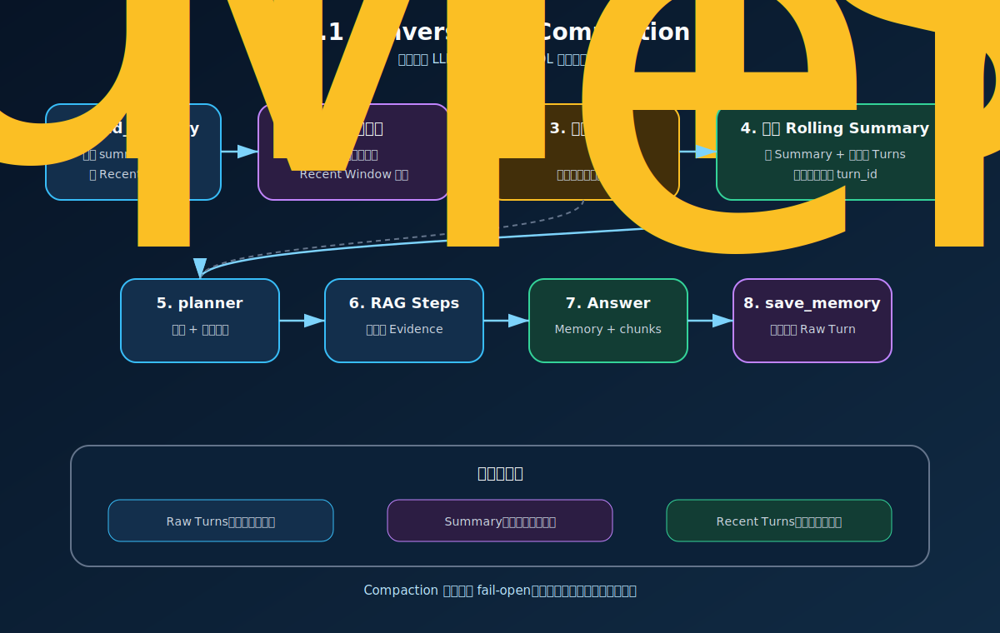
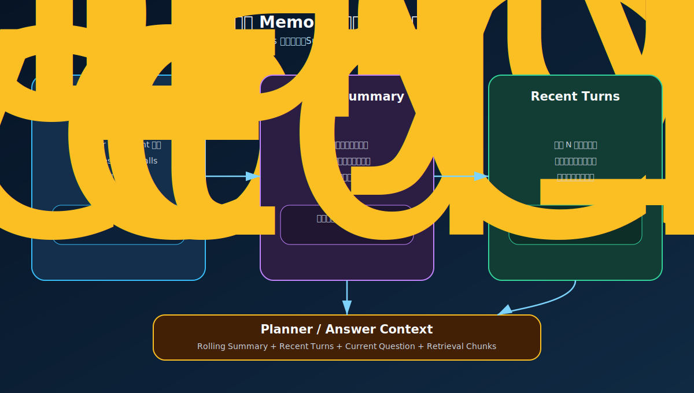
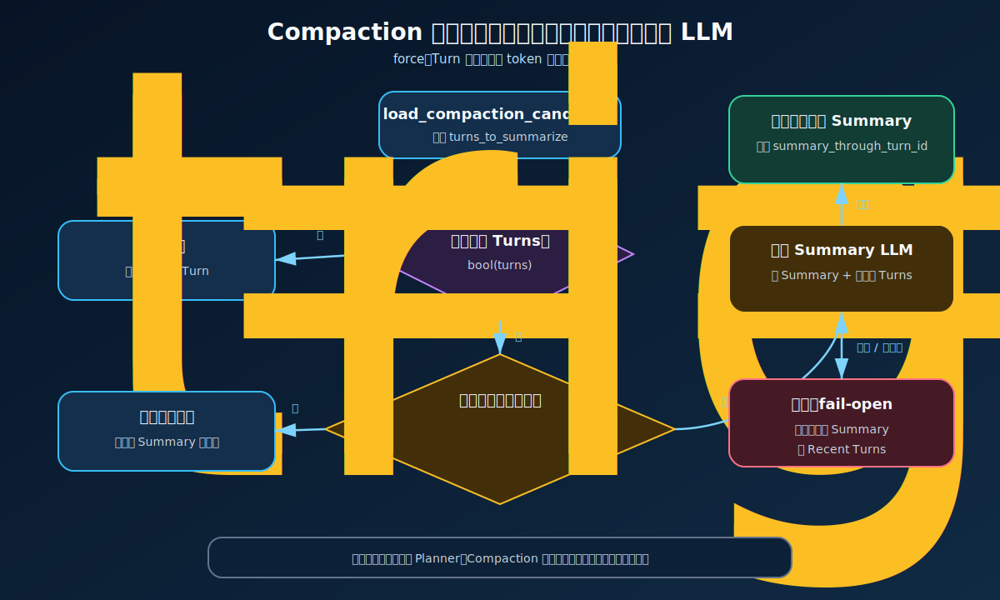

# V3.8.1 Conversation Compaction 学习指南

V3.8.1 解决的是一个很具体的问题：对话越来越长后，不能把全部历史都塞进 Prompt，也不能简单丢掉窗口之外的信息。

它采用的方案是：**完整保存 Raw Turns，把较旧对话压缩成 Rolling Summary，同时保留最近几轮原文。**



## 一句话理解 Conversation Compaction

Conversation Compaction 不是删除数据库里的历史，而是把“准备交给 LLM 的历史上下文”从很多旧 Turn 压缩成一段摘要：

```text
全部 Raw Turns
  -> 旧 Turn：Rolling Summary
  -> 新 Turn：Recent Turns 原文
  -> Planner / Answer Context
```

因此要区分两个概念：

| 概念 | 保存什么 | 是否被压缩覆盖 |
| --- | --- | --- |
| 持久化历史 | MySQL 中全部 Raw Turns | 否，始终保留 |
| LLM 上下文 | Summary + Recent Turns | 是，会滚动更新 |

## V3.8 与 V3.8.1 的区别

V3.8 只使用最近窗口：

```text
全部历史 -> 最近 memory_window 轮 -> Planner / Answer
```

当一条重要约束离开窗口后，模型就看不到它。

V3.8.1 增加滚动摘要：

```text
全部历史
  ├─ 窗口之前的重要信息 -> summary_text
  └─ 最近 memory_window 轮 -> recent_turns
                         ↓
                Planner / Answer
```

相比 V3.8，本版新增：

- LangGraph 中的 `compact_memory` 节点。
- `conversations.summary_text`、`summary_through_turn_id` 和 `summary_updated_at`。
- Turn 数量与估算 token 的双阈值。
- 自动压缩和 Swagger / CLI 手动强制压缩。
- Planner 与 Answer 同时消费 Summary 和 Recent Turns。
- 摘要失败时 fail-open，不阻断本轮问答。

## 三层 Memory



| 层 | 内容 | 主要用途 |
| --- | --- | --- |
| Raw Turns | 全部用户问题、助手回答、sources、tool calls | 审计、历史展示、重新生成摘要 |
| Rolling Summary | 已离开最近窗口的重要历史 | 用较少 token 保留长期上下文 |
| Recent Turns | 最近 `memory_window` 轮原文 | 保留准确措辞、指代和当前交流细节 |

实际交给模型的上下文近似为：

```text
conversation_summary
+ recent_turns
+ current_question
+ retrieval_chunks
```

其中 `retrieval_chunks` 属于知识库证据，不属于 Conversation Memory。`no_search` 或 `clarify` 分支可以没有 chunks，但仍可调用 Answer LLM。

## 自动压缩候选范围

Compactor 不会反复摘要全部历史。`load_compaction_candidate()` 只选择：

```text
上次 summary_through_turn_id 之后
且
最近 keep_recent_turns 窗口之前
的尚未摘要 Turns
```

假设已经有 8 个 Turn，`keep_recent_turns=3`，摘要已覆盖到 Turn 2：

```text
Turn 1-2：已在旧 Summary 中
Turn 3-5：本次候选，可能合并进 Summary
Turn 6-8：Recent Turns，继续保留原文
```

这样每次只处理新增的旧 Turns，避免重复读取和总结全部历史。

## 双阈值决策



真实决策逻辑位于 `ConversationCompactor.compact()`：

```text
有 candidate Turns
AND
(
  force=true
  OR candidate_turn_count >= trigger_turns
  OR estimated_input_tokens >= trigger_tokens
)
```

默认请求配置示例：

```json
{
  "memory_window": 3,
  "memory_compaction_enabled": true,
  "memory_compaction_trigger_turns": 4,
  "memory_compaction_trigger_tokens": 3000
}
```

token 数只是轻量估算，不是模型 tokenizer 的精确结果：中文字符约按 2 个字符 1 token，其他字符约按 4 个字符 1 token。它适合触发保护，不适合计费。

## Rolling Summary 如何更新

压缩输入不是只有新增 Turns，而是：

```json
{
  "existing_summary": "上一次滚动摘要",
  "new_turns": [
    {
      "user": "...",
      "assistant": "...",
      "sources": []
    }
  ]
}
```

LLM 把旧摘要和新增旧 Turns 合并为一份新摘要，然后保存：

```text
summary_text = 新摘要
summary_through_turn_id = 本次候选的最后一个 turn_id
```

摘要 Prompt 要求保留用户目标、明确事实、约束、已确认结论和未解决问题，不得编造信息。

## Planner 与 Answer 如何使用 Memory

主链路顺序如下：

```text
load_memory
  -> compact_memory
  -> planner
  -> execute_steps
  -> evidence_check
  -> build_context
  -> synthesize_answer
  -> save_memory
```

`compact_memory` 完成后，内存状态会刷新。随后：

- Planner 通过 `build_memory_aware_planner_question()` 获得摘要、最近对话和当前问题，用于判断指代与是否检索。
- Answer Context 通过 `ContextBuilder._build_messages()` 获得摘要、最近对话、当前问题和检索 chunks。
- `save_memory` 最后仍把本轮原始问答独立写入 `turns`。

`used_retrieval=false` 只代表本轮没有执行 RAG Search，不代表没有调用 Answer LLM。

## MySQL 数据结构

默认连接配置：

```env
RAG_MYSQL_HOST=127.0.0.1
RAG_MYSQL_PORT=3306
RAG_MYSQL_USER=root
RAG_MYSQL_PASSWORD=
RAG_MYSQL_DATABASE=obsidian_rag
```

`conversations` 保存摘要状态：

| 字段 | 含义 |
| --- | --- |
| `summary_text` | 当前滚动摘要 |
| `summary_through_turn_id` | 当前摘要已经覆盖到哪个 Turn |
| `summary_updated_at` | 摘要最近更新时间 |

`turns` 保存完整原始记录。压缩成功后也不删除 Turn；Summary 是可重建的派生数据，Raw Turns 才是事实来源。

## Swagger 调试

启动服务：

```bash
.venv/bin/uvicorn obsidian_rag.v3_8_1.app:app --host 127.0.0.1 --port 8011
```

打开 `http://127.0.0.1:8011/docs`。

### 自动压缩问答

`POST /agent/ask`

```json
{
  "question": "那处理完厨房怎么清洁？",
  "conversation_id": "conv_compaction_demo",
  "memory_window": 3,
  "memory_compaction_enabled": true,
  "memory_compaction_trigger_turns": 4,
  "memory_compaction_trigger_tokens": 3000,
  "top_k": 5,
  "mode": "hybrid",
  "filters": null,
  "max_steps": 4,
  "max_retries": 1,
  "context_max_chunks": 4,
  "context_token_budget": 4000
}
```

### 查看 Memory

```text
GET /memory/conv_compaction_demo?window=3
```

### 手动强制压缩

`POST /memory/conv_compaction_demo/compact`

```json
{
  "keep_recent_turns": 1,
  "trigger_turns": 4,
  "trigger_tokens": 3000,
  "force": true
}
```

响应中的 `memory_compaction` / `MemoryCompactionResult` 会展示是否尝试、是否成功、候选数、摘要数、保留数、估算 token 和摘要截止 Turn。

## CLI 调试

使用同一个 `conversation_id` 连续提问：

```bash
.venv/bin/obsidian-rag agent-v3-8-1 ask "生鸡肉要不要洗？" \
  --conversation-id conv_compaction_demo

.venv/bin/obsidian-rag agent-v3-8-1 ask "那处理完厨房怎么清洁？" \
  --conversation-id conv_compaction_demo
```

手动强制压缩：

```bash
.venv/bin/obsidian-rag agent-v3-8-1 compact conv_compaction_demo \
  --keep-recent-turns 1
```

## 条件分支与 fail-open

| 条件 | 行为 | 是否阻断问答 |
| --- | --- | --- |
| `memory_compaction_enabled=false` | 不执行 Compactor | 否 |
| 没有 candidate Turns | 跳过，保留当前 Summary 与 Recent Turns | 否 |
| 未达到 Turn/token 阈值 | 跳过，等待后续 Turn 累积 | 否 |
| `force=true` 且存在候选 | 忽略阈值，立即尝试摘要 | 否 |
| 摘要 LLM 初始化失败 | 返回原因，继续使用旧 Memory | 否 |
| 没有配置摘要 LLM | 跳过并保留旧 Memory | 否 |
| LLM 返回空文本或调用异常 | fail-open，继续使用旧 Memory | 否 |
| `save_summary()` 异常 | fail-open，继续本轮主流程 | 否 |
| 压缩成功 | 更新 Summary 和截止 Turn，再继续 Planner | 否 |

这里的关键设计是：Compaction 是上下文优化步骤，不应该成为问答可用性的单点故障。

## 核心流程断点调试

VS Code/Cursor 可依次运行：

```text
V3.8.1 compaction: first turn
V3.8.1 compaction: follow-up turn
V3.8.1 compaction: force compact
```

按真实执行顺序设置断点：

| 顺序 | 当前断点 | 重点观察变量 |
| --- | --- | --- |
| 1 | `agent/service.py:84` `ask()` | `request`、`conversation_id`、`initial_state` |
| 2 | `agent/service.py:238` `_load_memory_node()` | `memory_snapshot.summary_text`、`recent_turns` |
| 3 | `agent/service.py:259` `_compact_memory_node()` | 是否启用压缩、`compaction_result`、刷新后的 Memory |
| 4 | `compaction.py:26` `compact()` | `candidate`、`turns`、`estimated_tokens`、`should_compact` |
| 5 | `mysql_memory.py:109` `load_compaction_candidate()` | 摘要截止点、候选范围、保留窗口 |
| 6 | `compaction.py:126` `_build_summary_messages()` | `existing_summary` 与 `new_turns` payload |
| 7 | `mysql_memory.py:192` `save_summary()` | `summary_text`、`summary_through_turn_id` |
| 8 | `agent/service.py:303` `_planner_node()` | Memory 如何影响 Planner 决策 |
| 9 | `context.py:126` `build_memory_aware_planner_question()` | Planner 实际看到的历史文本 |
| 10 | `agent/service.py:460` `_build_context_node()` | `chunks`、Context budget、Memory |
| 11 | `context.py:79` `_build_messages()` | Answer LLM 的最终 messages |
| 12 | `agent/service.py:493` `_synthesize_answer_node()` | 检索与非检索分支的答案生成 |
| 13 | `agent/service.py:520` `_save_memory_node()` | 本轮原始 Turn 的持久化内容 |
| 14 | `mysql_memory.py:217` `append_turn()` | 新 Turn 如何写入 MySQL |

辅助入口：

| 入口 | 当前断点 | 用途 |
| --- | --- | --- |
| API 问答 | `routes/agent.py:13` `agent_ask()` | 从 Swagger 进入完整 Agent 流程 |
| 查看 Memory | `routes/memory.py:14` `get_conversation_memory()` | 查看 Summary 与 Recent Turns |
| 手动压缩 | `routes/memory.py:23` `compact_conversation_memory()` | 绕过 Agent 主链路直接调 Compactor |
| 加载快照 | `mysql_memory.py:55` `load_snapshot()` | 观察当前 Summary 和最近窗口 |
| token 估算 | `compaction.py:144` `_estimate_summary_input_tokens()` | 理解双阈值中的 token 近似值 |

行号已按当前代码核对；代码变化后应优先通过函数名重新定位。

## 文件职责

| 文件 | 职责 |
| --- | --- |
| `obsidian_rag/v3_8_1/schemas.py` | 请求、响应、Memory、Compaction 和 Agent State 契约 |
| `obsidian_rag/v3_8_1/mysql_memory.py` | MySQL Raw Turns、摘要状态和候选 Turn 查询 |
| `obsidian_rag/v3_8_1/memory.py` | 历史 SQLite 实现，保留给迁移和旧测试 |
| `obsidian_rag/v3_8_1/compaction.py` | 候选判断、阈值判断、摘要 Prompt 与滚动摘要生成 |
| `obsidian_rag/v3_8_1/context.py` | 将 Summary、Recent Turns 和 chunks 组装进 Planner / Answer |
| `obsidian_rag/v3_8_1/agent/service.py` | LangGraph 节点、路由与完整问答主流程 |
| `obsidian_rag/v3_8_1/tools.py` | 注册 `search_notes` Tool |
| `obsidian_rag/v3_8_1/dependencies.py` | 构建 Retrieval、LLM、Memory Store 与 Compactor |
| `obsidian_rag/v3_8_1/routes/agent.py` | `POST /agent/ask` |
| `obsidian_rag/v3_8_1/routes/memory.py` | Memory 查看和手动压缩接口 |
| `obsidian_rag/v3_8_1/app.py` | FastAPI app 与 Router 注册 |

## 与 DeerFlow 的关系

本版借鉴的是通用思想：

```text
旧消息摘要 + 最近消息原文 + 独立 summary state
```

它没有照搬完整系统，也不包含异步 Memory 队列、用户事实提取、置信度、过期检查、事实合并或跨 conversation 用户画像。

## 当前版本边界

V3.8.1 做：

- 会话内 Rolling Summary。
- Turn/token 双阈值和手动 `force`。
- 最近原始 Turns 保留。
- MySQL Raw Turns 完整持久化。
- 自动和手动 Compaction。
- Compaction 异常 fail-open。

V3.8.1 不做：

- 不做跨会话长期用户 Memory。
- 不做 Memory 向量检索。
- 不做用户偏好与稳定事实提取。
- 不做生产级异步摘要队列。
- 不保证摘要能够无损替代原文。

下一学习阶段进入 V3.9 Agent Evaluation；更完整的 Selective Long-Term Memory 应在后续独立版本继续演进。

## 学习检查清单

- 能解释为什么“压缩上下文”不等于“删除历史”。
- 能指出 `summary_through_turn_id` 如何避免重复摘要。
- 能解释 Recent Turns 为什么必须保留原文。
- 能说清 Turn/token/force 三种触发条件。
- 能在断点中看到旧 Summary 与新候选如何合并。
- 能验证摘要失败不会阻断 Planner 和 Answer。

## 图解索引

- [Conversation Compaction 主流程](assets/rag-v3-8-1-conversation-compaction-flow.svg)
- [三层 Memory](assets/rag-v3-8-1-memory-layers.svg)
- [Compaction 双阈值决策](assets/rag-v3-8-1-compaction-decision.svg)
