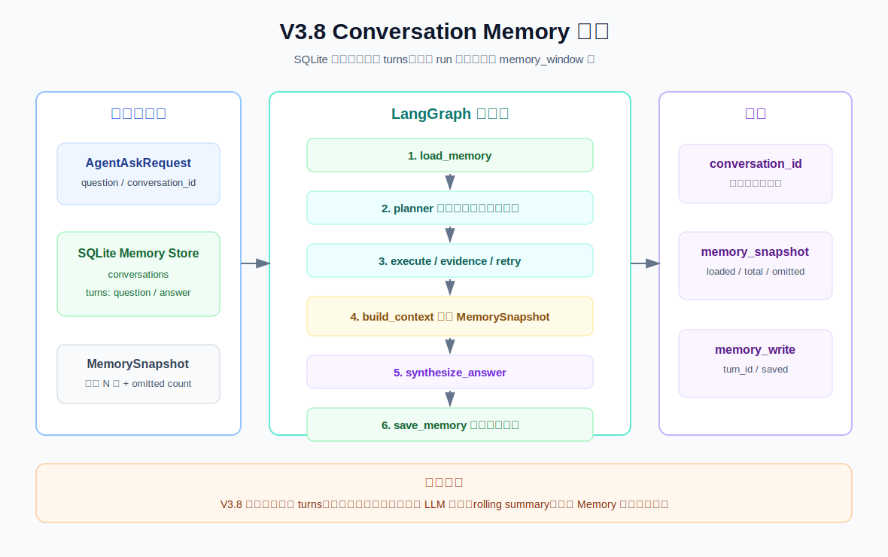

# V3.8 Conversation Memory Guide

V3.8 的目标是让单轮 Agent 变成可持久化的多轮对话 Agent。SQLite 保存完整原始 turns，但每次只把最近 `memory_window` 轮交给 Planner 和 ContextBuilder。

## V3.8 比 V3.7 改进了什么

V3.7：

```text
request -> planner -> retrieval -> build_context -> answer
```

V3.8：

```text
request -> load_memory -> planner -> retrieval -> build_context -> answer -> save_memory
```

关键变化：

- request 增加 `conversation_id` 和 `memory_window`。
- 新增 SQLite `ConversationMemoryStore`。
- 新增 `load_memory` 和 `save_memory` LangGraph 节点。
- Planner 使用最近历史理解“那”“它”“接下来”等指代。
- ContextBuilder 把最近历史和本轮证据一起放入 messages。
- response 返回 `memory_snapshot` 和 `memory_write`。

## 流程图



正常 graph path：

```text
load_memory
  -> planner
  -> execute_steps
  -> evidence_check
  -> build_context
  -> synthesize_answer
  -> save_memory
```

## Memory 设计

默认数据库：

```text
.rag/v3_8_memory.sqlite3
```

可通过环境变量修改：

```text
RAG_MEMORY_DB_PATH=/path/to/memory.sqlite3
```

SQLite 保存两类数据：

```text
conversations
turns
```

每个 turn 保存：

```text
user_message
assistant_message
sources
tool_calls
created_at
```

本版不生成摘要。数据库保存完整原文，而 `MemoryReader` 只读取最近 N 轮。

## MemorySnapshot

```json
{
  "conversation_id": "conv_food_demo",
  "window": 3,
  "recent_turns": [],
  "total_turn_count": 0,
  "loaded_turn_count": 0,
  "omitted_turn_count": 0
}
```

字段含义：

| 字段 | 含义 |
| --- | --- |
| `recent_turns` | 本轮真正读取的最近对话。 |
| `total_turn_count` | SQLite 中该 conversation 的总轮数。 |
| `loaded_turn_count` | 本轮加载的轮数。 |
| `omitted_turn_count` | 因 memory window 被省略的旧轮数。 |

## Swagger 用法

启动：

```bash
.venv/bin/uvicorn obsidian_rag.v3_8.app:app --reload --port 8010
```

打开：

```text
http://127.0.0.1:8010/docs
```

第一轮 payload：

```json
{
  "question": "生鸡肉要不要洗？",
  "conversation_id": "conv_food_demo",
  "memory_window": 3,
  "top_k": 5,
  "mode": "hybrid",
  "filters": null,
  "max_steps": 4,
  "max_retries": 1,
  "context_max_chunks": 4,
  "context_token_budget": 4000
}
```

第二轮使用相同 `conversation_id`：

```json
{
  "question": "那处理完厨房怎么清洁？",
  "conversation_id": "conv_food_demo",
  "memory_window": 3,
  "top_k": 5,
  "mode": "hybrid",
  "filters": null,
  "max_steps": 4,
  "max_retries": 1,
  "context_max_chunks": 4,
  "context_token_budget": 4000
}
```

还可以查看保存的 Memory：

```text
GET /memory/conv_food_demo?window=20
```

## CLI 用法

```bash
.venv/bin/obsidian-rag agent-v3-8 ask "生鸡肉要不要洗？" --conversation-id conv_food_demo

.venv/bin/obsidian-rag agent-v3-8 ask "那处理完厨房怎么清洁？" --conversation-id conv_food_demo
```

## 核心流程断点调试

VS Code/Cursor 依次运行：

```text
V3.8 memory: first turn
V3.8 memory: follow-up turn
```

两次调试必须使用相同的 `conversation_id`。第一轮观察空 Memory 如何写入 SQLite，第二轮观察上一轮如何进入 Planner 和 Answer Context。

按执行顺序设置以下核心断点：

| 顺序 | 断点 | 重点观察 |
| --- | --- | --- |
| 1 | `agent/service.py:73` `ask()` | `request`、`conversation_id`、`initial_state`。 |
| 2 | `agent/service.py:140` `_load_memory_node()` | `memory_snapshot` 如何进入 `AgentState`。 |
| 3 | `memory.py:19` `load_snapshot()` | `window`、`rows`、`recent_turns`。 |
| 4 | `context.py:97` `build_memory_aware_planner_question()` | 历史如何补充到 `planner_question`。 |
| 5 | `agent/service.py:191` `_execute_steps_node()` | `plan.steps`、检索 query 和 `search_results`。 |
| 6 | `agent/service.py:234` `_evidence_check_node()` | `is_sufficient`、`suggested_queries`。 |
| 7 | `agent/service.py:317` `_build_context_node()` | `memory_snapshot` 和检索结果如何进入 `ContextBundle`。 |
| 8 | `context.py:72` `_build_messages()` | `conversation_memory`、`included_chunks`、最终 messages。 |
| 9 | `agent/service.py:350` `_synthesize_answer_node()` | `context_bundle.messages` 和 LLM 最终 `answer`。 |
| 10 | `agent/service.py:381` `_save_memory_node()` | 准备保存的问答、sources 和 tool calls。 |
| 11 | `memory.py:51` `append_turn()` | SQLite `conversations`、`turns` 写入结果。 |

完整主链路：

```text
ask -> load_memory -> planner -> execute_steps -> evidence_check
    -> build_context -> synthesize_answer -> save_memory
```

证据不足时会额外经过：

```text
evidence_check -> retry_search -> evidence_check
```

行号会随代码修改发生变化；如果行号失效，以表中的函数名重新定位。

## 文件职责

| 文件 | 作用 |
| --- | --- |
| `obsidian_rag/v3_8/schemas.py` | 定义 request/response、MemoryTurn、MemorySnapshot。 |
| `obsidian_rag/v3_8/memory.py` | SQLite Conversation Memory Store。 |
| `obsidian_rag/v3_8/context.py` | 将 Memory 加入 Planner 和 Answer Context。 |
| `obsidian_rag/v3_8/agent/service.py` | V3.8 LangGraph 主流程。 |
| `obsidian_rag/v3_8/tools.py` | ToolRegistry。 |
| `obsidian_rag/v3_8/dependencies.py` | 构建 Retrieval、LLM 和 Memory 依赖。 |
| `obsidian_rag/v3_8/app.py` | FastAPI app。 |
| `obsidian_rag/v3_8/routes/agent.py` | `POST /agent/ask`。 |
| `obsidian_rag/v3_8/routes/memory.py` | `GET /memory/{conversation_id}`。 |
| `obsidian_rag/v3_8/routes/health.py` | `GET /health`。 |

## 当前版本边界

V3.8 做：

- SQLite 保存完整原始 turns。
- 最近 N 轮进入 Planner 和 Answer Context。
- conversation 之间相互隔离。
- trace 展示 Memory read/write。

V3.8 不做：

- 不做 LLM 摘要和 rolling summary。
- 不做向量化 Memory 检索。
- 不做跨 conversation 用户偏好。
- 不做多用户权限和加密。

下一步 V3.9 将进入 Agent Evaluation，评估 Router、Planner、Tool、Memory、Evidence 和 Answer 行为。
