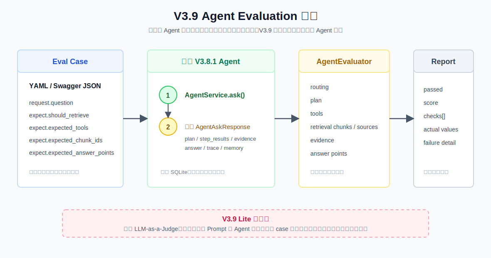

# V3.9 Agent Evaluation Guide

V3.9 Lite 的目标不是让 Agent 多做一步，而是把 V3.8.1 已经具备的行为变成可重复验证的评测对象。

它回答的问题是：一次回答不对时，到底是 Planner、Tool、Retrieval、Evidence 还是 Answer 出了问题？后续新增 Skill、MCP 或权限策略时，又怎样确认已有行为没有退化？

## V3.9 比 V3.8.1 新增什么

V3.8.1 负责执行：

```text
request -> Agent -> plan / tool / retrieval / evidence / answer / memory
```

V3.9 在外面增加一层离线评测：

```text
Eval Case -> V3.8.1 Agent -> AgentAskResponse -> AgentEvaluator -> Eval Report
```

V3.9 会：

- 复用 V3.8.1 `AgentService.ask()` 执行一次真实 Agent 链路。
- 根据 YAML 或 Swagger JSON 的 `expect` 定义行为契约。
- 检查 routing、Plan、Tool、检索 chunk/source、Evidence 和答案关键点。
- 返回每项检查的 `expected`、`actual`、`passed` 和失败原因。
- 批量执行 case，并把报告保存为 JSON，作为后续版本的回归基线。
- 使用独立 SQLite：`.rag/v3_9_eval_memory.sqlite3`，不污染 V3.8.1 日常调试的 `.rag/v3_8_1_memory.sqlite3`。

V3.9 不会：

- 不改变 V3.8.1 的 Planner、Tool、Memory、Prompt 或 AgentState。
- 不做 LLM-as-a-Judge、语义相似度裁判或自动 Prompt 优化。
- 不把评测失败自动反馈给 Agent 再运行一次。
- 不在 Lite 阶段断言滚动摘要内容；Memory 只隔离运行环境，Memory Eval 留给后续扩展。



## 最关键的概念

`Evidence Checker` 和 `Agent Evaluation` 都在检查质量，但时机不同：

| 模块 | 发生时间 | 作用 |
| --- | --- | --- |
| V3.6 Evidence Checker | 一次请求运行中 | 发现 search step 没有证据时补搜。 |
| V3.9 Agent Evaluation | 请求之外的评测运行 | 判断这次 Agent 行为是否符合预先写好的期望。 |

所以 V3.6 是 runtime guard，V3.9 是 offline regression test。

## Eval Case 数据结构

V3.9 使用 `AgentEvalCase`：

```yaml
id: chicken-wash
request:
  question: 生鸡肉要不要洗？
  top_k: 5
  mode: hybrid
  max_steps: 4
expect:
  should_retrieve: true
  required_step_kinds: [search, synthesize]
  expected_tools: [search_notes]
  expected_chunk_ids: [KB-072]
  expected_source_files: [rag_test_food_safety_kb_expanded.md]
  evidence_sufficient: true
  expected_answer_points: [不建议清洗生鸡肉, 交叉污染]
```

| `expect` 字段 | 从哪里取实际值 | 说明 |
| --- | --- | --- |
| `should_retrieve` | `response.used_retrieval` | Router-like 行为是否应当进入本地检索。 |
| `required_step_kinds` | `response.plan.steps[].kind` | Plan 是否包含 `search`、`synthesize`、`no_search` 或 `clarify`。 |
| `expected_tools` | `step_results`、`retry_step_results` | 是否调用了预期工具。`[]` 明确表示不得调用工具；字段省略则跳过该检查。 |
| `expected_chunk_ids` | 各 search result 的 `chunk_id` | 是否召回关键知识库证据。 |
| `expected_source_files` | 各 search result 的 `source` | 是否命中预期知识库文件。 |
| `evidence_sufficient` | `response.evidence_check.is_sufficient` | Evidence Checker 的结论是否符合预期。 |
| `expected_answer_points` | `response.answer` 子串匹配 | 最终答案是否包含关键结论。 |

V3.9 Lite 采用确定性断言。例如答案关键点当前采用子串匹配，因此“意思相近但措辞不同”会失败。这不是缺陷，而是为了先学习可重复的回归测试边界；更宽松的语义评测会在后续作为 LLM Judge 独立引入。

## 报告怎么读

单 case 的响应是 `AgentEvalReport`：

```json
{
  "case_id": "chicken-wash",
  "passed": true,
  "score": 1.0,
  "checks": [
    {
      "name": "retrieval_chunks",
      "passed": true,
      "expected": ["KB-072"],
      "actual": ["KB-072"],
      "detail": "检索结果命中所有预期 chunk_id。"
    }
  ],
  "agent_response": {}
}
```

`score` 是所有已启用 check 的通过比例，不是模型概率，也不是 LLM 打分。`agent_response` 保留完整 Agent 结果，因此可以继续查看 `plan`、`context_bundle`、`trace` 和 `memory_write`。

常见失败定位：

```text
routing 失败           -> Planner/router-like 决策不对
plan 失败              -> Plan 结构或 step.kind 不符合预期
tools 失败             -> Executor/Tool 分发不对
retrieval_chunks 失败  -> 检索 query、embedding、keyword 或数据集预期有问题
evidence 失败          -> Evidence Checker 的判定或补搜行为不对
answer 失败            -> Context/Answer 综合或答案断言过严
```

## Swagger 用法

启动：

```bash
.venv/bin/uvicorn obsidian_rag.v3_9.app:app --host 127.0.0.1 --port 8012
```

打开：

```text
http://127.0.0.1:8012/docs
```

单 case 接口：

```text
POST /eval/agent
```

可直接测试的 payload：

```json
{
  "id": "chicken-wash",
  "request": {
    "question": "生鸡肉要不要洗？",
    "top_k": 5,
    "mode": "hybrid",
    "max_steps": 4
  },
  "expect": {
    "should_retrieve": true,
    "required_step_kinds": ["search", "synthesize"],
    "expected_tools": ["search_notes"],
    "expected_chunk_ids": ["KB-072"],
    "expected_source_files": ["rag_test_food_safety_kb_expanded.md"],
    "evidence_sufficient": true,
    "expected_answer_points": ["不建议清洗生鸡肉", "交叉污染"]
  }
}
```

批量接口：

```text
POST /eval/agent/dataset
```

```json
{
  "dataset_path": "eval_sets/agent-food-safety.yaml",
  "save": false,
  "output_path": null
}
```

`save=true` 且没有指定 `output_path` 时，报告会保存在：

```text
.rag/eval/agent-v3-9-YYYYMMDD-HHMMSS.json
```

## CLI 用法

不保存报告：

```bash
.venv/bin/obsidian-rag agent-v3-9 eval eval_sets/agent-food-safety.yaml --no-save
```

指定报告位置：

```bash
.venv/bin/obsidian-rag agent-v3-9 eval eval_sets/agent-food-safety.yaml \
  --output .rag/eval/agent-food-safety-report.json
```

评测产生的 Raw Turns 默认进入独立数据库。若想使用临时数据库：

```bash
.venv/bin/obsidian-rag agent-v3-9 eval eval_sets/agent-food-safety.yaml \
  --memory-db-path .rag/v3_9_eval_debug.sqlite3 \
  --no-save
```

## 核心流程断点调试

VS Code/Cursor 可运行：

```text
V3.9 eval: food safety dataset
```

推荐按此顺序设置断点：

| 顺序 | 断点 | 重点观察 |
| --- | --- | --- |
| 1 | `cli.py:398` `run_agent39_eval()` | `dataset_path`、独立 `memory_db_path`、`AgentEvaluator`。 |
| 2 | `v3_9/evaluation/dataset.py:10` `load_agent_eval_dataset()` | YAML 如何变成 `AgentEvalDataset`、`AgentEvalCase`。 |
| 3 | `v3_9/evaluation/evaluator.py:36` `AgentEvaluator.evaluate_dataset()` | case 逐个运行，汇总 `pass_rate` 与 `mean_score`。 |
| 4 | `v3_9/evaluation/evaluator.py:23` `AgentEvaluator.evaluate_case()` | `case.request` 如何进入 V3.8.1 `AgentService.ask()`。 |
| 5 | `v3_8_1/agent/service.py:78` `AgentService.ask()` | 被评测的原有 Agent 运行入口与 `AgentAskResponse`。 |
| 6 | `v3_9/evaluation/evaluator.py:66` `_build_checks()` | `expect` 与实际 response 字段如何逐项比较。 |
| 7 | `v3_9/evaluation/evaluator.py:157` `_chunk_ids()` | 从 `step_results` 和 `retry_step_results` 提取 chunk_id。 |
| 8 | `v3_9/evaluation/evaluator.py:188` `_check_subset()` | expected chunk/source/step 是否为 actual 的子集。 |

正常分支：

```text
load YAML -> AgentService.ask -> build_checks -> AgentEvalReport -> summary
```

条件分支：

```text
expect 字段为 null / 未写 -> 跳过该 check
expected_tools: []           -> 断言实际没有任何工具调用
case 失败                    -> 仍返回完整 Agent response 和所有 check，不中断 batch
V3.8.1 内部 retry / clarify / no_search -> 作为被观察对象写入 plan、trace、step_results
YAML schema 无效或 Agent 调用抛错 -> 当前版本直接返回错误，不生成伪造评分报告
```

行号会随代码变化；行号失效时以表中函数名重新定位。

## 文件职责

| 文件 | 作用 |
| --- | --- |
| `obsidian_rag/v3_9/schemas.py` | 定义 Eval Case、期望、单 case 报告、批量报告和 Swagger 字段说明。 |
| `obsidian_rag/v3_9/evaluation/dataset.py` | 读取并校验 Agent Eval YAML。 |
| `obsidian_rag/v3_9/evaluation/evaluator.py` | 调用 Agent、构建检查项、计算 score、保存批量 JSON 报告。 |
| `obsidian_rag/v3_9/dependencies.py` | 构造 V3.8.1 Agent 和独立评测 SQLite Memory。 |
| `obsidian_rag/v3_9/routes/eval.py` | 提供单 case 和批量 Swagger 接口。 |
| `obsidian_rag/v3_9/routes/health.py` | `GET /health`。 |
| `obsidian_rag/v3_9/app.py` | V3.9 FastAPI app 入口。 |
| `obsidian_rag/cli.py` | 提供 `agent-v3-9 eval` CLI。 |
| `eval_sets/agent-food-safety.yaml` | 食品安全 Agent Eval 回归案例。 |
| `tests/v3_9/` | 覆盖 evaluator、YAML loader、API 和 CLI。 |

## 你需要记住的重点

V3.8.1 的问题是：

```text
一次 Agent 请求如何在长对话中保留上下文，并完成 RAG？
```

V3.9 的问题是：

```text
这次 Agent 的每一步行为，是否符合我们事先定义的预期？
```

评测 case 不是一次性的演示数据。以后修复任何 Agent 行为问题，都应该把触发问题写成一个 case；这样后续接入 V3.10 Production Core、V3.11 Skill System 和 V3.12 MCP 时，才能持续验证基础 RAG 行为没有退化。

下一版本大概率进入 V3.10 Production Core，把 `run_id`、状态、耗时、错误和 tool summary 从当前 response/trace 进一步系统化。
