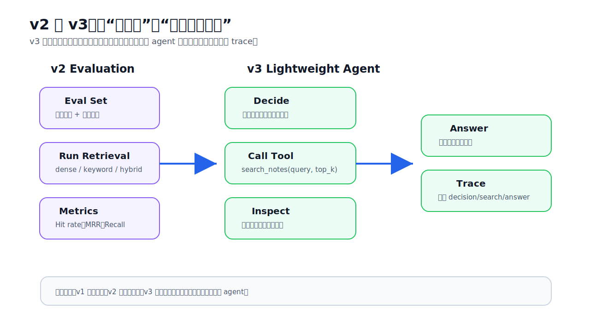
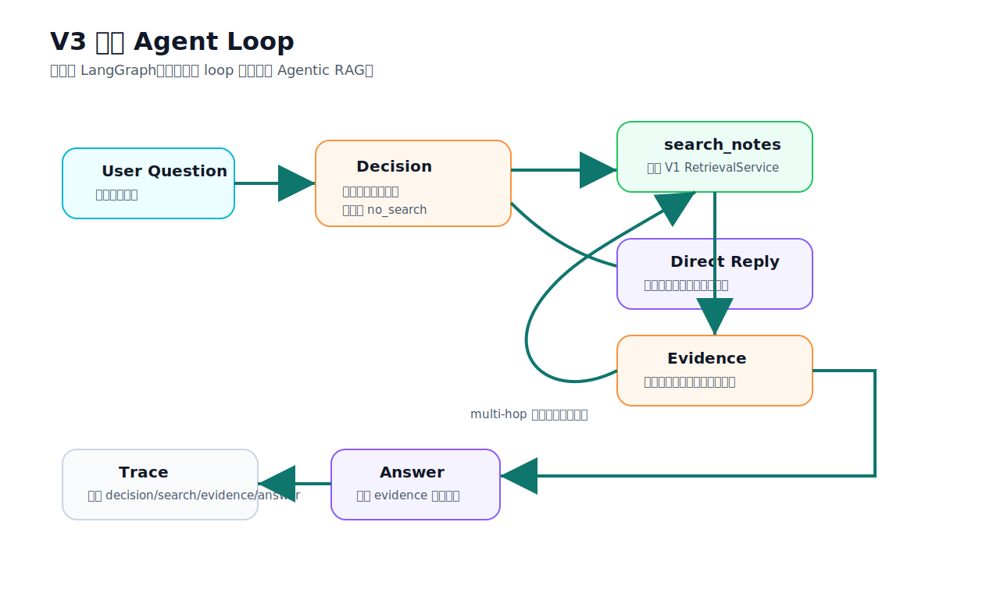
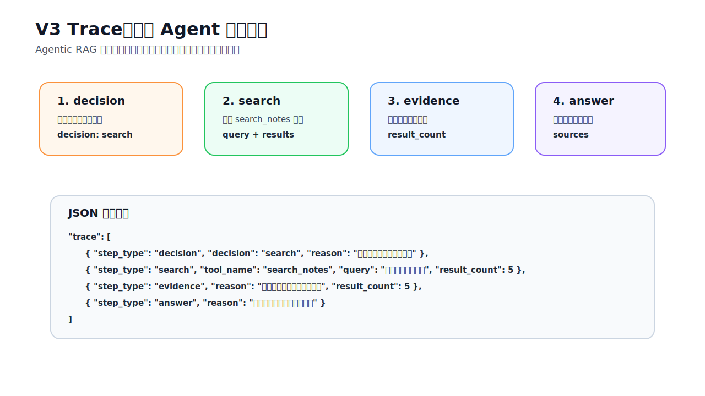

# V3 Agentic RAG Guide

V3 的目标是帮助理解 Agentic RAG。它不是引入复杂 agent 框架，而是把 V1 已经成熟的检索器包装成一个轻量工具，让系统能决定是否检索、检索什么、是否需要第二次检索，并把过程用 trace 暴露出来。

## V3 比 V2 改进了什么



V1 解决：

```text
怎样用 dense + keyword + hybrid 找到更好的候选证据？
```

V2 解决：

```text
怎样用评估集判断检索和答案是否变好？
```

V3 解决：

```text
怎样让系统像 agent 一样决定是否调用检索工具？
```

V3 的新增能力：

- `search_notes` 工具：复用 V1 `RetrievalService`。
- agent decision：判断是否需要查本地知识库。
- lightweight loop：最多执行 `max_steps` 次检索，当前默认最多 2 次。
- multi-hop query：对包含“处理完、清洁、洗手、交叉污染”等组合问题，触发第二次检索。
- trace：返回每一步 decision、search、evidence、answer，方便学习和调试。

## 轻量 Agent Loop



当前 V3 不使用 LangGraph，流程是确定性的：

1. 接收用户问题。
2. 判断是不是寒暄或明显不需要知识库。
3. 如果不需要检索，直接返回能力边界说明。
4. 如果需要检索，调用 `search_notes(query, top_k, mode, filters)`。
5. 如果问题看起来是多跳问题，并且 `max_steps >= 2`，再生成一个二次 query。
6. 汇总检索结果。
7. 如果没有证据，说明本地知识库资料不足。
8. 如果有证据，用 V0 的 prompt 和 LLM client 生成答案。
9. 返回 answer、sources、trace。

这版故意保持轻量，重点是看懂 agent loop，而不是过早上复杂编排框架。

## Trace 怎么读



V3 Swagger 返回里最重要的是 `trace`。

示例：

```json
{
  "question": "生鸡肉要不要洗，处理完后厨房怎么清洁？",
  "answer": "...",
  "used_retrieval": true,
  "sources": ["rag_test_food_safety_kb_expanded.md"],
  "trace": [
    {
      "step_type": "decision",
      "decision": "search",
      "reason": "问题需要本地知识库证据。"
    },
    {
      "step_type": "search",
      "tool_name": "search_notes",
      "query": "生鸡肉要不要洗，处理完后厨房怎么清洁？",
      "result_count": 5
    },
    {
      "step_type": "search",
      "tool_name": "search_notes",
      "query": "厨房 清洁 洗手 交叉污染",
      "result_count": 5
    },
    {
      "step_type": "evidence",
      "reason": "找到可用于回答的本地资料。",
      "result_count": 10
    },
    {
      "step_type": "answer",
      "reason": "基于检索证据生成最终答案。"
    }
  ]
}
```

字段含义：

| 字段 | 含义 |
| --- | --- |
| `used_retrieval` | 这次 agent 是否调用了本地检索工具。 |
| `sources` | 最终答案使用到的来源文件。 |
| `trace[].step_type` | 当前步骤类型：`decision`、`search`、`evidence`、`answer`。 |
| `trace[].decision` | `search` 或 `no_search`。 |
| `trace[].tool_name` | 当前调用的工具名，目前是 `search_notes`。 |
| `trace[].query` | 本次工具调用使用的 query。 |
| `trace[].result_count` | 本步骤拿到或汇总的结果数。 |
| `trace[].results` | search 步骤返回的结果预览。 |
| `trace[].reason` | 这一步为什么这么做。 |

## Swagger 使用

启动 V3 API：

```bash
.venv/bin/uvicorn obsidian_rag.v3.app:app --reload --port 8002
```

打开：

```text
http://127.0.0.1:8002/docs
```

单跳问题：

```json
{
  "question": "生鸡肉要清洗吗？",
  "top_k": 5,
  "mode": "hybrid",
  "max_steps": 2
}
```

多跳问题：

```json
{
  "question": "生鸡肉要不要洗，处理完后厨房怎么清洁？",
  "top_k": 5,
  "mode": "hybrid",
  "max_steps": 2
}
```

寒暄问题：

```json
{
  "question": "你好",
  "top_k": 5,
  "mode": "hybrid",
  "max_steps": 2
}
```

寒暄问题会返回 `used_retrieval=false`，trace 里会看到 `decision=no_search`。

## CLI 使用

```bash
.venv/bin/obsidian-rag agent ask "生鸡肉要不要洗，处理完后厨房怎么清洁？" --top-k 5 --mode hybrid --max-steps 2
```

CLI 会打印答案、sources 和简洁 trace。

## V3 文件职责

### Agent

| 文件 | 作用 |
| --- | --- |
| `obsidian_rag/v3/__init__.py` | 标识 V3 package。 |
| `obsidian_rag/v3/agent/__init__.py` | 标识 agent package。 |
| `obsidian_rag/v3/agent/service.py` | V3 核心 agent loop：决策、规划 query、调用检索、汇总证据、生成答案和 trace。 |
| `obsidian_rag/v3/schemas.py` | V3 Pydantic 请求/响应模型：`AgentAskRequest`、`AgentAskResponse`、`AgentTraceStep`。 |

### API

| 文件 | 作用 |
| --- | --- |
| `obsidian_rag/v3/app.py` | FastAPI V3 app 入口。 |
| `obsidian_rag/v3/dependencies.py` | 加载配置，创建 V1 `RetrievalService` 和 LLM client，再组装 `AgentService`。 |
| `obsidian_rag/v3/routes/__init__.py` | 标识 routes package。 |
| `obsidian_rag/v3/routes/health.py` | `GET /health`。 |
| `obsidian_rag/v3/routes/agent.py` | `POST /agent/ask`。 |
| `obsidian_rag/v3/services/__init__.py` | 预留 service package 标识。 |

### Tests

| 文件 | 作用 |
| --- | --- |
| `tests/v3/test_agent_service.py` | 测试 no-search、单次检索、多跳检索和 trace。 |
| `tests/v3/test_api.py` | 测试 V3 FastAPI JSON 接口。 |
| `tests/v3/test_cli_agent.py` | 测试 CLI agent ask 输出答案和 trace。 |

## 当前限制

- 这不是完整 LangGraph agent，只是轻量教学版 loop。
- 是否需要检索使用简单规则，不是 LLM planner。
- 多跳 query 生成也是规则化的，目前只覆盖少量常见模式。
- 如果要更强的 agent，可以在 V3.1 引入 LLM planner 或 LangGraph。

## 常见排查

1. `used_retrieval=false`：看 trace 的 decision reason，确认是否被判断成寒暄。
2. trace 只有一次 search：说明问题没有触发多跳规则，或 `max_steps=1`。
3. trace 有 search 但 answer 说资料不足：检索器没有返回结果，先回到 V1 `/compare-search` 调试。
4. answer 不理想但 trace 结果正确：问题在 prompt 或生成阶段，可以回到 V2 `/eval/answer` 做答案质检。
